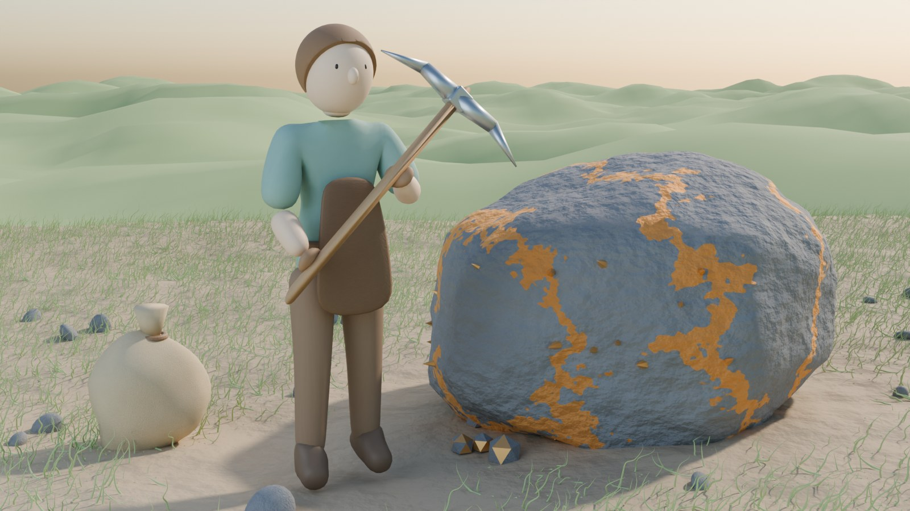
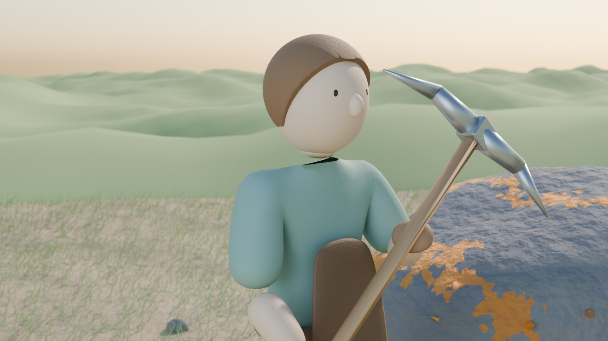
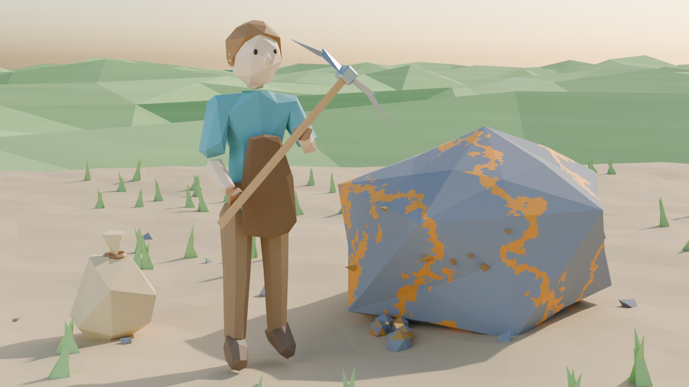
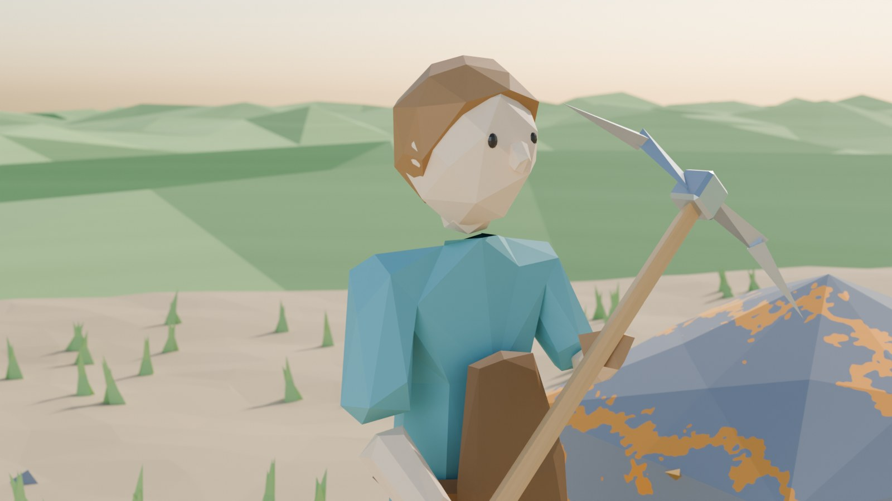
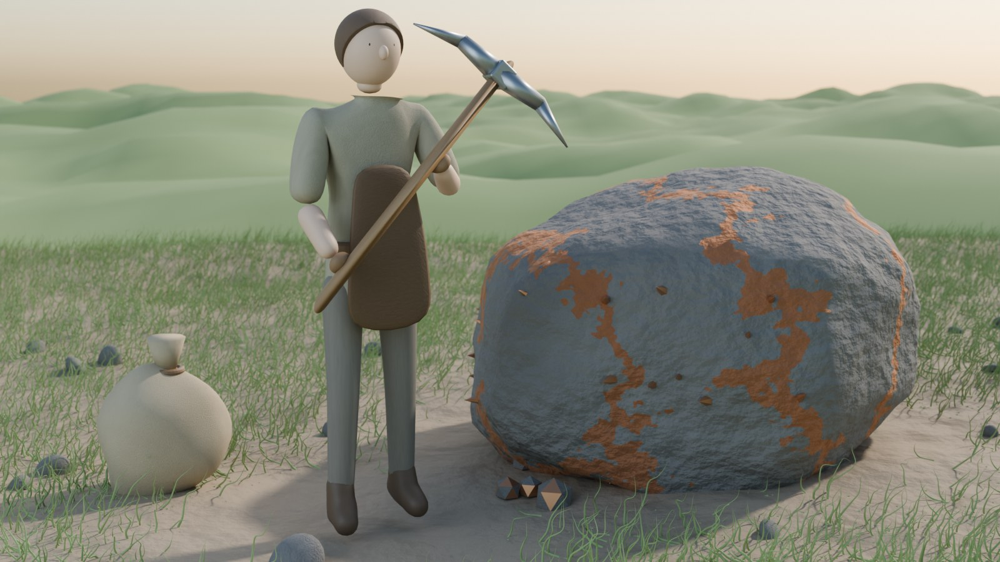
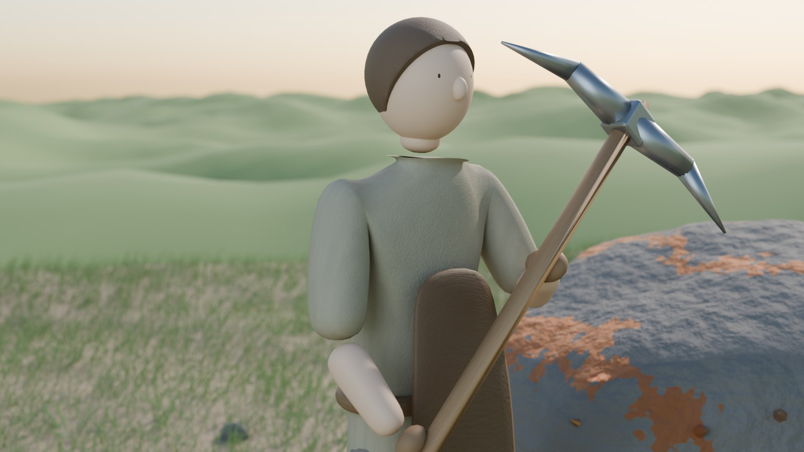

# S1 style studies — choosing the showcase's art direction

**Rendered:** October 1, 2026, in Blender 4.4 (Cycles, GPU).
**Status:** Not chosen. On October 1 Luis judged these "not bad", but they did not
match what he imagines. He supplied the [Visual Soul](VisualSoul.md) handoff
instead, and it is now the art direction. This page is kept as a record.
**Source:** [`Art/Blender/StyleStudies/style_studies.py`](../../Art/Blender/StyleStudies/style_studies.py).
Every image is generated from that script and can be reproduced or adjusted:

```
blender -b --factory-startup --python Art/Blender/StyleStudies/style_studies.py -- --out <folder> --styles soft,lowpoly,grounded --samples 128
```

## What these images are, and are not

All three show the same small scene, with the same camera and late-afternoon
light:

- the worker carrying a pickaxe;
- an ore-veined boulder;
- a sack;
- grass and pebbles.

Two frames are rendered for each style: the scene, and an upper-body portrait
like a creator preview.

These are **direction studies**, built quickly from simple shapes. They
compare:

- proportions;
- palette;
- surface finish;
- materials;
- lighting mood.

They do **not** represent final model quality. Hands, faces, cloth and
anatomy in particular are placeholders. Whichever direction is chosen, the S1
worker is modeled properly: real anatomy and hands, a skeleton for the
procedural body, and body shapes for the creator.

## A — Soft stylized




- **Look.** Rounded, slightly enlarged head and hands. Warm, gentle palette
  with soft light and storybook warmth.
- **For the showcase:**
  - very readable from RTS height;
  - friendly to procedural motion, since stylization hides small posing
    imperfections;
  - affordable to produce at high polish.
- **Risk.** It can tip into "cute" or "toy" and away from quiet, grounded awe.
  Mature proportions and painterly materials can counter that.

## B — Faceted low-poly




- **Look.** Flat-shaded facets, crisp silhouettes and a saturated, simple
  palette.
- **For the showcase:** clean and cheap to render, with strong silhouettes,
  and it suits procedurally generated geometry.
- **Risk.**
  - It is a common indie look.
  - It makes it harder to show the richness a Dark Souls-depth character
    creator promises (faces, materials, fine variation).
  - Weight and material are harder to convey.

## C — Grounded semi-realistic




- **Look.** Realistic human proportions, a muted natural palette, textured
  cloth, wood and stone, and depth of field.
- **For the showcase:** the closest match to "grounded, physical, weighty". It
  gives a deep character creator the most room (anatomy, faces, clothing),
  and strength and burden read most convincingly on a realistic body.
- **Risk.**
  - The highest asset cost.
  - Realistic bodies with imperfect procedural motion can feel uncanny.
  - A good result needs a proper human base. Realistically that means the
    free MakeHuman/MPFB Blender add-on (generated bodies are CC0), which
    needs Luis's approval to download.
- **Caveat.** This study shows only the proportions, palette and materials of
  the direction. A true semi-realistic body cannot be built from these simple
  shapes.

## Choosing

Luis can:

- pick one direction;
- mix them, for example C's proportions and materials with A's warmth and
  painterly light;
- or point to references that capture what he imagines.

The chosen direction is recorded in GAME_VISION.md, and S1's worker model is
built in it.
