# The miners — Small, Long and Round (S1d, second pass)

**Made:** October 2, 2026; polished October 3 and 4.
**Status:**
- **Hands that close** (October 5): the free hands close round a handle of
  any thickness from 12 to 44 mm, and open again
  ([below](#hands-that-close-october-5)). One question for Luis came out of
  it: [how Long stands in the game](#for-luis-how-long-stands-in-the-game).
- **The sweep of extreme poses** (October 5) is built. It found nothing in
  the poses the game uses; what it found beyond them is logged
  ([below](#the-sweep-of-extreme-poses-october-5)).
- **Luis's verdict on the method's first round** (October 5): "I really liked
  all the changes you did, except the shoulder strap." The strap is put back
  as it was ([below](#after-luiss-look-october-5)).
- **The method's first round** (October 3 and 4): Luis's five notes on Small
  are answered, and all three were taken through the
  [model quality method](ModelQualityMethod.md)
  ([below](#the-methods-first-round-october-3-and-4)).
- **Luis's verdict.** "Almost perfect… already adorable", after the second
  pass.
- **Polished** on the points Luis raised
  ([below](#polish-after-luiss-word-october-3)).
- **Rigged and in the game** (October 3): the three walk in the Ordinary
  Place on the procedural body, with the choice of miner
  ([below](#rigged-and-in-the-game-october-3);
  [MinersPlaytest.md](../Playtests/MinersPlaytest.md)).
**Asked by Luis.** After the [first concepts](WorkerConcepts.md), Luis ranked
them Small, then Long, then Round, and loved every face, then asked for:
- much higher model quality, prettier and more pleasing to look at;
- the same stylization, kept;
- hints, even small ones, that they are miners.

Luis also asked to keep in mind that the final game lets players customize
everything, units included, like detailed character creators
([correspondence](../Correspondence/2026-10-02_WORKER_CONCEPTS_FEEDBACK.md)).


## After Luis's look (October 5)

Luis: "I really liked all the changes you did, except the shoulder strap. I
mean I kinda prefered the before for this one"
([correspondence](../Correspondence/2026-10-05_THE_SHOULDER_STRAP.md)).

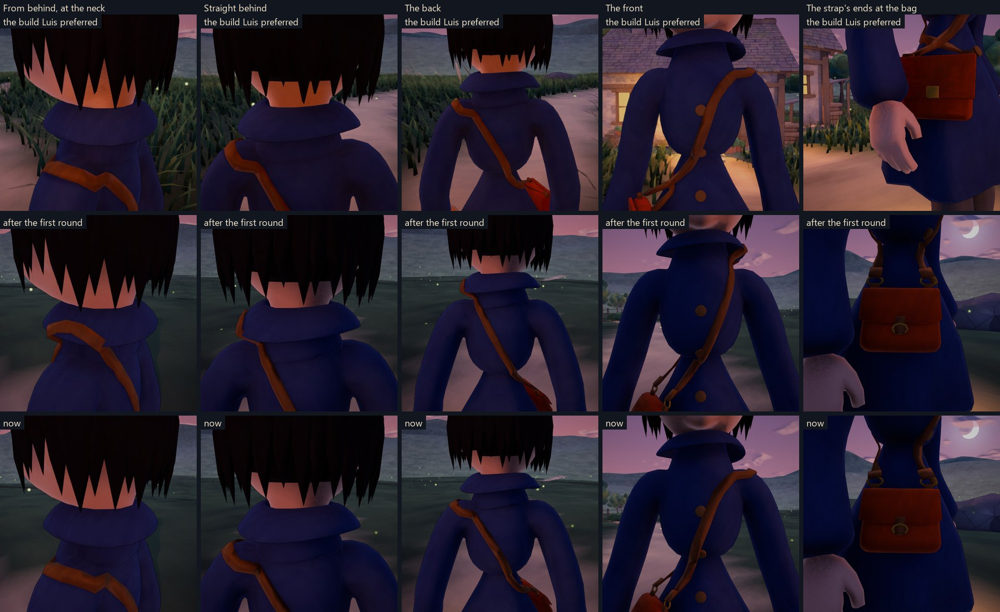

- **What the round had done.** Luis's note was that the strap did not join
  the bag. The round joined it, and also redrew the strap's whole course: it
  was pulled taut, sat nearer the neck, and climbed over the collar's rim.
- **Now.** The strap has the course and the breadth it had in the build Luis
  preferred: out on the shoulder, lying soft on the coat across the back,
  below the collar, which falls over it where they meet. Its ends still pass
  through the rings on the bag.
- **Checked:** the audit passes on the strap at rest and on the recorded
  movement (it meets both rings; it does not sink into the coat or the
  collar). The same four small checks as before remain
  ([below](#where-the-round-ended)).
- **What the method learned** is in its
  [misses ledger](ModelQualityMethod.md#9-the-misses-ledger): change only
  what a note or a failed check names.
- **Also closed: Round's neckband.** The round had left a small flaw open at
  the back of Round's neck. Looked at closely, it was slivers of skin and
  cloth where the neck comes out of the smock: on a round back the cloth
  falls away steeply, and the band had landed below the join it is there to
  cover. The band now sits on that join at the back and the sides. The front,
  under the chin, is as it was. A new check keeps a neckband on its
  garment's neckline all the way round.

  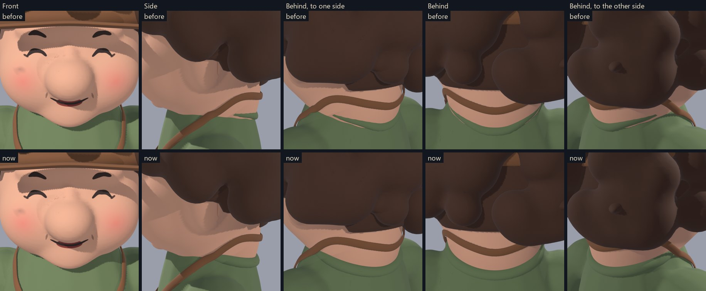

## Hands that close (October 5)

The second step of [the miners at work](../NextMilestonePlan.md#s1d-last-part--the-miners-at-work-plan-waiting-for-luiss-choices): a free hand closes round a
handle and opens again.

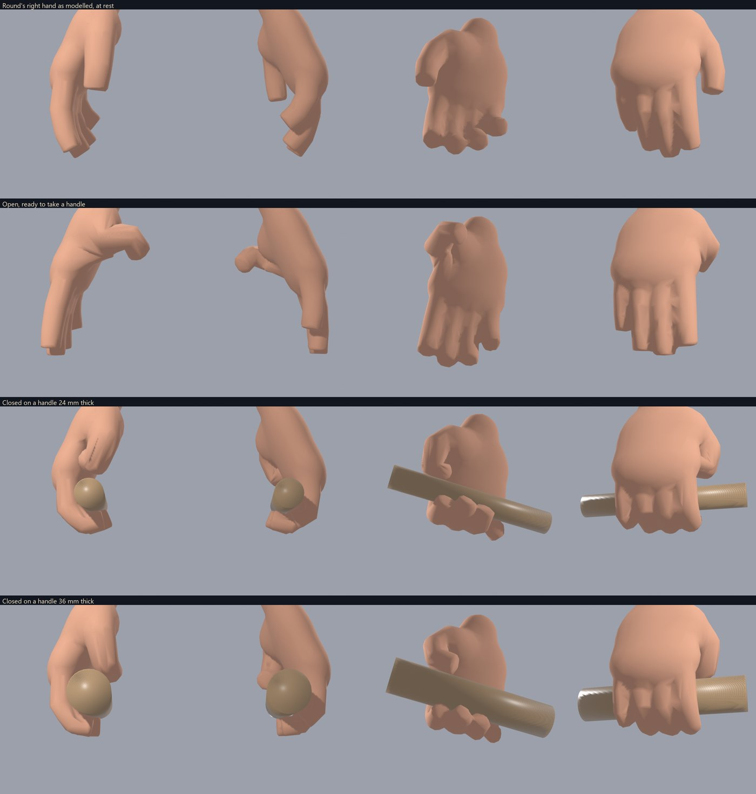

- **Which hands.** Small's right, Long's right and both of Round's. A hand
  that carries something (Small's lantern, Long's mug) stays as modelled: it
  was made closed round its handle and cut to fit, and cannot open. What
  those hands do at work is Luis's choice M3.
- **What a closing hand has.** Three bones for each finger and for the thumb
  (fifteen a hand), and 1,600 triangles of its own at the nearest level of
  detail.
- **How it closes.** The model's build closes the hand, skinned as the game
  skins it, round handles of six thicknesses from 12 to 44 mm:
  - the handle is laid at the root of the fingers, as low as the fingers can
    still go round it;
  - each finger closes until the skin of its two outer bones touches the
    handle;
  - the thumb unfolds forward from above the palm until it meets the handle
    or a finger.

  The game keeps those closings as a table and blends between neighbours for
  a thickness in between. To take a handle the hand first opens (the fingers
  straighten, the thumb lifts clear), then closes: about a third of a second
  in all.
- **Checked on the skin, in Blender.** For every hand and every handle: each
  finger and the thumb lie on what they close on (the farthest is 0.06 mm
  off), and nothing is more than 0.3 mm inside the handle. 144 checks, none
  failing (`Art/Review/Miners/hands_<Name>.txt`).
- **Checked in the game.** A new test closes every free hand on every handle
  of the table and on one in between:
  - each joint and fingertip lands within 1 mm of where the build measured
    it;
  - no finger bone passes inside the handle;
  - closing takes time;
  - let go, the fingers return exactly to their rest.

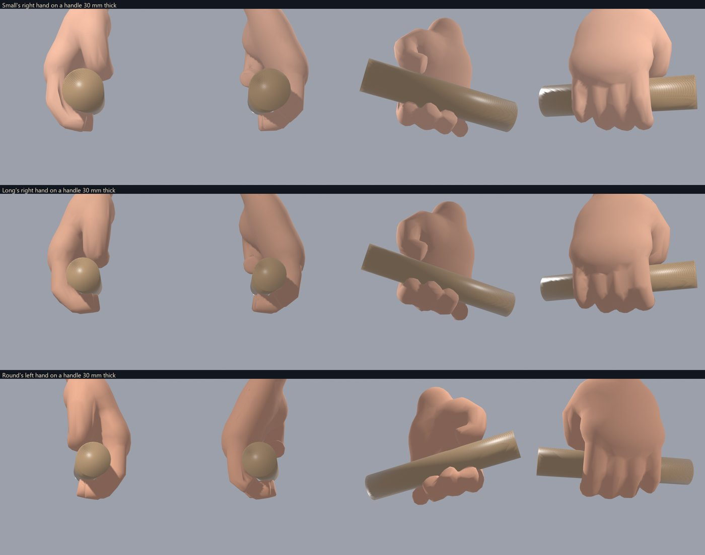

**Nothing new shows in play yet.** No miner has a tool in hand until the next
step. At rest the free hands look as they did (more triangles, the same
shape):

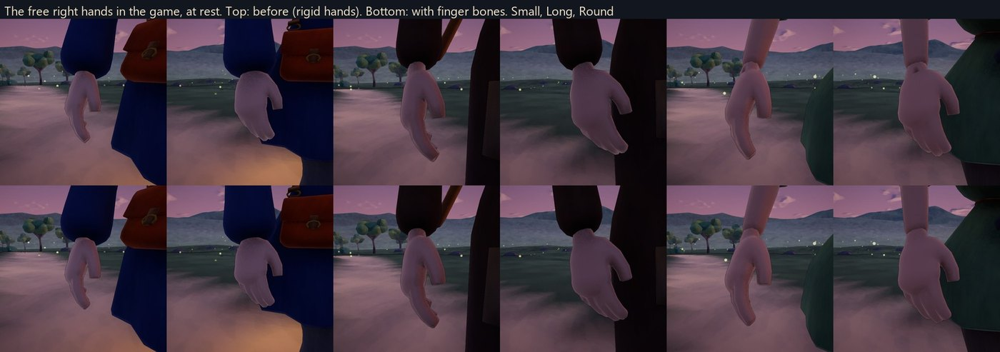

**What it costs.**
- **Bones:** 40 for Small, 39 for Long, 54 for Round (they were 25, 24 and
  24). The farthest level of detail has no skin on the finger bones.
- **Triangles at the nearest level:** about 18,300 for Small and Long and
  19,600 for Round (they were about 17,400). The other levels are unchanged
  (5,000 and 1,600).
- **Frame time,** a hundred miners walking: about 2.6 ms added with the
  finger bones and about 2.5 ms without, measured one after the other on
  October 6. That difference is no more than two runs of the same build
  differ by ([MinersPlaytest.md](../Playtests/MinersPlaytest.md#what-it-costs)).

### What the step found

| # | Found | Cause | What was done |
|---|---|---|---|
| **H1** | The back of a closing hand folded into a dark patch | The hand had 622 triangles. Shared out with everything else by size, that is far too few to bend fifteen joints | A hand that closes keeps 1,600 triangles of its own |
| **H2** | Fingers bent backwards at their last joint, differently on every handle | Each bone took its curl axis from its own direction, and a bone pointing straight out of the palm has none | A finger curls about one axis, taken once from the straight finger |
| **H3** | One finger left pointing while the others closed | The root of a finger touches a handle that lies against it, however the finger curls. The solve took that as "closed" | A finger is closed by the skin of its two outer bones. The whole finger, root included, is kept out of the handle |
| **H4** | The root of a finger pressed 1 to 2 mm into thick handles | A finger tapers, and its outer bones were laid as far from the handle as its first | Each bone stands off by its own thickness |
| **H5** | The thumb passed between the handle and the fingers and touched neither | Its path was drawn for one thickness | It unfolds from above the palm until it meets something. If it would pass between, its tip turns onto the handle |
| **H6** | In the game, Long's closed fingers were 4.5 mm from where the build measured them | The prefab squares each model by its head and feet, not by the model's own axes. Long's sits 11° off; Round's 2.4°; Small's 0.6° | The closing is fitted to the hand's own bones, not to the prefab's axes. The squaring itself is not changed ([below](#for-luis-how-long-stands-in-the-game)) |

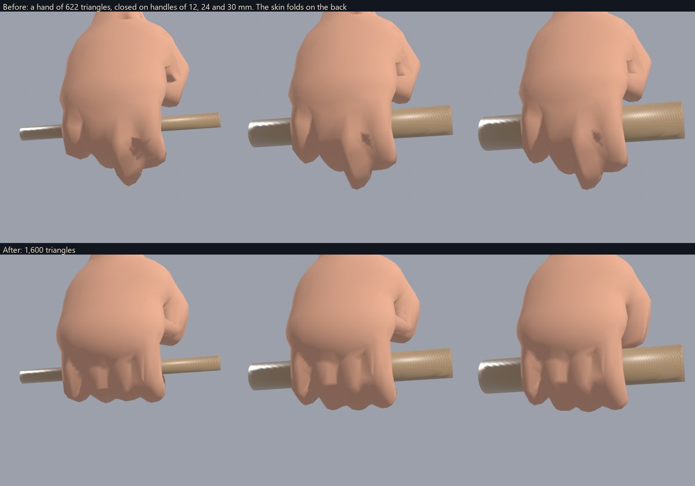

### For Luis: how Long stands in the game

H6 uncovered something older than this step. Since the miners were rigged
(October 3), the prefab turns each model so that its head is straight above
its hips. Long was built upright, the head carried forward on the neck. So
in the game Long's whole body leans back by 11°, and the head sits above the
hips:

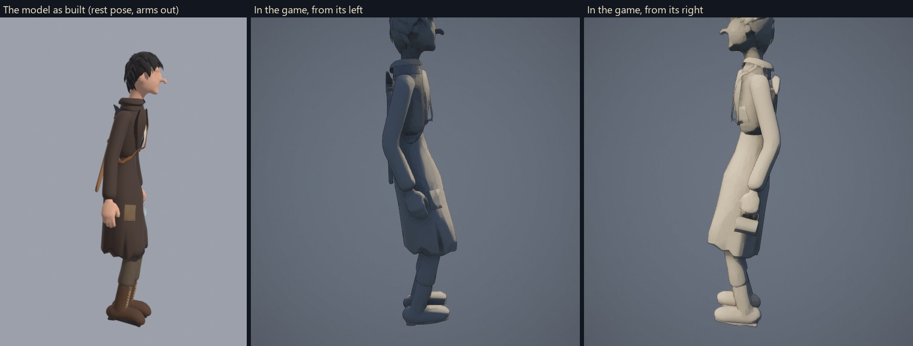

- **Not changed.** This is how Long has stood in every build Luis has
  played.
- **The question (P1 in [the plan](../NextMilestonePlan.md#s1d-last-part--the-miners-at-work-plan-waiting-for-luiss-choices)):** keep the game's stance, or
  stand Long as built? The built stance can be shown in the game beside the
  present one before anything is replaced.
- **The method had no check for this.** Nothing compared how a model stands
  in the game with how it was built. The prefab's setup now reports the
  difference for every hand it fits.

### Limits of the closing hands

- **The thumb does not wrap over the fingers.** On a thick handle it presses
  the handle from the wrist's side; on a thin one it closes on the fingers.
  The hand's proportions (a short thumb set near the wrist) do not let it
  reach round.
- **The hands that carry cannot open** (Small's left, Long's left). Whether
  they should is choice M3.
- **Handles are taken as round.** A flattened handle (as on the pickaxe Long
  carries) would leave about 2 mm under the fingers on its flat sides.
- **No handle is in the game yet,** so the closing was judged in Blender's
  pictures and by the game's test, not in play.

## The sweep of extreme poses (October 5)

The method's pass 4 had one part not built: poses beyond the game's own
movement, as riggers use to test a rig's whole range. It is built now, as the
first step of [the miners at work](../NextMilestonePlan.md#s1d-last-part--the-miners-at-work-plan-waiting-for-luiss-choices).

**What it does.** It takes each miner through 27 poses, one joint at a time
and in a few combinations:
- **arms:** forward 45° and 90°, overhead, back, out to the side; elbows to
  130°; wrists up and down; a backswing and a strike;
- **legs:** a knee lifted to 45° and 90°, a leg back, knees bent to 90°, a
  deep bend, toes bent;
- **trunk and head:** a bow of 40°, a lean back, a side bend, a twist; the
  head down, up, turned and tilted.

Each pose is skinned as the game skins it. The coats' flaps go with the
thighs and what a hand holds follows the hand, as in the game. Every pose
gets the audit's checks, two new ones, and three pictures:
- **pinched:** how much thinner a sleeve or a trouser leg gets at a bent
  joint, against the rest pose (limit: 45%);
- **stretched:** how long the longest edge of a cloth is pulled, against the
  rest pose (limit: 1.9 times).

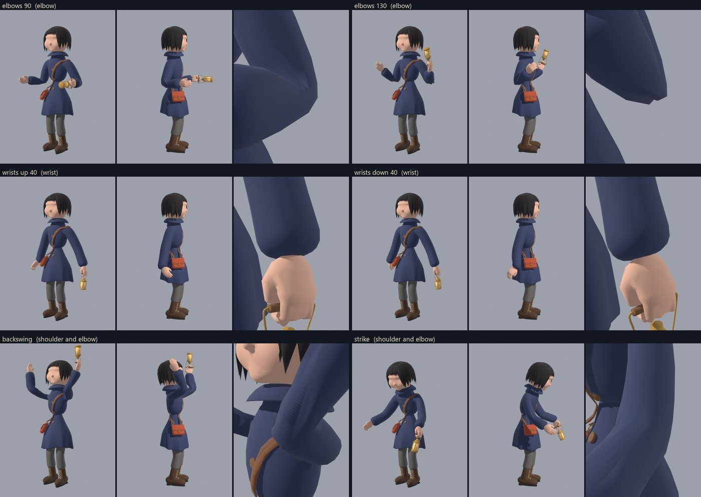

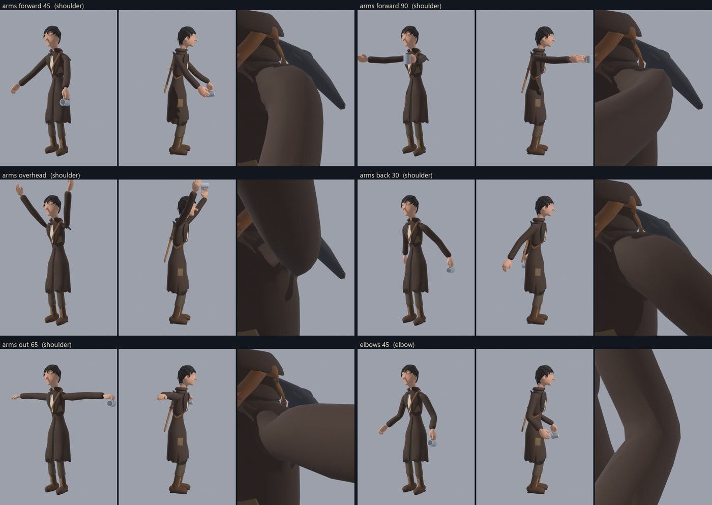

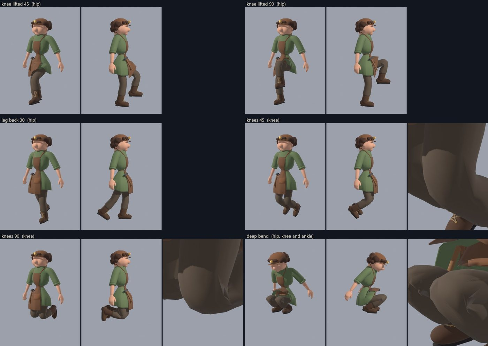

**What the game reaches today,** measured on its recorded movement: the
shoulders turn up to 35° from the rest pose, the elbows 28°, a thigh 30° to
42° walking and up to 52° in the sharpest turn, a knee about 50°, the spine
5°. Today's swing keeps both hands within 32 cm of a point in front of the
hips, so it does not raise the arms to the shoulder.

**What it found.** Nothing fails in those ranges. Everything that fails is in
a pose no movement reaches yet. Nothing was changed on the models: each
finding is logged with the movement that would need it fixed.

| Where | What the sweep found | Small | Long | Round | Does a movement reach it? |
|---|---|---|---|---|---|
| **Shoulders,** arms forward 90° | The sleeve thins at the joint | 25% | 22% | 24% | Not yet; today's swing stays below it. Within the limit |
| **Shoulders,** a backswing with the arms at 120° | The same, more | 43% | 37% | 45% | Not yet. At the limit |
| **Shoulders,** arms overhead | The sleeve collapses at the joint; the cloth is pulled to 2.5 to 3.1 times its length | 64% | 59% | 66% | Not yet |
| **Elbows** at 130° | The sleeve thins | 44% | 45% | 40% | Not yet (today's swing bends them less). At the limit |
| **Knees,** to a deep bend | The trouser leg thins | 39% | 37% | 39% | Not yet. Within the limit |
| **Wrists, neck, waist twist, toes** | — | pass | pass | pass | — |
| **Coats in a deep bend, or a knee lifted to 90°** | The flaps are turned by the thighs, so the cloth is pulled long (Small 3.7 times, Long 9.1 times) and the knees come out at the front opening | fails | fails | fails | Not yet. The sharpest turn lifts a thigh to 52° |
| **Long's coat, knees bent 90° standing** | The shins fold back through the long coat (66 mm) | — | fails | — | Not yet |
| **A bow of 40°** | Long: the pickaxe's loop leaves its strap by 21 mm. Round: the apron's ties lift 2 mm past their limit | pass | fails | fails | Not yet. The walk bends the spine 5° |
| **Round, a deep bend** | The hammer goes up to 10 mm into the smock and trousers; the apron's pocket lifts 8 mm past its limit | — | — | fails | Not yet |
| **Small,** arms overhead | The strap goes 4 mm into the coat at the shoulder | fails | — | — | Not yet |
| **Small,** a side bend of 20° | The free hand goes 4.6 mm into the coat | fails | — | — | Not as posed: in the game the arm is carried clear of the coat |

**What each will need, when a movement asks for it:**
- **Arms above the shoulder** (an overhead swing, S3's effort-driven swing, a
  wave): a helper bone at each shoulder that takes half of the arm's turn, so
  the sleeve is shared between three bones, not two. It would bring the
  backswing to about 13% and overhead to about 29%. It also changes the
  shoulder a little in every pose, so it is done with before-and-after
  pictures of the walk, not silently.
- **A deep bend or a kneel in a coat:** the coat's flaps need to fold at the
  knee as well as turn at the hip (a second bone in each flap), and Long's
  back flaps must be pushed by the shins.
- **A deep bow:** the pickaxe's loop and the apron's ties follow more than
  one bone of the trunk.

**The sweep's own first mistakes** (read before any fixing, as pass 3 asks):
- the trunk and the head bent backward where the poses said forward (a limb
  that hangs and a trunk that stands turn opposite ways about the same axis);
- what a hand holds stayed behind when the arm was raised;
- a leg under a lifted hem counted as "through the cloth". The audit's check
  was corrected for this: a point counts only if the way to it from the hip,
  down the leg, crosses the cloth. With it, the knee in Small's sharpest turn
  reads 11 mm, not 29 mm ([below](#where-the-round-ended)).

**Reports:** `Art/Review/Miners/sweep_<Name>.txt`. **To run it:** see the
method's [tools table](ModelQualityMethod.md#5-the-tools).

## The method's first round (October 3 and 4)

Luis played the polished build and sent four close screenshots of Small with
five notes, a principle, and a request: write a method for model quality
first, then fix
([correspondence](../Correspondence/2026-10-03_PHYSICAL_OBJECTS_AND_A_QUALITY_METHOD.md)).

- **The principle.** Physicality and the reality of all movement are among
  the game's main focuses. Anything that reads as an object is a proper
  object: held, hanging, swinging, stopped by the body. Nothing floats.
- **Liked, and kept:** how the coat's skirt, the lantern and the bag move as
  Small walks.
- **The method** is [ModelQualityMethod.md](ModelQualityMethod.md). This was
  its first round, on all three miners.

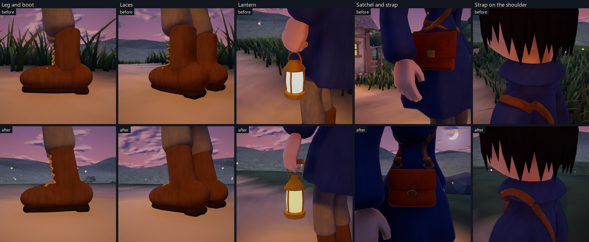

### Luis's five notes on Small

| Note | Cause | Now |
|---|---|---|
| **The leg does not line up with the boot** | The boot's shaft was modelled standing straight up. The shin leans about 11° forward from the ankle, even at rest, so the shaft's top sat 2.6 cm behind the shin. It only showed from the side, at ground level | The shaft follows the shin. The trousers fall over it all round, and the audit checks that on every recorded frame |
| **The laces' crosses float** | The shaft had been slimmed in the last polish, but the laces kept the old measurements. They stood 15 to 18 mm off the leather | Laces are laid on the boot's real surface. They run through eyelets and end in a bow |
| **The strap does not join the bag** | Tabs had been added to the bag, but the strap only passed near them | The bag has two rings, held by leather loops. Each end of the strap passes through its ring and is folded back and stitched. (The round also pulled the strap taut over the shoulder; Luis preferred it as it was, and on October 5 it was [put back](#after-luiss-look-october-5)) |
| **The lantern floats up close** | The grip was a guessed point: the bail hung 9 mm below the curled fingers | The lantern has a wooden handle. The hand is wrapped round it, finger by finger, with the thumb closing over, and the palm is cut to fit it. The wrist gives as the lantern swings |
| **The bag should hang with gravity** | The bag was rigid on the hips, its flap a board 7 mm off it | The satchel hangs from its rings on a bone of its own. It rests against the hip, swings as Small walks, and the coat pushes it out as the leg under it moves. The flap is folded over the top, with a tongue and a buckle |

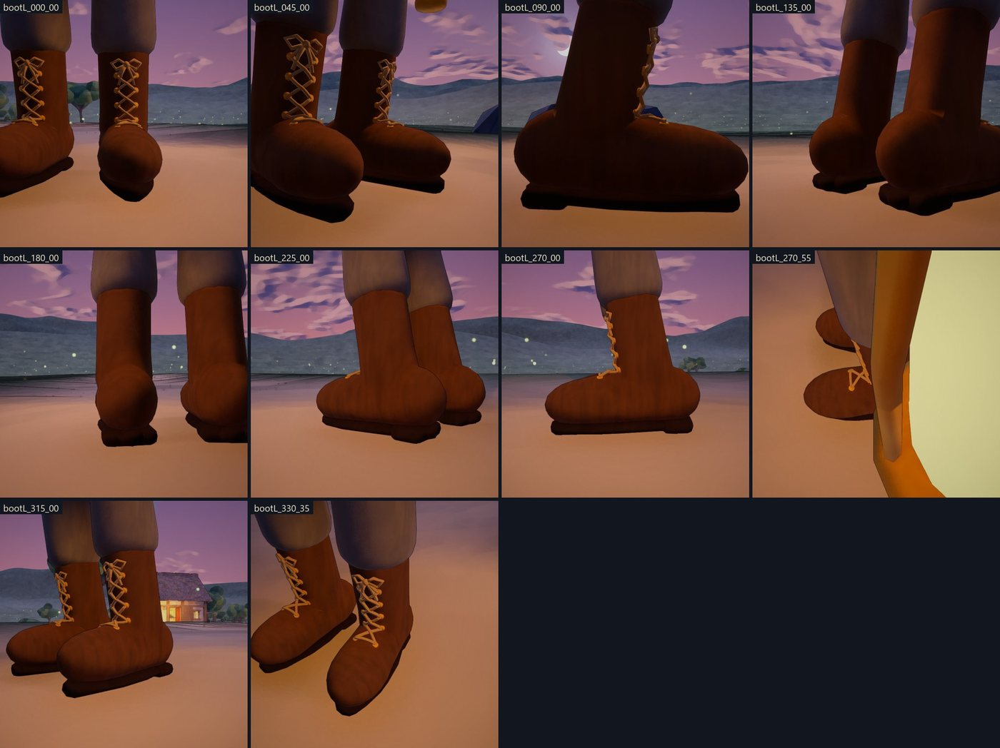

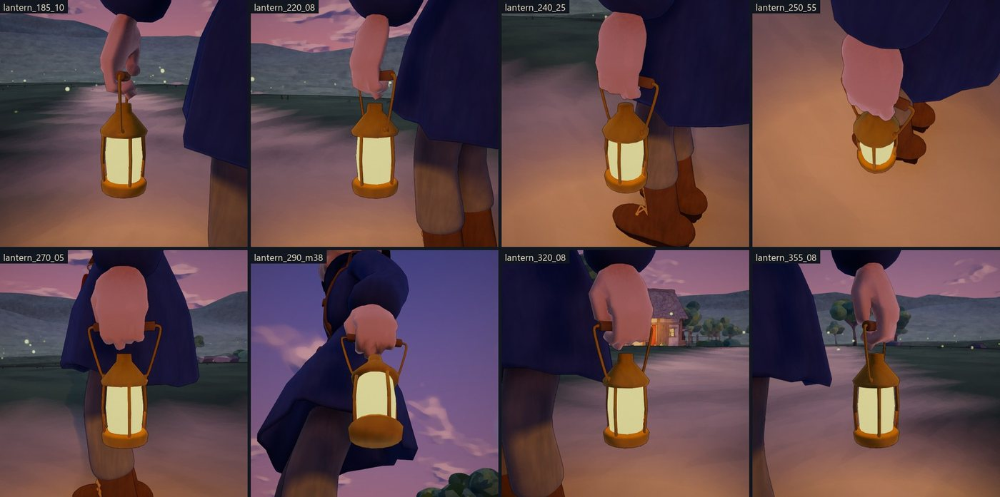

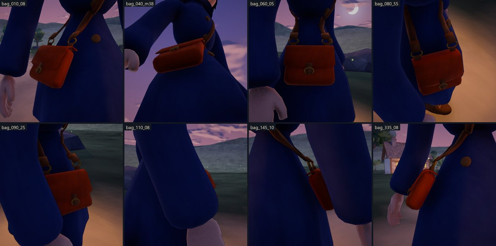

### What the method found

The first automatic audit, on the build Luis played, failed 45 checks on
Small, 41 on Long and 42 on Round. Some were the audit's own mistakes, and
were corrected ([below](#what-the-round-taught-the-method)). The real ones,
beyond Luis's five:

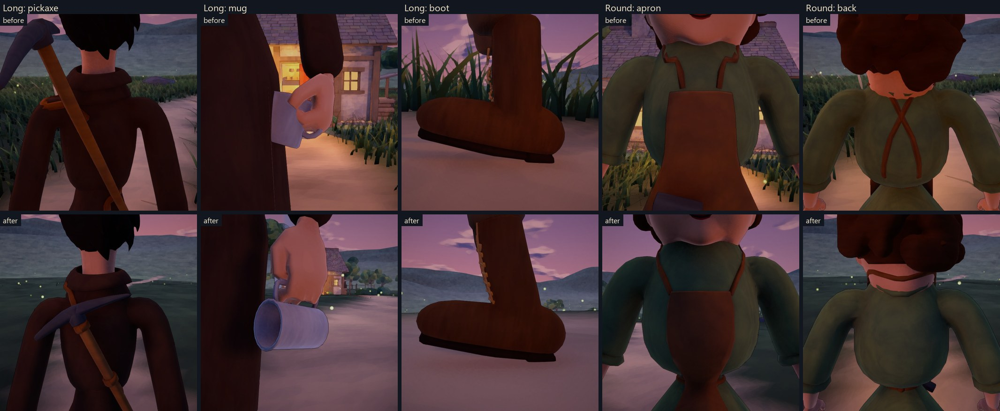

| ID | Model | Zone | Found by | Sev. | Finding | Cause | Fix |
|---|---|---|---|---|---|---|---|
| M1 | Long, Round | Boots | Audit at rest | A | Laces 16 to 26 mm off the boots, as on Small | Same as Small's | Same fix, in the boot module |
| M2 | All | Hips and hem | Pose sweep | A | The knee came through the coat mid-stride, by up to 15 cm (Small) and 18 cm (Long) | The skirt followed the hips and a share of each thigh, so a leg swinging forward outran it | The skirt hangs in four flaps, front and back of each leg, each on a bone at its hip. A thigh pushes its flap; a flap that is left falls back a little late |
| M3 | Small | Carried things | Pose sweep | A | The lantern swung up to 25 mm into the coat; the hand went 6 mm into it | Nothing stopped it | The body stops what hangs beside it. The carrying arm hangs far enough out for the lantern to hang straight through a whole stride |
| M4 | Small | Bag | Pose sweep | A | The bag went up to 33 mm into the arm, and 5 mm into the coat | The arm hung where the bag was | The arm on the bag's side hangs clear of it; the bag rests on the coat |
| M5 | Small, Long | Carried things | Capture, walking | B | The lantern and the bag trailed about 40° behind the walk, as if in a wind | Their swing was damped against the world, not against the hand that carries them | Only their own swing fades. Carried steadily, they hang straight |
| M6 | Small, Long | Carried things | Tests, then the recorded poses | A | The lantern leaned 16° backward and the mug 25°, even standing still | The wrist's give moved the handle, and that movement was fed back to the pendulum as if the arm had moved | The pendulum hangs from where the arm carries it; the give is shown, never fed back |
| M7 | All | Carried things | Tests | B | At very high frame rates the things stopped feeling gravity | Gravity's pull in one frame became smaller than a position far from the world's middle can hold | The weight is kept as a small offset and a speed |
| M8 | Long | Shoulders and back | Audit at rest | A | The pickaxe hung behind the back with nothing under it: 20 mm from its strap. The strap cut up to 37 mm into the coat | The strap was a guessed curve | A sling: the strap is laid on the cloth, pulled taut, and carries two leather loops that hold the handle. The pickaxe hangs by its head |
| M9 | Long | Carried things | Audit, capture | A | The mug went 10 to 16 mm into the coat and trousers; the knuckles cut its wall | It was placed by measurements | The handle stands off the wall with room for the fingers; the mug hangs from the hand and swings |
| M10 | Long | Chest, hem | Audit at rest | A | Two patches stood 6 mm off the cloth | Flat slabs on curved cloth | Every point of a patch is laid on the cloth |
| M11 | All | Boots | Pose sweep | A | In a sharp turn one boot passed up to 39 mm through the other | The swinging foot went straight to its place; in a turn the feet's paths cross | The swinging boot goes round the standing one, and never lands on it. Both are measured as boots (heel to toe), not as points |
| M12 | Round | Chest and waist | Audit at rest | A | The apron's straps ended 45 mm above the bib. The smock showed 22 to 30 mm through the apron. The ties stood 10 mm off; the pocket and the hammer's head floated | The apron was a board with separate straps | The apron is laid on the smock down to its ties and hangs free below. A strap goes round the neck; the ties are knotted at the back. The pocket is sewn on |
| M13 | Round | Hips and hem | Construction, pose sweep | B | The hammer stuck in a pocket; later, hung in a loop, it leaned 17° outward and its top sank 6 mm into the smock | First nothing held it. Then its stop was a flat place on a round body, and it slid along it | It hangs in a leather loop sewn to the apron, its head across the loop. It swings out from the body and back, not sideways, and the loop moves with the cloth it is sewn to |
| M14 | Round | Head | Audit at rest | A | Curls 19 mm inside the smock's neck | The hair grew as low as on a longer neck | The curls end above the collar |
| M15 | All | Head, neck | Audit at rest | C | A sealed bubble inside each head; the neck's base wider than the neckline | Left by joining the head's parts | Removed; the neck's base fits the neckline |
| M16 | All | Light | Capture | B | The lamp's flame burnt white up close | Too bright for the bloom | Glow lowered |
| M17 | Long | Hips and hem | Capture, against the "before" sheets | B | The long coat had become a bell, even standing | My own fix for M2 earlier in the round: making the coat clear the knees asked the whole ring for more depth, without end where a knee is as far out as the coat is wide | The cloth goes out only where a leg is, and only as far as the leg asks. The coat is slim again, and its back hangs still until a leg reaches it |
| M18 | Round | Chest | Before and after pairs | B | The apron's bib had become a narrow strip, like a tie | Also my own, from M12: laid on the real cloth, the bib's width was measured as an angle round a round belly | The bib is cut to the chest's measured width; from the waist down the apron hangs as fitted |

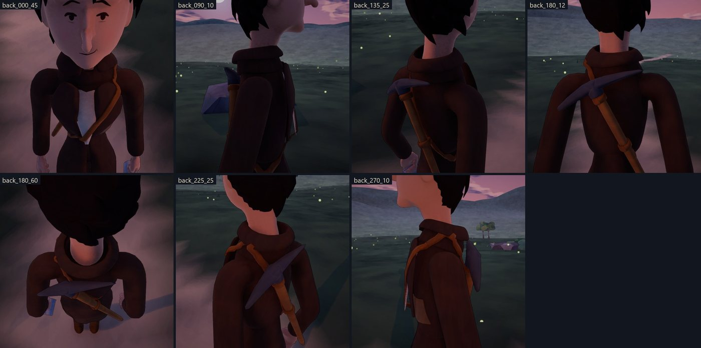

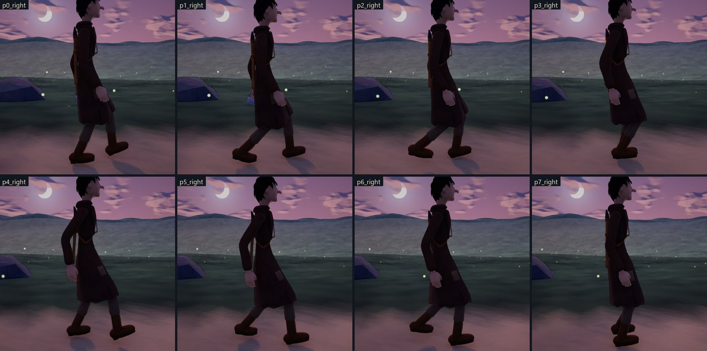

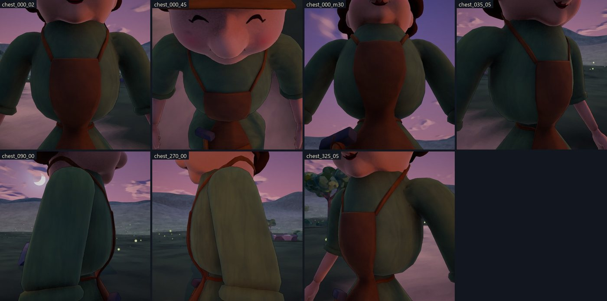

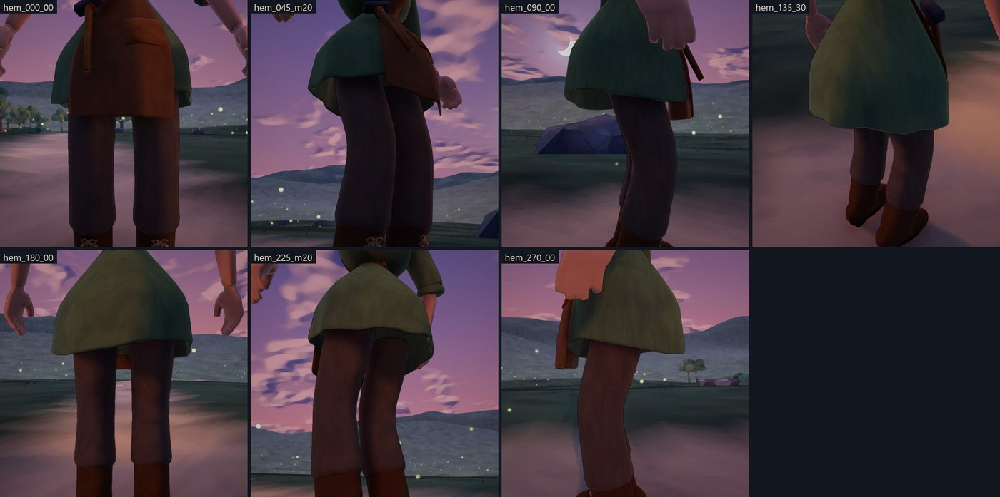

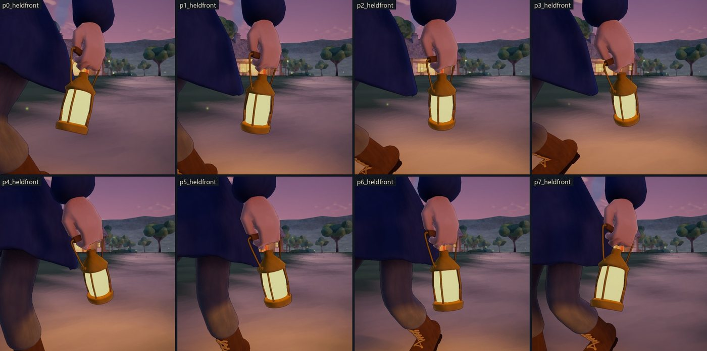

### Where the round ended

- **The automatic audit, at rest:** nothing fails on any of the three (386
  checks on Small, 268 on Long, 202 on Round).
- **The audit on the game's own movement** (235 recorded frames each:
  standing, starting, walking, a sharp turn, stopping): four checks remain of
  856. Each was read and is left with its reason:

  | Model | Where | What remains | Why it is left |
  |---|---|---|---|
  | Small | The sharpest turn, one frame | The knee shows 29 mm past the coat's lifted hem (11 mm since October 5, when the check stopped counting a leg under a lifted hem as through the cloth) | It comes out under the hem, not through the cloth. The step in that turn is a high one; that is the walk's matter, and the walk is not changed without Luis's word |
  | Small | The same step, one frame | The trouser's cuff goes 9 mm into the boot's shaft | The same high step bends the knee further than any stride does |
  | Long | The sharpest turn, two frames | The free hand brushes 7 mm into the coat's front | The knee lifts the coat into a hand that is swinging forward. Cloth would give |
  | Round | Walking, 6 frames of 118 | The hammer's handle presses 3.9 mm into the apron (the limit is 3.5) | The leg lifts the apron against the handle. Leather would give |

- **Tests.** Eight miner tests pass, two of them new: what a miner carries
  hangs from its hand, stays out of the body and hangs straight when carried
  steadily; in a sharp turn the boots never overlap.
- **The exhaustive look.** Every round captured about 240 frames a miner into
  92 contact sheets. The last round's were read: every junction zone, the
  walk's views, the carried things and the orbit at full size; the remaining
  walk, motion, distance and fresh-eyes sheets at half size.
- **Open, smaller than a note** (severity C):
  - a patch on Long's coat lifts a few millimetres at one corner in the
    sharpest turn (five bones share the cloth there, and the engine keeps
    four for each point);
  - a small tooth in the rim of Round's neckband, at the back
    ([closed on October 5](#after-luiss-look-october-5));
  - from the side, Long's pickaxe lies flat on the back and adds little to
    the silhouette.
- **The sweep of extreme poses** (a deep knee bend, arms raised) was not
  built in this round. It was built on October 5
  ([above](#the-sweep-of-extreme-poses-october-5)).

The reports are kept in `Art/Review/Miners`. See
[Validation.md](../Validation.md) for the full evidence.

### What the round taught the method

- **Read every failure before fixing.** A check that reads wrong is itself a
  finding. The audit's own mistakes in this round:
  - hands "inside" their own cuffs (the top is now measured as body and
    arms);
  - surfaces that only graze counted as crossing (depth is measured now);
  - thin shells judged by their faces' directions (crossings are counted
    instead);
  - "floating" pieces that were sealed inside a solid;
  - a boot's hidden end counted as coming out of the trousers;
  - the open front of a coat counted as legs coming through.
- **Compare with the "before" sheets, not only with the last round.** M17
  crept in over several rounds, each a little wider than the last, and M18
  came with a fix that passed every check. Both showed at once beside the
  first capture.
- **Measure in the game, then decide.** Two wrong guesses about the leaning
  lantern were replaced by one measurement on the recorded frames: it leaned
  backward, standing still, by exactly what a wrist can give.
- **A test must read one moment.** A test that read the bones after the miner
  had walked on measured the walk, not the lantern. `MinerBody` now reports
  what it last posed.
- **Tools must not write into the game's assets.** The audit's reports now go
  to `Art/Review/Miners`.

## Polish after Luis's word (October 3)

Luis: "almost perfect now! Honestly they are already adorable!" Luis also
noted:
- the necks looked glued on up close;
- the separated feet looked strange;
- Round's hands looked a little strange.

Luis asked for a careful look at every distance
([correspondence](../Correspondence/2026-10-03_THE_MINERS_FEEDBACK.md)).


- **Necks.** The neck is now part of the head's own form: a column growing
  from behind the jaw, down into the collar, widening into the shoulders
  under the clothes. No seam, no stalk.
  - **Round:** a short, sturdy neck. The head sits lower on the shoulders,
    which rise a little.
  - **The smock's neckline:** a rolled neckband laid on the smock's surface,
    where the neck leaves the clothes.
- **Feet.** The two-ball boots became one boot: a shoe last with a low,
  rounded toe. The shaft is wide enough for the trousers to tuck into. Laces
  cross up the front, and the sole and heel follow the boot's outline. The
  trousers tuck in, bloused softly above the boots.
- **Round's hands.** The fists sank into the smock. They are now hands on
  hips: palms resting against the hips, fingers down and back, thumbs
  forward. Their place is measured from the real surface of the clothes.
- **Hands, all three.** A fuller palm and chunkier fingers. The thumb now
  wraps what the hand holds: across the curled fingers in a fist, round the
  handle in a grip.
- **Found on the careful look:**
  - **Round's smock rim.** The skirt started in a hard rim, like a bucket's,
    at the waist: smoothing makes a garment a little smaller than its
    measurements. Skirts now measure the top's real surface and hang from
    just inside it, so the smock flows from chest to hem.
  - **Round's apron.** It now lies over the measured clothes beneath, never
    through them. Its ties run on the smock's surface.
  - **Long's hips.** Two bumps were the trousers' thighs showing through the
    coat. The thighs now sit within the hips, and the coat clears them.
  - **Round's hair.** From behind, the curls read as a dark, spiky nest. They
    are now soft round clumps blended into one cloud, with a fringe of curls
    and a few curls springing off the back.
  - **Long's cheeks.** Gentler, so they read as cheekbones, not swellings.
  - **Creases.** Only inside the bent elbows and knees, a few soft ones, not
    rings all round.
  - **Rolled sleeves** hug the arm instead of floating like hoops.
  - **Patches and the apron pocket** are cast onto the garment's surface and
    lie along it. Round's hammer sits in the pocket.
  - **Faces fading at a distance.** The thin strokes averaged away into the
    skin as the texture shrank. Faces now use a sharper mipmap, so Long's
    eyes and smile read at conversation distance; up close they are
    unchanged.
  - **Small's lantern.** Its light sits a little below the glass, so the hand
    that carries it is not burnt white.

## Polish after Luis's play (October 3, evening)

Luis played the build and pointed at Small:
- the lantern floating beside the hip, through the hand;
- legs not lining up with the boots;
- the neck still odd;
- the satchel clipping, and not hanging properly from its strap.

Luis asked for proactive polish on all three, for research into good Blender
practice, and for natural walks
([correspondence](../Correspondence/2026-10-03_SMALL_POLISH_AND_NATURAL_GAITS.md)).
The practices now live in [CharacterPractices.md](CharacterPractices.md). The
close audit has since grown into the
[model quality method](ModelQualityMethod.md).


- **Small:**
  - **The lantern** is held by its bail in the left hand, on a bone of its
    own, and swings as Small walks. It lights the ground and the legs (a
    downward spot), not the face from below.
  - **The satchel** rests against the coat at the right hip, turned to its
    surface. Its strap lies on the coat from the left shoulder, rides over the
    buttons and ends at the bag's top in two tabs.
  - **The legs and boots** line up: the shafts hug the legs, and the trousers
    fall over them.
  - **The neck** rises from behind the jaw, slender at the top, into a collar
    that closes round it. The coat is buttoned up to the collar.
- **Found on the close audit:**
  - **The body walked away from Small.** After choosing a miner, its body was
    still standing where that miner was last shown. Choosing now stands the
    body up where the miner is, and a test checks it.
  - **A hole at the back of every neck.** The garments' necklines now close
    round the neck; collars grow out of the coat.
  - **Long's chest strap** (for the pickaxe on the back) floated where the
    coat opens. It now lies over the lapels and shirt, and the pickaxe sits
    lower and closer.
  - **Long's mug** now sits in the left hand instead of hanging at the belt.
  - **Round's apron** stood off the smock like a board. It now hangs just
    clear of it, and its straps lie over the shoulders.
  - **Buttons** are sewn onto the cloth, turned to its surface.
  - **Trousers under the coats and smock** are cut away where no one can see
    them, so they can never poke through.
  - **Clothes moving apart.** Layers lying on one another now take the same
    weights from the same field, so they move together.
  - **Selection rings** match each miner's size.
- **Natural walks.** Each body walks at its own comfortable pace, with a walk
  of its own (see
  [CharacterPractices.md](CharacterPractices.md#3-walks-natural-to-each-body)):
  - Small is brisk and bouncy;
  - Long takes long, smooth strides;
  - Round has a rolling walk.


## Rigged and in the game (October 3)


- **A rest pose for the rig.** Each miner is built a second time standing
  neutrally: feet under the hips, arms a little out, the head straight.
  Things held in the hands move elsewhere, so the hands are free for work:
  - Small's lantern goes to the belt;
  - Long's pickaxe goes across the back, the mug to the belt.
- **A skeleton** on the procedural body's own joints. It has 19 bones: pelvis,
  spine, chest, neck and head; upper arms, forearms and hands; thighs, shins,
  feet and toes. (Since October 4, carried things and the skirt's four flaps
  have bones of their own: 25 for Small, 24 for Long and Round.)
- **Skinning by the kind of part:**
  - boots follow the feet and shins;
  - hair and the cap follow the head;
  - a coat's skirt or an apron hangs from the pelvis, with the thighs carrying
    more of it towards the hem;
  - a satchel or lantern rides on the hips;
  - the slung pickaxe rides on the chest.

  Within those, each vertex follows its nearest bones.
- **Light for the RTS.**
  - **Three levels of detail:** about 18,000, 5,000 and 1,600 triangles. The
    farthest also drops laces, buttons and ties.
  - **One texture.** The painting, the painted face and the plain colours are
    all baked into a single 2048² atlas per miner. The face's islands get
    three times the room, so its strokes stay sharp.
  - **Draw calls.** One material, plus one for a lamp's glass, and the
    outline on the nearer two levels.
- **Moved by the procedural body.** The body's proportions now come from each
  model's skeleton: hip height and width, leg, foot, shoulders, arms and how
  the arms hang. It solves its joints onto invisible segments, and a rig
  adapter (`MinerBody`) turns the model's bones to match:
  - the pelvis, chest, head and feet follow their solved frames;
  - limbs aim at the solved joints, with knees bending forward and elbows
    back.
- **The choice.** All three stand ready in the Ordinary Place; one walks at a
  time, and `M` swaps them in place.


## What changed from the first concepts


| | First concepts | Now |
|---|---|---|
| **Hands** | Mitten blobs | Four fingers and a thumb, each with three joints, curled by the grip: around a strap, a lantern's bail, a mug or a pick handle; fists on the hips |
| **Hair** | Blobs, like helmets | Tapered locks combed from a parting or a crown, ending in points: a bob with a cut fringe, a swept cut, a mop of curls |
| **Boots** | Rounded lumps | A shaft, foot and toe cap fused into one form, a thick sole and heel, and laces |
| **Clothes** | Clay tubes | **Garments.** Garments fitted to the body; coats and smocks that hang in folds with ragged hems; collars, lapels, a shirt front, buttons, patches, a leather apron with straps and ties. **Painted.** Hand-painted by the same painter as the house: brushwork, cool cavities, worn lit edges, and a little dust low on the boots and hems |
| **Posture** | Stiff | **Weight.** It rests on one leg, the hips tilt and the shoulders answer. **Arms and legs.** They reach their targets with two-bone solving, like the procedural rig. **Head.** It turns, tilts and nods |
| **Faces** | Painted marks | The same faces Luis loved, unchanged, with one smudge of soot on Small's cheek |
| **Lines** | An outline that showed through thin cloth from afar | The outline sits a few centimetres behind each piece, so it draws silhouettes, never through a garment lying close on top |

## They are miners

- **Small.**
  - A brass miner's lantern swings from one hand; at dusk and night it casts
    warm light on Small.
  - The satchel strap is gripped in the other hand.
  - A smudge of soot sits on one cheek.
- **Long.** Leans on a pickaxe like a walking stick, a mug of tea in the other
  hand: a miner at the end of a shift.
- **Round.**
  - A leather miner's cap with a brass lamp, whose glow lights the way at
    night.
  - A leather apron with a hammer in its pocket.
  - Rolled sleeves.
  - Fists on the hips.
- **All three.** Dust low on their boots and hems.


## Portraits and turnarounds


## Built from modules, towards a character creator

A miner is a **preset**: a body, a face, a hairstyle, and a list of garments
and accessories, each with its own parameters. Every module fits any body,
since it is built from the body's skeleton and measurements. Swapping, mixing
or tuning modules makes a new character. That is the shape a character
creator needs.

| Module | Source | Choices today |
|---|---|---|
| **Body** | [`body.py`](../../Art/Blender/Worker/body.py) | **Measurements.** Height, head size and shape, trunk widths, limb thickness, hand and foot size. **Pose.** Which leg carries the weight, hip shift and tilt, stoop, head turn, nod and tilt, and where each hand goes. **Head.** Skull, jaw, cheeks, chin and a nose of its own. **Hands.** Five grips: relaxed, open, fist, hold, grip. **Boots.** Shaft height, with or without a cuff |
| **Face** | [`faces.py`](../../Art/Blender/Worker/faces.py) | Three painted styles (laughing, sleepy, curious), the skin tone, and soot smudges |
| **Hair** | [`hair.py`](../../Art/Blender/Worker/hair.py) | Three styles (bob, swept, curls), each tuned by parting, sweep, how high it starts under a cap, and its colour |
| **Garments and accessories** | [`outfits.py`](../../Art/Blender/Worker/outfits.py) | **Garments.** A top with sleeves (full, rolled, long over the hands), skirts for coats and smocks, trousers, a collar, lapels, a shirt front, an apron, buttons and patches. **Accessories.** A satchel, a lantern, a pickaxe, a mug, a lamp cap, a hammer |
| **The miners** | [`workers.py`](../../Art/Blender/Worker/workers.py) | The three presets, their materials and colours, the painting, the export and the manifest |

Materials are named, and the manifest (`workers.json`) tells the engine how
each one is drawn:
- **Painted texture:** cloth, leather, wood and metal.
- **Painted face:** skin.
- **Plain colour.**
- **Glow:** lantern and lamp glass.

A recolour is a new entry; a new garment is a new function.

Luis's "maybe" about letting the player choose between the three is recorded
as a possibility. Presets like these are how such a choice, and later a full
creator (S2), would start.

## How to make and see them

```
blender -b --factory-startup --python Art/Blender/Worker/workers.py -- --out Assets/_WonderGather/Art/Worker/Miners --paint --fbx
Unity -batchmode -projectPath . -executeMethod WonderGather.Editor.MinerCapture.Capture -captureOut <folder> -quit
```

In the Editor, **Wonder Gather → Capture the Miners** does the same. It asks
before leaving a modified scene, and leaves the three standing on the path to
look at in the Scene view. They are never saved into the scene.

## Limits

- **Rigged in the game,** but only walking and standing. Mining still uses
  the test body (see [MinersPlaytest.md](../Playtests/MinersPlaytest.md#not-yet)).
- **The posed models are heavy.** About 95,000–105,000 faces each, for
  portraits. The game uses the rigged versions: 18,000, 5,000 and 1,600
  triangles.
- **Fixed expressions.** Each face is painted with one expression.
- **Fingers.** The free hands have finger bones and close on a handle
  (October 5). The hands that carry something are still one closed shape.
- **The walk's high step in the sharpest turn.** For a frame, the knee shows
  under the coat's lifted hem. The walk itself is not changed without Luis's
  word.
- **Not judged by Luis.** Passing captures are not acceptance of the look.

## Next

- **The miners at work** (the plan is in
  [NextMilestonePlan.md](../NextMilestonePlan.md#s1d-last-part--the-miners-at-work-plan-waiting-for-luiss-choices)).
  Built: the sweep of extreme poses, and hands that close. Next: a pickaxe
  made for each body with its grips read from the model, a tool solve that
  reads the body, and then the miners at the rock. The last needs Luis's
  choices M1 to M4.
- **Faces in motion.** A blink or a change of expression.
- **Whatever Luis finds** that the method missed goes into its
  [misses ledger](ModelQualityMethod.md#9-the-misses-ledger).
