# The miners — Small, Long and Round (S1d, second pass)

**Made:** October 2, 2026; polished October 3.
**Status:**
- **Luis's verdict.** "Almost perfect… already adorable", after the second
  pass.
- **Polished** on the points Luis raised
  ([below](#polish-after-luiss-word-october-3)).
- **Rigged and in the game** (October 3): the three walk in the Ordinary
  Place on the procedural body, with the choice of miner
  ([below](#rigged-and-in-the-game-october-3);
  [MinersPlaytest.md](../Playtests/MinersPlaytest.md)).
**Asked by Luis.** After the [first concepts](WorkerConcepts.md), Luis ranked
them Small, then Long, then Round, and loved every face, then asked for:
- much higher model quality, prettier and more pleasing to look at;
- the same stylization, kept;
- hints, even small ones, that they are miners.

Luis also asked to keep in mind that the final game lets players customize
everything, units included, like detailed character creators
([correspondence](../Correspondence/2026-10-02_WORKER_CONCEPTS_FEEDBACK.md)).

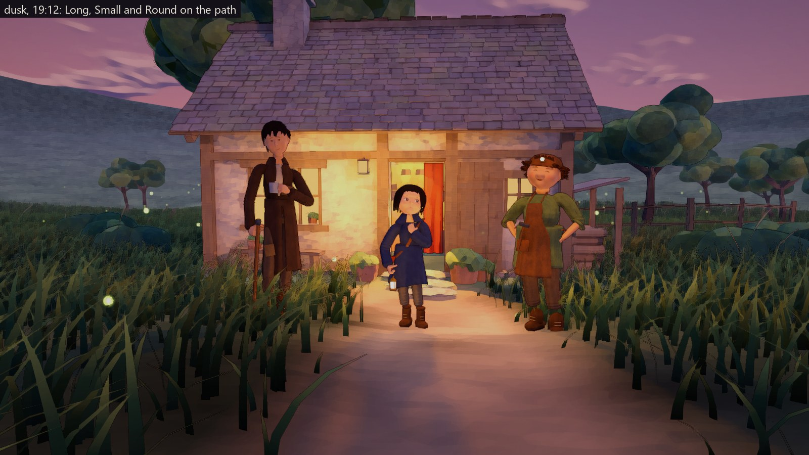

## Polish after Luis's word (October 3)

Luis: "almost perfect now! Honestly they are already adorable!" Luis also
noted:
- the necks looked glued on up close;
- the separated feet looked strange;
- Round's hands looked a little strange.

Luis asked for a careful look at every distance
([correspondence](../Correspondence/2026-10-03_THE_MINERS_FEEDBACK.md)).

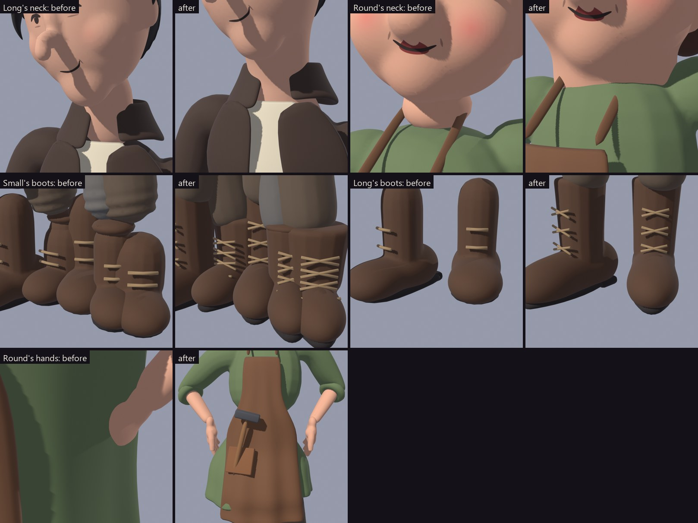

- **Necks.** The neck is now part of the head's own form: a column growing
  from behind the jaw, down into the collar, widening into the shoulders
  under the clothes. No seam, no stalk.
  - **Round:** a short, sturdy neck. The head sits lower on the shoulders,
    which rise a little.
  - **The smock's neckline:** a rolled neckband laid on the smock's surface,
    where the neck leaves the clothes.
- **Feet.** The two-ball boots became one boot: a shoe last with a low,
  rounded toe. The shaft is wide enough for the trousers to tuck into. Laces
  cross up the front, and the sole and heel follow the boot's outline. The
  trousers tuck in, bloused softly above the boots.
- **Round's hands.** The fists sank into the smock. They are now hands on
  hips: palms resting against the hips, fingers down and back, thumbs
  forward. Their place is measured from the real surface of the clothes.
- **Hands, all three.** A fuller palm and chunkier fingers. The thumb now
  wraps what the hand holds: across the curled fingers in a fist, round the
  handle in a grip.
- **Found on the careful look:**
  - **Round's smock rim.** The skirt started in a hard rim, like a bucket's,
    at the waist: smoothing makes a garment a little smaller than its
    measurements. Skirts now measure the top's real surface and hang from
    just inside it, so the smock flows from chest to hem.
  - **Round's apron.** It now lies over the measured clothes beneath, never
    through them. Its ties run on the smock's surface.
  - **Long's hips.** Two bumps were the trousers' thighs showing through the
    coat. The thighs now sit within the hips, and the coat clears them.
  - **Round's hair.** From behind, the curls read as a dark, spiky nest. They
    are now soft round clumps blended into one cloud, with a fringe of curls
    and a few curls springing off the back.
  - **Long's cheeks.** Gentler, so they read as cheekbones, not swellings.
  - **Creases.** Only inside the bent elbows and knees, a few soft ones, not
    rings all round.
  - **Rolled sleeves** hug the arm instead of floating like hoops.
  - **Patches and the apron pocket** are cast onto the garment's surface and
    lie along it. Round's hammer sits in the pocket.
  - **Faces fading at a distance.** The thin strokes averaged away into the
    skin as the texture shrank. Faces now use a sharper mipmap, so Long's
    eyes and smile read at conversation distance; up close they are
    unchanged.
  - **Small's lantern.** Its light sits a little below the glass, so the hand
    that carries it is not burnt white.

## Polish after Luis's play (October 3, evening)

Luis played the build and pointed at Small:
- the lantern floating beside the hip, through the hand;
- legs not lining up with the boots;
- the neck still odd;
- the satchel clipping, and not hanging properly from its strap.

Luis asked for proactive polish on all three, for research into good Blender
practice, and for natural walks
([correspondence](../Correspondence/2026-10-03_SMALL_POLISH_AND_NATURAL_GAITS.md)).
The practices and the close audit now live in
[CharacterPractices.md](CharacterPractices.md).

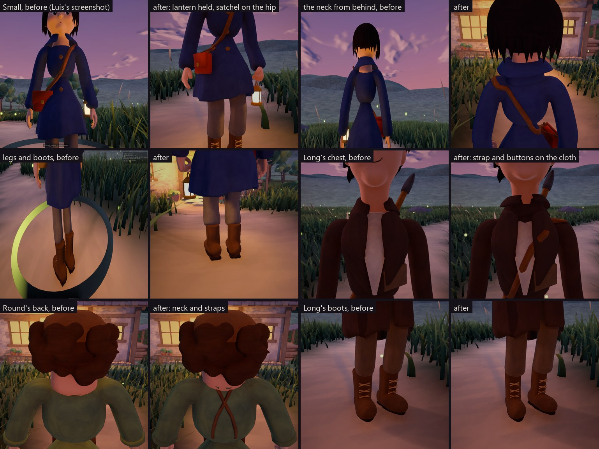

- **Small:**
  - **The lantern** is held by its bail in the left hand, on a bone of its
    own, and swings as Small walks. It lights the ground and the legs (a
    downward spot), not the face from below.
  - **The satchel** rests against the coat at the right hip, turned to its
    surface. Its strap lies on the coat from the left shoulder, rides over the
    buttons and ends at the bag's top in two tabs.
  - **The legs and boots** line up: the shafts hug the legs, and the trousers
    fall over them.
  - **The neck** rises from behind the jaw, slender at the top, into a collar
    that closes round it. The coat is buttoned up to the collar.
- **Found on the close audit:**
  - **The body walked away from Small.** After choosing a miner, its body was
    still standing where that miner was last shown. Choosing now stands the
    body up where the miner is, and a test checks it.
  - **A hole at the back of every neck.** The garments' necklines now close
    round the neck; collars grow out of the coat.
  - **Long's chest strap** (for the pickaxe on the back) floated where the
    coat opens. It now lies over the lapels and shirt, and the pickaxe sits
    lower and closer.
  - **Long's mug** now sits in the left hand instead of hanging at the belt.
  - **Round's apron** stood off the smock like a board. It now hangs just
    clear of it, and its straps lie over the shoulders.
  - **Buttons** are sewn onto the cloth, turned to its surface.
  - **Trousers under the coats and smock** are cut away where no one can see
    them, so they can never poke through.
  - **Clothes moving apart.** Layers lying on one another now take the same
    weights from the same field, so they move together.
  - **Selection rings** match each miner's size.
- **Natural walks.** Each body walks at its own comfortable pace, with a walk
  of its own (see
  [CharacterPractices.md](CharacterPractices.md#2-walks-natural-to-each-body)):
  - Small is brisk and bouncy;
  - Long takes long, smooth strides;
  - Round has a rolling walk.

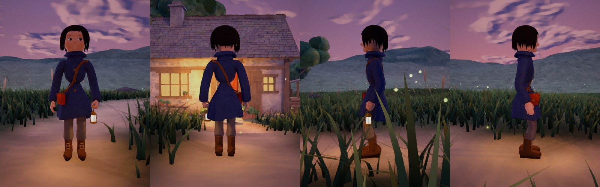
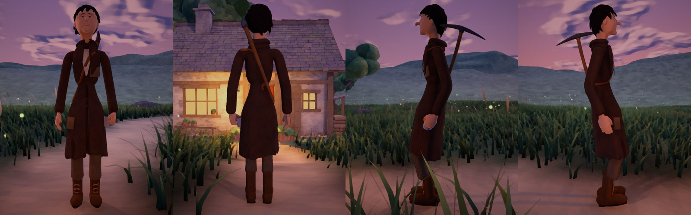
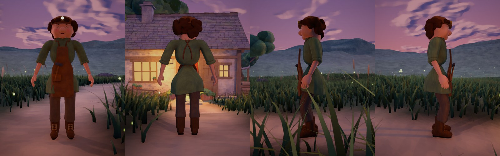

## Rigged and in the game (October 3)


- **A rest pose for the rig.** Each miner is built a second time standing
  neutrally: feet under the hips, arms a little out, the head straight.
  Things held in the hands move elsewhere, so the hands are free for work:
  - Small's lantern goes to the belt;
  - Long's pickaxe goes across the back, the mug to the belt.
- **A skeleton** on the procedural body's own joints. It has 19 bones: pelvis,
  spine, chest, neck and head; upper arms, forearms and hands; thighs, shins,
  feet and toes.
- **Skinning by the kind of part:**
  - boots follow the feet and shins;
  - hair and the cap follow the head;
  - a coat's skirt or an apron hangs from the pelvis, with the thighs carrying
    more of it towards the hem;
  - a satchel or lantern rides on the hips;
  - the slung pickaxe rides on the chest.

  Within those, each vertex follows its nearest bones.
- **Light for the RTS.**
  - **Three levels of detail:** about 18,000, 5,000 and 1,600 triangles. The
    farthest also drops laces, buttons and ties.
  - **One texture.** The painting, the painted face and the plain colours are
    all baked into a single 2048² atlas per miner. The face's islands get
    three times the room, so its strokes stay sharp.
  - **Draw calls.** One material, plus one for a lamp's glass, and the
    outline on the nearer two levels.
- **Moved by the procedural body.** The body's proportions now come from each
  model's skeleton: hip height and width, leg, foot, shoulders, arms and how
  the arms hang. It solves its joints onto invisible segments, and a rig
  adapter (`MinerBody`) turns the model's bones to match:
  - the pelvis, chest, head and feet follow their solved frames;
  - limbs aim at the solved joints, with knees bending forward and elbows
    back.
- **The choice.** All three stand ready in the Ordinary Place; one walks at a
  time, and `M` swaps them in place.


## What changed from the first concepts

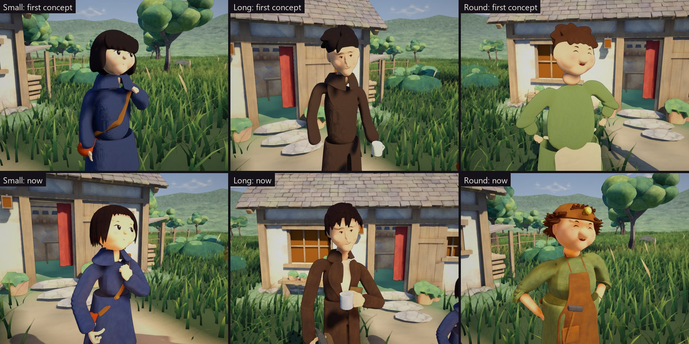

| | First concepts | Now |
|---|---|---|
| **Hands** | Mitten blobs | Four fingers and a thumb, each with three joints, curled by the grip: around a strap, a lantern's bail, a mug or a pick handle; fists on the hips |
| **Hair** | Blobs, like helmets | Tapered locks combed from a parting or a crown, ending in points: a bob with a cut fringe, a swept cut, a mop of curls |
| **Boots** | Rounded lumps | A shaft, foot and toe cap fused into one form, a thick sole and heel, and laces |
| **Clothes** | Clay tubes | **Garments.** Garments fitted to the body; coats and smocks that hang in folds with ragged hems; collars, lapels, a shirt front, buttons, patches, a leather apron with straps and ties. **Painted.** Hand-painted by the same painter as the house: brushwork, cool cavities, worn lit edges, and a little dust low on the boots and hems |
| **Posture** | Stiff | **Weight.** It rests on one leg, the hips tilt and the shoulders answer. **Arms and legs.** They reach their targets with two-bone solving, like the procedural rig. **Head.** It turns, tilts and nods |
| **Faces** | Painted marks | The same faces Luis loved, unchanged, with one smudge of soot on Small's cheek |
| **Lines** | An outline that showed through thin cloth from afar | The outline sits a few centimetres behind each piece, so it draws silhouettes, never through a garment lying close on top |

## They are miners

- **Small.**
  - A brass miner's lantern swings from one hand; at dusk and night it casts
    warm light on Small.
  - The satchel strap is gripped in the other hand.
  - A smudge of soot sits on one cheek.
- **Long.** Leans on a pickaxe like a walking stick, a mug of tea in the other
  hand: a miner at the end of a shift.
- **Round.**
  - A leather miner's cap with a brass lamp, whose glow lights the way at
    night.
  - A leather apron with a hammer in its pocket.
  - Rolled sleeves.
  - Fists on the hips.
- **All three.** Dust low on their boots and hems.

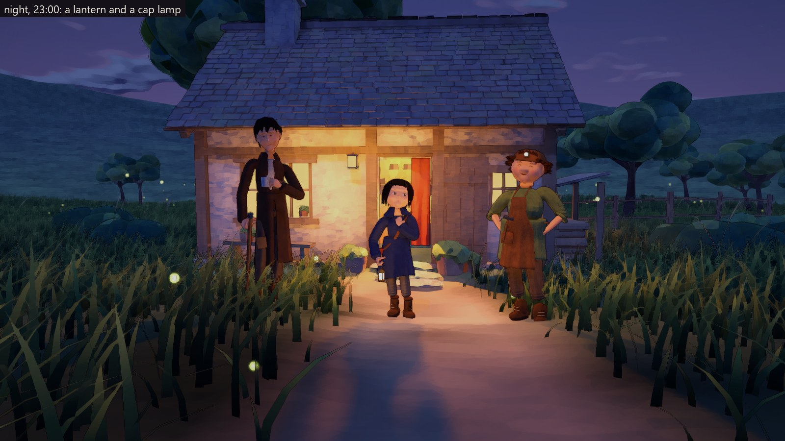

## Portraits and turnarounds

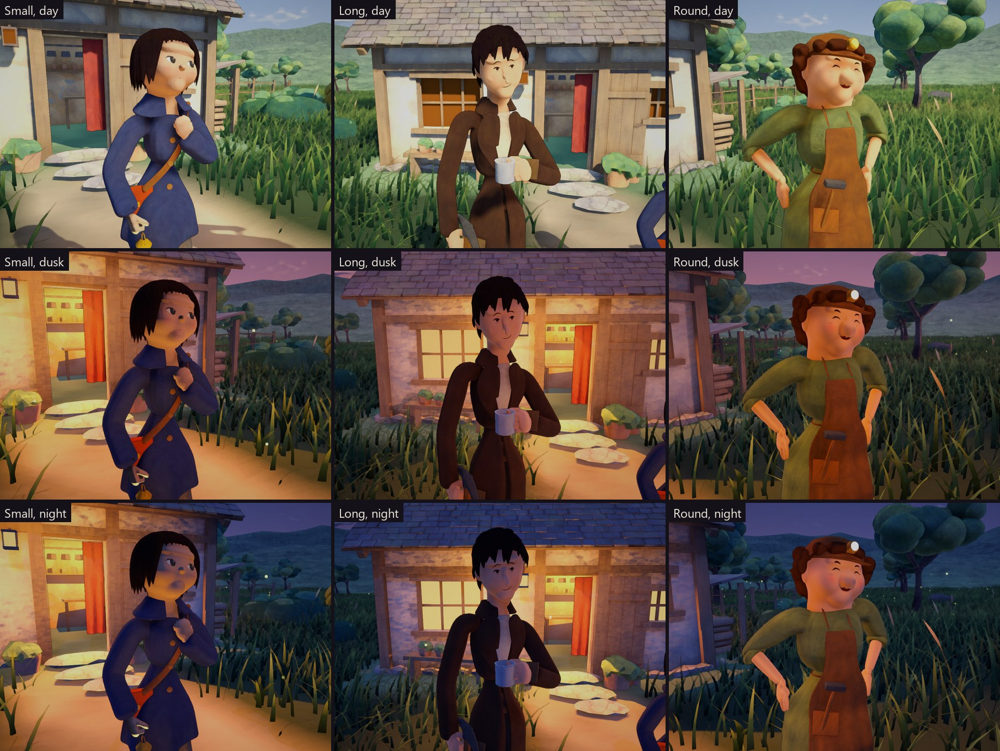

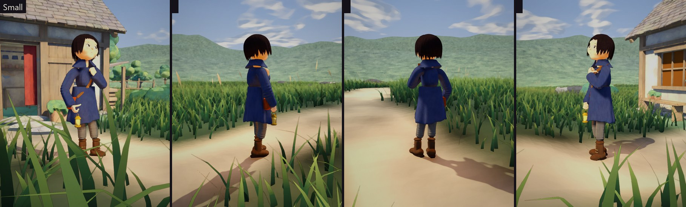
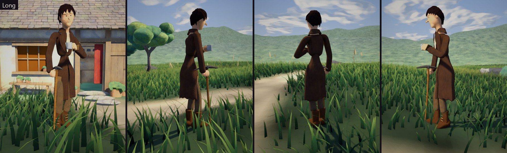
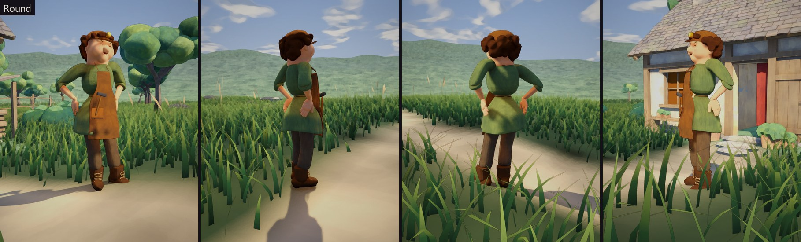

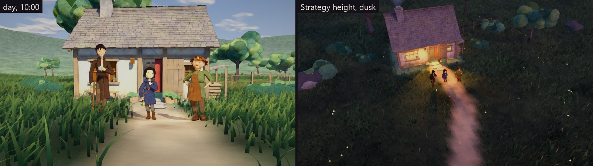

## Built from modules, towards a character creator

A miner is a **preset**: a body, a face, a hairstyle, and a list of garments
and accessories, each with its own parameters. Every module fits any body,
since it is built from the body's skeleton and measurements. Swapping, mixing
or tuning modules makes a new character. That is the shape a character
creator needs.

| Module | Source | Choices today |
|---|---|---|
| **Body** | [`body.py`](../../Art/Blender/Worker/body.py) | **Measurements.** Height, head size and shape, trunk widths, limb thickness, hand and foot size. **Pose.** Which leg carries the weight, hip shift and tilt, stoop, head turn, nod and tilt, and where each hand goes. **Head.** Skull, jaw, cheeks, chin and a nose of its own. **Hands.** Five grips: relaxed, open, fist, hold, grip. **Boots.** Shaft height, with or without a cuff |
| **Face** | [`faces.py`](../../Art/Blender/Worker/faces.py) | Three painted styles (laughing, sleepy, curious), the skin tone, and soot smudges |
| **Hair** | [`hair.py`](../../Art/Blender/Worker/hair.py) | Three styles (bob, swept, curls), each tuned by parting, sweep, how high it starts under a cap, and its colour |
| **Garments and accessories** | [`outfits.py`](../../Art/Blender/Worker/outfits.py) | **Garments.** A top with sleeves (full, rolled, long over the hands), skirts for coats and smocks, trousers, a collar, lapels, a shirt front, an apron, buttons and patches. **Accessories.** A satchel, a lantern, a pickaxe, a mug, a lamp cap, a hammer |
| **The miners** | [`workers.py`](../../Art/Blender/Worker/workers.py) | The three presets, their materials and colours, the painting, the export and the manifest |

Materials are named, and the manifest (`workers.json`) tells the engine how
each one is drawn:
- **Painted texture:** cloth, leather, wood and metal.
- **Painted face:** skin.
- **Plain colour.**
- **Glow:** lantern and lamp glass.

A recolour is a new entry; a new garment is a new function.

Luis's "maybe" about letting the player choose between the three is recorded
as a possibility. Presets like these are how such a choice, and later a full
creator (S2), would start.

## How to make and see them

```
blender -b --factory-startup --python Art/Blender/Worker/workers.py -- --out Assets/_WonderGather/Art/Worker/Miners --paint --fbx
Unity -batchmode -projectPath . -executeMethod WonderGather.Editor.MinerCapture.Capture -captureOut <folder> -quit
```

In the Editor, **Wonder Gather → Capture the Miners** does the same. It asks
before leaving a modified scene, and leaves the three standing on the path to
look at in the Scene view. They are never saved into the scene.

## Limits

- **Rigged in the game,** but only walking and standing. Mining still uses
  the test body (see [MinersPlaytest.md](../Playtests/MinersPlaytest.md#not-yet)).
- **The posed models are heavy.** About 95,000–105,000 faces each, for
  portraits. The game uses the rigged versions: 18,000, 5,000 and 1,600
  triangles.
- **Fixed expressions.** Each face is painted with one expression.
- **Coarse fingers.** Finger shapes are good from a step away, but coarse up
  close.
- **Not judged by Luis.** Passing captures are not acceptance of the look.

## Next

- **Luis plays the build:** the choice of miner and walking in the meadow
  ([MinersPlaytest.md](../Playtests/MinersPlaytest.md)).
- **Mining with the miners.** Size the pickaxe and its grips to each body, and
  move the equipment scene onto the miners.
- **Hands and faces in motion.** Hands that close on what they hold, and a
  blink or a change of expression.
