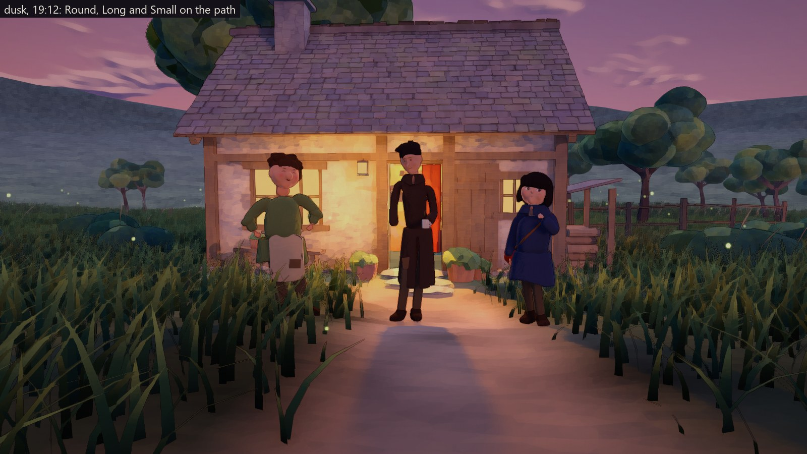
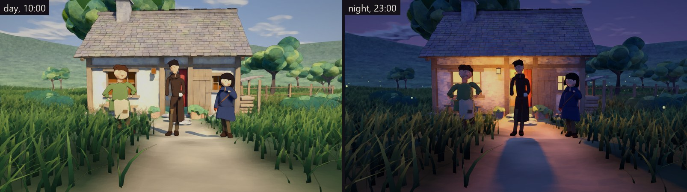
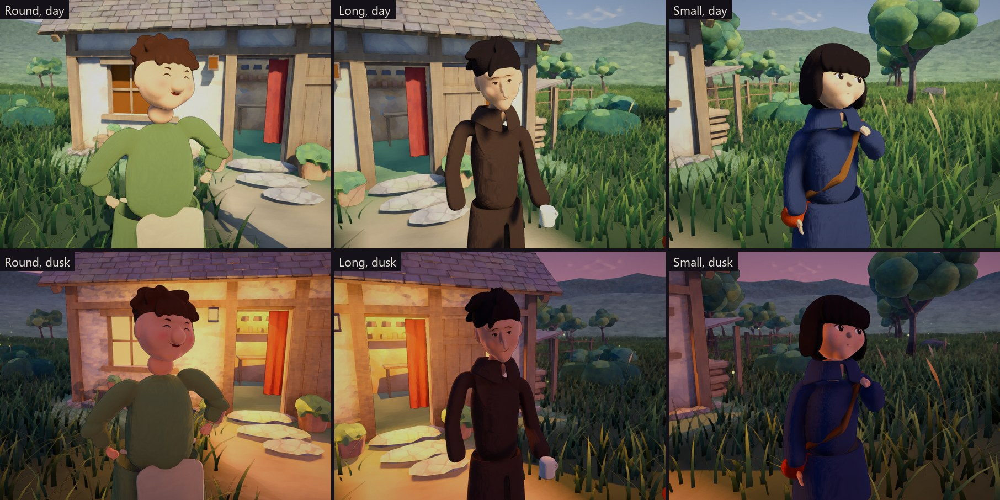
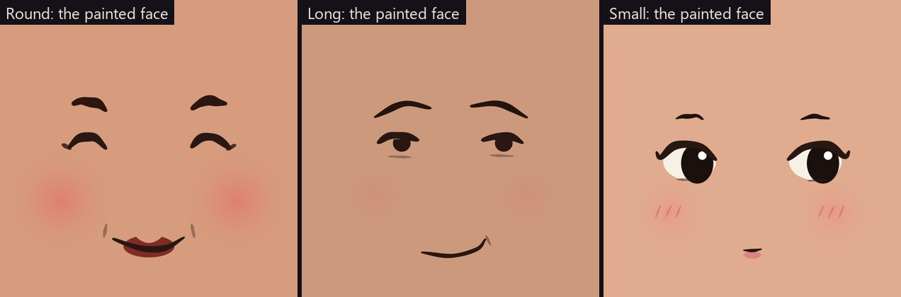
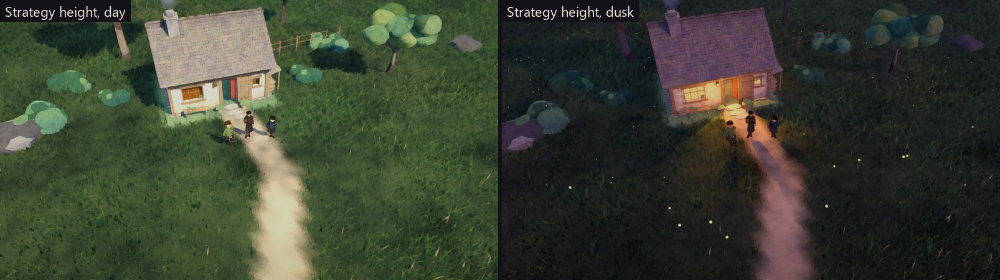

# The worker's redesign — first concepts (S1d)

**Made:** October 2, 2026.
**Status:** Concept frames for Luis to choose a direction. They are not the
rigged worker.
**Asked by Luis:** "let's finally move to the player remodel/redesign… Please
use them to implement this remodelling/redesign with heart and soul" (see
[the correspondence](../Correspondence/2026-10-02_DUSK_DETAILS_AND_THE_WORKER.md)).

**Source.**
- **Models.** [`Art/Blender/Worker/worker_concepts.py`](../../Art/Blender/Worker/worker_concepts.py)
  builds the three figures and paints their faces. Every image here can be
  remade from it.
- **Frames.** `WonderGather.Editor.WorkerConceptCapture` stands them in the
  Ordinary Place, in look E, and renders the frames.

```
blender -b --factory-startup --python Art/Blender/Worker/worker_concepts.py -- --fbx Assets/_WonderGather/Art/Worker/Concepts/Workers.fbx
Unity -batchmode -projectPath . -executeMethod WonderGather.Editor.WorkerConceptCapture.Capture -captureOut <folder> -quit
```

In the Editor, the menu **Wonder Gather → Capture Worker Concepts** does the
same. It leaves the three standing on the path, so they can be looked at in
the Scene view. They are never saved into the scene.

## What they are built on

The Visual Soul's language for every being and thing
([VisualSoul.md](VisualSoul.md#the-language-for-every-being-and-thing)). Each
principle shows up as follows:

| Principle | In these concepts |
|---|---|
| **A shape that tells character** | Each figure is built on one clear idea: round and heavy, long and thin, small and young. They read apart even as three dots from the Strategy camera. |
| **Drawn, not only modelled** | **Outline.** A dark warm contour wobbles in width along the form (`WGOutline`), about the same width on screen near or far. **Paint filter.** It now leaves beings clear (`_Drawn`), so their few marks hold, while the world around stays painted. |
| **Feeling from very few marks** | **Faces.** Each face is a handful of brush strokes painted into a texture: laughing closed eyes, heavy sleepy lids, big glancing eyes. Brows, a mouth and a blush add little else. |
| **Value design** | Dark hair and coats against light faces and hands. One warm accent: a satchel, a mug, a patch. |
| **Posture and small gestures** | **Weight.** It rests on one leg, the hips tilt, the shoulders answer, and the head turns and tilts. **Hands.** Fists on the hips, a mug held loosely, a hand on a satchel's strap. |
| **Individual, worn surfaces** | An apron with a pocket, patches on an old coat, ragged hems, rolled sleeves. **Not yet painted:** cloth folds and wear, which are the next step (see below). |
| **Light finds them** | The frames are taken at Luis's favourite hour, at 19:12 before the lit house, and also by day and at night. |
| **Small against an immense world** | Seen at the Strategy camera's height: three small people on the path. |

## The three concepts



| | Round | Long | Small |
|---|---|---|---|
| **The idea** | Short and heavy-set, sure of the work ahead | Tall and thin, unhurried, a little melancholy | Young and small, curious, ready to set out |
| **Height** | 1.56 m | 1.86 m | 1.42 m |
| **Shape** | A barrel body, a big round head, a bulb nose | A stoop, a long face, a long nose, a long open coat | A big dark bob, an oversized coat with long sleeves |
| **Face** | Laughing: closed happy eyes, big rosy cheeks, a wide smile | Sleepy and kind: heavy lids, long brows sloping down, a crooked smile | Big dark eyes glancing aside, a soft blush with three small strokes, a small parted mouth |
| **Gesture** | Fists on the hips | One hand in a pocket, a mug of tea in the other | One hand on the satchel's strap |
| **Surfaces** | A green smock with rolled sleeves, a canvas apron with a pocket | A dark brown coat with two sewn patches and lapels | A navy coat with a turned-up collar, a red-brown satchel |









## How they are made

- **Bodies and clothes.**
  - Joint skeletons are given flesh by Blender's skin modifier.
  - The torso and each arm are fused into one closed surface, by a voxel
    remesh.
  - Coat and smock skirts are flared tubes with ragged hems.
  - The skeleton follows the procedural rig's joints: pelvis, spine, chest,
    neck, head, arms, legs and feet.
- **Heads.** Metaballs blend these into one form:
  - a skull and jaw;
  - cheeks and a chin;
  - a brow;
  - ears;
  - each figure's own nose.
- **Hands.** Metaballs: a palm, grouped fingers with tips, and a thumb, open or
  closed.
- **Hair.** Metaball locks: a curly mop, a swept cut with strands up at the
  crown, a bob with a pointed fringe.
- **Faces.** Painted by the script into a 1024² texture with soft brush stamps
  along curves, wobbling slightly like a hand. They are projected onto the face
  from the front.
- **In the engine.** Each figure takes the world's own painted shader, with
  its colours chosen for value design, plus:
  - the outline material;
  - the `_Drawn` switch.

## Questions for Luis

1. **Direction.** Which concept, or which mix? For example, Small's face and
   eyes with Long's proportions, or Round's warmth in a taller body.
2. **Faces.** Are painted faces with very few marks the right way? Which eyes
   feel most like Wonder Gather: laughing, sleepy, or big and glancing?
3. **The drawn outline** on beings: keep it, make it bolder or finer, or drop
   it?
4. **Proportions.** The heads are about a fifth to a sixth of the height. Do
   you want more stylized (bigger heads) or more grounded?

## Next, after the choice

- **Refine the chosen direction:**
  - hands with clearer fingers;
  - cloth folds and wear painted into the clothes;
  - the pickaxe;
  - the idle gestures.
- **Rig it** on the procedural biped's skeleton. A rig adapter takes the body's
  dimensions from the model, replacing today's 2.2 m test body.
- **Prove it moves.** Gait, support and grip tests pass on the new body. Review
  it rendered in motion.

## Limits of these frames

- **Static.** The figures are posed, not rigged; nothing moves.
- **Fixed expressions.** Each face is painted with one expression.
- **Simple pieces.** Hands, cloth and boots are simple shapes. There is no
  painted cloth texture yet.
- **Not judged in motion,** or by Luis's eye. Passing tests do not mean the
  look is accepted.
