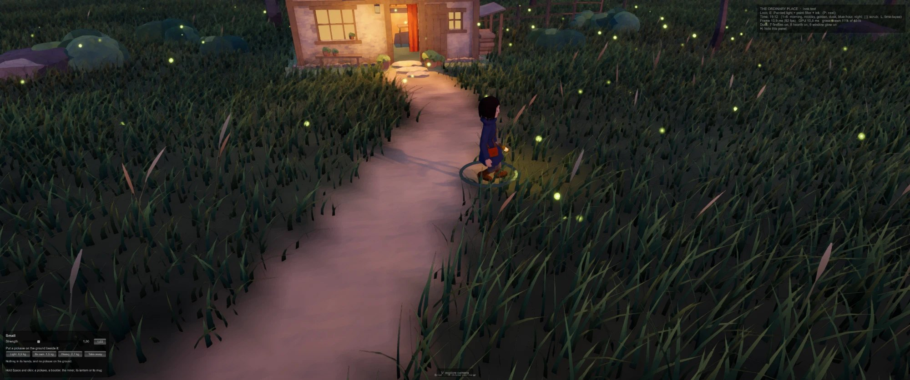
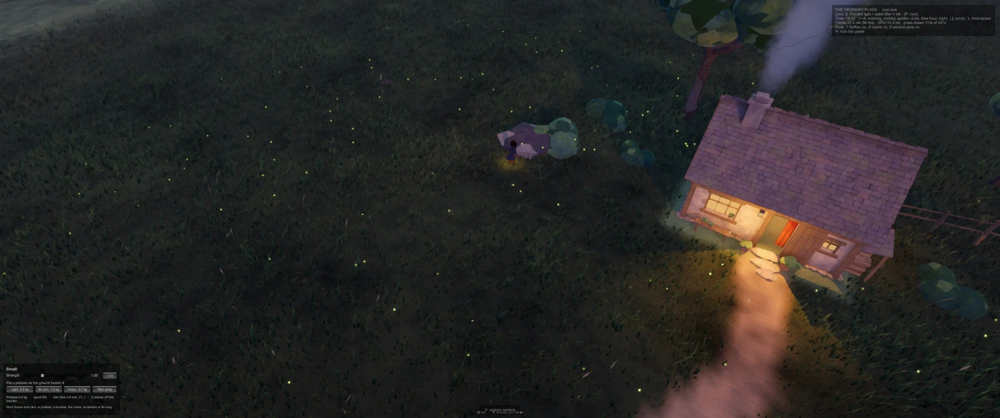
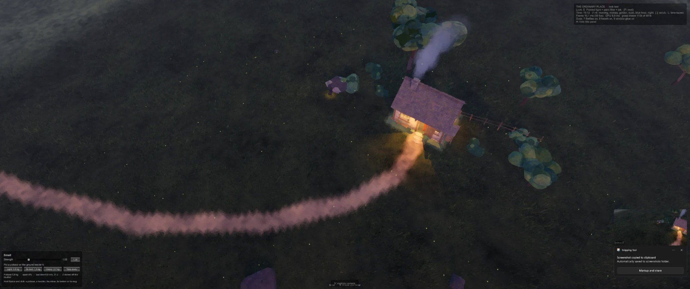
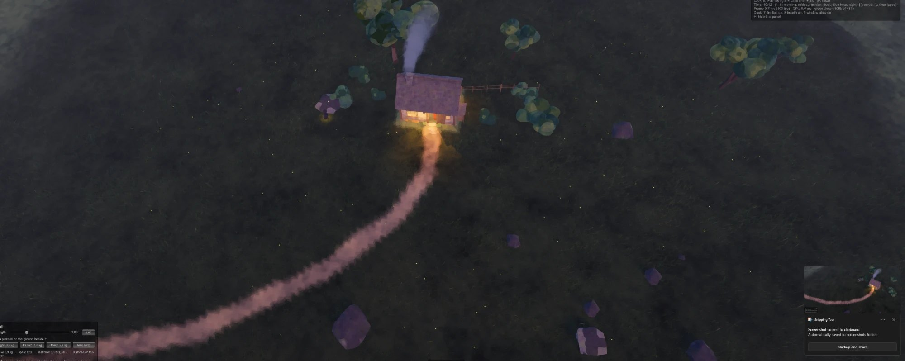
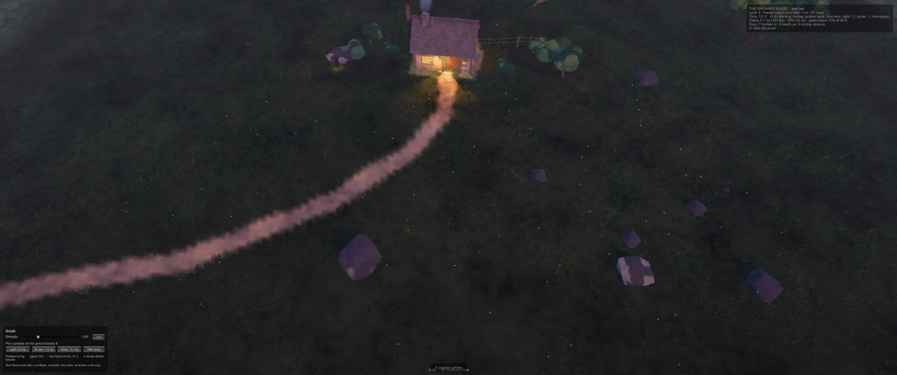
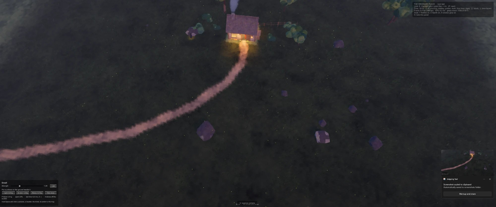

# The playtest of S3: no fake animations, and the notes kept back — October 8, 2026

**From:** Luis (Game Director), after playing the build of S3
(`Builds/WindowsOrdinaryPlace`, commit 027da6e: the panel, the boulders,
the fall).

**What Luis sent with it:** six screenshots of the build at dusk (19:12),
with Small chosen:

| | |
|---|---|
|  |  |
|  |  |
|  |  |

## The message (verbatim)

> Okay, I tested it, and there are many places where it's looking pretty good right now, especially... I really like also the direction that you're looking at next. But before you proceed, and then I want you to proceed with all the plans I asked for. I think it's finally about time that I tell you all the feedback, not only from this one, but there was some minor feedback I had noticed before, but I was waiting for you to develop some more of other parts before I told you. But now I think it's time for me to tell you, because I think this polishing run and the fixing run will take a long time. But first of all, the fireflies are still not good. There are still way too many of them during the night, and they still don't behave how I want them to when you zoom out. When you zoom out, it's not like they start to get less bright, but, like, they're still basically points in a position, basically, or, like, roaming points in a position. All it does is when it zooms out, it literally drags around the screen, the current fireflies, and that's it. So I want you to examine at each zoom out so you can also understand what I'm talking about, and so it can actually be how I wanted it to be, like the points are not based on the camera lock. They're, like, its own entities, and they appear based on your distance from them, and when it's very far away, there are less of them that you see, and they are less bright. Okay, you get it. Also, the bug about zooming out too much and then suddenly there's a flash, like, not a flash, but the cabin light gets suddenly much stronger than before, that's still happening. We should still investigate that, also very in depth, with each level of zoom out from it, so you can understand. Now, there's one issue that I observed for some time, from the walking, and that is there's a very light stutter after each walk, where it seems like the character is being... I don't know... It's very weird, and it's very obvious for humans. I don't know if you can see it. Maybe you have to study it a lot, but there's a slight stutter after each step, where it looks like the character is being, like, teleported a little bit, like to the ground, I don't know, some... without moving, but, like, very slightly. And it's very obvious, this light stutter. So please do your best to reinvestigate this in depth as possible. Some other things I noticed: the legs already looked a bit weird when trying to turn around, like within itself, like the character is facing a direction and tell it to go in the opposite direction. It was already a bit weird. I feel now it's even more weird. Some... the legs will teleport a bit sometimes when trying to turn, and the movement is not very human or natural. And also another thing I observed from your screenshots at first, but also now, the clothes when the characters kneel, for example, they, like, start exploding and moving in very unnatural ways. So that also needs to be fixed. Also, the kneeling animation feels very off and weird for the most part. Part of it feels natural, but most of it feels very unnatural. And it feels more like an animation also in parts, not a real physical thing. And I saw that the animation for them recovering, it was just an animation. It was not a physical thing when, like, they fell. I saw from your screenshots, and then they tried to get up again. It felt supernatural because it was just an animation. It was not the actual character with weight interacting with the world. And like I said, I want all the animations to be that. I don't want any fake animations. And I think that's the thing. I think you need to review every single screenshot animation not just to see if it works, but to see if it compares with animations of real characters getting up or doing those actions. Because this is the thing about the game: I don't want it to be necessarily real-life realistic, but I want it to feel like fantasy media realistic. And what I mean with that is all the movements need to feel real. They don't need to correspond to how people do it in real life, but they need to correspond to at least how people in real life can see those movements and feel, Oh, yeah, that movement makes sense, which is what I mean. Do you understand the vibe I'm going for with this? Also another minor bug while I was testing: the long, it mined, and then it got tired, and then after he recovered to 77% spent, he stopped recovering, and now he's just still without doing anything more. Anyways, yeah, there's a lot of uncanny a bit animations still, and there are some animations where, yeah, it doesn't feel like the character is properly reacting to the world. It just looks like a built-in animation. That's what I mean. I don't want the animations to be just built-in animations. I want them to be more general animations that the character can adapt to any situation. Also, yeah, for example, the animation for getting the light, lamp, or mug, it looks okay until the part to hold, then it looks a bit uncanny. Anyways, do all that. Also please research online about all of these things and do a lot of research and make it all very documented and organized. And search ways that we can really fully optimize the way to check every animation, make everything natural, and debug everything. Like one thing I saw online is like a loop gauntlet or something like that with a bunch of agents to keep judging each other. I don't know if that makes sense, but anyways, you can search what makes sense for our project and implement it.

## How it was recorded

**What Luis liked.** "There are many places where it's looking pretty
good right now"; and "the direction that you're looking at next" (S4,
by the approved order). Nothing is promoted to Locked by that.

**The order of work.** This polishing and fixing run first ("I think this
polishing run and the fixing run will take a long time"); then "all the
plans I asked for" (S4, S2, S5, as approved).

**The notes, as they are kept track of**
([the round's page](../Reviews/2026-10-08_ThePlaytestRound.md)):

| | Luis's note | Since when |
|---|---|---|
| L1 | **Fireflies:** "still way too many of them during the night"; and zooming out only "drags around the screen the current fireflies". They are to be "its own entities", not based on the camera; they appear by the distance from them; from very far there are fewer to see, and they are less bright | Asked on October 2; what was built then put them in a patch of meadow that follows the camera |
| L2 | **The cabin's light:** zooming out, at some point it "gets suddenly much stronger than before". "Still happening" | Reported on October 2; what was done then matched the close view to the far one, and did not remove the jump |
| L3 | **The walk:** "a slight stutter after each step", as if the character were "teleported a little bit, like to the ground", "very obvious for humans" | "For some time" (before S3) |
| L4 | **Turning round on the spot** (facing one way, sent the opposite way): the legs "already looked a bit weird", "now it's even more weird"; they "teleport a bit sometimes"; "not very human or natural" | Before S3, and worse since |
| L5 | **The clothes when a character kneels** "start exploding and moving in very unnatural ways" | Seen first in the clips, now in play |
| L6 | **The kneeling** (going down for the pickaxe) "feels very off and weird for the most part", and "more like an animation also in parts, not a real physical thing" | S3, step 8 and step 11 |
| L7 | **Getting up after a fall** "was just an animation", "supernatural": "not the actual character with weight interacting with the world" | S3, step 10 (written up there as "partly not physics") |
| L8 | **Long,** after mining and tiring, "recovered to 77% spent", "stopped recovering", and stands still | S3 |
| L9 | **Taking the lantern or the mug:** "okay until the part to hold, then it looks a bit uncanny" | S3, step 8 |
| L10 | **In general:** "a lot of uncanny a bit animations still"; some where "it doesn't feel like the character is properly reacting to the world. It just looks like a built-in animation" | S3 |

**The principle Luis states** (recorded as a Direction, in Luis's words;
it sharpens "every action is physical" of October 6):

- "I don't want any fake animations." "I don't want the animations to be
  just built-in animations. I want them to be more general animations
  that the character can adapt to any situation."
- "I don't want it to be necessarily real-life realistic, but I want it
  to feel like fantasy media realistic": "all the movements need to feel
  real. They don't need to correspond to how people do it in real life,
  but they need to correspond to at least how people in real life can see
  those movements and feel, Oh, yeah, that movement makes sense."

**How the work is to be checked** (Luis's instruction):

- "Review every single screenshot animation not just to see if it works,
  but to see if it compares with animations of real characters getting up
  or doing those actions."
- "Research online about all of these things", "a lot of research", "all
  very documented and organized".
- "Search ways that we can really fully optimize the way to check every
  animation, make everything natural, and debug everything." Luis names
  one he saw: "a loop gauntlet or something like that with a bunch of
  agents to keep judging each other", and leaves it to judgement: "search
  what makes sense for our project and implement it."

**What Luis did not say:**

- Nothing about the panel itself, the three pickaxes, the space bar, the
  boulders' pieces, the strength slider's ends, or the questions put with
  the build (what a weak body should do; the keys). They stay Open.
- Luis did not say to merge the branch into `main`.

## Later, in the same round (verbatim)

Three short messages from Luis while the round was under way. None
changed what was asked.

- October 8: "I hit my usage limit while you were working, but it has
  reset now. Please continue from where you left off."
- October 8: "i had to stop my computer for a bit, please continue with
  your previous task."
- October 9: "I hit my usage limit while you were working, but it has
  reset now. Please continue from where you left off."

**What I changed because of them** (my own choice, not asked): the
judges are called three at a time, on the smaller model, and only after
the work in hand is committed; and whatever is consistent is committed
and pushed before a long run.
