# The physical body

**Written:** October 6, 2026, by Claude, from Luis's two messages of that
day
([real weight and real strength](../Correspondence/2026-10-06_REAL_WEIGHT_REAL_STRENGTH_AND_THE_CREATOR.md);
[stable but able to fall, and the interaction click](../Correspondence/2026-10-06_STABLE_BUT_ABLE_TO_FALL_AND_THE_INTERACTION_CLICK.md))
and the research Luis asked for.

**Status:** the design that stage S3 builds
([NextMilestonePlan.md](../NextMilestonePlan.md)). What Luis said is marked
as Luis's. The rest is proposal: it is tried on a bench and shown to Luis
before anything is built on it. [GAME_VISION.md](../GAME_VISION.md) remains
the design authority.

## 1. What Luis asked for

- Bodies "react against real physics, with real strength in their limbs,
  and against objects with real weight".
- "I want characters to be very stable, but for them to still technically
  have these possibilities of tripping in this, like, ragdoll-ish way if
  it's an extreme situation that calls for it."
- "Some level of stamina for the muscles and tiredness."
- "I want all the actions to feel physical and real … It needs to be all
  the actions."
- "I want to later build upon what we do for this high-fi prototype":
  running and sword fights come later, on the same body.

## 2. Can "very stable" and "able to fall" be combined?

**Yes.** It is how people stand, and how the games that do this well are
built.

### How a person keeps from falling

People do not wobble, and they can still fall. Studies of balance describe
a ladder of answers, each used only when the one before is not enough:

| Rung | What the body does | When |
|---|---|---|
| **1. Sway at the ankles** | Presses the feet into the ground to shift where its weight is carried | Small pushes; all the time, unseen |
| **2. Bend at the hips** | Moves the trunk against the push | Faster or larger pushes |
| **3. Step** | Puts a foot where the weight is going, so the feet are under it again | Pushes the first two cannot hold |
| **Fall** | | Only when no step can catch it |

**What decides the rung can be worked out.** Take where the body's weight
is and how fast it is moving, and you get the point on the ground where the
feet must be for the body to stop upright (in the studies: the
"extrapolated centre of mass", or "capture point"). While that point is
inside the feet, the body is safe. When it leaves them, a step is needed.
When no reachable step can get under it, the body falls. So falling can be
a matter of numbers, never of chance.

### How games combine them

- **A simulated body that tries to keep its feet** (the technology in *GTA
  IV* and its successors): bodies take steps to stay up and fall when they
  cannot.
- **A posed body that can be let go** (a widely used Unity tool works this
  way): the body follows its animation while it can; a strong enough blow
  lets it go into physics; then it gets up.

The wobbly games are the ones that skip the ladder: they leave balance to
physics alone from the first moment.

### The design: stable until the physics says otherwise

The miner's body always knows its real weights and how they are moving. It
climbs the ladder only as far as the numbers make it.

| Rung | What is seen | What decides it |
|---|---|---|
| **0. At ease** | The planted walk and stance Luis has liked | The weight is well inside the feet |
| **1. Lean** | The body carries its weight against the load: back against a heavy pick held in front, forward into a pull | Where the weight of body and load together falls |
| **2. Brace** | Feet wider, knees bent, the body lower | The weight nearing the edge of the feet; or a known effort coming (a lift, a swing) |
| **3. Step** | One or more quick steps to get the feet under the weight again | The weight's point leaving the feet |
| **4. Fall** | The body is let go into physics, "ragdoll-ish", with its remaining strength trying to protect it. It lies, gathers itself, and gets up | No reachable step can catch it; or the legs cannot bear it |

**Why it will not be wobbly.** In ordinary work a healthy miner with a
pickaxe it can manage stays on rungs 0 to 2. Rung 3 needs something
unusual; rung 4 something extreme.

**What would be extreme enough,** from Luis's examples:

- a very strong force pulling or pushing the body;
- a swing or a thrust put in far too hard for the body's own weight;
- legs that give out from tiredness under a load;
- a foot caught while running (running itself comes later).

**What makes one body steadier than another** is real: heavier, lower,
wider-set, stronger in the legs, less tired.

## 3. Strength and stamina

- **Strength** is one number for now (Luis: "it can be a general
  strength"). It sets the most each working joint can give and the most a
  hand can hold. Later it may be by limb.
- **A body's weight** comes from its own model.
- **Stamina** (short-term) is how much of that strength is there right now.
  - Hard effort uses it up; rest brings it back.
  - It is kept for each group of muscles that works (arms, back, legs), so
    an arm can be spent while the legs are fresh.
  - The model is a simple one from the study of work and tiredness: muscle
    is rested, working or tired, and moves between the three at rates that
    differ by joint.
- **What tiredness looks like comes out of the same rules as strength.** A
  tired miner is a weaker miner for a while: it lifts lower, drives
  slower, takes shorter chops, rests the pick's head on the ground and
  waits. If it is made to go on, its hold can slip or its legs can give.
- **Open:** how fast tiredness comes and goes; whether there is a
  longer-term tiredness; what the player is shown of it.

## 4. Every object is a real body

- **Weight and balance** from its own model: the pickaxe, a stone, the
  lantern, the mug, later the sack and the cart.
- **A hand holds it** as hard as the hand can. A hold can slide along a
  handle (the sliding hand of a real swing) and can be overcome.
- **It hangs** from what really holds it: a hook on a belt, a ring on a
  bag, a strap. (Luis: "hanging somewhere, like that makes physical sense,
  from the clothes".)
- **It lies** where it is put or dropped, and stays there.
- **It is never placed by a rule alone.** If it moves, something moved it.

## 5. Every action is physical

Luis: "if it's going to strap the pickaxe, you need to find a believable,
simple way that looks like he's strapping the pickaxe on its back".

Every action is made from the same few movements, done by the same arms
with the same strength on the same real objects:

| Movement | What it is |
|---|---|
| **Reach** | A hand goes to a place: a handle, a hook, the ground |
| **Take hold** | The fingers close round what is there |
| **Lift and carry** | The object, now held, is moved. Its weight is felt |
| **Set or hang** | The object is brought to where it will rest: the ground, a hook, a bag's mouth, a strap |
| **Let go** | The fingers open. The object stays by what holds it now |

So "take the lantern in hand" is: reach to the belt, take hold, lift it off
its hook, carry it. "Lay the pickaxe down" is: lower the head to the
ground, lower the handle, let go. Mining is the same movements with a
swing between them. Nothing appears in a hand and nothing vanishes from
one.

## 6. The interaction click

**What Luis asked for.** The ordinary right-click keeps doing the ordinary
RTS thing. A special click on something that can be interacted with shows
its options beside it, in a small box, with a cancel. It is for "actions
… that I don't know how you would click on them on a usual RTS". The key
"would be the most important" after moving the map.

### The key: the space bar (recommended)

| Key | What RTS players expect of it | For this |
|---|---|---|
| **Shift** | Queues orders, in nearly every RTS | Must stay free |
| **Ctrl** | Groups of units; select all of a kind | Must stay free |
| **Alt** | Small extras; and Windows itself answers to it (Alt+Tab) | Risky |
| **Tab** | Cycles through a selection | Awkward to hold while moving the map |
| **Space** | Jumps the view to the last event or to the selection. This game gives that to `F` | **Free, the largest key, under the thumb while the fingers stay on the map keys** |

- **How it works.** Hold Space: everything that can be interacted with
  shows itself softly. Click one of them: its options open beside it.
  Tapping Space instead of holding it does the same for the next click.
  Escape, or a click elsewhere, closes it. One of the options is always
  **Cancel**.
- **The first option is what the plain right-click would do,** so the box
  also teaches the ordinary orders.
- **It is one setting,** so Luis can try another key.

Two games reach such a box without a key: in one, holding the right button
down opens it; in another, a plain right-click does. Neither fits here: the
plain right-click is the RTS order, and holding the right button looks
around in the Explore camera.

### Options for the prototype (a proposal: Luis asked what else makes sense)

| Clicked | Options | Stage |
|---|---|---|
| **The lantern or the mug,** hanging | Take in hand · Cancel | S3 |
| **The lantern or the mug,** in the hand | Hang it back · Set it down · Cancel | S3 |
| **The pickaxe,** in the hands | Lay it down · Cancel | S3 |
| **A pickaxe on the ground** | Pick it up · Cancel | S3 |
| **A boulder** | Mine · Cancel | S3 |
| **The miner itself** | Rest · Cancel | S3 |
| **The pickaxe,** with a strap worn | Sling it on the back · Take it in hand · Cancel | S4 |
| **A loose stone** | Pick it up · Put it in the bag · Cancel | S4 |
| **The sack, the cart** | Take hold · Let go · Cancel | S4 |

Each option is an order like any other. It goes the way every order goes
(what the player meant, the order given, how the unit takes it, what it
does), and what it does is one of the physical actions above.

## 7. Built to be built upon

- **Running and fighting** use the same body: the same weights, the same
  limits, the same ladder. A sword is another object with weight. A thrust
  put in too hard carries the body's weight past its feet, which is rung 3
  or 4.
- **Many units.** A body is worked out fully only while it needs to be:
  working, carrying, pushed, or near the edge of its balance. A miner
  walking with empty hands far from the camera stays as light as it is
  today. What a fully worked body costs is measured on the bench.

## 8. How it is built

**Two layers.**

1. **The body's intention** (what exists today, extended): the planted
   walk, where the hands mean to go, the plan of a swing or an action.
2. **The body's physics** (new): every part's weight; every working
   joint's limit; real objects in the hands; the measure of balance.

While the body is on rungs 0 to 3, the legs follow the intention and the
physics tells them what they are bearing. The arms, the back and
everything held follow the physics, pulled toward the intention as hard as
strength allows. On rung 4 the whole body follows the physics.

**What the bench settled** (October 6; [below](#9-what-is-built)):

- **How the arms are built: forces at the hands, the arms following.** The
  object is a real body in the engine's physics. Each hand pushes and turns
  it, and can give only what its arm's joints can at that moment, in that
  pose. The arms are then drawn to where the object is. This was built and
  it answered the bench's questions.
- **The other way was not built:** the engine's own jointed physical body
  for the arms. The plan said both would be tried and compared, and only
  one was. It stays worth trying if the arms' own movement comes to look
  stiff, because that way gives each part of the arm its own swing.
- **Steady at every frame rate tried:** the same lift and the same blow
  with the game running free, and at 25, 50 and 100 frames a second.
- **What one body costs:** about 26 millionths of a second for each step of
  the physics (fifty a second), for the hands' own work, measured in the
  editor. A hundred miners at work would add about 2 thousandths of a
  second a frame. The engine's own share for the objects is not in that
  figure.
- **How it reads at the miners' size:** see the clips. That judgement is
  Luis's.

**The riskiest part is rung 4** (the fall, and getting up believably). It
is built after the swing works, and shown as clips before it is trusted.

## 9. What is built

### Step 1: everything weighed (October 6)

Each part of each miner, and each pickaxe, has a weight, a place where
that weight is, and a resistance to turning. All of it is measured on the
models themselves (`Art/Blender/Worker/weights.py`):

- **the body under its clothes,** as the solids its own measures describe,
  at the density of a living body;
- **what it wears,** by the area of each piece of cloth, leather or sheet
  metal;
- **solid wood and iron** (a pickaxe, a hammer) by their volume.

| | Small | Long | Round |
|---|---|---|---|
| Height | 1.42 m | 1.86 m | 1.56 m |
| **Weight** | **40.7 kg** | **58.5 kg** | **87.6 kg** |
| of which worn and carried | 1.8 kg | 4.6 kg | 2.8 kg |
| The head | 10.0 kg | 6.5 kg | 9.8 kg |
| One arm (upper arm, forearm, hand) | 1.9 kg | 3.2 kg | 3.7 kg |
| Its weight's centre, above the ground | 0.81 m | 1.03 m | 0.87 m |
| **Its pickaxe** | **1.50 kg**, 517 mm | **3.21 kg**, 718 mm | **2.39 kg**, 561 mm |
| The pickaxe against the body's weight | 3.7% | 5.5% | 2.7% |
| The most its shoulder gives, at strength 1 | 24 N·m | 31 N·m | 61 N·m |

The full reports: `Art/Review/Miners/weights_<Name>.txt` and
`tool_<Name>.txt`.

**What the figures say:**

- **The heads are heavy.** Small's is a quarter of its weight. That is the
  shape of the characters, weighed honestly. Whether it reads well when the
  body has to balance is for step 6 to show.
- **Round is twice Small's weight,** and by far the strongest in the arms:
  strength is built from the limbs' own thickness.
- **Long's pickaxe is heavy for Long.** A pickaxe is sized by the arm that
  swings it, and its weight grows much faster than its length. Long's arms
  are long and thin. This is expected to show when Long has both hands free
  (step 3). It has not been tried yet.
- **A real pickaxe** of the common kind is 0.9 m long with a head of 2.3
  to 3.2 kg: with its handle, 4 to 5.5% of the weight of a grown person of
  75 kg. The miners' are 2.7 to 5.5% of theirs.

### Step 2: the bench (October 6)

Round stands in the Ordinary Place with its pickaxe over a block. The
pickaxe is a real body. Round bows to it, raises it over the right
shoulder as high as it will go, and brings it down on the block. This is
tried at three strengths, with the pickaxe at half, once and twice its own
weight.

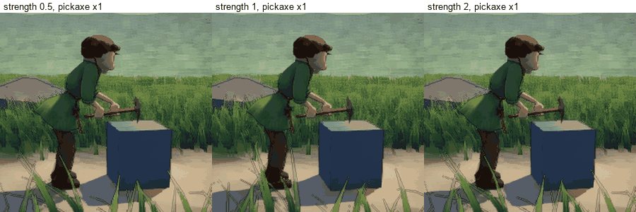

*Its own pickaxe (2.39 kg) at half strength, ordinary strength and double
strength. All nine: [Bench_Round.gif](../Images/PhysicalBody/Bench_Round.gif);
as stills: [Bench_Round_Strips.jpg](../Images/PhysicalBody/Bench_Round_Strips.jpg).*

**Nothing in these clips is timed by hand.** The plan says only where the
pickaxe is meant to go. How fast it rises, how hard the arms work, how
fast it lands: these come out of the weights and of what the arms can
give.

| Strength | Pickaxe at half weight (1.19 kg) | Its own (2.39 kg) | Twice its weight (4.78 kg) |
|---|---|---|---|
| **0.5** | raised in 0.60 s, arms at 55%; lands at 6.2 m/s | 0.62 s, 83%; 4.1 m/s | **1.36 s**, 97%, and not as high; **2.2 m/s** |
| **1** (ordinary) | 0.60 s, 27%; 8.4 m/s | **0.60 s, 42%; 6.5 m/s** | 0.60 s, 73%; 4.5 m/s |
| **2** | 0.60 s, 14%; 9.6 m/s | 0.60 s, 21%; 8.3 m/s | 0.60 s, 36%; 6.5 m/s |

*"Arms at 55%": the hardest-worked joint used 55% of what it has, on
average, while raising it. "Lands at": the head's speed as it strikes.*

**How to read it:**

- **The weak one with the heavy pickaxe** takes more than twice as long to
  raise it, with everything it has, does not get it as high, and lands a
  feeble blow. No rule says so: the arms run out.
- **Twice the strength with twice the weight** is the same swing (0.60 s,
  about 40%, 6.5 m/s) with twice the energy behind it. That is what physics
  says it should be, and it is a check that the sums are right.
- **An ordinary blow** with Round's own pickaxe lands with about 50 joules:
  what the same pickaxe would have if dropped from 2.1 m. The arms and the
  back add to what gravity gives.

**What the bench found, and what was done about each:**

| ID | Seen | Why | Done |
|---|---|---|---|
| B1 | Told to go straight to the end of the blow with all it had, the pickaxe swung the wrong way round: its head fell back behind the hands and came through underneath | Each arm gave what it could of its own share, and the two shares no longer added up to the turn that was meant | Both arms give the same share of what is asked, so together they always push the way that was meant. The plan leads the pickaxe along its path, a fixed way ahead of where it is |
| B2 | With the trunk upright, two hands can hold the handle only while it leans less than about 45 degrees forward | The upper hand's arm is too short to follow the handle further | The body bows from the hips to its work. The bow is by intention only: the back's own strength is not yet counted |
| B3 | The blow landed at the same speed whatever the strength | The arms finished early and the back's steady pace brought the head down | The back goes first; the arms follow when it is well on its way |
| B4 | After the blow the pickaxe vaulted over its own head | The plan went on pushing into the block | After a blow the pickaxe is meant to stay where the blow left its head |
| B5 | The same lift took 72% of the arms at one frame rate and 37% at another | The body is posed once a frame and the physics steps on its own clock: read as last posed, the body moved in stairs | The physics reads the body as it stands at each step's own moment. The same at every rate tried since |
| B6 | After the blow the pickaxe went on turning in the hands, another 45 degrees | A pickaxe's weight is nearly all at its head, so a blow there stops the head and hardly slows the turn. What stops the turn in a real swing is the hands and forearms on the handle, and they had no weight | The arms' own weight rides on the handle where each hand holds. A muscle forced back resists with more than it can push with |
| B7 | A hand came off the handle at full stretch | The link that keeps the handle within an arm's length was measured from the shoulder, not from where the wrist must be | Measured from the wrist. Left: up to 3 cm, for a step or two, in the fastest part of the blow |
| B8 | In the pictures the pickaxe was a frame ahead of the hands | The pictures were taken before the body was posed | Pictures and measures are taken after the body is posed |

### Step 3: both hands free, things that hang (October 6)

Both hands close on all three miners. Small's lantern hangs from a hook on
the coat in front of the left thigh; Long's mug hangs in a loop of thong at
the left hip. The pictures, the checks and what was found are in
[TheMiners.md](../ArtDirection/TheMiners.md#both-hands-free-the-lantern-and-the-mug-at-the-hip-october-6).
They swing as they did, from a bone of their own. Since step 8 a hand takes
them ([below](#step-8-second-half-the-lantern-and-the-mug-taken-in-hand-and-hung-back-october-7)).

### Step 4: the swing (October 6)

After Luis's look at the bench ("very promising … the version we want is a
full swing that will involve the body adapting to the strength
capabilities and rock").

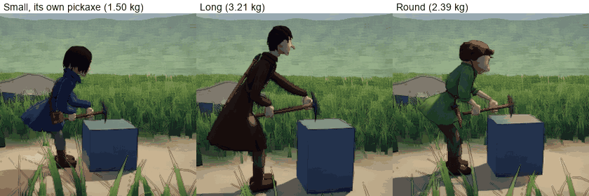

*Each miner with the pickaxe made for it, at ordinary strength.*

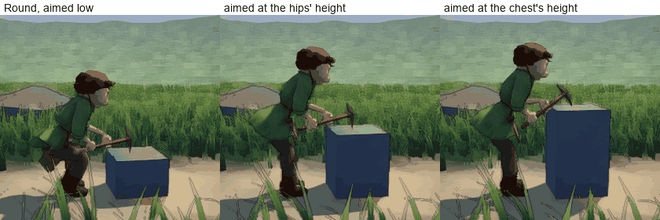

*Round aiming at a low block, one at the hips' height and one at the
chest's.*

**What the body now does by itself:**

- **The upper hand goes up the handle for the lift, by as much as the tool
  feels heavy.** Holding the pickaxe at rest tells the body how much of its
  arms that takes. If it is little, the hands stay where they are. If it is
  much, the upper hand slides up towards the head, where the weight is,
  before the lift. In the blow it slides down to meet the lower hand, and
  the swing lengthens as it comes over. A sliding hand holds loosely: it
  steadies the handle and does not pull along it.
- **The back has its own strength.** It holds up the upper body, further
  out the further it bows, and whatever the hands are holding up, at the
  end of the arms. An ordinary back holds up about two and a half times
  its own upper body bent level. A back that is overloaded straightens
  slowly, or not at all.
- **The hips go back as the body bows,** by as much as keeps its weight,
  the pickaxe's with it, over its feet. This is the first rung of the
  ladder of balance.
- **Aimed at a point, the body takes the stance that reaches it.** It finds
  how far to bow, how far to bend its knees and how the pickaxe must lean
  for the head to rest just over that point. It prefers to stand tall. The
  legs straighten under the lift and bend again into the blow.

**The three miners, each with its own pickaxe, at ordinary strength:**

| | Small | Long | Round |
|---|---|---|---|
| The pickaxe | 1.50 kg | 3.21 kg | 2.39 kg |
| The upper hand goes up the handle | 26% of the way to the head | **all the way** | 18% |
| Raised | 0.79 m in 0.60 s | 1.03 m in 0.60 s | 0.88 m in 0.60 s |
| The arms, while raising it | 42% of what they have | **65%** | 36% |
| The back, while raising it | 28% | 32% | 30% |
| The head lands at | 6.3 m/s | 6.1 m/s | 6.9 m/s |

**Round, by its own adapting:**

| | The upper hand | |
|---|---|---|
| At half strength | 88% of the way to the head | raised with the arms at 66%, where they needed 83% with the hands left in place |
| At double strength | stays where it is | |

| Aimed at | The knees bend | The pick's head lands |
|---|---|---|
| A low block (a fifth of its height) | 23 cm | 11 mm from the height aimed at, at 6.9 m/s |
| A block at half its height | not at all | 13 mm from it, at 6.9 m/s |

**What the step found:**

| ID | Seen | Why | Done |
|---|---|---|---|
| S1 | Long needs its upper hand right at the head, and two thirds of its arms, to raise its own pickaxe | The pickaxe is sized by the arm that swings it, and its weight grows much faster than its length; Long's arms are long and thin | Nothing: it is true of this body and this tool. At half strength Long cannot manage it. It is what the creator's strength and a lighter pickaxe will be for |
| S2 | A blow was reported 10 cm inside the block | The pick's head moves fast by the tool's turning, and the engine found it inside the block only after the step | The tool is watched for ahead of each step, so the head is stopped at the surface. Where a blow landed is read from the head itself |
| S3 | The same lift felt lighter after the back and the hips were added | The hips going back bring the hands nearer the body | Nothing: it is what going back is for |
| S4 | Aimed at a block as high as the chest, the pickaxe ends lying on its side on the block | A blow on something that high should come in level, at its face, not down on its top | Left for step 9, where a rock's own shape says where and how to strike |

**What is not there yet:**

- **The legs' own strength** came with step 6
  ([below](#step-6-balance-october-7)).
- **It is not in the game's mining.** Since later on October 6 the look
  with `K` shows this swing on a block
  ([below](#in-the-place-to-try-october-6)); a boulder came with step 9
  ([below](#step-9-any-boulder-by-a-click-october-7)).
- **The pickaxe does not yet stop at the miner's own body,** nor at what
  hangs at the hip.
- **Tiredness** came with step 5 (below).
- **The path over the shoulder is still the first swing's,** on the right
  side only.

### Step 5: tiredness (October 6)

Luis: "some level of stamina for the muscles and tiredness", short-term at
least.

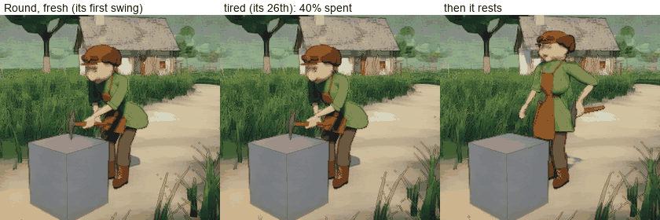

*Round's first swing; its 26th, with its arms and back 40% spent; and the
rest it then takes.*

- **Each group of muscles tires by itself:** each arm, the back (the legs
  are counted too, and do not work yet). A share of the group is spent for
  now, and what it can give is what is not spent.
- **Hard work spends it, the harder the faster.** All-out work spends a
  third of a group in about ten seconds.
- **Light work does not tire.** Below about a fifth of what a muscle has,
  it can go on all day. This is what makes a restful way of holding a tool
  restful.
- **Rest brings it back,** the sooner the less the muscles are doing: most
  of a spent third in about half a minute.
- **Nothing else was added to make a tired miner look tired.** It is a
  weaker miner for a while, so by the same rules as before it lifts with
  more of what it has left, takes the tool nearer its head, and lands a
  weaker blow.

**Round, its own pickaxe, swinging on:**

| | The first swing | The 26th, before its rest | The 27th, after it |
|---|---|---|---|
| Spent | 1% | 40% | 15% |
| The head lands at | 6.7 m/s | 5.5 m/s | 5.9 m/s |
| The upper hand, up the handle | 19% of the way | 83% | |
| The arms, raising it | 37% of what they have | 55% of what is left | |

**The rest.** When its arms or its back are 40% spent, it stops after a
blow. It stands up straight, which is what rests a back. Its lower hand
lets go, and it carries the pickaxe in its upper hand alone, near the head
where the weight is, level at its side with the arm hanging: the way a
tool is carried. That costs the arm less than a fifth of what it has, so
the arm rests too. When it is down to 15% spent (under half a minute), the lower hand reaches for the handle and takes hold again, and
it goes back to work.

(This was measured on Round. For Long it is not so: holding its pickaxe
at its side costs its shoulder far more, and since step 9 it rests with
the head of the pickaxe on the ground:
[a rest that rests](#step-9-any-boulder-by-a-click-october-7).)

**What the step found:**

| ID | Seen | Why | Done |
|---|---|---|---|
| T1 | Resting bowed over the block with the pick lying on it, the arms rested and the back did not | Holding a bow is work for a back, whatever the hands do | To rest, the body stands up |
| T2 | Straightening while the hands stayed on the tool dragged the tool off the block | The arms are not long enough to hold a tool on the block from upright | The tool comes with the body: it is carried |
| T3 | Holding the tool level across the thighs with two hands, the upper arm never rested | One hand is always beyond the weight, so it carries more than all of it, with the arm reaching forward round the belly | One hand at the balance point, at the side, the arm hanging |
| T4 | Even a light hold kept a muscle a little tired for ever | The first rule tired a muscle at any effort | Light work does not tire |

**What came with it, for later steps:**

- **A hand lets go and takes hold again** (with a reach that takes a
  moment). The small actions of step 8 are made of this.
- **The tool carried in one hand at its balance point** is the first of
  the ways of holding and walking with a tool (step 7).

**Open:** how fast tiredness comes and goes (the paces here are a first
setting); whether there is a longer tiredness; what the player is shown.

### In the place, to try (October 6)

> **Since step 11 (October 7)** the keys below do nothing: a panel has
> taken their place, and no pickaxe is made in a miner's hands
> ([below](#step-11-the-panel-in-the-ordinary-place-october-7)). What follows is as it was
> on October 6 and 7.

The bench could only be seen in clips. So that Luis can watch the work and
try it, this swing is now what the `K` key shows in the Ordinary Place, in
place of the old swing.

*Each miner where the place puts it, with its own pickaxe, at ordinary
strength.*

| Key | What it does |
|---|---|
| `K` | The chosen miner bows, a block stands before it, and it takes up its pickaxe and works on the block. `K` again (or choosing another miner) puts the block and the pickaxe away |
| A move order while it works | It takes its pickaxe with it, held as its strength allows (since October 7). `K` where it comes to puts it to work again there |
| `,` and `.` (the two keys right of `M`) | Weaker and stronger, a quarter at a time, from 0.3 to 3 times ordinary. It takes effect at once |
| `-` and `=` (the two keys right of `0`) | A lighter and a heavier pickaxe, from 0.4 to 3 times its own weight. The miner takes it up afresh |

A line at the foot of the screen says the strength, the pickaxe's weight,
how spent the miner is and how fast the last blow landed.

- **It is an early part of step 11,** brought forward so that the work can
  be watched while the rest is built. Keys stand in for the panel. The
  plan said the look with `K` would be retired; for now the key is kept
  and what it shows is replaced.
- **It is the bench, not mining.** Nothing is mined, the block is put
  where the miner stands, and the pickaxe appears in the hands. Any
  boulder by a click came with step 9, and taking up and laying down the
  pickaxe with step 8.
- **The old swing is no longer shown in the Ordinary Place.** Its code is
  still there (the equipment scene and its tests use it) until step 9
  replaces the game's mining.

**At the ends of the keys** (all three miners, the look begun as the key
begins it, with their balance; measured again on October 7; nothing breaks
at any of them):

| Strength | Pickaxe | What is seen |
|---|---|---|
| 3 | 0.4 of its weight | Fast, easy swings. The blows land at 10 to 11 m/s (6 to 7 at ordinary strength with its own pickaxe), the hands stay at the end of the handle, the arms give 8 to 16% of what they have |
| 3 | 3 times its weight | Small and Round swing it much as an ordinary miner swings its own (5.9 and 6.5 to 6.9 m/s). **Long is thrown about by its own swing:** its upper hand is at the head, it steps to keep its feet, ends a step back from the block, and goes on swinging from there (5.1 m/s). Bringing itself back to its work is step 9 |
| 0.3 | 0.4 of its weight | A weak body. The upper hand is right at the head, the back gives all it has and hardly straightens, and the blows land at 4.0 to 5.7 m/s |
| 0.3 | 3 times its weight | **It cannot swing it, and what it then does is not designed yet.** Small and Round hold the head on the block and cannot raise it. Long's pickaxe slips off the block and hangs from its hands, where nothing stops it passing through its legs. What a body does with a tool too heavy for it (drag it, or leave it) is step 7 |

### Step 6: balance (October 7)

Luis: "very stable", not "naturally wobbly", and yet able to trip or fall
"if it's an extreme situation". This step is the stable part: the body now
keeps its own balance, by its real weights. The fall came with step 10
([below](#step-10-the-fall-and-getting-up-october-7)).

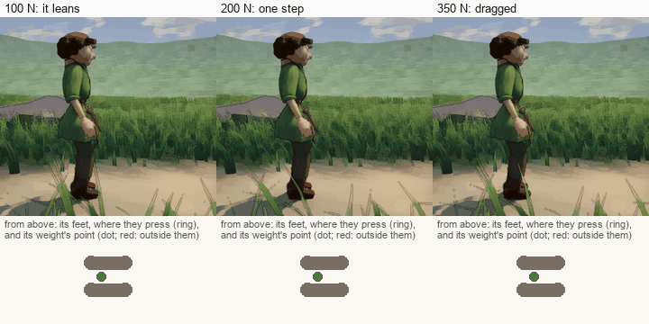

*Round stands and a rope pulls it forwards at the chest. Under each
picture, the same moment from above: its boots, where they press on the
ground (the ring), and its weight's point (the dot; red when it is outside
the boots).*

**How it works.** At every step of the physics the body works out:

- **where its weight is,** from its own parts as they are posed;
- **what loads it:** what its hands give a held thing, and whatever pulls
  or pushes it;
- **the weight's point:** the place on the ground its feet must be able to
  press on to stop it, going as it is.

**What it then does** is the ladder of [section 2](#the-design-stable-until-the-physics-says-otherwise),
each rung only when the one before is not enough:

| Rung | What is seen | When |
|---|---|---|
| **At ease** | Nothing. It stands exactly as it did | The weight's point is where this body carries its weight |
| **Lean** | The hips move and the whole body inclines against the load. The feet stay | The point is inside the feet, but not at ease |
| **Brace** | The feet go apart for the work (the left a little ahead), before the first swing | A planner says an effort is coming |
| **Step** | A foot goes to where the weight's point will be when it lands, and the body goes over it. The feet stay apart while the load lasts, then come together | The point reaches the edge of the feet and is not coming back |

**Round (87.6 kg), pulled at the chest for two and a half seconds:**

| Pull | What it does | Its weight's point |
|---|---|---|
| None | Nothing: its hips move 0.0 mm | 119 mm inside its feet |
| 100 N forwards | Leans back against it; hips 6 to 8 cm back; no step | Never nearer the edge than 77 mm |
| 200 N forwards | One step (9 cm on), then holds with its feet apart, leaning back. Its feet come together when the rope lets go | 13 mm outside, for a moment |
| 350 N forwards | Dragged two steps (0.56 m), into a long stride | 24 cm outside |
| 180 N to its right | One step out to that side (17 cm); stands wide (52 cm between its feet, 19 at ease) | |

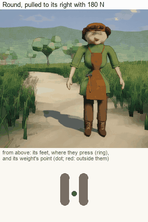

**What makes one body steadier than another is real.** The same pull, 110 N
forwards:

| | Weighs | What it does |
|---|---|---|
| Small | 40.7 kg | Three steps, 0.39 m |
| Long | 58.5 kg | One step, 0.09 m |
| Round | 87.6 kg | Leans; no step |

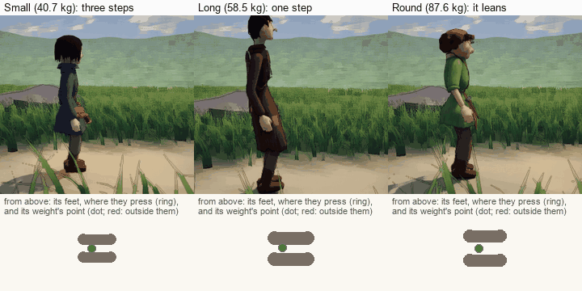

**At the work.** The miners now set their feet apart before the first
swing, and keep their own balance through it.

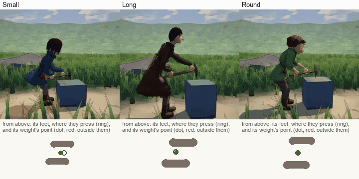

- **With its own pickaxe** no miner steps. Round's and Small's weight's
  point stays 65 mm or more inside their feet. Long's, whose pickaxe is
  heavy for it, goes 16 mm outside for an instant and comes back. The
  hips go back as the body bows, by the same physics, where a rule put
  them before.
- **With a pickaxe three times its weight** (7.2 kg) Round swings it, the
  upper hand right at the head, and takes three steps in two swings to
  keep its feet.
- **When it has stepped, it goes on swinging from where it stands.** The
  block does not follow it, and it does not go back to the block. Finding
  its place at the rock again is step 9.

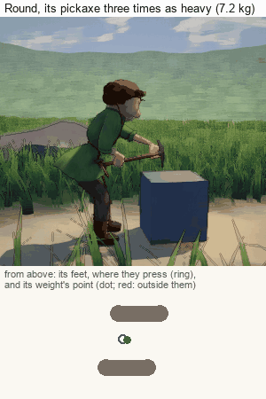

**The legs have a strength of their own** (a first setting, like the
arms'). A knee holds up its share of what the feet bear, and works harder
the more it is bent.

| Round | Its knees give |
|---|---|
| Standing | 3% of what they have |
| Knees bent, hips 21 cm lower | 44% |
| The same at half strength | 91% |

- **Bent knees tire the legs;** straight ones do not.
- **Weaker legs raise the body more slowly:** 0.34 s from that bend at
  ordinary strength, 0.78 s at half.
- **Knees asked for more than they have give way,** and the body sinks
  until they can hold it.
- **Changed in step 8** ([A2](#step-8-first-half-the-interaction-click-and-the-pickaxe-laid-down-and-picked-up-october-7)):
  a knee's strength now comes from the body it carries, not from the
  leg's thickness. Round's figures above became 2%, 36% and 74%, and it
  rises in 0.34 s and 0.46 s.

**What changed in what Luis has seen:**

- **The stance at work:** feet apart and the left a little ahead, where
  they stood together.
- **Small's upper hand** is now 40% of the way to the head (it was 26%).
  Round's and Long's are as they were (16% and 100%). See K1 below.
- **Round rests sooner:** after its 19th swing, where it was its 26th. At
  rest the pick's head used to lie on the block, which carried some of
  its weight; the arms now carry all of it.

**What the step found:**

| ID | Seen | Why | Done |
|---|---|---|---|
| K1 | With the balance in, Round's upper hand went to 85% of the way up the handle, where it had been 19% | The hand's place came from how heavy the tool felt, and that was measured with the hand already moved: it fed on itself. A centimetre's change in how the body stood tipped it | The heaviness is taken with the hands where they hold at rest, before the upper hand moves |
| K2 | At 25 frames a second the blow landed up to 0.9 m/s slower | The tool's physics saw the body as it was last drawn: in 40 ms stairs | The back and the balance tell the physics where they have the body at each step. The tool now comes down at the same speed at any frame rate (5.80 and 5.81 m/s through upright) |
| K3 | The blow's speed still differs by up to 0.6 m/s between runs | It is read at the last step before the blow, and the head gains about 0.7 m/s in a step. Whether the engine finds the contact a step sooner or later is a matter of millimetres | The speed on the way down is measured between steps as well, and that is what is compared |
| K4 | Bringing its feet together, the body lurched 10 cm towards the lifted foot | A foot was lifted with weight on it | The weight goes over the other foot first; then the foot lifts |
| K5 | Pulled sideways, it crossed its legs and ended with its feet together | The foot that was behind stepped across | Going out past a foot's own side, that foot steps out, and the body ends set wide |
| K6 | When a rope it leaned against let go, it lurched back and to the side | It had leaned its own weight outside its feet, trusting the rope | It keeps its own weight over its feet too, where it can |
| K7 | Given its balance, Long shifted 2 cm forwards standing still | Long stands with its weight further back on its feet than the others | Each body's own way of standing is measured, and that is where it is at ease. All three now move 0.0 mm |
| K8 | Dragged, it shuffled in half steps and drifted sideways | A step's reach was counted from where the foot was, so the foot behind only came level | A step lands as far as it reaches from the other foot |
| K9 | Standing up to rest, the upper hand came 54 mm off the handle | The back straightened before the tool had come up, and arms do not reach a tool on the block from upright | It straightens as the tool comes up (7 mm) |

**What is not there yet:**

- **The fall** came with step 10 (below): when its steps do not catch
  it, it is let go.
- **Balance while walking** came with step 7 (below): the body leans and
  inclines against a load; it does not step for its balance while it walks.
- **The legs' strength is a first version:** the knees' effort, their
  tiredness, how fast they raise the body, and giving way. Hips and ankles
  have no strength of their own.
- **The pickaxe does not stop at the miner's own body,** as before.
- **What it costs** has not been measured again.

**Luis's look (October 7):** "those balance tests were looking pretty
good", and to go on
([message](../Correspondence/2026-10-07_THE_BALANCE_LOOKS_PRETTY_GOOD.md)).
Luis saw the clips; the build has not been tried.

**Open:**

- How firmly it holds itself, and how soon it steps (first settings).
- The stance for the work: how far apart, and which foot ahead.
- How far the body inclines against a load.

### Step 7: holding and walking with the tool (October 7)

A tool has weight when it is carried too. How a miner holds its pickaxe
when it is not working, and whether it can walk off with it at all, now
comes from its strength.

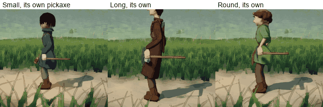

*Each with its own pickaxe, at ordinary strength: in one hand at its side.*

**What decides it is the hand's hold.** A hand's grip has a most it can
give, like every other joint (an ordinary grown hand: 400 N, by the arm's
own thickness and the body's strength, less what the arm has spent).

| How it is held | When | What is seen |
|---|---|---|
| **Carried in one hand** | Holding the tool's weight asks no more than half of the hand's hold | At the body's side, held at its balance point, level, the arm hanging. It walks at its own pace |
| **Dragged** | It asks more than half | The hand takes the end of the handle. The body stoops from the back until its hand is low enough for the pick's head to lie on the ground, and pulls it along. It walks slower, by how hard the pull is for it |
| **Left** | It cannot move it, or it slips from its hand | It lets go. The pickaxe lies where it fell, and the miner walks on |

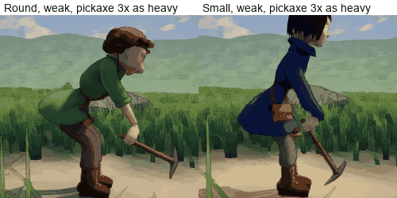

*Round and Small at about a third of their strength, their pickaxes three
times as heavy (7.2 and 4.5 kg): too much for a hand, so they are
dragged.*

**Walking four metres along the path:**

| | Holding it asks | How | Pace |
|---|---|---|---|
| Small, its own pickaxe (1.5 kg) | 8% of its hand's hold | One hand | Its own (1.27 m/s) |
| Long, its own (3.2 kg) | 15% | One hand | Its own (1.38 m/s) |
| Round, its own (2.4 kg) | 6% | One hand | Its own (1.28 m/s) |
| Round at 0.35 of its strength, 7.2 kg | 55% | Dragged | 0.82 m/s; at its slowest 46% of its pace, pulling 47 N |
| Small at 0.3, 4.5 kg | 75% | Dragged | 0.68 m/s; slowest 22% |
| Long, 9.3 kg, ordinary strength | 39% fresh, more as its arm tires | One hand, then dragged | |
| Long at 0.12, 9.6 kg | far more than it has | Dragged, then left | Walks on without it |

- **A tired arm drags what it carried.** Nothing was added for that: a
  spent arm holds less, so the same weight asks more of it.
- **Balance while walking.** The hips go against a load that lasts and the
  body inclines against it, walking as standing (2.4 cm with its own
  pickaxe at one side).
- **A hold can be overcome.** A hand asked for more than its hold for a
  third of a second loses what it holds.

**In the build.** In the look with `K`, a miner sent somewhere while it
works now takes its pickaxe with it. `K` where it comes to puts it to work
again, on a block there. `K` at work puts everything away, as before.

**What the step found:**

| ID | Seen | Why | Done |
|---|---|---|---|
| C1 | The plan had "in two hands" between one hand and dragging | A pickaxe's weight is at its head. The hand under the head carries all of it, and a second hand further down the handle can only steady it | Not built. A tool too heavy for one hand is dragged |
| C2 | Held by the end of its handle with the arm hanging, the tool swung under the hand and did not drag | The miners' pickaxes are about as long as their hands hang high: the head did not reach the ground | The body stoops until its hand is low enough. (A first try bent the knees instead, and the miner squatted along: not how a person drags) |
| C3 | A grip had no limit: any weight could be held | Only the shoulder, the elbow and the wrist had one | The hand's hold has its most, and is part of the arm's effort and tiredness |
| C4 | Taking a heavy tool to drag it, the hand is 25 to 46 mm off the handle for a moment | When the other hand lets go, the head drops, and the handle turns fast in the one hand | Left, and measured. Step 8 lays a tool down under control, and this will use that |
| C5 | Standing with a tool it drags, Round stays a little stooped | Its pickaxe is shorter than its hand hangs high, so the hand must come down to keep the head on the ground | Left: setting it down and standing up is step 8 |
| C6 | Two swings alike differed by 0.55 m/s in a test | K3 again: the speed at the blow moves with when the contact is found | The tests compare swings by the speed on the way down |

**What is not there yet:**

- **Over the shoulder.** It is how a heavy pickaxe is really carried: the
  shoulder's bones bear it and a hand only steadies it. It needs the tool
  to rest on the body, and tools do not touch the body yet. Not in the
  plan; a proposal for Luis.
- **Taking a left tool up again,** and laying one down on purpose, came
  with step 8 (below).
- **The legs' effort while walking** (stooped, or loaded): it is counted
  standing only.
- **A slope,** and sharp turns while dragging.

**Open:**

- The share of a hand's hold at which a tool is dragged (a half).
- How hard a body can pull, walking (three tenths of its weight).
- Whether a heavy pickaxe goes over the shoulder.

### Step 8, first half: the interaction click, and the pickaxe laid down and picked up (October 7)

Luis: "a special click, where if you click something that can be
interacted with, then it gives you … interaction options"; and "I want all
the actions to feel physical and real … It needs to be all the actions."

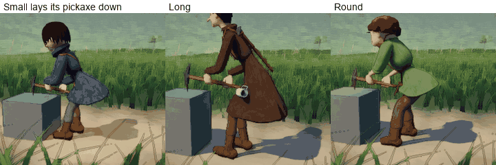

*Each miner lays its pickaxe down: it stops its work, squats and bows,
lays the tool flat beside it, lets go, and stands up.*

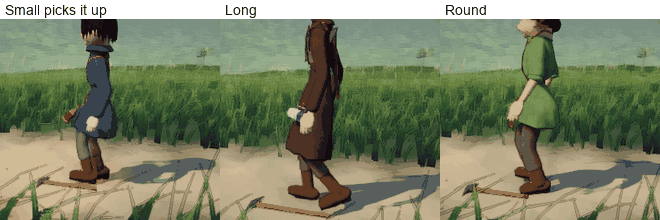

*Each walks back to its pickaxe, goes down, takes the handle under the
head, and stands up with it.*

**The click.**

- **Hold the space bar** (or tap it, for the next click): what can be
  interacted with shows its name.
- **Click one of them:** its options open beside it in a small box, with
  a **Cancel**. Escape, or a click elsewhere, closes it.
- **While the key is held or the box is open,** the ordinary clicks do
  nothing: nothing is selected or sent by mistake.
- **The key is a proposal** (section 6): Space is not yet Luis's choice,
  and it is one setting.

**What offers what, so far:**

| Clicked | It offers |
|---|---|
| The pickaxe, in the miner's hands | Lay it down |
| A pickaxe lying on the ground | Pick it up |
| The miner, at work | Rest |
| The miner, standing with its pickaxe | Work here |

**The actions are done by the body,** with the same arms, back and legs
as the swing, on the same real pickaxe:

| Action | What the body does |
|---|---|
| **Lay it down** | It takes the pickaxe in one hand at its side. It bows a little, bends its knees until the hand is at the ground, lays the tool flat, and lets go when it lies still. Then it stands up, by its back's and its legs' own strength |
| **Pick it up** | It walks to stand with the handle, under the head, below where its shoulder will be. It goes down the same way until its hand reaches, takes hold, and stands up as the tool comes with it. If it finds the handle out of reach it steps nearer and goes down again |
| **Rest** | It stops its work and stands with the pickaxe held as its strength allows |

- **A pickaxe that lies stays in the world,** where it was laid or left.
  It weighs what it weighs.
- **A pickaxe too heavy for the hand** is taken by the end of its handle
  and dragged, as in step 7.

**On the path, with their own pickaxes:**

| | Laid down in | Picked up in (with a walk of 2.5 m) |
|---|---|---|
| Small | 2.5 s | 4.5 s |
| Long | 3.0 s | 4.6 s |
| Round | 2.5 s | 4.9 s |

**What the step found:**

| ID | Seen | Why | Done |
|---|---|---|---|
| A1 | Bowed as far as it went (58 degrees), the hand did not reach the ground | A body does not reach the ground from its back alone | It bows a little, then bends its knees, and bows further only for what that leaves. A body now bows to 80 degrees and squats to 0.6 of its hips' height |
| A2 | Long squatted to lay its pickaxe down and could not get up | A knee's strength came from the leg's thickness, and Long's legs are long and thin: the squat asked all it had | A knee is as strong as its own body needs: it holds 1.6 times its share of the body with the thigh level, whatever its thickness (the back's rule) |
| A3 | Bent right down, Round's hand stopped 8 cm short of a pickaxe on the ground | The unit's own place rides about 8 cm above the ground (the surface it walks on), and heights were taken from it | Heights are taken from the ground under the feet |
| A4 | It came to stand too far from the pickaxe, or beside it | It stopped as near as a walk stops (12 cm), and aimed for the wrong place | It goes to where the handle will be under its bent shoulder, stops within 3 cm, and steps nearer if it still cannot reach |
| A5 | Bent over the pickaxe it stepped to keep its balance, walked back, and bent again, over and over | A step moved it off the place it had walked to, and the walk took it back | Once it has come to the pickaxe it stays there |
| A6 | A pickaxe let go weighed 2 kg too much | The part of the arms that rides on a held tool stayed on it | Let go, it weighs what it weighs |

**What changed in the look with `K`:**

- **A pickaxe left because it was too heavy** now ends the look by itself
  when the miner has stood up, and stays lying. Before, the look waited
  for `K`.
- **`K` with a pickaxe lying somewhere** puts that one away and makes a
  new one, as `K` always has.

**What is not there yet:**

- **The lantern and the mug** came with the second half of this step
  (below).
- **A boulder's "Mine"** came with step 9 (below).
- **It always lays the pickaxe at its left,** flat, wherever it stands.
- **It goes down very low** (a deep squat with the back bowed right over;
  Round's head comes near the ground). Kneeling on one knee, which a
  short-armed body would do, is not built.
- **A very weak miner** has not been tried: it may not be able to stand
  up from the squat.

**Open:** the key; the list of options; how long a tap is.

### Step 8, second half: the lantern and the mug taken in hand and hung back (October 7)

Luis: "I want all the actions to feel physical and real … It needs to be
all the actions."

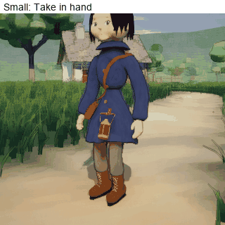

*Small takes its lantern off its hook, carries it at its side, walks with
it, and hangs it back.*

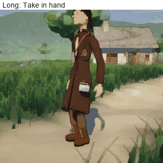

*Long takes its mug out of its loop by the handle, walks with it, and
hangs it back.*

**What offers what** (with the click of the first half):

| Clicked | It offers |
|---|---|
| The lantern or the mug, hanging | Take in hand |
| The lantern or the mug, in the hand | Hang it back |

**What the body does:**

| Action | What the body does |
|---|---|
| **Take in hand** | The hand on the thing's own side reaches to the handle where it hangs. The fingers close on it. The hand lifts it off its hook (3 cm up, and a little out from the cloth) and brings it to the side. There the arm hangs, and the thing hangs from the hand |
| **Hang it back** | The hand brings the handle back over the hook, lowers it on, opens, and the arm hangs free again |

- **It is the same object throughout.** It hangs and swings from the hand
  as it did from the hook: the same swinging Luis liked, now from the
  handle's place in the closed fingers. The wrist gives with its swing,
  and the body stops it.
- **The carry is the one from before October 6,** when the lantern and
  the mug were in the hand: the arm hanging at the side, far enough out
  for the thing to hang straight down clear of the clothes, and swinging
  less than a free arm (45% of its swing). It is that carry brought back,
  not a new one.
- **It works standing or walking.**
- **The hands are for the pickaxe.** With the pickaxe in its hands, the
  lantern offers nothing. A miner with its lantern in its hand that is
  told to work (`K`), or to pick its pickaxe up, hangs the lantern back
  first, and then does what it was told.

**What a hand needs to know of the thing, measured from the models:**

| | Small's lantern | Long's mug |
|---|---|---|
| Its handle's radius | 7.0 mm | 5.6 mm |
| How far it reaches below its handle | 175 mm | 128 mm |
| To each side of the line it hangs along | 44 mm | 50 mm |
| How far the clothes reach to that side, where it hangs from the hand | 202 mm | 171 mm |
| The body's side stops it at (from the pelvis) | 258 mm | 233 mm |
| The arm that carries it hangs further out than a free arm by | 50 mm | 0 mm (Long's left arm already hangs 6 cm out, to pass the mug) |

**On the path:**

| | Small's lantern | Long's mug |
|---|---|---|
| In the hand, and at the side, after | 1.8 s | 1.8 s |
| The fingers close this far from where the handle hung | 0.0 mm | 0.1 mm |
| Carried, standing: from straight down | 0.0 degrees | 0.3 degrees |
| Carried, standing: clear of the body by | 37 mm | 102 mm |
| Walking: it swings to | 32 degrees | 34 degrees |
| Walking: nearest the body | 4 mm clear | 83 mm clear |
| Walking: the handle from its place in the fingers, at most | 0.0 mm | 0.0 mm |
| Back on its hook after | 2.1 s | 2.1 s |

**What the step found:**

| ID | Seen | Why | Done |
|---|---|---|---|
| H1 | First built, the lantern was carried before the belly, the elbow out to the side | A new carry: held a little out from its hook, because the body's side was not known to the game | The carry from before October 6: at the side, the arm hanging. How far the clothes reach at that side is measured from the model |
| H2 | The fingers closed 6 mm (Small) and about 12 mm (Long) from the handle, and the thing slid into them | The arm is solved from the body's own shoulders, and the model's shoulders are not quite there | At the hook the hand is brought onto the handle by what it sees: where the handle would lie in its fingers, against where the handle is |
| H3 | Brought to the side in 0.6 s, the lantern swung out to 51 degrees | It is a pendulum, and it was moved fast | It is brought in 0.9 s |
| H4 | The height the hand hangs at came out as 1.0 m for both miners | A saved miner that has not woken still has the first body's proportions | The saved proportions are read |
| H5 | The handle's radius was read as nothing | A bar's own points are at its two ends | The bar is cut across at the place the thing hangs from |

**What is not there yet:**

- **"Set it down"** (the third option the proposal gave these two): not
  built. The lantern and the mug are part of their miner's model: left
  on the ground, each would still be drawn, and hidden, with its miner.
  To be left in the world it has to be made an object of its own, as the
  pickaxe is. Whether, and when, is Luis's to say.
- **A pickaxe in one hand and the lantern in the other.** The pickaxe is
  carried in the left hand, the side the lantern and the mug hang on. So
  a miner with its pickaxe cannot take its lantern, and hangs it back to
  take its pickaxe.
- **Round's hammer** stays in its loop: it hangs by its head, not by a
  handle.
- **Its weight is not moved to the arm.** The body's balance does not
  know the thing has gone from the hip to the hand. (A lantern is light.)
- **Only the hand on its own side** takes it; the other hand does not
  reach across.

**Open:** which hand carries what; whether these two are to be set down
(the lantern on the ground by the work, giving its light there).

### Step 9: any boulder, by a click (October 7)

The plan's words: "A click on any boulder of the Ordinary Place sends the
miner to mine it. A place to stand is found from the rock's own shape and
the ground. A spot to strike is found on its surface within this body's
reach. The swing adapts to the spot. What is struck off falls as real
stones and lies where it falls."

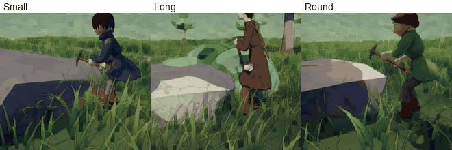

*Small, Long and Round, each at a boulder of the place: each stands where
its own swing reaches the rock, and strikes it.*

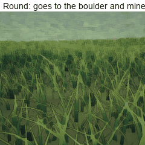

*Round is told to mine a boulder: it walks to it with its pickaxe, takes
the last steps to the rock's foot, turns to its spot and strikes. Pieces
break off and lie.*

**What happens:**

1. **Hold the space bar and click a boulder:** it offers **Mine**.
2. **The miner gets ready.** With something in its hand, it hangs that
   back. If its pickaxe lies somewhere, it goes and picks it up. With no
   pickaxe at all it is given its own, as `K` gives it one.
3. **It finds its place** from the rock's shape (below), walks there, and
   takes the last steps off the walked ground to the rock's foot.
4. **It turns to its spot, takes its stance, and swings** at it, with the
   same swing as at the block, aimed.
5. **Each blow's energy goes into the rock.** When the rock has taken
   what a piece costs, a piece comes off where the pick landed: a stone
   with its own weight, thrown a little out, that falls and lies. A piece
   that lies where the pick lands is knocked aside by the next blow.
6. **It goes on** until it is told something else. It rests when it is
   spent, as at the block. If its own swing has made it step, it aims
   again from where it stands, and goes back to its place if the spot is
   out of its reach from there.

**How the place and the spot are found** (`RockWork`):

- **The rock is felt from above** along a line from its middle towards
  the miner, every 3 cm: that gives its outline on that side, and where
  it first stands out of the ground (its foot). The ground is felt under
  each place, because it slopes.
- **Spots are tried along that outline,** from the foot inwards: where
  the rock faces up, where nothing of it stands higher on the miner's
  side, and no higher than half the miner's own height.
- **For each spot, places to stand are tried,** from as near as the
  boots may come to the rock's foot (6 cm clear, with room for the
  forward foot of its stance) outwards. Each is asked of the swing
  itself: how far must it bow, bend its knees and lean the pickaxe to
  bring the head there, and how far short would it be?
- **The spot and the place that cost the swing least are taken.** A place
  where the swing would miss by more than 3 cm is no place.
- **It looks first on the side the miner comes from,** then round the
  rock, 30 degrees at a time to either side.

**A low spot is struck late in the blow.** The place's boulders are low
domes: their tops are 0.2 to 0.9 m over the ground. At the block, the
blow lands with the handle about level, the head at the height of the
hands. A spot lower than that is struck with the blow going further
through its arc: the handle pointing down and forward, the head below the
hands, as a pick is swung at the ground. The swing may now lean the tool
up to 78 degrees for a rock (46 at the block, which is unchanged).

**The last steps off the walked ground.** The ground that can be walked
keeps half a metre from anything solid, so it stops short of every
boulder: no miner could come near enough to strike one. A unit now takes
the last short way (0.9 m at most) on its own feet, in a straight line,
at 60% of its pace, and takes it back to where it left the walked ground
before it goes anywhere else. This is in the motor every unit has; only
the rock work uses it so far.

**The place's ten boulders, and each miner at each** (30 of 30 have a
place, on the side the miner comes from):

| | Small | Long | Round |
|---|---|---|---|
| Its spots, over the ground | 0.14 to 0.57 m | 0.14 to 0.62 m | 0.14 to 0.53 m |
| Its places, off the walked ground | up to 0.53 m | up to 0.55 m | up to 0.42 m |
| The swing short of its spot, at most | 1 mm | 2 mm | 1 mm |
| Found in, at most | 39 ms | 23 ms | 20 ms |

**Mining, each at a different boulder:**

| | Small, a small low rock | Long, a middling one | Round, a large one |
|---|---|---|---|
| Its spot, over the ground | 0.09 m | 0.34 m | 0.51 m |
| It stands, from the spot | 0.38 m | 0.68 m | 0.64 m |
| At its place | to the millimetre | to the millimetre | to the millimetre |
| A blow | 5.4 m/s, 22 J | 4.9 to 6.2 m/s, 39 to 62 J | 5.8 to 6.7 m/s, 40 to 53 J |
| The pick lands, from where the plan put it | 5 cm at most | 12 cm at most | 7 cm at most |
| The first piece comes off at | the 5th blow | the 2nd | the 2nd |
| The pieces | 1.5 kg | 0.7 and 0.7 kg | 0.6 and 0.5 kg |

- **A piece costs 90 joules of blows** (a first setting). So a weaker
  blow takes more of them: Small's five, where Long and Round take two.
- **A piece is 9 to 14 cm across** and weighs what stone of that size
  weighs (0.4 to 1.5 kg). It is the rock's own shape, small.

**A rest that rests** (this changes step 5's rest, for a tool too heavy
to hold):

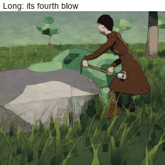

*Long, spent, lets the head of its pickaxe lie where it struck, keeps
the end of the handle in one hand, stands up, and gets its strength back.
Then it takes the pickaxe up again.*

- **Long struck four times, rested, and never went on.** Resting, a miner
  carries its pickaxe in one hand at its side. For Small and Round that
  costs the shoulder little (5% and 4% of it, fresh). For Long, whose
  arms are thin and whose left arm hangs out past its mug, it cost 59% of
  what the shoulder had left, and more as it tired: the rest spent
  strength instead of giving it back. Step 5 measured the rest on Round
  only.
- **A tool that heavy is now put down to rest.** The lower hand keeps
  the end of the handle and hangs at the side; the upper hand lets go;
  the head lies where it is, on the ground or on the rock. The knees give
  what the arm lacks (a tall body with a short pickaxe). The ground
  carries the tool.
- **When:** if holding it at the side would ask more than 27% of what
  the shoulder has now. Above that, an arm does not come back to 15%
  spent while it holds.
- **Long now comes down from 40% spent to 15% in about half a minute,**
  takes its pickaxe up and goes on: eight blows in a minute and a half,
  where it had stopped at four. Small and Round rest as before.

**What the step found:**

| ID | Seen | Why | Done |
|---|---|---|---|
| R1 | No place at most boulders | They are low domes. A spot a fifth of the body's height up, the lowest the aimed swing reached, lies far in from the rock's foot | A low spot is struck late in the blow's arc, the head below the hands |
| R2 | Still no place at most: nowhere to stand | The walked ground keeps half a metre from anything solid | The last steps off the walked ground, and back |
| R3 | The ground's height at the rock was taken a few metres out, where it is not the same | The ground slopes | The ground is felt under each place |
| R4 | Finding a place took up to 0.6 s | Every 3 cm of outline was tried from every distance, each aimed in full | Spots every 9 cm; distances first tried roughly: 8 to 39 ms |
| R5 | Five blows, and no piece | The engine finds a fast blow a step ahead and gives it a small speed | The rock takes the energy the swing itself measured |
| R6 | Blows were placed 6 to 19 cm above the rock | For such a blow the engine gives the place the head was at, a step before | Where the head comes to rest is where it landed |
| R7 | Moving the aim by what each blow taught made the blows wander (3 to 19 cm) | A moved aim changes the whole stance, in jumps | Taken out. The blows land 4 to 12 cm from where the plan puts them, short and to the miner's right (the swing comes over the right shoulder), and the same within a centimetre or two each time |
| R8 | Long struck four times and stood there | Its rest spent strength (above) | The tool is put down to rest |
| R9 | Long gave a boulder up after its first blow | Its own swing threw it a step off its place; it stepped back, and that was taken for being sent somewhere else | Its own way back to its place is known for what it is |
| R10 | After its second piece, Small's blows no longer counted: it swung and struck, and the rock took nothing | The piece lay where the pick lands, and every blow landed on it | A blow that lands on a loose piece knocks it aside (a third of the blow's energy sends it off, to one side); the rock takes nothing of that blow |

**Left at a boulder for more than three minutes** (the bench):

| | Small | Long | Round |
|---|---|---|---|
| Blows before it rests | 8 or 9 | 4 | 16 |
| How it rests | holding its pickaxe at its side | the head put down | holding it at its side |
| A rest lasts (40% spent down to 15%) | about half a minute | about half a minute | about half a minute |
| In 200 s | 29 blows, 6 pieces | (8 blows and 3 pieces in 90 s) | 36 blows, 16 pieces |

**What is not there yet:**

- **The boulder does not change.** However many pieces come off, it
  stays whole, and it never runs out.
- **A level blow at a face.** A spot is no higher than half the miner's
  height and is struck from above (step 4's S4 stays open).
- **The pick lands 4 to 12 cm from its spot,** not on it.
- **The stones only lie.** They cannot be picked up or carried (S4), and
  a miner walking through them pushes them.
- **With no pickaxe, one still appears in its hands.**
- **Two miners at one rock, or a miner in another's place:** not tried.
- **Units do not walk round a unit that stands off the walked ground.**
- **It mines until it is told something else.**

**Open:** what a piece costs, and how big the pieces are; whether a
boulder should get smaller and run out; whether "Mine" should end by
itself; the rest with the head down (new, and also seen with `K` at the
block when Long works there).

### Step 10: the fall, and getting up (October 7)

Luis: "I want characters to be very stable, but for them to still
technically have these possibilities of tripping in this, like,
ragdoll-ish way if it's an extreme situation that calls for it." The
plan called this the riskiest step, to be "shown as clips before it is
trusted". Nothing here is Locked.

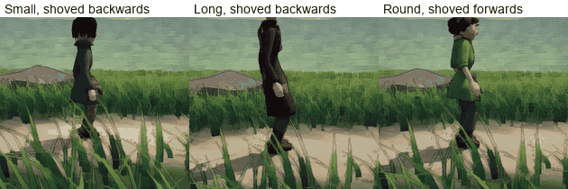

*Small and Long shoved backwards, Round forwards: each goes down into a
crouch as it falls, lies, gathers itself, and gets up.*

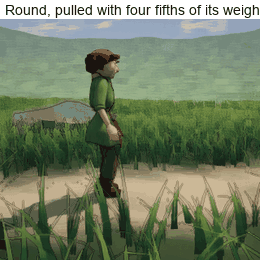

*Round pulled at the chest with four fifths of its own weight: its steps
do not catch it, and it goes down. The rope drags it on until it lets go;
then it lies, and gets up.*

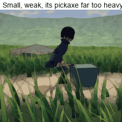

*Small at half its strength, with a pickaxe three times its weight, in
the look with `K`: after about twenty seconds of work its legs give way.
It lets the pickaxe go, lies, and gets up.*

**When it falls** (rung 4 of the ladder of balance; never by chance):

| | What decides it |
|---|---|
| **Its steps are not catching it** | Two steps in a row have had to land further from the other foot than a step reaches (a stumble, then another) |
| **No step reaches** | One step would have to land two and a half times a step's reach away |
| **Its weight has been outside its feet too long** | 2.2 s at a stretch, whatever it did |
| **Its legs cannot bear it** | Its knees have given way as far as they go and are still asked for more than they have, for 0.3 s |

**How much it takes.** A pull at the chest, coming on in a third of a
second and held for a second and a half:

| | Small (41 kg) | Long (58 kg) | Round (88 kg) |
|---|---|---|---|
| It only steps | 100 N | 100 to 150 N | up to 250 N |
| It stumbles, and keeps its feet | 150 N | 250 N | |
| It falls | from 250 N | from 350 N | from 350 N (as the rope lets go), at once from 700 N |

So each keeps its feet against a pull of a quarter of its own weight, and
goes down under four fifths of it (the tests hold it to both). In
between it depends on the body: Small and Long go down from about three
fifths; Round, heavier and lower, is dragged along stepping and goes
over when the rope lets go. In ordinary work, with a pickaxe a miner can
manage, none of this is reached.

**What falls.** While a body can keep its feet it is posed, as before.
Let go, it is eleven solid parts with the weights it was weighed at
(step 1), jointed where a body is jointed, each joint turning only as
far as that joint turns: the hips, the trunk, the head, and on each side
an upper arm, a forearm with its hand, a thigh, and a shin with its
boot. They are made where the posed body is at that moment, moving as
it was moving. From then on the posed body's own segments are put where
those parts are, so the model, its coat and what hangs on it follow the
fall.

**It holds itself as it falls.** Each joint is held towards a pose that
protects the body, as hard as that joint's own strength allows (what is
left of it, tired as it is), and no harder:

- **It goes down into a crouch** (knees, hips and trunk bent), which
  brings its weight low before it lands.
- **Its arms go out** towards the ground it is falling to.
- **Its head is kept from the ground:** back when it falls on its front,
  forward when it falls on its back.
- **Lying still, it lets go** (a twentieth of its strength), and lies
  easy.

| Shoved over (250 N for 0.3 s) | Limp, as first built | Holding itself |
|---|---|---|
| The fastest any part moved | 4.4 to 6.2 m/s | 2.8 to 4.8 m/s |
| Its head came down at | 3.0 to 5.5 m/s | 1.3 to 3.9 m/s |

**Getting up:**

1. **It lies** at least 1.2 s.
2. **It gathers itself:** the same crouch, with its own strength, where
   it lies (still in the physics). On its front it draws its knees under
   it; on its back it curls.
3. **The posed body takes over** from there in 0.9 s, crouched at that
   place: each part goes from where the physics left it to where the
   posed crouch has it. It comes up facing the way a body would: towards
   its head if it lay on its front, towards its feet if on its back.
4. **It stands up at its legs' own pace.**

- **Only from a crouch its legs can raise it from.** The crouch is found
  on the posed body itself: the deepest in which its knees would give no
  more than 55% of what they have now (no deeper than half its hips'
  height). If there is none of even a tenth of its hips' height, it lies
  down again and its legs rest 2.5 s before it tries again.
- **Where it was thrown, it is off the walked ground,** and comes back
  to it before it goes anywhere (step 9's last steps).

| Let go and shoved | Small | Long | Round |
|---|---|---|---|
| Down (falling, lying, gathering itself) | 3.3 to 4.7 s | 3.4 to 4.5 s | 3.3 to 3.7 s |
| Then up and standing | 1.4 s | 1.7 s | 1.5 s |
| From where it lay | 0 to 0.19 m | 0.02 to 0.06 m | 0.02 to 0.05 m |
| It rose from a crouch | 0.30 m deep | 0.46 m | 0.35 m |

**At its work** (the look with `K`, and at a boulder):

- **A miner given its physical work can fall.** When it does, its pickaxe
  leaves its hands and lies where it falls, and its work is over. Up
  again with its hands empty, the look ends by itself, as when a pickaxe
  is laid down. The pickaxe can be picked up with the click.
- **What makes it fall there:** only something extreme. At half strength
  with a pickaxe three times its weight, Small's and Round's legs gave
  way after about 22 s of work. Each lay, got up 6 to 7 s later from a
  crouch 0.14 and 0.15 m deep (its legs spent), and stood.

**What the step found:**

| ID | Seen | Why | Done |
|---|---|---|---|
| F1 | It fell like a plank, its arms hanging | The joints' bending limits were the wrong way round (the engine measures a joint's bending opposite to the part's own turn), so knees, hips and elbows were pinned straight, and the hold could not bend them | The limits are the right way round |
| F2 | Limp, it crumpled into a heap, its legs through its trunk | No part struck another, and nothing held the joints | Its joints are held with its own strength; a shin, a thigh and a forearm strike the trunk and the head |
| F3 | Lying on its back, its legs went up and down, without end | Lying, it let go and its legs dropped; a dropping leg counted as falling again, so it held itself again | Once it lies, only its hips, trunk or head moving fast is a fall. Lying is judged by those too |
| F4 | It fell at the moment a rope let go, where it used to step back and stand | One step's reach was judged by where the weight was predicted to go, which jumps when a load vanishes | A fall takes two short steps in a row, or one hopelessly short |
| F5 | It got up facing the wrong way: on its back, towards its head | It faced the way its hips faced, and hips tilt with the knees up | It comes up towards its feet from its back, towards its head from its front |
| F6 | Weak, with its legs spent, it fell, got up, and fell again, over and over | It was stood in a deep crouch whatever its legs had left | It gets up only from a crouch its legs can raise it from, and rests them until there is one |
| F7 | That crouch was still too deep (Long's knees were asked for 1.2 times what they had) | Worked out from the legs' lengths, it was wrong by half; and the knees' giving way from before the fall was still counted | It is found on the posed body itself; what the balance had done before the fall is forgotten |
| F8 | A pull on a body that was getting up broke the game's step | The parts were gone, and the pull still went to them | A force on a rising body is lost on it |

**What is not there yet:**

- **How it gets from lying to its crouch is not all physics.** It curls
  by its own strength, in the physics; then, for 0.9 s, its parts are
  moved to the posed crouch. Its hands pushing it off the ground are not
  forces.
- **A body too weak to raise itself stays down,** trying every few
  seconds.
- **What it holds in its hand** (the lantern, the mug) goes back to its
  hook at once when it falls. It is not dropped.
- **Its own parts mostly pass through each other** (only the shins,
  thighs and forearms strike the trunk and the head). The pickaxe it
  dropped can strike it.
- **Nothing in the build pushes or pulls a miner.** A fall comes only
  from its own work, when that is far too much for it; the rope is the
  bench's.
- **Tripping over something** (a stone, another miner, a step in the
  ground), **being struck,** and **falling while walking** are not built.
- **It is not hurt,** and getting up costs it nothing.
- **Falls on a slope, against a rock, or from a height** have not been
  tried.

**Open:** when it should fall (every figure in the first two tables);
how hard it holds itself; how long it lies; whether a fall should cost
it something; the getting up.

### Step 11: the panel in the Ordinary Place (October 7)

The plan: "A plain panel: the strength slider, and a light, a middling and
a heavy pickaxe. The look with `K` is retired." Luis has not seen it yet.
Nothing here is Locked.

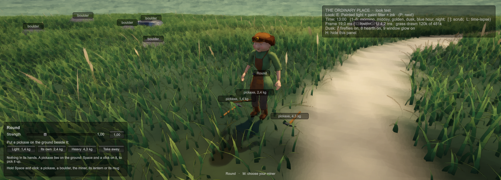

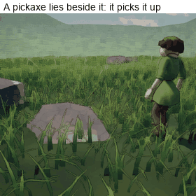

*Round, as strong as it was built, with its own pickaxe: put on the
ground beside it, picked up, carried to a boulder, and put to work.*

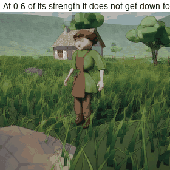

*Round at six tenths of its strength: it bows, bends its knees as far as
one of them could hold it alone, does not reach, and stands up again.*

**What the panel is** (lower left of the screen, while the choice of
miner is closed):

| On it | What it does |
|---|---|
| **Strength** | A slider from 0.30 to 3.00 times what the miner's build gives it, and a button back to 1.00. It is the chosen miner's strength at once, whatever it is doing, with or without a pickaxe |
| **Light, Its own, Heavy** | Puts a pickaxe of the miner's own kind on the ground beside it: 0.6 of its own pickaxe's weight, its own, or 1.8 times it. Each button says the kilograms |
| **Take away** | Takes away the pickaxes that lie on the ground, in no hand |
| **A line of words** | What the miner is doing; and, for a few seconds, why it did not do what it was told |

**What went with the keys:**

- **`K`, `,` `.`, `-` `=` do nothing any more.** The block of rock that `K`
  put before the miner is gone from the build. (The tests and the
  benches still use it.)
- **Nothing appears in a miner's hands.** A pickaxe is put on the ground;
  the miner picks it up itself, by the interaction click.
- **"Mine" with empty hands:** the miner first goes to the nearest pickaxe
  that lies anywhere, picks it up, and stands up with it. If none lies,
  it does nothing, and the panel says why. None is made for it.
- **"Work here" (a block where it stands) is no longer offered.** A miner
  resting at its boulder is offered "Back to work".
- **A pickaxe says what it weighs** when the space bar shows its name.

**The three pickaxes** (kilograms):

| | Light (0.6) | Its own | Heavy (1.8) |
|---|---|---|---|
| Small | 0.90 | 1.50 | 2.70 |
| Long | 1.93 | 3.21 | 5.78 |
| Round | 1.43 | 2.39 | 4.30 |

**Along the slider: picking a pickaxe up** (each miner, each of its
three pickaxes, at eight strengths: 72 tries, none of which fell; the
times are from the order to the pickaxe in the hand; "knee" is the most
one knee was asked, of what it has, through the whole try):

| Strength | Small | Long | Round |
|---|---|---|---|
| 0.30 to 0.70 | Does not get down to it | Does not get down to it | Does not get down to it |
| 0.80 | The light and its own (3.8 and 4.0 s), not the heavy | Does not get down to it | Does not get down to it |
| 0.90 | All three, 3.6 to 3.8 s; knee 89% | All three, 3.8 to 3.9 s; knee 103% | All three, 3.7 to 4.0 s; knee 71% |
| 1.00 | All three, 3.8 s; knee 79% | All three, 4.0 s; knee 81, 90 and 102% (light, its own, heavy) | All three, 3.8 s; knee 55 to 66% |
| 2.00 | 3.8 s; knee 40% | 4.0 s; knee 50% | 3.8 s; knee 32% |
| 3.00 | 3.8 s; knee 26% | 4.0 s; knee 33% | 3.8 s; knee 22% |

- **Where it does not get down:** it bows, bends its knees as far as the
  rule below lets it (at six tenths of its strength: 0.15 to 0.20 m,
  where the deepest bend is 0.36 to 0.56 m), stands up again about three
  seconds after the order, and the panel says "Its legs would not raise
  it again from as far down as the pickaxe lies".
- **Standing up with it** takes 1.3 s more (all three).

**Along the slider: at its work** (a boulder of ordinary height, its spot
0.57 m over the ground; six blows; how fast the head lands, the tool's
energy then, and the pieces off the rock):

| | Light | Its own | Heavy |
|---|---|---|---|
| Small, 1.00 | 6.4 m/s, 19 J; 1 piece | 5.2 m/s, 20 J; 1 | 3.9 m/s, 20 J; 1 |
| Small, 2.00 | 7.9 m/s, 28 J; 1 | 6.9 m/s, 36 J; 2 | 5.3 m/s, 38 J; 2 |
| Small, 3.00 | 8.8 m/s, 35 J; 2 | 7.8 m/s, 45 J; 3 | 6.0 m/s, 49 J; 3 |
| Long, 1.00 | 6.3 m/s, 38 J; 2 | 5.3 m/s, 45 J; 2 | 3.3 m/s, 35 J; three blows in 45 s, then it rests with the head down; none |
| Long, 2.00 | 8.7 m/s, 73 J; 4 | 7.0 m/s, 78 J; 5 | **Thrown off its feet by its own swing** after one blow ("its steps are not catching it") |
| Long, 3.00 | 9.7 m/s, 90 J; 6 | 8.3 m/s, 111 J; 6 | 6.2 m/s, 111 J; 6 |
| Round, 1.00 | 7.8 m/s, 43 J; 2 | 6.3 m/s, 48 J; 3 | 4.7 m/s, 47 J; 3 |
| Round, 2.00 | 9.2 m/s, 61 J; 4 | 8.2 m/s, 81 J; 5 | 6.8 m/s, 100 J; 6 |
| Round, 3.00 | 9.8 m/s, 69 J; 4 | 9.1 m/s, 99 J; 6 | 7.9 m/s, 133 J; 6 |

- **A heavier pickaxe lands slower and no harder, on the same body:**
  what a blow carries is set by the body, and a piece costs 90 J. A
  stronger body lands the same pickaxe faster and harder.
- **A knee at this work** is asked 5 to 23% (Small, Round) and 13 to 91%
  (Long, most with the heavy pickaxe, resting with its head down).

**Along the slider: a weak miner at its work** (it picked its pickaxe up
as strong as it was built, and was made weaker once it stood with it; the
same boulder; 70 s or eight blows):

| | Light | Its own | Heavy |
|---|---|---|---|
| Small, 0.70 | 5.4 m/s, 13 J; 8 blows, 1 piece | 4.3 m/s, 14 J; 7 blows, 1 | 3.0 m/s, 12 J; 4 blows, none |
| Small, 0.50 | 4.5 m/s, 9 J; 8 blows, none | 3.7 m/s, 10 J; 4 blows (one swing in four did not strike), none | One blow, a rest with its head down, and **its legs gave way** after 34 s |
| Long, 0.70 | 5.4 m/s, 28 J; 8 blows, 2 | 3.8 m/s, 25 J; 7 blows, 1 | Four blows, a rest with its head down, and **its legs gave way** after 50 s |
| Long, 0.50 | Does not work there (all three): bent to its work, its knees are asked too much, and it stands up again | | |
| Round, 0.70 | 6.4 m/s, 30 J; 8 blows, 2 | 5.2 m/s, 32 J; 8 blows, 2 | 4.0 m/s, 34 J; 6 blows, 2 |
| Round, 0.50 | 5.4 m/s, 21 J; 8 blows, 1 | 4.3 m/s, 22 J; 6 blows, 1 | 3.0 m/s, 20 J; 4 blows, none |

- **A weaker body lands the same pickaxe slower and softer,** and rests
  sooner. At half its strength Small's blows no longer break a piece off
  in eight (9 to 10 J, where a piece costs 90).
- **Long at seven tenths of its strength** works with the light pickaxe
  and its own, but resting with its head down asks a knee 1.4 times what
  it has (it did not fall in 70 s). Its knees were asked 33 to 35% when
  they were read: at the edge of what is let through.

**The two lowest boulders** (domes 0.18 and 0.20 m high; twelve tries at
ordinary strength, none of which fell):

- **Small and Long do not work there.** They go to the rock and bend to
  their work; before the first blow their knees are read (asked more
  than a third of what they have, each holding half the body: Long's
  41%); they stand up again with the pickaxe, and the panel says "It
  would have to bend its knees too deep to work at that boulder". (See
  N9 and N10.)
- **Round works at both.** At the lower one a knee is asked 39% in the
  blows; at the other, all it has (101 to 102%), without falling in the
  two tries.

> **Since step 12** Small and Long work at them too. Where a stance asks
> its knees too much, a miner now looks for a way to stand that bends
> them less, and gives the rock up only if there is none
> ([below](#step-12-evidence-october-8)).

**What the step found.** The panel is the first thing that lets a miner
be weaker or stronger while it does everything else, so every order was
tried along the whole slider, on all three miners. Most of what that
found was there before the panel.

| ID | Seen | Why | Done |
|---|---|---|---|
| N1 | Round, at half its strength, picked its pickaxe up, could not stand up with it, and fell ("its legs cannot bear it", a knee asked 2.2 times what it had). Sent walking at once it did not fall: the same order ended one way or the other by tenths of a second | A body went down for a pickaxe as deep as ever, whatever its legs had. Once a knee is asked more than it has, the body cannot come up at all, and its knees give way | A body bends its knees, of its own accord, no deeper than one of them could hold it alone: each asked half of what it has, holding half the body (the measure it gets up from a fall by, read from the body as it is posed). What the bend was for is left to its back and its arm, or is out of its reach |
| N2 | As strong as it was built, the same squat asked one knee 93 to 96% of what it has; and Long, lifting its own pickaxe from where the panel had put it, fell | It was still turning to face the pickaxe and putting its feet in their places as it went down. A foot in the air leaves the other knee the whole body. On both feet the same squat asks a knee half as much | It places itself first, bowed, its knees straight: it turns, steps nearer if the pickaxe is not under its shoulder, and waits for both feet to be down. Then it goes down, once, and does not turn while it is down |
| N3 | A weak miner hung bowed over a pickaxe it could not reach, stepped nearer and went down again three times, and gave it up after six seconds or more | It found out only by trying, to the end | If its knees stop well short and what is lacking is more than all the bowing left could give, it does not bow down to make sure. Bent all it can and still short for 1.2 s, it gives it up. It stands up again, and the panel says why |
| N4 | Told to mine with its pickaxe just in its hand, Small went to a boulder, could not strike it from where it stood, went round and round, and fell | The place to stand and the spot to strike were found for a body still bent to the ground | It stands up with its pickaxe first; then the rock is looked at |
| N5 | Long, at half its strength, fell every time it rested with its pickaxe's head on the ground | Resting so, its knees bent by as much as its arm lacked, whatever they had | Resting, and dragging, its knees bend no further than the same rule lets them |
| N6 | Sent somewhere from its work at a low spot, in the middle of a swing, Small fell (two of four moments tried): "its weight has been outside its feet too long" | Leaving its work it brought its feet together at once, still bowed, its knees bent, the pickaxe out before it | Its feet stay set apart until it has stood up (twelve of twelve then arrived) |
| N7 | Standing up with its pickaxe (one it had laid down itself), Small took two steps that landed short, and fell: "its steps are not catching it" | The balance read the body's own straightening as a loss of balance; and a step from a deep squat reaches nowhere | Bent to the ground for a tool, it takes no step to catch itself until it has stood up. If its weight stays outside its feet, it still falls |
| N8 | At a boulder, a spot 8 or 9 cm over the ground was chosen, and struck with the knees bent so deep that the blows asked them 121 to 128% of what they have | The lowest spot allowed was 8 cm. Every spot step 9 had been tried at was 14 cm up or more; coming from where it picked its pickaxe up, a miner found the lower ones | No spot nearer the ground than 14 cm is struck |
| N9 | At the two lowest boulders (domes a fifth of a metre high) Small fell within a minute, in four tries of four in one batch and none of four in another; Long's knees were asked 118 to 181% in the blows, and it fell once in twelve tries | Even at 14 cm the swing bends the knees 0.16 to 0.31 m there, and the blows ask a knee two to four times what the same bend asks standing still. Whether Small kept its place depended on its first swing | See N10 |
| N10 | (the same) | How far the swing bends the knees was chosen for the reach alone | Bent to its work at a boulder, before its first blow there, a miner's knees are read. Asked more than a third of what they have (each holding half the body), it does not work there: it stands up with its pickaxe, and the panel says why. Where the work went well they were asked 18% or less; where the body fell, 40 to 71% |
| N11 | With N5, Small (at half its strength, a pickaxe three times its weight) no longer falls at the block within a minute and a half: step 10's own example | Its rest no longer asks its knees more than they have | Left so. On the bench, at half their strength, Long's legs gave way after 30 s and Round's after 43 s; the test of it is Round's |
| N12 | A miner that was down when the place was put away stopped the next place from loading (in the tests) | Its let-go body's parts were gone before it was | It does nothing with parts that are gone |

**Known, and not put right in this step:**

- **Small and Long did not mine the two lowest boulders** (above), until
  step 12 gave a miner another way to stand to a rock. A body still has
  no way to work at rock lower than it can strike standing: on one knee,
  say.
- **Round, at the lowest boulder but one, is asked all its knees have**
  in the blows. It did not fall in four tries of 40 to 60 s.
- **Long, at twice its strength with the heavy pickaxe** (5.8 kg), was
  thrown off its feet by its own swing after one blow, in the one try. At
  three times its strength it works.
- **Up again after a fall, a weak miner may stand bent double and stay
  so.** Its back, weak and spent by the work, does not raise its trunk,
  and holding it there is no rest. The panel says so ("its back does not
  raise it"); made stronger, it straightens in about a second.
- **Weakened at the bottom of its squat, a miner cannot come up:** its
  legs give way, and it falls (nine tries of nine at half its strength).
  The slider takes effect at once, whatever the miner is doing.

**What is not there yet:**

- **A weak miner does not pick a pickaxe up.** Below about nine tenths of
  its strength its knees do not let it down as far as the ground, and it
  has no other way down (kneeling, a hand on its knee). To see a weak
  miner work, let it pick the pickaxe up as strong as it was built, and
  then bring the slider down.
- **How careful a body is with its knees is two numbers** (a knee asked
  no more than half of what it has for a bend it chooses standing still;
  no more than a third, bent to its work). With both feet down, a body at
  about six tenths of its strength could hold the deepest squat; it does
  not try, because a foot that comes off the ground would leave the
  other knee twice that.
- **Where to stand and strike at a rock is still chosen for the reach
  alone.** The knees are read only when the body is there and bent to
  its work. (Since step 12 it then looks for a way to stand that bends
  them less.)
- **The pick-up takes longer:** 3.6 to 4.0 s from the order to the
  pickaxe in the hand (it was 2.7 to 3.6 s), and 1.3 s more to stand up
  with it.
- **The three pickaxes are the miner's own, lighter and heavier:** they
  look the same and weigh differently. A miner can also pick up another
  miner's pickaxe (laid down, and the miner changed): that has not been
  tried.
- **Changing the miner while it holds a pickaxe** takes the pickaxe away
  with it.
- **The panel is the engine's plain boxes,** and has only been pressed by
  the tests' own calls: nobody has used the mouse on it.
- **The interaction click and the panel are added where the miners'
  physical work is** (the scene's own file was not changed).

**Open:** whether the keys should stay beside the panel; where the panel
stands and what is on it; the three pickaxes (shares of its own, or the
three miners' own); what a body too weak to get down should do; how
careful it is with its knees; work at rock lower than a body can strike
standing; everything about the weakest bodies.

### Step 12: evidence (October 8)

What the plan's list of evidence asked for, and what there is to show for
each ([the list](../NextMilestonePlan.md#evidence)). Nothing here is
Locked, and none of it is Luis's eye on the build.

**The tests the plan named:**

| What was to be shown | Where it is shown | Shown? |
|---|---|---|
| A heavier pickaxe is lifted lower and arrives slower, on the same body | `StrengthAndWeightDecideTheSwing` (raising it asks 1.3 times more and more, and it comes down slower); the step 11 table (Small's lands at 6.4, 5.2 and 3.9 m/s) | **Yes** for slower and harder to raise. "Lower" only where it is too heavy to raise all the way |
| A stronger body lifts the same pickaxe higher and it arrives faster | The same test (raising it asks under 0.7 of what it did, and it comes down more than 1.1 times as fast); the step 11 table (5.2, 6.9 and 7.8 m/s at 1, 2 and 3) | **Yes** |
| A body too weak for its pickaxe does not strike, and nothing is mined | The same test (a feeble blow, the arms giving more than 0.8 of what they have); the step 11 bench: Small at half its strength lands 9 to 10 J where a piece costs 90, and one swing in four does not strike; Long at half its strength does not work at all | **In part.** A weak body strikes feebly, or not, and breaks nothing off for a long while. Enough feeble blows still break a piece off: the rock adds them up |
| A tired body is weaker, and recovers with rest | `HardWorkTiresAMuscleAndRestBringsItBack`, `ATiredMinerWeakensRestsAndGoesOn` | **Yes** |
| The head's speed and energy at each strike are measured and shown | Every swing's result; `NothingAppearsInAHandOrVanishesFromOne` reads the last blow's and finds them in the panel's line | **Yes** |
| The pickaxe never passes through its bearer, at any strength | Nothing stops the pickaxe at the miner's own body | **No.** Not built |
| The hands stay on the handle, and let go only when the plan says so or their hold is overcome | The swing tests (never more than 35 mm off), the carry and pick-up tests (0 mm); `WhatItCannotMoveItLeaves` | **Yes,** in what was tried |
| A body within its balance does not step or fall; pulled hard enough it steps; pulled harder it falls, and gets up | `PhysicalBalanceTests` (four), `AHardPullThrowsItDownAndALightOneDoesNot`, `AMinerLetGoFallsLiesAndGetsUp` | **Yes** |
| Nothing appears in a hand or vanishes from one: every object is at every moment held, hanging, or lying | `NothingAppearsInAHandOrVanishesFromOne` (new): one pickaxe and one lantern followed through 1,120 frames of everything a miner does with them | **Yes,** in play. Outside it: the panel puts pickaxes on the ground and takes them away; changing the miner takes its pickaxe with it |
| Only a real touch of the head on the rock yields anything | The old body's tests (`EquippedWorkerTests`); at a boulder, only the head's own contact with that rock is counted, and a blow that lands on a loose piece gives the rock nothing (`ALoosePieceThatIsStruckIsKnockedAside`) | **Yes** |
| Any boulder of the place can be mined, by each of the three bodies | The bench: each miner at each of the place's ten boulders, as strong as it was built, with its own pickaxe (thirty tries). Each struck five blows within 33 s and broke one or two pieces off; none fell, and none gave its rock up | **Yes,** each from the one side it was tried from. At eight of the thirty the miner had to find a way to stand that its knees bear (E2) |
| The old test body and its maps work as before | The rest of the suite | **Yes** |

**What it costs** (the release build, 1920 by 1080, full screen, the
machine otherwise idle; RTX 4060 Laptop, i9-14900HX; milliseconds a
frame, the 95th percentile in brackets):

| | Standing | At its work | The hands, each step of the physics |
|---|---|---|---|
| Small | 4.72 (5.17) | 4.51 (5.01) | 32 millionths of a second |
| Long | 4.59 (5.11) | 4.83 (5.08) | 33 |
| Round | 4.57 (5.06) | 4.56 (5.05) | 31 |

- **One miner at its physical work costs nothing that shows in the
  frame.** (Standing is measured where the place puts the miner, the work
  at the rock: what differs between the two columns is the view.) The
  hands' own step was 26 millionths of a second on the bench in step 2.

| Miners walking | Strategy view, October 8 | Close view, October 8 | Strategy view, October 4 | Close view, October 4 |
|---|---|---|---|---|
| 0 | 4.84 (5.35) | 4.92 (5.27) | 4.8 (5.2) | 4.7 (5.1) |
| 25 | 5.62 (5.95) | 5.33 (5.64) | 5.5 (5.8) | 5.2 (5.4) |
| 50 | 6.08 (6.88) | 5.81 (6.54) | 5.9 (6.7) | 5.5 (6.0) |
| 100 | 7.31 (8.70) | 7.00 (8.33) | 6.9 (7.8) | 6.4 (7.1) |

- **A hundred walking miners add about 2.5 ms** (2.1 on October 4): about
  0.025 ms each. What S3 put on every miner (its weights, fingers that
  close, things that hang from a hand) costs about 0.4 ms in a hundred.
- **A crowd at physical work was not measured:** only the chosen miner
  is given its physical work.

**What the step found:**

| ID | Seen | Why | Done |
|---|---|---|---|
| E1 | In the build's own measure, Small fell on its way to its work. On the bench: five seconds into any long walk with its pickaxe in its hand ("its weight has been outside its feet too long"), at 50 frames a second as at 200 | The rule that lets a body go when its weight has been outside its feet for 2.2 s was counted while it walked, where the walk carries the weight ahead of the feet. A light body with a tool at its side walked "outside" all the way. No test had walked further than a few metres with a pickaxe | It is counted only standing. All nine miners and pickaxes then walked 17 m to their work and worked |
| E2 | Tried at every boulder, eight of the thirty miners and boulders gave their rock up for their knees (step 11's N10): at the two low domes, and at three boulders of ordinary height | The stance at a rock is chosen for the reach alone. Where that bent the knees deep, the miner could only refuse the rock | Asked too much, it looks for a way to stand that bends its knees less (to 0.65 of what the last one did, up to three times for an order), and gives the rock up only if there is none. All thirty then mined. Long, at the lowest boulder: its knees asked 39% as it first stood to it, 23% as it struck |

**The model quality method, across strengths.** The plan asked for the
audit in motion "run across a range of strengths, since the motion is no
longer the same every time". What was done is coarser than that method:

- **Captured:** each miner at its work at a boulder of ordinary height, at
  0.7 and at 3 times its strength (six captures of 22 to 28 s), from close
  by at the miners' size in play (a miner about a hundred pixels tall).
- **Read:** four of the six, forty frames each, a quarter of a second
  apart (Long at both strengths, Small at 0.7, Round at 3).
- **Seen:** nothing breaks. The hands stay on the handle; the feet stay
  where they are put; the body bows and straightens with the swing; the
  weaker body raises its pickaxe to its shoulder, the stronger over it.
  - **Long, resting at 0.7 with its pickaxe low at its side:** the
    pickaxe's head lies in the skirt of its coat. Nothing stops a pickaxe
    at its bearer (the list above).
  - **At the top of the lift** (Long and Round at 3) the pickaxe's head
    comes close by the face. Whether it touches cannot be told at this
    size.
- **Not done:** the close audit, part by part and from several sides,
  that the method asks of a model; the two captures not read (Small at 3,
  Round at 0.7); strengths in between; the low boulders; a tired body.

**What is not shown:**

- **Nothing Luis has seen or played.**
- **The pickaxe through its bearer** (above).
- **A crowd at physical work,** and what many falling bodies cost.
- **Other machines.** Only the RTX 4060 Laptop.
- **A knee asked more than it has, at moments, in the blows:** Long's at
  three of the ten boulders (103 to 124%), without a fall in five blows.
- **Each boulder from more than one side.**
- **Frame rates:** the build ran at about 210 frames a second and the
  tests at 50; the long walk and work at a boulder were also run at 200
  on the bench. Slow frames (under the physics' 50) were tried only for
  the bench's swing, in step 2.

**What is not there yet** (of the bench, step 2):

- **The swing's plan was rough,** the back as strong as it liked, and only
  Round had been tried. Steps 3 and 4 answered these (above).
- **Balance** came with step 6 ([above](#step-6-balance-october-7)).
- **The pickaxe does not yet stop at the miner's own body.**
- **It is not in the game's mining:** it can be tried on a block with `K`
  ([above](#in-the-place-to-try-october-6)).
- **Strength's figures are a first setting,** from an ordinary grown
  person's arm. They have not been set against measured swings.
- **Luis's look (October 6):** "very promising so far … On the hands
  side it's already looking quite good"; the full swing, with the body
  adapting to its strength and to the rock, is what is wanted next
  ([message](../Correspondence/2026-10-06_THE_BENCH_IS_PROMISING.md)).

### After Luis's play: the walk, the turn and the rest (October 8)

Luis played S3 and sent ten notes
([the message](../Correspondence/2026-10-08_THE_PLAYTEST_NO_FAKE_ANIMATIONS.md));
what was found and done for each, with the figures and pictures, is in
[the round's page](../Reviews/2026-10-08_ThePlaytestRound.md). This
section keeps what changed in *how a body works*, so that it can be
built on. All of it is **Implemented, not Locked**.

**The rule Luis gave** (a Direction, in Luis's words): "I don't want any
fake animations." "I want them to be more general animations that the
character can adapt to any situation." It sharpens "every action is
physical" of October 6: a movement that is done by the body and still
reads as played back is also wrong.

#### The walk: the hips come down to a landing

- **What was wrong.** Only the legs of feet *on the ground* held the hips
  down. Through a swing the hips stayed up; in the frame the foot landed,
  its leg had to reach it and the hips were put down at once: 5 to 13 cm
  in one frame, at every step.
- **The rule now.** A foot in the air is on its way down. From a third of
  the way through its swing the hips are brought to where both legs will
  reach once it has landed: from where they are and as fast as they are
  moving, along one line with no corner, by the very reach that will hold
  them afterwards. Nothing is left to change in the landing frame.
- **A landing is reckoned to the frame it happens in,** not to the moment
  between two frames (the foot's landing place moved in its last frame in
  the air).
- **The hips rise with a pace that is kept** from frame to frame; and a
  foot leaves the ground from rest.
- **A foot in the air changes where it is going at a pace.** Where it
  will land moves as the body turns and as its walk changes; followed at
  once, the foot jumped in mid-air.

#### The turn: paced by the feet

- **The head looks where the body is about to go:** up to 62 degrees
  round, at once; the chest a third of that; the hips after them.
- **A leg turns only so far in its hip.** The body's place is turned no
  further than 62 degrees round from a foot on the ground: it waits there
  until that foot has stepped. This holds however the body is turned (to
  go somewhere, to face its work, off the walked ground).
- **The foot on the side it turns to steps first,** and lands turned on
  towards the way the body means to face (by up to 34 degrees ahead of
  it), opening the way; the other comes round after. Half a turn is three
  steps.
- **A boot never lands across the standing one.** It lands as far round
  as leaves them clear, with a little room made beside the standing boot
  if that is enough, and turned less if it is not.
- **It turns, then walks.** Turned further than 58 degrees from the way
  it is to go, the body all but stands; it walks as it comes round, at
  its whole pace once within 22 degrees. The turn itself gathers pace and
  loses it (no faster than 250 degrees a second).
- These are in `UnitMotor` (the turn of the body's place) and
  `ProceduralBiped` (what the feet allow, and where they step).

#### The rest: nothing works harder than it can go on working

- **What was wrong.** A rest was a pose. Nobody had asked what it cost to
  hold: for Long, an arm at full strain for as long as the rest lasted.
- **The carry at the side, and the rest, hang.** The arm is as near to
  straight down as the body lets it, and all but straight (0.995 of its
  length): a bent elbow holds a tool up by strength, a straight arm by
  its bones.
- **There is one way to rest holding a tool:** in one hand at the side.
  The rest with the head on the ground and the handle's end in hand is
  gone (it asked for a place the handle could not be at). Two hands were
  tried and do not share a tool whose weight is at one end.
- **A rest ends.** It is looked back on every eight seconds, once the
  body has stood up: when the last eight gave back less than 0.4% of
  what was spent, it has given what it can. The body goes on if it is
  then under 30% spent; if not, holding this tool is no rest for it: it
  puts the tool down and the panel says why.
- **A tool that slips from the hands at work ends the work,** and the
  panel says so.
- `PhysicalBody.Effort(muscles)` gives what each group of muscles gave
  at the last step: a rest can be checked by it.

#### How it is checked

A movement is traced frame by frame at 100 frames a second and read for
breaks (`MotionTraceBench`, `Art/Review/motion_breaks.py`); a work and
its rests are run for five minutes with each group of muscles' effort
written down (`MinerPanelBench -panelMuscles`). The whole method is in
[the judging of movement](../ArtDirection/MotionJudging.md).

## Sources

- The ladder of balance (ankle, hip, step):
  <https://www.frontiersin.org/articles/10.3389/fbioe.2021.670498/pdf>;
  <https://link.springer.com/doi/10.1007/s10439-009-9717-y>
- The point the feet must be under, and the margin of stability:
  <https://www.mdpi.com/2076-3417/13/19/10574/htm>
- A simulated body that keeps its feet (*GTA IV*):
  <https://en.wikipedia.org/wiki/NaturalMotion>
- A posed body that can be let go and gets up (PuppetMaster, a Unity tool;
  not used here):
  <https://assetstore.unity.com/packages/tools/physics/puppetmaster-48977/reviews>
- Tiredness as rested, working and tired muscle:
  <https://pmc.ncbi.nlm.nih.gov/articles/PMC3397684>
- What RTS players expect of each key:
  <https://www.liquipedia.net/starcraft2/Hotkey>;
  <https://news.blizzard.com/en-us/article/4552955/game-guide-special-control>
- A box of options with a cancel (*RuneScape*):
  <https://runescape.wiki/w/Choose_Option>
- Holding the right button for a box of options (*Kenshi*):
  <https://kenshi.fandom.com/wiki/Controls>
- The swing, strength and the ways of building a physical body:
  [Reviews/2026-10-06_SamePageReview.md](../Reviews/2026-10-06_SamePageReview.md)
