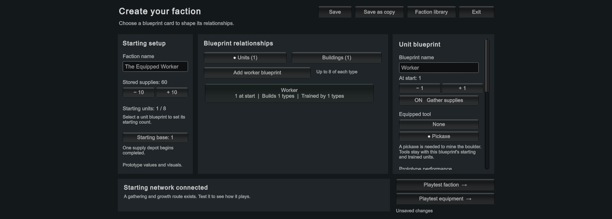
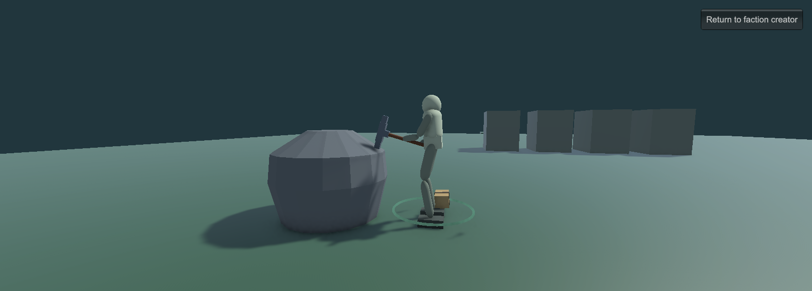
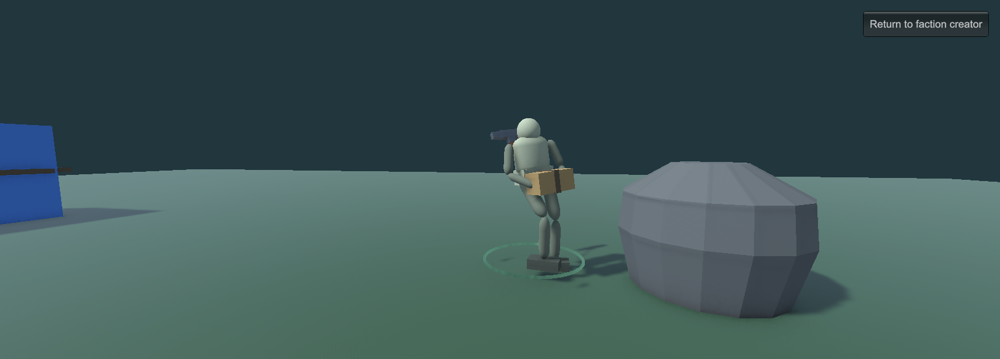

# The Equipped Worker playtest

**Status:** Ready for Luis's review, September 29, 2026. The 18 focused tests,
85 full PlayMode tests, rendered probe and Windows build passed. This guide
describes the prototype review path; aesthetic/playtest acceptance is pending.
Executed results belong in [Validation.md](Validation.md); Luis's playtest
acceptance is separate from those checks.

This slice asks whether a tool chosen in the faction blueprint can visibly
reach the mineral and cause extraction through valid contact. It advances
the [one-worker showcase](WorkerShowcaseVision.md), while its body, pickaxe,
boulder, handling and fixed yield remain provisional.

## Open the test through the creator

Open `Assets/_WonderGather/Scenes/TheFactionCreator.unity` and press Play.
The **Playtest equipment →** button opens the new equipment map using the
current faction draft. **Playtest faction →** still opens the existing
supply-gathering map. Opening `EquipmentPlaytest.unity` directly does not
initialize a faction; use the creator so the worker comes from your blueprint.

The validated local standalone build is
`Builds/WindowsEquippedWorker/WonderGather.exe`, together with its adjacent
data folders. Standalone mouse/keyboard playtesting remains for Luis.

1. **Prepare one worker.** Select a unit blueprint, set **At start** to one,
   and set other unit blueprints to zero starting units. Enable **Gather
   supplies**. Under **Equipped tool**, select **Pickaxe**; the selected
   choice has a dot. The template and older saved factions begin with
   **None**, so this is an explicit choice. Start with 100% movement, five
   carrying capacity, 100% gathering and 100% construction.
2. **Keep a growth route.** Give the worker permission to construct a
   workshop and make that workshop able to train this worker. Set starting
   supplies to 40 if you want to test construction and production too.
   Save the faction if you want to keep these choices, then select
   **Playtest equipment →**.
3. **Watch one strike closely.** Select the worker and right-click the grey
   mineral boulder. Press F to focus and zoom in. The worker should travel
   to a free working position, face the mineral, settle, prepare the tool,
   strike and recover. Both hands should follow the pickaxe's grips while
   it is held. The selected-worker HUD reports its mining phase and cargo.
   One accepted head contact takes one unit from the resource; elapsed
   time alone must not collect anything.
4. **Follow the material and tool.** During mining, the provisional supply
   bundle is shown beside the worker's feet so its hands can keep using the
   pickaxe. At capacity or depletion, the tool moves toward a temporary
   back-stowed pose and the worker carries the bundle to the blue base.
   Delivery increases stored supplies and clears the carried count. The
   repeating order then returns to the mineral if stock remains. The bundle
   represents this worker's accounted cargo; it is not a separate pile of
   loose, collectible physics objects.
5. **Interrupt the action.** Right-click ordinary ground during preparation,
   during a strike, and after a successful hit. The worker should respond
   to the new order, retain any material already collected, and stop the
   abandoned attempt. An interruption before contact should grant nothing.
   Right-click the base to deliver a partial load, then the boulder to resume.
   Note any stale swing, repeated extraction, floating grip or confusing
   change between the tool and the carried bundle.
6. **Compare None and Pickaxe.** Return to the creator and switch this unit
   to **None**. Re-enter the equipment map and right-click the boulder.
   The HUD should explain that a pickaxe must be equipped; gathering
   permission alone cannot mine it. Return, choose Pickaxe again, and
   confirm the order works. The ordinary faction map should still allow
   its existing supply collection with None.
7. **Check the blueprint connection.** Duplicate the equipped blueprint,
   give the copy a distinct name, and compare its tool choice. Changing one
   blueprint should not change the other. Test a workshop-trained worker:
   it should receive the same equipment and settings as a starting worker
   of that blueprint. Return from playtest, save, reopen the faction and
   confirm the tool choices survive.
8. **Share and exhaust the target.** After the one-worker review, try more
   workers. The boulder has eight reserved working positions. Workers
   should use separate places, wait when necessary, and deliver the finite
   stock without duplicating it. Compare remaining material, worker cargo
   and stored supplies. Rate and capacity controls remain prototype
   throughput settings, not strength or weight measurements.

The normal controls remain: click/drag to select, Shift to add or toggle,
right-click for contextual orders, F to focus, WASD/arrows to pan, Q/E to
rotate and the wheel to zoom. Review both close up and at strategic height.
Save the draft before stopping Editor Play Mode; this saves faction design,
not the running map or the current mined/cargo state.

## What Luis is judging

Please assess whether the tool looks held and useful, whether preparation
and impact feel restrained, and whether the feet, torso and hands make the
action believable. Pay particular attention to the change from mining with
material beside the feet to back-stowing the tool and carrying the load.
The temporary interpolation does not yet constitute a detailed pickup,
harness or loading animation.

Useful feedback includes the phase or order where a problem occurs, whether
the material count changed, and whether it appeared only close up or was
also unclear from the normal RTS camera. Rendered checks and automated
tests cannot settle the desired aesthetic or feel on Luis's behalf.

Strength-dependent grips, one-handed carrying, dragging, bags, carts,
physical loose ore, force/angle-dependent yield and final art remain future
work. The deep unit/character creator and meaningful building customization
remain part of the full vision. Passing this first contact test does not
make the small scene ready for outside testers.

## Rendered reference

Scripted Editor captures reviewed during validation:

