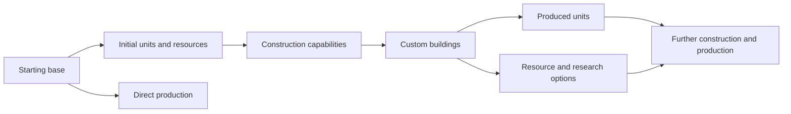

# Wonder Gather — Game Vision and Design Source of Truth

**Status:** Living document

**Last updated:** September 9, 2026

**Purpose:** Preserve the current game vision so future design and engineering work can distinguish decisions from possibilities.

**Working names:** **Wonder Gather** is the design and brand name; **WonderGatherRTS** is the Unity project name; **Modular-RTS** is the GitHub repository; **The Wanderer** is the first prototype slice. The final commercial title remains open.

This document synthesizes the complete recovered design conversation and the current prototype. It replaces short summaries as the primary design reference. When a future decision changes something here, update this file in the same commit as the affected work.

## How to read this document

- **Locked** — directly chosen by the game director. Treat it as part of the game's identity unless deliberately revisited.
- **Direction** — strongly intended, but its implementation or exact values remain open.
- **Possible** — discussed as a promising option. It is not a commitment.
- **Open** — needs design work, prototyping, or playtesting.
- **Implemented** — exists in the current prototype. Implementation does not automatically make a design choice permanent.

## The game in one paragraph

**Locked:** Wonder Gather is a slow-paced, fully 3D fantasy RTS in which players do not merely choose a faction: they design an entire civilization before the match. A civilization begins from a customized central base and unfolds as a connected network of units, buildings, resources, production relationships, and optional progression. Matches retain the gathering, growth, construction, production, and tactical command rhythm associated with *Age of Empires*, especially the more deliberate pace of *Age of Empires III*. Units and combat should be far more physically expressive and procedural, drawing inspiration from the emergence of *Totally Accurate Battle Simulator* while rejecting its slapstick tone in favor of grounded movement, readability, quiet awe, and wonder.

The intended pleasure is not only winning with a civilization. It is inventing one, bringing it into a match, and watching that handcrafted possibility slowly become alive.

## Core design pillars

### 1. Design a civilization

**Locked:** The pre-match creative act is central. The player's “deck” is an entire civilization: its starting base, available unit and building blueprints, production links, construction permissions, resource relationships, and progression structure.

**Locked:** Creation is modular but expansive enough to feel close to freeform. Modules exist to make choices flavorful, legible, balanceable, and mechanically meaningful rather than to force civilizations into narrow presets.

**Locked:** Aesthetic and mechanical decisions are connected. Players should often express gameplay through meaningful fictional or visual choices, rather than editing only abstract combat numbers.

### 2. Watch it become alive

**Locked:** The game should reward close observation. The player is meant to enjoy body language, movement, construction, small fights, and emergent moments instead of operating entirely from a numbers-focused strategic autopilot.

**Locked:** The camera must support a continuous relationship between strategic command and intimate observation: high enough to read armies, economy, and territory, and close enough to care about individual units.

### 3. Command beings with agency

**Locked:** Players mainly issue familiar, readable RTS orders such as move and attack, with only a small number of special commands where needed.

**Direction:** Units interpret orders through their bodies, capabilities, circumstances, and personalities. Autonomy can sometimes overrule the player's intention. A unit with little courage may flee despite an attack or movement order.

**Locked technical principle:** Keep player intention, issued order, unit interpretation, and performed action separate. This supports personality, morale, AI, replays, and eventual networking without changing the meaning of player input.

### 4. Physical expression without farce

**Locked:** Movement and combat should be dynamic and procedural, but grounded. The result must avoid the weightless, nonsensical, or deliberately goofy quality associated with comedy physics.

**Direction:** Favor the highest useful degree of procedural motion that remains visually convincing, controllable, readable, and performant at RTS scale.

### 5. Creative freedom through meaningful tradeoffs

**Locked:** Powerful, versatile, direct, or resilient starting options must consume more of the pre-match design budget. Players can instead reach power through longer, slower, or more fragile production chains.

**Locked:** The system should preserve strange and risky civilizations where possible. Validation should explain weaknesses and dead ends rather than automatically forbidding every unconventional design.

## The civilization as a graph

**Locked:** A civilization is a connected network whose entry point is its starting setup.

A blueprint matters in a match only when the starting setup can reach it through production, construction, transformation, research, or another valid relationship. This reachability is the basis for design cost, progression, validation, and the future civilization editor.

### Starting base and starting setup

**Locked:** Every main match starts from a central initial base, in the broad tradition of *Age of Empires*. The starting setup can also contain builders, other initial units, and starting resources.

**Locked:** Players spend a limited design budget on properties of this initial possibility space. Relevant choices include:

- central-base properties such as durability and special capabilities;
- what the base can produce directly;
- which and how many units begin the match;
- which resources and how much of them begin available;
- which later blueprints are reachable through the starting network;
- redundancy, versatility, and alternative routes through the network.

Exact point values and balance formulas are **open**.

### Units

**Locked:** Unit types are customized blueprints rather than fixed faction rosters. A blueprint can combine body, appearance, equipment, attributes, personality, behavior, production cost, and capabilities.

**Locked:** Construction knowledge belongs to unit customization. Giving a unit permission to build one or more structures makes that unit more valuable and more expensive. Connecting it to the starting setup also affects the design budget because it unlocks downstream possibilities.

**Direction:** Physical and personality traits both play major roles. Strength and dexterity were named examples. Courage is the clearest established behavioral example.

**Possible traits discussed:** discipline, curiosity, loyalty, aggression, patience, protectiveness, independence, sociability, mass, reach, movement style, morale stability, carry capacity, accuracy, and formation role. This is a candidate vocabulary, not a final stat list.

### Buildings

**Locked:** Buildings are customizable and can serve production, defense, economy, research, and utility roles. Which units can build which buildings is part of civilization design.

**Direction:** Buildings and units can unlock one another through multi-stage relationships. Adding an intermediate dependency may make a powerful blueprint cheaper in starting-design value because it is less immediately accessible during the match.

### Progression

**Locked:** Players can fully design their own progression structure. A civilization may use a deep technology network, a small sequence, or no conventional technological progression at all.

**Locked:** Position within a progression chain is a balance tool. Requiring earlier units, buildings, or technologies can make a later option more efficient or less expensive than granting direct access from the starting base.

**Possible:** Hidden standardized power bands could help balance very different fictional progressions, while keeping their visible names, requirements, and presentation unique. This was proposed but not chosen.

**Open:** The exact meaning of technologies, unlock conditions, research behavior, and any limits on graph depth or cycles.

## The two-cost model

**Locked:** Wonder Gather has two related but distinct values.

### Design value

Paid before a match. It measures how much immediate possibility and resilience a civilization's starting setup provides. Direct production, extra starting units or resources, powerful base properties, versatile builders, broad access, and redundant progression routes can all raise it.

### In-match cost

Paid during play through resources, time, production capacity, prerequisites, or other match systems. It measures how difficult a specific unit, building, or effect is to create in that match.

**Locked:** These values must not be identical. A dragon at the far end of a fragile production chain can have a high in-match cost but a relatively modest design value. Producing that same dragon directly from the starting base would consume far more design value.

**Direction:** In-match costs should be calculated from customization choices rather than assigned arbitrarily to every handcrafted blueprint.

**Open:** Cost formulas, nonlinear interactions, synergy pricing, discounts for prerequisites, resilience premiums, population, production time, and how balance changes are versioned for saved civilizations.

## Resources and economy

**Direction:** The game will have a known set or framework of match resources, and unit/building customization will help determine their costs automatically.

**Possible:** Some civilization choices may unlock, create, gather, transform, or require unusual resources. Examples discussed include conventional food, wood, stone, and metal, as well as fantasy resources such as moonlight, fungi, animals, or memories.

**Open:** The base resource list; whether resources are globally shared, partially customizable, or produced from templates; storage and delivery; market or conversion systems; scarcity; map generation; population; and the exact gathering loop.

## Match structure and pacing

**Locked:** Matches follow a recognizable RTS growth arc: begin with the designed starting setup, gather or generate resources, expand the reachable civilization network, construct buildings, produce units, fight, and pursue victory.

**Locked:** The intended pace is slower and matches are expected to be long rather than brief tactical rounds. Small engagements should be readable and worth watching.

**Direction:** The playable army may need to be smaller than in mass-battle RTS games so procedural bodies, behavior, and individual readability remain practical. At the same time, maps and presentation should preserve grandeur and the feeling of a large world.

**Open:** Match length targets, maximum unit and building counts, map size, simulation tick rate, fog of war, territory, logistics, diplomacy, neutral creatures, and how much attention economy management requires.

## Control, autonomy, and personality

**Locked:** Direct orders should remain simple: primarily move, attack, and a limited set of contextual or special actions such as beginning a craft.

**Direction:** Subsequent behavior is shaped by autonomy. Units may choose routes, positioning, reactions, and moment-to-moment actions independently, and may refuse or abandon an order when personality and danger strongly demand it.

**Direction:** Disobedience must be readable. Players should be able to understand that a unit fled from fear, protected an ally, hesitated, or regrouped, rather than experiencing the AI as broken controls.

**Possible behavior model:** perception feeds stress and morale; personality modifies utility scores; a unit compares obeying, attacking, holding, protecting, regrouping, and fleeing. Courage, discipline, health, nearby allies, nearby enemies, safety, loyalty, and protectiveness could shape these scores.

**Open:** Exact AI model; trait inheritance from blueprints; autonomy limits; player feedback; group morale; experience; memory; relationships; and how much unpredictability is acceptable in competitive play.

## Individuals and attachment

**Direction:** Units should have enough personality and physical expression for the player to become attached to them.

**Possible:** A blueprint supplies the main attributes while individual instances receive small, visible variations in courage, appearance, tendencies, experience, injuries, or relationships. Important survivors could accumulate history during long matches.

**Open:** Whether individual variation ships in the core game; its magnitude; persistence between matches; naming; veterancy; permanent injury or death; and how competitive players inspect variation.

## Movement and combat

**Locked:** Units move and fight in three-dimensional space. Terrain, bodies, equipment, momentum, and nearby agents should matter visually.

**Direction:** Procedural animation and physics-influenced reactions should create variation and presence while authored constraints preserve intention and elegance.

**Possible techniques:** procedural foot placement, terrain adaptation, body lean and anticipation, active-ragdoll experiments, physically aimed attacks, weapon/body collision, balance and stumbling, pushes, momentum, formation-aware steering, and blended authored animation.

**Open:** The final simulation depth; whether damage uses hit volumes or abstract resolution; how active ragdolls blend with navigation; formation behavior; crowd collision; deterministic simulation; performance budget; and how combat remains legible from both camera extremes.

## Camera and visual space

**Locked:** The game is fully 3D, with a rotating RTS camera, terrain elevation, and the ability to zoom from strategic height to close observation of an individual fight or activity.

**Locked:** The camera embodies the “strategy ↔ observation” pillar and is a core experiential system rather than disposable infrastructure.

**Direction:** Motion should be smooth and deliberate, with acceleration/deceleration, comfortable rotation, terrain-aware limits, and close zoom that does not lose strategic orientation.

**Possible:** edge panning, middle-mouse rotation, zoom toward cursor, cinematic focus on selected units, and camera collision with uneven terrain. Current controls use keyboard panning, Q/E rotation, wheel zoom, and F to focus.

## World, tone, and art

**Locked:** The broad setting is fantasy and should allow wide creative freedom among civilizations.

**Locked:** The emotional tone is grounded, poetic, and wonder-filled: quiet awe, discovery, visual curiosity, and affection for a handcrafted living civilization. Comedy may emerge naturally, but deliberate nonsense is not the aesthetic foundation.

**Direction:** The world should feel large even if the simulated armies stay relatively intimate. A player should feel creative, clever, tactically engaged, and like a gentle commander or observer.

**Open:** Lore, species, cultures, world history, magic rules, technology range, visual style, environmental biomes, soundtrack, interface language, and whether the final rendering leans painterly, storybook, miniature, low-poly, or soft semi-realism.

## Victory and defeat

**Locked:** Destroying the opponent's main initial base is the foundational victory condition.

**Direction:** Base customization may let a civilization establish additional civilization hearts or main bases. Spending design value on this resilience could require opponents to destroy every qualifying heart before victory.

**Possible alternate modes or standardized victories:** capture a central structure, control wonders, complete a monumental project, achieve a cultural or magical transformation, force surrender through territory or morale, survive a world event, or fulfill a faction-flavored aspiration.

**Open:** Whether any alternate victory enters the primary competitive mode, surrender rules, defeat after loss of production capability, and how extra civilization hearts are limited and communicated.

## Modes and multiplayer

**Locked:** The long-term game is multiplayer-focused.

**Locked:** The principal competitive format is **Open Workshop**: players create civilizations beforehand and bring them into matchmaking under the design budget and applicable validation rules.

**Direction:** The system should also support an appropriate single-player experience.

**Possible additional formats:** skirmish versus AI, campaign, co-op, a drafted workshop using a shared module pool, a curated or seasonal league, and mirrored construction where players receive the same components but build different civilizations.

**Open:** Player count, team modes, campaign structure, matchmaking rules, ranked legality, anti-cheat, mod/workshop sharing, version compatibility, deterministic or authoritative networking, and which mode is developed first after the core simulation is proven.

## Civilization validation

**Locked:** The editor should analyze whether a civilization can theoretically progress from its starting setup.

**Locked:** Warnings are preferred over hard blocking in order to protect creative freedom, though competitive queues can still require explicit legality rules.

**Possible validation language:**

- **Valid:** at least one functional route exists from the starting state.
- **Valid but vulnerable:** progression exists, but foreseeable losses or dependencies can permanently strand the civilization.
- **Incomplete:** no viable route exists to acquire a required resource, construct, produce, or advance.

Warnings should explain causes precisely, such as: “No reachable unit can gather stone, but three reachable structures require stone.”

**Open:** Which failures merely warn, which make a civilization ineligible for matchmaking, whether intentional challenge civilizations are supported, and how exhaustive the graph/economy simulation must be.

## Technical direction

**Locked for the current project:** Unity 6.6 with the Universal Render Pipeline. The project is organized under `Assets/_WonderGather`, separate from third-party content.

**Locked architectural principles:** modular components; data separate from runtime behavior; explicit ownership; command objects between input and action; editor automation for repetitive setup; automated tests for deterministic rules and important integration; Git/GitHub as the shared source of truth.

**Direction:** ScriptableObject-backed blueprints are a strong fit for unit, building, resource, personality, body, technology, and civilization definitions. A visual graph editor may eventually present their relationships, but the data model should be proven with simpler tools first.

**Direction:** Utility scoring is a strong candidate for personality and autonomous decisions after basic states and behavior loops are understood.

**Possible later technical systems:** save/load formats for civilizations, graph validation, cost-calculation tools, procedural locomotion, active-ragdoll experiments, formation and steering systems, multiplayer authority and replication, performance profiling, content versioning, and creator-facing debugging explanations.

**Deferred intentionally:** DOTS/ECS, networking packages, final art assets, deep procedural combat, and a polished civilization graph editor are not foundations for the earliest prototypes. Adopt them only when measurements and milestone needs justify them.

## Current production state

### Prototype 1.1 — The Wanderer

**Implemented:**

- a Unity 6.6 URP project and GitHub repository;
- a fully 3D test scene with one selectable Wanderer;
- smooth bounded camera pan, rotation, zoom, and selected-unit focus;
- mouse selection, deselection, order feedback, and destination marker;
- a command boundary from player input to movement;
- NavMesh navigation, obstacle routing, and rejection of unreachable destinations;
- a reusable unit prefab and separated runtime/editor/test assemblies;
- three passing PlayMode tests and a successful Windows development build.

**Awaiting design acceptance:** camera feel, zoom range, pan/rotation speed, unit acceleration and turning, selection clarity, and destination feedback after hands-on playtesting.

**First hands-on feedback:** the prototype's features and overall camera smoothing felt good. Mouse-wheel sensitivity increased from 0.0015 to 0.002. The retest initially accepted this as good enough; the user then chose and saved 0.005 as the preferred zoom sensitivity. The Wanderer is provisionally accepted as the foundation for group control.

### Prototype 1.2 — The Group

**Accepted in first hands-on playtest:** eight selectable units in TheGroup, click and Shift-click selection, drag-box and additive box selection, selection rings/count, group-center camera focus, and group orders with separate arrival slots. NavMesh local avoidance handles nearby agents. The user requested that unreachable clicks move toward the next best available place. Movement now resolves reachable alternatives and adjusts nearby slots while preserving separation. Invalid numerical orders and groups with no available space still preserve existing destinations. See `Docs/GroupPlaytest.md`.

### The Gatherer — first step toward The Little Settlement

**Implemented for playtesting:** one placeholder supply resource, one drop-off point, eight workers, five-unit carry capacity, gathering and repeated delivery, finite resource accounting, stored-resource HUD, and cancellation/resumption through orders. The user approved this production step after accepting The Group. Exact values and resource fiction remain prototype choices; this does not lock the final resource list.

### Prototype 1.3 — The Little Settlement

**Planned direction:** one starting base, one builder, one resource, one constructible building, and one production path. This is the smallest slice that can test civilization reachability and the two-cost model.

### Later proof sequence

The order remains adjustable, but the likely progression is:

1. **Civilization data and graph:** data-driven base, unit, and building definitions; production/build links; reachability validation; two-cost foundation; first editor tooling.
2. **Three Temperaments:** one basic blueprint expressed through courage and discipline differences, proving readable orders, autonomy, and morale.
3. **The Living Body:** one creature with procedural locomotion and grounded physical reactions, establishing the non-goofy visual bar before scaling combat.
4. **Small physical battle:** a few units with readable attacks and reactions, measured against a performance budget and player comprehension.
5. **Vertical slice:** design one civilization before the match, begin from its starting setup, gather and progress, fight, and reach a main-base victory.
6. **Multiplayer prototype:** bring saved civilizations into Open Workshop matchmaking after the local vertical slice proves its rules.

This later sequence is a direction synthesized from the conversation, not locked milestone scope. The inaccessible earlier dossier reportedly contained a seven-stage roadmap, but its exact stages and exit criteria cannot be recovered and are not reconstructed here.

## Collaboration agreement

**Locked:** The user is the game director, lead designer, creative director, and primary judge of feel. The user defines the desired experience, makes creative choices, and playtests visual and emergent behavior.

**Locked:** Codex acts as technical co-developer and systems-design partner: architecture, C# implementation, editor tools, tests, debugging, documentation, Git workflow, performance investigation, and later networking code where possible.

The working loop is: describe an experience → design the rule together → implement the smallest coherent slice → playtest → translate observations into technical adjustments → repeat.

## Explicit open-decision register

These questions must remain visible rather than being silently answered by implementation:

- What are the standard match resources, and how can civilizations alter them?
- What exact attributes and aesthetic modules can players edit?
- How are design value and in-match cost calculated and balanced?
- What graph structures, dependencies, cycles, and transformations are legal?
- How much individual variation do instances receive?
- What is the practical unit count and target match duration?
- How physically simulated can combat become without losing control, readability, or performance?
- How does the game explain hesitation, refusal, fear, protection, and autonomous choices?
- Which single-player and secondary multiplayer modes support the central vision?
- Are victory conditions beyond civilization-heart destruction part of the main game?
- What visual style and lore best express grounded fantasy wonder?
- Which rules are warnings, and which are required for competitive matchmaking?

## Guardrails for future work

- Do not turn a tentative example into a permanent rule without recording the decision here.
- Do not reduce civilization creation to cosmetic faction skins or a conventional fixed tech tree.
- Do not let procedural physics become comedy at the expense of grounded wonder.
- Do not make autonomous behavior opaque; agency must be legible to the commander.
- Do not optimize only for top-down efficiency; close observation is part of the game.
- Do not build the polished creator interface before the blueprint graph, validation, and cost rules survive small prototypes.
- Do not add large-scale technology because it sounds future-proof. Add it when a measured prototype needs it.

## Decision log

New ideas enter as **Possible**. Only an explicit design decision promotes them to **Locked**. A prototype can implement a hypothesis without making it permanent.

| Date | Topic | Status | Decision or hypothesis | What could change it |
|---|---|---|---|---|
| 2026-09-06 | Engine foundation | Locked for current project | Unity 6.6 and URP; migrated early from Unity 6.3 LTS | A demonstrated engine-level blocker or a deliberate future LTS transition |
| 2026-09-06 | First slice | Provisionally accepted | The Wanderer proves camera, selection, commands, and one-unit navigation | Hands-on playtest feedback |
| 2026-09-06 | Repository visibility | Production choice | Publish the source at `MacquePanoramix/Modular-RTS` | A later explicit decision to make it private |
| 2026-09-07 | Prototype camera tuning | Provisionally accepted | Preserve smooth wheel zoom and increase sensitivity from 0.0015 to 0.0020 | Hands-on retest feedback |

Add future entries with the decision, its status, the evidence behind it, and what kind of playtest or new requirement would justify revisiting it.

## Provenance

This source of truth is based on the recovered “Branch · Game Concept Development” conversation and the current repository state. A prior 49-page dossier was referenced in that conversation, but the actual attachment contents were not available in this task. Ideas mentioned only by the assistant have been labeled **Possible**, **Direction**, or **Open** unless the user explicitly accepted them. Future user decisions take precedence over this document.

## Gatherer playtest follow-up — September 8, 2026

The user reported that the gathering loop worked. The requested HUD clipping correction is implemented. The next proposed step remains construction within The Little Settlement: spend gathered supplies to place a building and send a worker to complete it, followed by unit production. Resource names and balance values remain provisional.

## Construction step — September 8, 2026

The user approved proceeding from the accepted Gatherer to construction. Implemented for playtesting: one workshop definition, preview placement, validation and spending stored supplies, worker travel and timed construction, interruption/resumption, and navigation footprints. Prototype values are 20 supplies, eight seconds and a three-unit square footprint; these are not locked balance decisions. Unit production remains the next step toward the full Little Settlement loop.

## Unit production — September 8, 2026

The user accepted construction and approved unit production. Implemented for playtesting: selecting a completed workshop, training one worker type with stored supplies, a three-entry queue, cancellation/refunds, safe nearby spawning, and full selection/gathering/building integration for produced workers. The provisional worker costs 10 supplies and takes six seconds; these values and queue size are not locked design decisions. This completes the first gather → build → produce loop of The Little Settlement. Civilization data and production relationships remain the next planned foundation after playtest acceptance.

## Civilization blueprint foundation — September 9, 2026

The user accepted the production result and approved working together on the
civilization blueprint foundation. The gather → build → produce loop is now
provisionally accepted. This milestone adds editable starting-base, unit,
building and civilization assets, construction permissions, production links,
runtime starting setup and inheritance of produced workers' blueprints.
Inspector tooling checks structural reachability and reports missing supply
gathering. Warnings preserve intentional challenge designs; invalid runtime
references must be corrected before instantiation.

The standard sample preserves eight starting workers and zero stored supplies.
A provisioned sample uses three workers and 40 supplies to demonstrate that
data changes affect play. These are implementation examples, not locked
factions or balance choices. The central base is a completed depot placeholder.
Each building currently supports one produced unit type; the framework's first
unit prefab contract remains a worker with optional gather/build permissions.

Only supplies are implemented. The report does not simulate complete economic
chains or prove resilience, map feasibility, or competitive legality. The
two-cost distinction is preserved: existing in-match costs are reused; no
design-budget formula or inferred balance pricing is introduced. That design
work remains open, as do new resource types and the polished graph editor.

After playtesting this foundation, collaboratively choose a small second role
or production chain to test meaningful civilization variation, then develop
design-value rules with concrete examples before moving to Three Temperaments.
This is a proposed next refinement, not a newly locked roadmap.

**Collaboration clarification:** The user reaffirmed that their specific vision
and aesthetic guide must direct the work. Check in with concrete proposals
before introducing visual direction, new unit roles or meaningful design
changes. Technical sample assets are provisional. The current written guide
captures grounded fantasy, quiet awe, expressive bodies and rejection of
slapstick physics; the location of any more detailed aesthetic source has been
requested and must be reviewed before visual decisions.

## Player-facing faction creator — September 9, 2026

**User clarification:** The final game must let players design their own
factions through blueprints, supported by a high-quality creation interface.
Developer-facing Inspector assets are a foundation, not the intended final
player experience.

The user accepted the civilization foundation and approved a first functional
creator with a central blueprint graph, adjacent customization panel and
starting-setup summary. Implemented for review: faction naming, starting
worker/supply counts, editable gather/build/train permissions, live dependency
warnings, launch into the existing test map and return to the same draft.
Runtime draft copies protect authored example assets. Each playtest resets the
map while preserving the draft for this session.

The visual treatment is provisional and deliberately limited to a layout
prototype. No final art style, lore, new faction role or balance formula is
locked by this implementation. The 0–8 workers and 0–120 supplies controls are
test-map bounds. Save/load, broader blueprint content, full visual graph
editing and the final HUD design remain future work. Review clarity and feel
with the user before choosing the next creator refinement.

## Faction saving and library — September 9, 2026

The user provisionally accepted the first creator and approved saving,
loading and duplicating factions as the next implementation. Added for
playtesting: Save, Save as copy, library Open/Rename/Delete, unsaved-change
feedback and confirmation before replacing edits or normally closing the
standalone player. Editor Stop Play Mode still requires saving first.

Saved data records the current small creator's blueprint IDs, links, starting
setup and name. Files are local and versioned; failed writes preserve the
draft, previous saves receive a backup, and deletions retain a recovery file.
Unknown/incompatible data is explained rather than silently discarded.

This does not lock the final faction schema, balance formulas or interface
aesthetic. The next proposed design discussion remains multiple customizable
unit/building blueprints and meaningful production chains, with the user
choosing roles and capabilities before implementation. Cloud sharing and
running-match saves remain separate possibilities.
