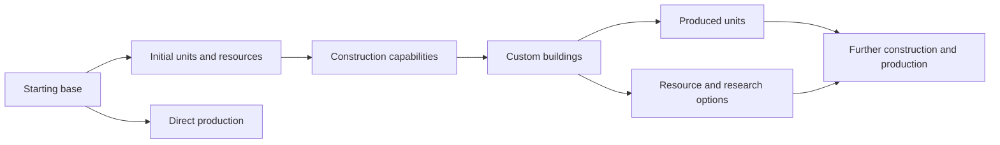

# Wonder Gather — Game Vision and Design Source of Truth

**Status:** Living document

**Last updated:** October 1, 2026

**Purpose:** Preserve the current game vision so future design and engineering work can distinguish decisions from possibilities.

**Working names:** **Wonder Gather** is the design and brand name; **WonderGatherRTS** is the Unity project name; **Modular-RTS** is the GitHub repository; **The Wanderer** is the first prototype slice. The final commercial title remains open.

This document synthesizes the complete recovered design conversation and the current prototype. It replaces short summaries as the primary design reference. When a future decision changes something here, update this file in the same commit as the affected work.

## How to read this document

- **Locked** — directly chosen by the game director. Treat it as part of the game's identity unless deliberately revisited.
- **Direction** — strongly intended, but its implementation or exact values remain open.
- **Possible** — discussed as a promising option. It is not a commitment.
- **Open** — needs design work, prototyping, or playtesting.
- **Implemented** — exists in the current prototype. Implementation does not automatically make a design choice permanent.

## The game in one paragraph

**Locked:** Wonder Gather is a slow-paced, fully 3D fantasy RTS in which players do not merely choose a faction: they design an entire civilization before the match. A civilization begins from a customized central base and unfolds as a connected network of units, buildings, resources, production relationships, and optional progression. Matches retain the gathering, growth, construction, production, and tactical command rhythm associated with *Age of Empires*, especially the more deliberate pace of *Age of Empires III*. Units and combat should be far more physically expressive and procedural, drawing inspiration from the emergence of *Totally Accurate Battle Simulator* while rejecting its slapstick tone in favor of grounded movement, readability, quiet awe, and wonder.

The intended pleasure is not only winning with a civilization. It is inventing one, bringing it into a match, and watching that handcrafted possibility slowly become alive.

## Core design pillars

### 1. Design a civilization

**Locked:** The pre-match creative act is central. The player's “deck” is an entire civilization: its starting base, available unit and building blueprints, production links, construction permissions, resource relationships, and progression structure.

**Locked:** Creation is modular but expansive enough to feel close to freeform. Modules exist to make choices flavorful, legible, balanceable, and mechanically meaningful rather than to force civilizations into narrow presets.

**Locked:** Aesthetic and mechanical decisions are connected. Players should often express gameplay through meaningful fictional or visual choices, rather than editing only abstract combat numbers.

### 2. Watch it become alive

**Locked:** The game should reward close observation. The player is meant to enjoy body language, movement, construction, small fights, and emergent moments instead of operating entirely from a numbers-focused strategic autopilot.

**Locked:** The camera must support a continuous relationship between strategic command and intimate observation: high enough to read armies, economy, and territory, and close enough to care about individual units.

### 3. Command beings with agency

**Locked:** Players mainly issue familiar, readable RTS orders such as move and attack, with only a small number of special commands where needed.

**Direction:** Units interpret orders through their bodies, capabilities, circumstances, and personalities. Autonomy can sometimes overrule the player's intention. A unit with little courage may flee despite an attack or movement order.

**Locked technical principle:** Keep player intention, issued order, unit interpretation, and performed action separate. This supports personality, morale, AI, replays, and eventual networking without changing the meaning of player input.

### 4. Physical expression without farce

**Locked:** Movement and combat should be dynamic and procedural, but grounded. The result must avoid the weightless, nonsensical, or deliberately goofy quality associated with comedy physics.

**Direction:** Favor the highest useful degree of procedural motion that remains visually convincing, controllable, readable, and performant at RTS scale.

### 5. Creative freedom through meaningful tradeoffs

**Locked:** Powerful, versatile, direct, or resilient starting options must consume more of the pre-match design budget. Players can instead reach power through longer, slower, or more fragile production chains.

**Locked:** The system should preserve strange and risky civilizations where possible. Validation should explain weaknesses and dead ends rather than automatically forbidding every unconventional design.

## The civilization as a graph

**Locked:** A civilization is a connected network whose entry point is its starting setup.

```mermaid
flowchart LR
    B[Starting base] --> I[Initial units and resources]
    B --> P[Direct production]
    I --> C[Construction capabilities]
    C --> S[Custom buildings]
    S --> U[Produced units]
    S --> R[Resource and research options]
    U --> N[Further construction and production]
    R --> N
```

A blueprint matters in a match only when the starting setup can reach it through production, construction, transformation, research, or another valid relationship. This reachability is the basis for design cost, progression, validation, and the future civilization editor.

### Starting base and starting setup

**Locked:** Every main match starts from a central initial base, in the broad tradition of *Age of Empires*. The starting setup can also contain builders, other initial units, and starting resources.

**Locked:** Players spend a limited design budget on properties of this initial possibility space. Relevant choices include:

- central-base properties such as durability and special capabilities;
- what the base can produce directly;
- which and how many units begin the match;
- which resources and how much of them begin available;
- which later blueprints are reachable through the starting network;
- redundancy, versatility, and alternative routes through the network.

Exact point values and balance formulas are **open**.

### Units

**Locked:** Unit types are customized blueprints rather than fixed faction rosters. A blueprint can combine body, appearance, equipment, attributes, personality, behavior, production cost, and capabilities.

**Locked:** Construction knowledge belongs to unit customization. Giving a unit permission to build one or more structures makes that unit more valuable and more expensive. Connecting it to the starting setup also affects the design budget because it unlocks downstream possibilities.

**Direction:** Physical and personality traits both play major roles. Strength and dexterity were named examples. Courage is the clearest established behavioral example.

**Possible traits discussed:** discipline, curiosity, loyalty, aggression, patience, protectiveness, independence, sociability, mass, reach, movement style, morale stability, carry capacity, accuracy, and formation role. This is a candidate vocabulary, not a final stat list.

### Buildings

**Locked:** Buildings are customizable and can serve production, defense, economy, research, and utility roles. Which units can build which buildings is part of civilization design.

**Direction:** Buildings and units can unlock one another through multi-stage relationships. Adding an intermediate dependency may make a powerful blueprint cheaper in starting-design value because it is less immediately accessible during the match.

### Progression

**Locked:** Players can fully design their own progression structure. A civilization may use a deep technology network, a small sequence, or no conventional technological progression at all.

**Locked:** Position within a progression chain is a balance tool. Requiring earlier units, buildings, or technologies can make a later option more efficient or less expensive than granting direct access from the starting base.

**Possible:** Hidden standardized power bands could help balance very different fictional progressions, while keeping their visible names, requirements, and presentation unique. This was proposed but not chosen.

**Open:** The exact meaning of technologies, unlock conditions, research behavior, and any limits on graph depth or cycles.

## Advanced prototype reference: one worker, deep interaction

**Direction, clarified by Luis on September 28, 2026:** Develop a later
prototype suitable for outside playtesting that is small in scene scale but
highly polished and deep in its represented systems. Its reference is one
worker in a landscape with a mineral-bearing boulder or ore deposit and an
equipped pickaxe. The current Living Worker is provisionally accepted as an
early foundation; it does not define the final movement, resource, body,
equipment, customization depth or aesthetic.

**Direction:** Unit creation should approach the depth and care of a
video-game character creator, with a strong HUD and meaningful links among
body, appearance, attributes, equipment and behavior. Dark Souls was Luis's
example of that level of authorship, not a selection of art style or exact
editor features. Comparable modular depth extends to buildings and the
civilization blueprint system. Current percentage sliders are scaffolding.

**Direction:** The worker's motion should be fully procedural in intent,
credible and restrained. The tool must physically reach and strike the
mineral. Strength, tool demands and material loads should affect handling,
locomotion and what work is possible. The ambition is coherent embodied
behavior, not instability or an implicit commitment to a specific physics
solver. Tool and cargo handling must be compatible within the same body.

**Illustrative possibilities:** A strong worker carries the pickaxe in one
hand while walking; another drags it, changing its movement; a less capable
worker needs assistance such as a small wooden tool cart. Mined material
also has carrying demands, potentially addressed through a bag or cart.
These examples express the depth of interaction. The exact strength bands,
mass/bulk model, carry modes, assistance rules and penalties remain **open**.

**Possible, not decided:** How or how well a strike lands could change
resource yield. Impact-dependent yield needs experimentation; fixed yield
per valid strike is only a possible first proof. Loose material, pickup,
loading and container handling also need design. Neither a timer nor a
simple bundle linked to cargo settles the intended physical economy.

The expanded reference, experiential criteria and proposed stages are in
[WorkerShowcaseVision.md](Design/WorkerShowcaseVision.md). Luis's original wording
is preserved in [Correspondence/2026-09-28_ONE_WORKER_SHOWCASE_BRIEF.md](Correspondence/2026-09-28_ONE_WORKER_SHOWCASE_BRIEF.md).
The Equipped Worker now exists as the bare starting point.

**Direction, clarified by Luis on October 1, 2026:**

- **Scope.** The showcase is one worker (maybe more later) with a video-game
  style character creator for that worker. In this prototype that creator
  replaces the civilization/faction creator, and it sets the quality bar for
  the final unit customization.
- **Always a worker.** The character always has basic worker abilities. In the
  full game, "worker" is not a unit type: units are customized into workers.
- **Speed.** Base movement speed stays constant and is not a creator option
  for now.
- **Hauling.** The worker gets material home in one of these ways:
  - load in one hand and pickaxe in the other, if strong enough;
  - a backpack;
  - a sack;
  - a cart.

  A back-stowed pickaxe "doesn't make sense", and leaving the pickaxe behind
  is "a bit strange".
- **Models.** They should be of much higher quality, made with Blender.
- **Audience.** Outside players will playtest it.

The staged plan is [ShowcaseRoadmap.md](ShowcaseRoadmap.md). Its sequence is a
recommendation, not a locked roadmap or approval of every detailed mechanic.

## The two-cost model

**Locked:** Wonder Gather has two related but distinct values.

### Design value

Paid before a match. It measures how much immediate possibility and resilience a civilization's starting setup provides. Direct production, extra starting units or resources, powerful base properties, versatile builders, broad access, and redundant progression routes can all raise it.

### In-match cost

Paid during play through resources, time, production capacity, prerequisites, or other match systems. It measures how difficult a specific unit, building, or effect is to create in that match.

**Locked:** These values must not be identical. A dragon at the far end of a fragile production chain can have a high in-match cost but a relatively modest design value. Producing that same dragon directly from the starting base would consume far more design value.

**Direction:** In-match costs should be calculated from customization choices rather than assigned arbitrarily to every handcrafted blueprint.

**Open:** Cost formulas, nonlinear interactions, synergy pricing, discounts for prerequisites, resilience premiums, population, production time, and how balance changes are versioned for saved civilizations.

## Resources and economy

**Direction:** The game will have a known set or framework of match resources, and unit/building customization will help determine their costs automatically.

**Possible:** Some civilization choices may unlock, create, gather, transform, or require unusual resources. Examples discussed include conventional food, wood, stone, and metal, as well as fantasy resources such as moonlight, fungi, animals, or memories.

**Open:** The base resource list; whether resources are globally shared, partially customizable, or produced from templates; storage and delivery; market or conversion systems; scarcity; map generation; population; and the exact gathering loop.

## Match structure and pacing

**Locked:** Matches follow a recognizable RTS growth arc: begin with the designed starting setup, gather or generate resources, expand the reachable civilization network, construct buildings, produce units, fight, and pursue victory.

**Locked:** The intended pace is slower and matches are expected to be long rather than brief tactical rounds. Small engagements should be readable and worth watching.

**Direction:** The playable army may need to be smaller than in mass-battle RTS games so procedural bodies, behavior, and individual readability remain practical. At the same time, maps and presentation should preserve grandeur and the feeling of a large world.

**Open:** Match length targets, maximum unit and building counts, map size, simulation tick rate, fog of war, territory, logistics, diplomacy, neutral creatures, and how much attention economy management requires.

## Control, autonomy, and personality

**Locked:** Direct orders should remain simple: primarily move, attack, and a limited set of contextual or special actions such as beginning a craft.

**Direction:** Subsequent behavior is shaped by autonomy. Units may choose routes, positioning, reactions, and moment-to-moment actions independently, and may refuse or abandon an order when personality and danger strongly demand it.

**Direction:** Disobedience must be readable. Players should be able to understand that a unit fled from fear, protected an ally, hesitated, or regrouped, rather than experiencing the AI as broken controls.

**Possible behavior model:** perception feeds stress and morale; personality modifies utility scores; a unit compares obeying, attacking, holding, protecting, regrouping, and fleeing. Courage, discipline, health, nearby allies, nearby enemies, safety, loyalty, and protectiveness could shape these scores.

**Open:** Exact AI model; trait inheritance from blueprints; autonomy limits; player feedback; group morale; experience; memory; relationships; and how much unpredictability is acceptable in competitive play.

## Individuals and attachment

**Direction:** Units should have enough personality and physical expression for the player to become attached to them.

**Possible:** A blueprint supplies the main attributes while individual instances receive small, visible variations in courage, appearance, tendencies, experience, injuries, or relationships. Important survivors could accumulate history during long matches.

**Open:** Whether individual variation ships in the core game; its magnitude; persistence between matches; naming; veterancy; permanent injury or death; and how competitive players inspect variation.

## Movement and combat

**Locked:** Units move and fight in three-dimensional space. Terrain, bodies, equipment, momentum, and nearby agents should matter visually.

**Direction:** Procedural animation and physics-influenced reactions should create variation and presence while authored constraints preserve intention and elegance.

**Possible techniques:** procedural foot placement, terrain adaptation, body lean and anticipation, active-ragdoll experiments, physically aimed attacks, weapon/body collision, balance and stumbling, pushes, momentum, formation-aware steering, and blended authored animation.

**Open:** The final simulation depth; whether damage uses hit volumes or abstract resolution; how active ragdolls blend with navigation; formation behavior; crowd collision; deterministic simulation; performance budget; and how combat remains legible from both camera extremes.

## Camera and visual space

**Locked:** The game is fully 3D, with a rotating RTS camera, terrain elevation, and the ability to zoom from strategic height to close observation of an individual fight or activity.

**Locked:** The camera embodies the “strategy ↔ observation” pillar and is a core experiential system rather than disposable infrastructure.

**Direction:** Motion should be smooth and deliberate, with acceleration/deceleration, comfortable rotation, terrain-aware limits, and close zoom that does not lose strategic orientation.

**Possible:** edge panning, middle-mouse rotation, zoom toward cursor, cinematic focus on selected units, and camera collision with uneven terrain. Current controls use keyboard panning, Q/E rotation, wheel zoom, and F to focus.

**Direction (Luis, October 1, 2026):** two camera systems the player toggles between ([correspondence](Correspondence/2026-10-01_VISUAL_SOUL_AND_TWO_CAMERAS.md)):

- **Strategy.** An "Age of Empires-like best RTS possible" camera for playing fast. The earlier slow, smoothed scrolling suited the vision but is inconvenient for strategy.
- **Explore.** A free POV camera like the Blender/Unity viewport. It can go anywhere, observe characters very closely from every angle and look up at the sky. It is "filled with wonder", "cozy to navigate and soft", and comes very near floors and buildings without passing through them. Buildings without decorated interiors stay solid.

Key bindings, control details and whether orders work in Explore are implementation defaults, listed in NextMilestonePlan.md (C1–C4). They are not Locked.

## World, tone, and art

**Locked:** The broad setting is fantasy and should allow wide creative freedom among civilizations.

**Locked:** The emotional tone is grounded, poetic, and wonder-filled: quiet awe, discovery, visual curiosity, and affection for a handcrafted living civilization. Comedy may emerge naturally, but deliberate nonsense is not the aesthetic foundation.

**Direction:** The world should feel large even if the simulated armies stay relatively intimate. A player should feel creative, clever, tactically engaged, and like a gentle commander or observer.

**Direction (Luis, October 1, 2026):** the [Visual Soul](ArtDirection/VisualSoul.md) handoff is the art direction.

- **The core.** "Even an ordinary moment should feel worth pausing for." Lighting leads the emotion, surfaces feel alive, characters have a soul, and the wonder is playful and personal.
- **The aim.** A strongly stylized, individual artistic world. Generic game-render looks were rejected.
- **References.** Six soul images, A–F, are approved with no ranking, under named influences: Studio Ghibli, Little Nightmares, Ranking of Kings and Mob Psycho 100, and Super Mario Galaxy.
- **Not chosen.** The earlier Blender style studies (soft, low-poly, grounded) were not chosen.

**Open:** Lore, species, cultures, world history, magic rules, technology range, environmental biomes, soundtrack and interface language. Within the Visual Soul direction, also open: final proportions, architecture, world setting (a literal space setting is still open), the intensity of the Little Nightmares influence, the final cast and costumes, and the rendering technique, which needs an in-engine test.

## Victory and defeat

**Locked:** Destroying the opponent's main initial base is the foundational victory condition.

**Direction:** Base customization may let a civilization establish additional civilization hearts or main bases. Spending design value on this resilience could require opponents to destroy every qualifying heart before victory.

**Possible alternate modes or standardized victories:** capture a central structure, control wonders, complete a monumental project, achieve a cultural or magical transformation, force surrender through territory or morale, survive a world event, or fulfill a faction-flavored aspiration.

**Open:** Whether any alternate victory enters the primary competitive mode, surrender rules, defeat after loss of production capability, and how extra civilization hearts are limited and communicated.

## Modes and multiplayer

**Locked:** The long-term game is multiplayer-focused.

**Locked:** The principal competitive format is **Open Workshop**: players create civilizations beforehand and bring them into matchmaking under the design budget and applicable validation rules.

**Direction:** The system should also support an appropriate single-player experience.

**Possible additional formats:** skirmish versus AI, campaign, co-op, a drafted workshop using a shared module pool, a curated or seasonal league, and mirrored construction where players receive the same components but build different civilizations.

**Open:** Player count, team modes, campaign structure, matchmaking rules, ranked legality, anti-cheat, mod/workshop sharing, version compatibility, deterministic or authoritative networking, and which mode is developed first after the core simulation is proven.

## Civilization validation

**Locked:** The editor should analyze whether a civilization can theoretically progress from its starting setup.

**Locked:** Warnings are preferred over hard blocking in order to protect creative freedom, though competitive queues can still require explicit legality rules.

**Possible validation language:**

- **Valid:** at least one functional route exists from the starting state.
- **Valid but vulnerable:** progression exists, but foreseeable losses or dependencies can permanently strand the civilization.
- **Incomplete:** no viable route exists to acquire a required resource, construct, produce, or advance.

Warnings should explain causes precisely, such as: “No reachable unit can gather stone, but three reachable structures require stone.”

**Open:** Which failures merely warn, which make a civilization ineligible for matchmaking, whether intentional challenge civilizations are supported, and how exhaustive the graph/economy simulation must be.

## Technical direction

**Locked for the current project:** Unity 6.6 with the Universal Render Pipeline. The project is organized under `Assets/_WonderGather`, separate from third-party content.

**Locked architectural principles:** modular components; data separate from runtime behavior; explicit ownership; command objects between input and action; editor automation for repetitive setup; automated tests for deterministic rules and important integration; Git/GitHub as the shared source of truth.

**Direction:** ScriptableObject-backed blueprints are a strong fit for unit, building, resource, personality, body, technology, and civilization definitions. A visual graph editor may eventually present their relationships, but the data model should be proven with simpler tools first.

**Direction:** Utility scoring is a strong candidate for personality and autonomous decisions after basic states and behavior loops are understood.

**Prototype foundations and possible later depth:** save/load formats for civilizations, graph validation, cost-calculation tools, procedural locomotion, active-ragdoll experiments, formation and steering systems, multiplayer authority and replication, performance profiling, content versioning, and creator-facing debugging explanations.

**Deferred intentionally:** DOTS/ECS, networking packages, final art assets, deep procedural combat, and a polished civilization graph editor are not foundations for the earliest prototypes. Adopt them only when measurements and milestone needs justify them.

## Current production state

**Current implementation:** the grounded body (Strength and Burden checkpoint A,
now roadmap stage S0).

- Luis judged it "much better" on October 1. The arrival shuffle he reported is
  fixed.
- The worker walks at a constant natural 1.8 m/s.

**Next:** S1, the worker model and art direction, proposed in
`Docs/NextMilestonePlan.md` and awaiting Luis's choice of art direction. The
showcase roadmap is `Docs/ShowcaseRoadmap.md`.
Historical entries
below preserve earlier scope and feedback; later entries supersede earlier
limits and proposed sequencing.

### Prototype 1.1 — The Wanderer

**Implemented:**

- a Unity 6.6 URP project and GitHub repository;
- a fully 3D test scene with one selectable Wanderer;
- smooth bounded camera pan, rotation, zoom, and selected-unit focus;
- mouse selection, deselection, order feedback, and destination marker;
- a command boundary from player input to movement;
- NavMesh navigation, obstacle routing, and rejection of unreachable destinations;
- a reusable unit prefab and separated runtime/editor/test assemblies;
- three passing PlayMode tests and a successful Windows development build.

**Awaiting design acceptance:** camera feel, zoom range, pan/rotation speed, unit acceleration and turning, selection clarity, and destination feedback after hands-on playtesting.

**First hands-on feedback:** the prototype's features and overall camera smoothing felt good. Mouse-wheel sensitivity increased from 0.0015 to 0.002. The retest initially accepted this as good enough; the user then chose and saved 0.005 as the preferred zoom sensitivity. The Wanderer is provisionally accepted as the foundation for group control.

### Prototype 1.2 — The Group

**Accepted in first hands-on playtest:** eight selectable units in TheGroup, click and Shift-click selection, drag-box and additive box selection, selection rings/count, group-center camera focus, and group orders with separate arrival slots. NavMesh local avoidance handles nearby agents. The user requested that unreachable clicks move toward the next best available place. Movement now resolves reachable alternatives and adjusts nearby slots while preserving separation. Invalid numerical orders and groups with no available space still preserve existing destinations. See `Docs/Playtests/GroupPlaytest.md`.

### The Gatherer — first step toward The Little Settlement

**Implemented for playtesting:** one placeholder supply resource, one drop-off point, eight workers, five-unit carry capacity, gathering and repeated delivery, finite resource accounting, stored-resource HUD, and cancellation/resumption through orders. The user approved this production step after accepting The Group. Exact values and resource fiction remain prototype choices; this does not lock the final resource list.

### Prototype 1.3 — The Little Settlement

**Planned direction:** one starting base, one builder, one resource, one constructible building, and one production path. This is the smallest slice that can test civilization reachability and the two-cost model.

### Later proof sequence

The list below records the earlier broad proof sequence. The September 28
clarification now favors equipment/contact, then strength/load and transport
experiments toward the one-worker showcase before Three Temperaments.
The current proposal is detailed in NextMilestonePlan.md and remains adjustable;
the earlier list must not be treated as an automatic implementation queue:

1. **Civilization data and graph:** data-driven base, unit, and building definitions; production/build links; reachability validation; two-cost foundation; first editor tooling.
2. **The Living Body:** a provisional articulated biped with procedural locomotion, planted feet and terrain adaptation, establishing a grounded movement reference before personality and combat.
3. **Three Temperaments:** one basic blueprint expressed through courage and discipline differences, proving readable orders, autonomy, and morale.
4. **Small physical battle:** a few units with readable attacks and reactions, measured against a performance budget and player comprehension.
5. **Vertical slice:** design one civilization before the match, begin from its starting setup, gather and progress, fight, and reach a main-base victory.
6. **Multiplayer prototype:** bring saved civilizations into Open Workshop matchmaking after the local vertical slice proves its rules.

This later sequence is a direction synthesized from the conversation, not locked milestone scope. The inaccessible earlier dossier reportedly contained a seven-stage roadmap, but its exact stages and exit criteria cannot be recovered and are not reconstructed here.

## Collaboration agreement

**Locked:** The user is the game director, lead designer, creative director, and primary judge of feel. The user defines the desired experience, makes creative choices, and playtests visual and emergent behavior.

**Locked:** Codex acts as technical co-developer and systems-design partner: architecture, C# implementation, editor tools, tests, debugging, documentation, Git workflow, performance investigation, and later networking code where possible.

The working loop is: describe an experience → design the rule together → implement the smallest coherent slice → playtest → translate observations into technical adjustments → repeat.

## Explicit open-decision register

These questions must remain visible rather than being silently answered by implementation:

- What are the standard match resources, and how can civilizations alter them?
- What exact attributes and aesthetic modules can players edit?
- How do strength, tool mass/geometry, hand availability and cargo determine handling, movement and the need for bags/carts?
- Which rendering technique, proportions, architecture and setting realize the Visual Soul direction (S1c in-engine test)?
- Does strike quality change mineral yield, and how do extraction, pickup and loading relate?
- How are design value and in-match cost calculated and balanced?
- What graph structures, dependencies, cycles, and transformations are legal?
- How much individual variation do instances receive?
- What is the practical unit count and target match duration?
- How physically simulated can combat become without losing control, readability, or performance?
- Should the body be physics-informed kinematic, physics-driven (active ragdoll), or a hybrid, and where is the boundary?
- What is a worker's natural pace relative to RTS movement speed, and does body or load set top speed?
- How does the game explain hesitation, refusal, fear, protection, and autonomous choices?
- Which single-player and secondary multiplayer modes support the central vision?
- Are victory conditions beyond civilization-heart destruction part of the main game?
- What visual style and lore best express grounded fantasy wonder?
- Which rules are warnings, and which are required for competitive matchmaking?

## Guardrails for future work

- Do not turn a tentative example into a permanent rule without recording the decision here.
- Do not reduce civilization creation to cosmetic faction skins or a conventional fixed tech tree.
- Do not let procedural physics become comedy at the expense of grounded wonder.
- Do not make autonomous behavior opaque; agency must be legible to the commander.
- Do not optimize only for top-down efficiency; close observation is part of the game.
- Develop creator interaction and previews alongside demonstrated body/equipment consequences; a limited early UI must not become a ceiling on character or building customization. Final editor polish should follow proven choices and Luis's aesthetic direction.
- A small public prototype may need deep, highly polished interactions. Do not equate few units with permanently shallow systems.
- Do not add large-scale technology because it sounds future-proof. Add it when a measured prototype needs it.

## Decision log

New ideas enter as **Possible**. Only an explicit design decision promotes them to **Locked**. A prototype can implement a hypothesis without making it permanent.

| Date | Topic | Status | Decision or hypothesis | What could change it |
|---|---|---|---|---|
| 2026-09-06 | Engine foundation | Locked for current project | Unity 6.6 and URP; migrated early from Unity 6.3 LTS | A demonstrated engine-level blocker or a deliberate future LTS transition |
| 2026-09-06 | First slice | Provisionally accepted | The Wanderer proves camera, selection, commands, and one-unit navigation | Hands-on playtest feedback |
| 2026-09-06 | Repository visibility | Production choice | Publish the source at `MacquePanoramix/Modular-RTS` | A later explicit decision to make it private |
| 2026-09-07 | Prototype camera tuning | Provisionally accepted | Preserve smooth wheel zoom and increase sensitivity from 0.0015 to 0.0020 | Hands-on retest feedback |
| 2026-09-21 | Proof sequence and physical expression | Approved prototype direction | Implement a small Living Body locomotion experiment before Three Temperaments; provisional biped and comparison scene | Movement playtest and the user's aesthetic direction |
| 2026-09-28 | Living Worker feedback | Provisionally accepted | The current implementation is good as an early prototype; its forms and rules remain replaceable | Further playtesting and the final vision |
| 2026-09-28 | Advanced one-worker showcase | Direction with open mechanics | Small landscape, customized worker, pickaxe/mineral contact, deep creation and physical handling relationships; detailed examples/yield rules remain open | Luis's design refinement and staged experiments |
| 2026-09-29 | Next implementation review | Approved and implemented | The Equipped Worker before strength/load and transport experiments; Three Temperaments remains later | Luis's feedback on scope and results |
| 2026-09-30 | Equipped Worker feedback | Provisionally accepted as a foundation | Blueprint tool choice, contact gate and work loop are the base to build on. The canned-looking strike, body clipping and goofy feet are not accepted | Improved motion in a later playtest |
| 2026-09-30 | Motion direction | Reaffirmed by Luis | Movement should be procedurally animated and grounded, without goofiness | Luis's playtest judgment |
| 2026-09-30 | Next implementation | Approved by Luis | Strength and Burden in three checkpoints: grounded body, effort-driven strike, strength-resolved handling | Checkpoint playtests |
| 2026-09-30 | Body technique (D1) | Chosen for this milestone | Physics-informed kinematic body; no active ragdoll | Checkpoint playtests; a later explicit physics experiment |
| 2026-09-30 | Worker pace (D2) | Chosen for this milestone | Default worker walks at a natural pace for its body; higher Movement % becomes a jog. Economy timing slows accordingly | Playtest of pace and economy feel |
| 2026-09-30 | Strength and tool weight (D3/D4) | Chosen for this milestone | One Strength value with named bands; authored light/standard/heavy pickaxes whose shape matches their weight | Checkpoint C playtest; a later body-build editor |
| 2026-09-30 | Tool while hauling (D5) | Superseded October 1 | Carry the tool in a free hand when strong enough; otherwise lean it at the worksite and collect it on return | Replaced by the October 1 hauling direction |
| 2026-10-01 | Grounded body (checkpoint A) | Provisionally accepted | The walk is "much better". Arrival must not re-shuffle the feet to the exact spot (fixed the same day) | Further playtesting on the real model |
| 2026-10-01 | Showcase scope | Direction, clarified by Luis | One worker (maybe more later) and a video-game style character creator for it, in place of the faction creator in this prototype; always a worker; high quality for outside playtesters | Luis's later refinement |
| 2026-10-01 | Movement speed | Direction, for now | Constant natural pace, not a creator option | Luis's ongoing thinking about speed |
| 2026-10-01 | Hauling (revises D5) | Direction, clarified by Luis | Load in one hand and pickaxe in the other if strong enough, or a backpack, sack or cart. No back-stow; leaving the pickaxe behind is not the default | S4 playtest |
| 2026-10-01 | Asset quality | Direction | Showcase models made to a much higher quality, using Blender | The chosen art direction (open) |
| 2026-10-01 | Art direction process (O1) | Chosen | Decide the showcase style from rendered Blender style studies | Luis's choice among the studies |
| 2026-10-01 | Stage order (O4) | Chosen | The worker model (S1) comes before the character creator (S2) | Pipeline findings during S1 |
| 2026-10-01 | Strength source (O2) | Chosen for the showcase | Body build sets a base strength; a separate training choice adjusts it within limits | S2/S4 playtests |
| 2026-10-01 | Blender style studies | Not chosen | The soft, low-poly and grounded studies "were not bad" but did not match what Luis imagines | — |
| 2026-10-01 | Visual Soul (art direction) | Direction | The Visual Soul handoff and its approved images A–F (no ranking). Proportions, architecture, setting and rendering technique remain open | In-engine look test (S1b/S1c) and Luis's judgment of real captures |
| 2026-10-01 | Two camera systems | Direction | A fast Strategy camera and a free, cozy Explore camera, toggled; Explore approaches surfaces closely without passing through floors or buildings | S1a playtest |
| 2026-10-01 | Ordinary Place, first pass | Provisionally accepted as the direction | "The direction is going really well into the Visual Soul… but I would be lying to say it's already" there | Further passes and Luis's judgment |
| 2026-10-01 | Rendering approach (V1) | Direction (working base) | Candidate E (painted light + paint filter + ink) is Luis's favourite; hand-painted textures are the next exploration | Comparison after the hand-painted pass |
| 2026-10-01 | Camera defaults (C1–C4) | Accepted | `V` toggle, orders in Explore, Unity-style fly plus Blender-style orbit, buildings solid without interiors | Later playtests |
| 2026-10-01 | Project organization | Working agreement, reaffirmed | Everything, including documentation, goes to GitHub, in a very organized structure (see Docs/README.md) | — |
| 2026-10-01 | S1 sequence | Revised from Luis's handoff | Cameras first (S1a), then the Ordinary Place (house, grassland, path, worker; day and night, S1b), rendering candidates compared in engine (S1c), then the worker model (S1d) | Playtest of each checkpoint |
| 2026-10-02 | Hand-painted pass | Judged by Luis | "Already quite beautiful… I can't exactly call it perfect yet"; explore further rather than stop | S1e |
| 2026-10-02 | The essence (S1e) | Direction, asked by Luis | Seek the breathtaking, out-of-this-world emotion and the stylistic essence, not the surface. Every frame a painting driven by light, while the RTS still runs well. A style above and beyond the Visual Soul, unique to Wonder Gather. A long checkpoint with research is welcome | Luis's playtests of each S1e iteration |
| 2026-10-02 | S1e first iteration (the beyond, look F) | Not adopted | Luis: "honestly I think I like the before better". His favourite frame: the lit house at dusk from low on the path, in look E. The hand-painted pass stays the base; the experiment is archived on `claude/essence-exploration` | — |
| 2026-10-02 | Hand-painted pass merged | Approved by Luis | The hand-painted Ordinary Place in look E is in `main` (7f7fcc0) | — |
| 2026-10-02 | Fireflies in the Ordinary Place | Approved by Luis | "Can be for this scene I actually do like that"; on by default, key 7 | — |
| 2026-10-02 | Dusk details | Direction, in small steps | Deepen the dusk mood in small switchable steps, then move to the worker model. The hearth's flicker (8) and window glow (9) were built off until judged (see the next rows) | Luis's judgment in the build |
| 2026-10-02 | Dusk details on by default | Approved by Luis | "Honestly I loved it"; fireflies, the hearth and window glow all start on (keys 7–9 still switch them) | — |
| 2026-10-02 | Fewer fireflies, still seen far out | Asked by Luis | 600 instead of 1,100, blinking more sparsely ("from gentle wonder inducing to a bit overwhelming" near the ground); a tiny painted dot keeps them visible when very zoomed out | Luis's check in the build |
| 2026-10-02 | Lamplight close up | Asked by Luis | The near view now matches the far look Luis liked: lamplight reaches the blade bodies and the soil | Luis's check in the build |
| 2026-10-02 | The Visual Soul's principles | Direction, clarified by Luis | The base art style for every being and thing in the world, across all kinds of units; details like the scarf were only examples ([VisualSoul.md](ArtDirection/VisualSoul.md#the-language-for-every-being-and-thing)) | — |
| 2026-10-02 | Worker redesign (S1d) | Started, asked by Luis | "Let's finally move to the player remodel/redesign", from the Visual Soul and the principles for people, "with heart and soul"; concept frames first | Luis's choice of a concept direction |
| 2026-10-02 | Worker concepts (S1d) | Proposed, awaiting Luis's choice | Three directions built on the Visual Soul's language: Round, Long and Small. Each has a painted few-mark face, its own gesture and a drawn outline, with beings kept clear of the paint filter ([WorkerConcepts.md](ArtDirection/WorkerConcepts.md)) | Luis's choice of a direction or mix |
| 2026-10-02 | Worker concepts judged | Luis's ranking | Small, then Long, then Round; loved every face and every character's idea; asked for much higher model quality, miner's hints, and the stylization kept | Luis's judgment of the miners |
| 2026-10-02 | A choice of characters | Possible ("maybe"), then chosen on October 3 (see below) | The final prototype might let the player choose between the three miners | Luis's decision |
| 2026-10-02 | Customization | Direction, from Luis | The final game lets players customize everything, units included, down to appearance, like detailed character creators. Beings are built from modules (body, face, hair, garments, accessories) that fit any body ([TheMiners.md](ArtDirection/TheMiners.md#built-from-modules-towards-a-character-creator)) | S2 (the creator) |
| 2026-10-02 | The miners (S1d, second pass) | Proposed, awaiting Luis's judgment | Small, Long and Round remade at higher quality, with miner's hints ([TheMiners.md](ArtDirection/TheMiners.md)) | Luis's judgment |
| 2026-10-03 | The miners | Approved in direction by Luis | "Almost perfect now! Honestly they are already adorable!"; polish the necks, feet and Round's hands, then rig them and make them light enough for the RTS ([TheMiners.md](ArtDirection/TheMiners.md)) | Luis's playtest of the rigged miners |
| 2026-10-03 | A choice of three miners | Chosen by Luis for this prototype | Small, Long and Round are offered as choices | — |
| 2026-10-03 | Rigging the miners | Built, awaiting Luis's playtest | One skeleton on the procedural body's joints. The body's proportions come from each model, and a rig adapter turns the bones to the solved joints. Three levels of detail and one atlas each. Hands are freed for work: Small's lantern goes to the belt, Long's pickaxe to the back ([MinersPlaytest.md](Playtests/MinersPlaytest.md)) | Luis's playtest |
| 2026-10-03 | Walking pace | Superseded the same day | One pace for all three miners (1.3 m/s) | — |
| 2026-10-03 | Natural walks | Direction from Luis | "Their bodies should walk in a way that feels natural to their appearance." Each walks at its own comfortable pace (Froude about 0.21–0.27) with its own bounce, sway and arm swing ([CharacterPractices.md](ArtDirection/CharacterPractices.md#2-walks-natural-to-each-body)) | Luis's playtest |
| 2026-10-03 | Proactive polish | Working agreement, from Luis | Every character passes a close audit in the engine before Luis sees it; the practices are recorded in [CharacterPractices.md](ArtDirection/CharacterPractices.md) | — |
| 2026-10-02 | Exploration process | Working agreement (Claude's lesson) | Explorations are added as switchable options beside what Luis loves, never replacing it, and shown early as frames | — |
| 2026-10-02 | Wonder Gather's own language | Proposed, not Locked | Thesis "warm lives, drawn by hand, in a breathing painted world that is always bigger than the frame", seven signature devices and a frame test ([TheEssence.md](ArtDirection/TheEssence.md)) | Luis's choice of devices |

Add future entries with the decision, its status, the evidence behind it, and what kind of playtest or new requirement would justify revisiting it.

## Provenance

This source of truth is based on the recovered “Branch · Game Concept Development” conversation and the current repository state. A prior 49-page dossier was referenced in that conversation, but the actual attachment contents were not available in this task. Ideas mentioned only by the assistant have been labeled **Possible**, **Direction**, or **Open** unless the user explicitly accepted them. Future user decisions take precedence over this document.

## Gatherer playtest follow-up — September 8, 2026

The user reported that the gathering loop worked. The requested HUD clipping correction is implemented. The next proposed step remains construction within The Little Settlement: spend gathered supplies to place a building and send a worker to complete it, followed by unit production. Resource names and balance values remain provisional.

## Construction step — September 8, 2026

The user approved proceeding from the accepted Gatherer to construction. Implemented for playtesting: one workshop definition, preview placement, validation and spending stored supplies, worker travel and timed construction, interruption/resumption, and navigation footprints. Prototype values are 20 supplies, eight seconds and a three-unit square footprint; these are not locked balance decisions. Unit production remains the next step toward the full Little Settlement loop.

## Unit production — September 8, 2026

The user accepted construction and approved unit production. Implemented for playtesting: selecting a completed workshop, training one worker type with stored supplies, a three-entry queue, cancellation/refunds, safe nearby spawning, and full selection/gathering/building integration for produced workers. The provisional worker costs 10 supplies and takes six seconds; these values and queue size are not locked design decisions. This completes the first gather → build → produce loop of The Little Settlement. Civilization data and production relationships remain the next planned foundation after playtest acceptance.

## Civilization blueprint foundation — September 9, 2026

The user accepted the production result and approved working together on the
civilization blueprint foundation. The gather → build → produce loop is now
provisionally accepted. This milestone adds editable starting-base, unit,
building and civilization assets, construction permissions, production links,
runtime starting setup and inheritance of produced workers' blueprints.
Inspector tooling checks structural reachability and reports missing supply
gathering. Warnings preserve intentional challenge designs; invalid runtime
references must be corrected before instantiation.

The standard sample preserves eight starting workers and zero stored supplies.
A provisioned sample uses three workers and 40 supplies to demonstrate that
data changes affect play. These are implementation examples, not locked
factions or balance choices. The central base is a completed depot placeholder.
Each building currently supports one produced unit type; the framework's first
unit prefab contract remains a worker with optional gather/build permissions.

Only supplies are implemented. The report does not simulate complete economic
chains or prove resilience, map feasibility, or competitive legality. The
two-cost distinction is preserved: existing in-match costs are reused; no
design-budget formula or inferred balance pricing is introduced. That design
work remains open, as do new resource types and the polished graph editor.

After playtesting this foundation, collaboratively choose a small second role
or production chain to test meaningful civilization variation, then develop
design-value rules with concrete examples before moving to Three Temperaments.
This is a proposed next refinement, not a newly locked roadmap.

**Collaboration clarification:** The user reaffirmed that their specific vision
and aesthetic guide must direct the work. Check in with concrete proposals
before introducing visual direction, new unit roles or meaningful design
changes. Technical sample assets are provisional. The current written guide
captures grounded fantasy, quiet awe, expressive bodies and rejection of
slapstick physics; the location of any more detailed aesthetic source has been
requested and must be reviewed before visual decisions.

## Player-facing faction creator — September 9, 2026

**User clarification:** The final game must let players design their own
factions through blueprints, supported by a high-quality creation interface.
Developer-facing Inspector assets are a foundation, not the intended final
player experience.

The user accepted the civilization foundation and approved a first functional
creator with a central blueprint graph, adjacent customization panel and
starting-setup summary. Implemented for review: faction naming, starting
worker/supply counts, editable gather/build/train permissions, live dependency
warnings, launch into the existing test map and return to the same draft.
Runtime draft copies protect authored example assets. Each playtest resets the
map while preserving the draft for this session.

The visual treatment is provisional and deliberately limited to a layout
prototype. No final art style, lore, new faction role or balance formula is
locked by this implementation. The 0–8 workers and 0–120 supplies controls are
test-map bounds. Save/load, broader blueprint content, full visual graph
editing and the final HUD design remain future work. Review clarity and feel
with the user before choosing the next creator refinement.

## Faction saving and library — September 9, 2026

The user provisionally accepted the first creator and approved saving,
loading and duplicating factions as the next implementation. Added for
playtesting: Save, Save as copy, library Open/Rename/Delete, unsaved-change
feedback and confirmation before replacing edits or normally closing the
standalone player. Editor Stop Play Mode still requires saving first.

Saved data records the current small creator's blueprint IDs, links, starting
setup and name. Files are local and versioned; failed writes preserve the
draft, previous saves receive a backup, and deletions retain a recovery file.
Unknown/incompatible data is explained rather than silently discarded.

This does not lock the final faction schema, balance formulas or interface
aesthetic. The next proposed design discussion remains multiple customizable
unit/building blueprints and meaningful production chains, with the user
choosing roles and capabilities before implementation. Cloud sharing and
running-match saves remain separate possibilities.

## Multiple unit blueprints — September 9, 2026

The user accepted the saving/library prototype and approved multiple editable
unit blueprints, starting from an editable worker template. This slice adds
Add/Duplicate/Rename/Remove, per-blueprint starting counts and gather/build
permissions, one selected trained blueprint per workshop, saving and playtests.
Copies get distinct IDs and zero starting units. Removing a blueprint also
removes its starting entries and clears its training link after confirmation.

Eight blueprints and eight total starting units are provisional test-map/UI
bounds. Each workshop still supports one trained type; multiple training
options in a building remain a later extension. All types share the existing
worker body and production cost/time. Example Gatherer and Builder names are
playtest suggestions, not fixed roles or faction templates. Blank-template
creation remains possible future work; this slice starts from editable workers.

Saved factions now use version 2; version-1 saves open without rewriting and
upgrade on explicit save with a backup. No aesthetic, lore, stat list, design
budget or final graph layout is locked. Review the editing experience together
before expanding buildings, training options or blueprint customization.

## Building blueprints and production networks — September 10, 2026

The user accepted the multiple-unit prototype and approved editable building
blueprints, per-unit construction links and multiple training choices per
building. The creator now has Units/Buildings rosters, building naming and
duplication/removal, editable incoming/outgoing links and reachability warnings.
The playtest names constructed blueprints and exposes each training choice.
Mixed queues preserve requested types, costs, duration and refund ownership.

This prototype retains the fixed starting depot, shared worker/workshop bodies
and existing in-match costs. Eight unit and eight building blueprints, eight
starting units and three queue entries are provisional test bounds. The last
editable blueprint of each kind is retained; its links may all be disabled.
Duplicates copy outgoing choices but gain no new incoming links automatically.
Building and unit examples remain player choices, not locked faction roles.

Save version 3 preserves the whole supported network. Versions 1 and 2 load
without file changes and upgrade on explicit save with a backup. This does not
lock a final faction schema, graph layout, building taxonomy or aesthetic.
After playtesting, the proposed next collaborative design step is to choose
small, meaningful customization tradeoffs as examples for design-value rules.
That design work should be agreed with the user before implementation.

## Prototype unit performance — September 10, 2026

**User clarification:** All current systems are provisional foundations. The
final versions must be much deeper and more complex. True customization must
develop alongside procedural unit action and movement; current controls do not
define the final body, equipment, personality or behavior model. The user
delegated the temporary choice between stat controls and example modules.

**Implemented for review:** direct per-blueprint movement, carrying capacity,
gathering and construction controls. Rate percentages compare with the current
worker: 100% preserves its behavior; 200% doubles its speed or work rate. Carry
capacity is a count of supplies. Rates of 25–200% and capacity of 1–20 are
temporary test bounds. Defaults are 100%, five supplies, 100%, 100%.

These controls expose outcomes for testing. Later physical capabilities,
equipment, personality and circumstances can determine those outcomes. Work
rates do not grant missing gather/construction permissions. No cost formula is
introduced: production still costs 10 supplies and six seconds in the example,
and design value remains distinct from in-match costs. This slice is not a
balanced tradeoff system, final stat list or final customization interface.

Version 4 saves include performance; versions 1–3 receive the previous worker
defaults in memory and upgrade only on explicit save/rename with a backup.
The next design discussion should revisit which small behavioral or physical
prototype best advances the living-unit vision, using the user's playtest.

## The Living Body — September 21, 2026

**User-approved direction:** after the accepted unit-performance prototype,
begin a small procedural movement experiment. The user approved implementing
the proposed simple test biped and asked that documentation and GitHub remain
current. This changes the proof sequence: the first Living Body experiment
precedes Three Temperaments. The goal remains the deeper civilization design
vision, with physical capabilities and behavior eventually informing unit
customization.

**Implemented for review:** a separate `TheLivingBody` comparison scene with
the same provisional articulated body at measured and brisk pace; procedural
stepping with world-planted supporting feet, two-bone legs, body response to
acceleration and turns, and a flat/ramp/plateau test course. Existing selection,
orders, navigation and RTS camera controls remain the command interface.
Navigation moves the unit; the articulated body presents that movement.

**Acceptance remains with the user:** does the body feel grounded, readable,
expressive and enjoyable to watch at both close and strategic distance?
Specific proportions, pace, posture, movement character, colors and anatomy
are provisional test choices. No species, culture or final visual style is
established by this rig. Gather and construction body actions, personalities,
combat, balance physics, active ragdolls and a player-facing body creator are
outside this milestone. The final systems remain substantially deeper than
these proof cases.

The faction creator remains a separate working prototype with version-4
faction files and its existing temporary performance controls. No final
cost formula or faction-body serialization is introduced. The next design
discussion should use the user's movement feedback before choosing whether
to refine locomotion, connect a body action, or begin personality expression.

## Living Body playtest acceptance and next-step review — September 24, 2026

The user reported that the movement feels okay for this prototype and asked
for a review of the project and a plan for the next step. The Living Body is
therefore provisionally accepted. Its current body, aesthetic, physical
authority and movement tuning do not become final decisions.

**Proposed, awaiting design choice:** The Living Worker, connecting an
articulated faction worker to gathering, visibly carrying supplies and
delivery. This would join the existing civilization/economy and locomotion
foundations before revisiting Three Temperaments. Scope, integration gaps
and acceptance checks are archived in `Docs/Plans/LivingWorker.md`. This review does
not authorize implementation or lock a revised long-term roadmap.

## The Living Worker — September 26, 2026

**User-approved scope:** Luis approved the Living Worker plan, including the
provisional collecting gesture and carried bundle. The existing faction
playtest now uses articulated workers for both starting and produced units.
Gathering and delivery use reachable reserved positions; visible cargo and
arm poses follow actual task state. Interrupted work retains carried supplies.
The existing creator controls and version-4 faction files retain their meaning.

**Implemented for review:** one restrained reach-and-collect action, carrying
support, a short delivery gesture, activity/cargo HUD feedback, eight places
at the supply station and base, and waiting when places are occupied. The
worker gait adapts to the existing movement range. Construction behavior is
preserved; a procedural construction gesture is outside this slice.

These are integration proof cases. They do not finalize the resource fiction,
station design, body, pace, species, equipment, autonomy or aesthetic. No
load penalty, cost formula, physics balance or save migration is introduced.
The next decision follows Luis's judgment of the integrated work routine;
Three Temperaments remains a possible follow-up after that playtest.

## Living Worker acceptance and showcase clarification — September 28, 2026

Luis accepted the latest prototype while emphasizing that its implementation
is a foundation for much deeper systems. His one-worker showcase reference
is now captured in the dedicated canonical section above and expanded in
Docs/Design/WorkerShowcaseVision.md. The September 29 source review recommends
blueprint equipment and contact-based mining next; it changes documentation
only. The September 26 technical evidence remains the latest executed validation.

## The Equipped Worker — September 29, 2026

**User-approved scope, implemented for review:** Luis approved the next
equipment/contact slice. Unit blueprints now choose None or an authored
pickaxe, and starting/produced workers receive that choice. The new equipment
playtest uses a mineral surface with reserved working positions. Supported,
reachable tool grips and the actual solved head strike gate one unit of
extraction per accepted attempt. Misses and interrupted work give no free
material; real cargo remains conserved through delivery.

**Temporary implementation choices:** one fixed-scale biped and primitive
pickaxe, a bounded preparation/strike/recovery motion, fixed yield, material
represented beside the feet during mining, and a short side-to-back stow
transition for transport. These are proof cases awaiting Luis's judgment,
not final body proportions, tool shape, animation character, resource fiction,
hauling rules or aesthetics. Saves extend deliberately to version 5; older
designs open with None without being rewritten just by opening.

Technical validation passed; Luis's playtest acceptance is pending. The
deeper character-creator and civilization/building modularity remain the
target. Strength-dependent tool handling, one-handed carry/dragging, bags,
carts and material burden remain the recommended following experiments.
Force/angle-dependent yield and their exact rules remain open.
Reference: Docs/Playtests/EquippedWorkerPlaytest.md and Docs/Technical/EquipmentArchitecture.md.

## Equipped Worker feedback and next proposal — September 30, 2026

Luis reviewed The Equipped Worker. The pickaxe "looks more or less held". The
motion, however, "looks just like an animation still", the tool clips the body,
and the feet still look goofy. Overall it "looks like the bare starting points"
of the hi-fi prototype. He restated that movement should be procedurally
animated without looking goofy, and re-supplied his original showcase brief,
now kept verbatim under `Docs/Correspondence/`.

A source review traced the three problems:

- **Feet.** The worker moves at 3.2 m/s, above the walk–run threshold for its
  leg length, with short reactive steps at about five per second.
- **Strike.** The swing is a fixed angle curve around a point in front of the
  belly, with no body participation.
- **Clipping.** The windup places the pickaxe head at the worker's own head.

**Proposed, not approved:** Strength and Burden, in three checkpoints each
returned for playtesting:

1. a grounded body with gait from body dimensions, rolling feet, weight
   transfer, a spine, balance and body volume;
2. an effort-driven strike shaped by tool mass and strength, keeping the
   existing contact contract and measuring impact without changing yield;
3. strength-resolved tool handling (one-handed, dragged or needing an aid),
   with load-dependent movement and readable inability.

The recommended technique is a physics-informed kinematic body rather than an
active ragdoll. Luis decides that choice (D1) and the other open choices
(D2–D9) in `Docs/NextMilestonePlan.md` before implementation. None of the
proposal's examples, thresholds or recommendations is locked.

## Strength and Burden, checkpoint A — September 30, 2026

**Implemented for review:**

- **Pace (D2).** The worker walks at 1.8 m/s by default; faster Movement % jogs.
- **Gait.** Stride and cadence follow hip height and speed through a
  Froude-number walk/jog threshold and a phase-based gait.
- **Feet.** Heel-to-ball feet with toes strike, roll and push off.
- **Body.** The pelvis sways, rotates and dips while the chest counter-rotates.
  The head stays level. Free arms swing as pendulums.

Navigation still owns the root, and nothing is an active ragdoll (D1).
Stride, sway and timing values are provisional first choices. Neither the
pace nor the gait character is locked until Luis judges them. The swing,
strength, mass and handling follow in Checkpoints B and C.

## Checkpoint A feedback and showcase scope — October 1, 2026

Luis's feedback is kept verbatim in
`Docs/Correspondence/2026-10-01_CHECKPOINT_A_FEEDBACK_AND_SHOWCASE_SCOPE.md`.

**Walk and arrival.** The walk is "much better". Arriving bodies used to stop
and then make separate adjustment steps toward the exact spot. Now the last
steps land where the body stops, at most one closing step follows without a
pause, and a settled stance tolerates small drift.

**Scope.** The rest of the feedback clarifies the showcase described in the
advanced prototype section above:

- one worker and a character creator rather than a civilization creator;
- a constant pace;
- real hauling options instead of a back-stowed pickaxe;
- Blender-quality models;
- organized documentation and GitHub uploads at every step.

**Roadmap.** `Docs/ShowcaseRoadmap.md` proposes stages S1–S5:

- S1: model and art direction;
- S2: worker creator;
- S3: effort-driven work;
- S4: strength and hauling;
- S5: world, presentation and playtest readiness.

The Strength and Burden plan is archived. Its checkpoints B and C continue as
S3 and S4.

**Still open:**

- art direction;
- whether strength is a separate value or comes from body build;
- whether mined material falls as loose pieces;
- the stage order;
- third-party asset sourcing.
