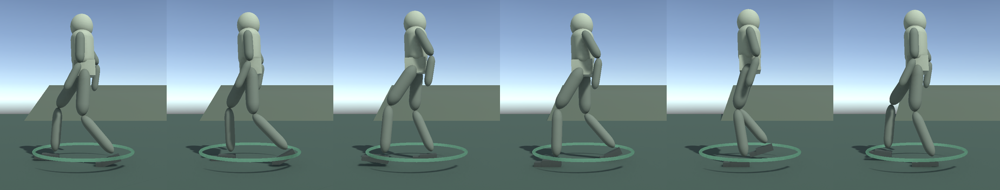
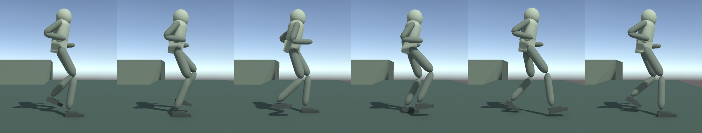
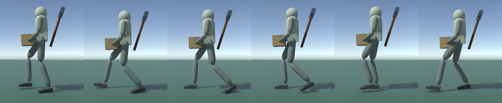
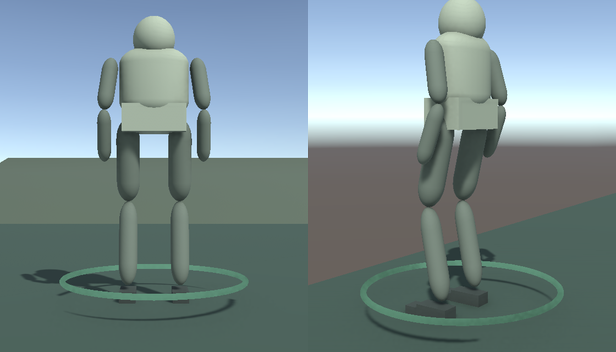

# Strength and Burden, checkpoint A — The grounded body playtest

**Status:** Ready for Luis's review, September 30, 2026. It is technically validated;
[Validation.md](Validation.md) has the exact results. Checkpoint B (the
effort-driven swing) and C (strength-resolved handling) wait for this review.
Plan: [NextMilestonePlan.md](NextMilestonePlan.md).

## The question

Does walking now look grounded and deliberate rather than goofy? Specifically:

- a believable stride instead of shuffling;
- heel strike, roll and push-off;
- weight moving over each foot;
- arms swinging against the legs;
- a jog at higher speeds.

This checkpoint changes locomotion only. **The pickaxe swing is unchanged.** It
still reads as the old canned animation and can still clip the body. Checkpoint B
replaces it.

## What changed

- **Pace (decision D2).** The worker's default speed is now a natural walk of
  1.8 m/s instead of 3.2 m/s. That is the same pace as the Living Body "measured"
  walker you judged okay on September 24. Movement % still scales it: 25% is
  0.45 m/s and 200% is 3.6 m/s. The whole economy therefore runs slower, and
  trips to the supplies and the mineral take longer.
- **Gait from the body.** Stride length and cadence follow from hip height and
  actual speed. At the default pace that is about two steps per second with a
  stride of about 1.85 m; the old code took roughly five short steps per second.
- **Walk and jog.** Above the walk–run threshold for this body (about 2.8 m/s,
  so Movement % above roughly 150%) the worker jogs. A jog has a short flight
  phase (about 0.08 s), bent pumping arms and a slight forward lean. A walk
  always keeps a foot on the ground.
- **Feet.** Each foot is now a heel-to-ball block plus a toe. Feet land heel
  first, roll flat and push off from the ball while the toe stays planted.
- **Hips, torso and head.**
  - The pelvis shifts over the stance foot, rotates with the forward leg and
    dips slightly on the swing side.
  - The chest counter-rotates.
  - The head stays level and looks along the path.
- **Arms.** Free arms hang nearly straight and swing like pendulums from the
  shoulder. They swing less while the hands hold the pickaxe or a load.
- **Standing.** When the worker stops, it finishes its step and then makes
  small adjustment steps until the feet sit beneath the body. It does the same
  when turning in place.

Navigation still decides where the worker goes. The body only presents that
movement. Nothing here is an active ragdoll (decision D1).

## How to look at it

1. **Comparison scene.** Open `Assets/_WonderGather/Scenes/TheLivingBody.unity`
   and press Play. Use its route buttons (or select and right-click) to watch the
   1.8 m/s and 2.5 m/s walkers on flat ground and on the ramp. Zoom in close with
   F, then pull out to RTS height.
2. **The worker in the faction map.** Open `TheFactionCreator.unity`, choose
   **Playtest equipment →** (with a pickaxe) or **Playtest faction →**. Send a
   worker to the mineral or supplies and watch it:
   - leave;
   - turn around with its load;
   - walk home carrying the bundle.
3. **Speed range.** In the creator, set the worker's movement to 25%, 100%,
   150% and 200% and compare. 200% should be a jog, not a frantic walk.
4. **Standalone build.** `Builds/WindowsGroundedBody/WonderGather.exe` contains
   the creator and both maps.

## What Luis is judging

- Do the feet still look goofy anywhere, close up or from RTS height?
- Is the default walking pace right for the game? Is 1.8 m/s too slow for the
  economy, or does it help the "slowness is attention" feeling?
- Does the jog read as a jog, and is 200% the right place for it?
- Is the torso and arm motion natural or overdone (sway, twist, arm swing)?
- Do starting, stopping and turning look deliberate?

Useful feedback names the scene, the speed and the moment: starting, turning,
stopping, walking with the bundle, jogging, or on the ramp.

## Known limits of this checkpoint

- **Swing unchanged.** The swing, its clipping and the pickaxe's rest pose are
  unchanged until Checkpoint B. The back-stow is still the provisional
  interpolation.
- **No mass yet.** Loads do not yet change gait, lean or speed. Checkpoint C
  adds mass and strength.
- **Primitive shapes.** The body is still made of primitive segments, and the
  heel/toe feet are new shapes on the same rig.
- **Terrain.** Only flat ground and the existing gentle ramp are covered.
  Stairs, steep slopes, rough terrain and crowds of walkers have not been
  tested for gait quality.
- **Tuning is provisional.** Stride, cadence, sway, twist and clearance values
  are first choices from biomechanics rules of thumb.
- **Measurements.** The figures above come from automated tests in
  TheLivingBody. Rendered frames were reviewed as still images, not as video.

## Rendered reference

Captured from the automated probe, side view, one stride each:

