# S1b/S1c — The Ordinary Place: the Visual Soul in engine

**Built:** October 1, 2026, on branch `claude/worker-showcase`.
**Plan:** [NextMilestonePlan.md](NextMilestonePlan.md), S1b and S1c.
**Direction:** [VisualSoul.md](VisualSoul.md), Luis's handoff of October 1.
**Build:** `Builds/WindowsOrdinaryPlace/WonderGather.exe`, a release build that
opens straight into the place.

The handoff asks to "start with one ordinary place": a small house,
grassland, path and worker in the existing prototype, by night and by day. It
leaves the rendering technique open until real captures and runtime costs can
be compared. This is that first in-engine test.

It is a first pass, not a finished look. It shows how far a real-time
painted light can carry the references, and where the gaps still are.

## What is in the place

- **The lit house.**
  - Built in Blender from a reproducible script
    ([`Art/Blender/OrdinaryPlace/house.py`](../Art/Blender/OrdinaryPlace/house.py)).
  - Leaning plaster walls and a timber frame, a hand-laid shingle roof and a
    stone chimney.
  - Deep window reveals, an open door onto a small warm room with a red
    curtain, doorstep stones, a bench, potted plants, a firewood lean-to, a
    fence and a lantern.
  - Warm window, door and lantern lights spill onto the walls, the path and
    the grass at night.
  - Chimney smoke drifts downwind.
- **The grassland.**
  - About 480,000 GPU-instanced blades, dark blue-green at the root and warm
    at the tip, plus taller seed heads.
  - Moved by gusting wind, and parted around the worker's feet.
  - Nearby grass is full density; distant grass thins smoothly.
- **The land.**
  - A gentle meadow with a worn path to the door.
  - Trees, bushes and boulders
    ([`nature.py`](../Art/Blender/OrdinaryPlace/nature.py)), and hills that rise
    into distant ranges for aerial depth.
  - The land is rebuilt from one height field whenever the scene loads, so
    the grass, the path and the ground always agree.
- **The sky and the day.**
  - A painted sky with soft cloud masses lit in bands, a dusk band, stars, a
    faint galactic band and a crescent moon.
  - One time-of-day palette drives the sun or moon, the sky, ambient and
    shade colours, the fog, and the house lights. Its keys follow C's
    daylight, golden hour, E's lilac dusk and A's night.
- **The worker.**
  - Today's procedural body, dressed provisionally in a dark coat with dark
    hair and a rust scarf.
  - It walks the path under your orders.
  - The real character model is S1d. The costume is still open.

## Controls

Both camera modes from S1a work here (see
[TwoCamerasPlaytest.md](TwoCamerasPlaytest.md)). `V` switches to Explore,
which is the best way to judge the look up close.

| Key | Look test |
|---|---|
| P | Next rendering candidate (A–E) |
| 1–6 | Morning, midday, golden hour, dusk, blue hour, night |
| [ / ] | Scrub the time of day |
| L | Time-lapse: the day passes at 30 in-game minutes per second |
| H | Hide or show the look-test panel (it shows the frame time) |

## The rendering candidates (S1c)

All five use the same models and light. They differ in how the image is made:

| | Candidate | What it adds |
|---|---|---|
| A | Baseline | Plain light, for comparison only |
| B | **Painted light** | **Light edge.** A soft edge between light and shade, broken by brush marks tied to each surface. **Shade.** Cool, coloured shade instead of grey. **Variation.** Hue and value drift across every material. **Local light.** Warm pools from local lights, a cool rim, aerial fog and a light paper grain |
| C | B + paint filter | A screen-space filter that turns fine detail into flat strokes while keeping edges |
| D | B + ink contours | Loose, wobbling dark lines at silhouettes and creases. They fade with distance and never touch the grass |
| E | B + filter + ink | Both |

**Night.** Candidates A–E, left to right:

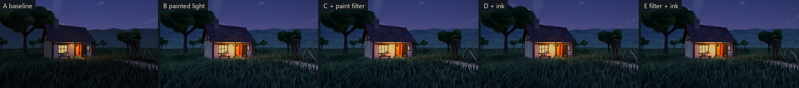

**Day.** Candidates A–E, left to right:

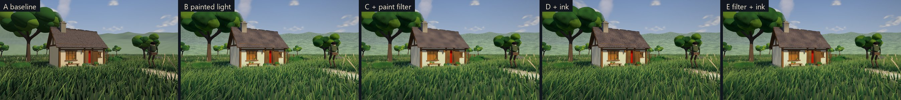

**The worker at dusk.** Candidates A–E:

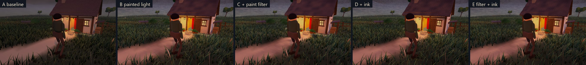

## Next to the references

Each reference image is shown beside the matched in-engine capture (candidate
B unless noted).

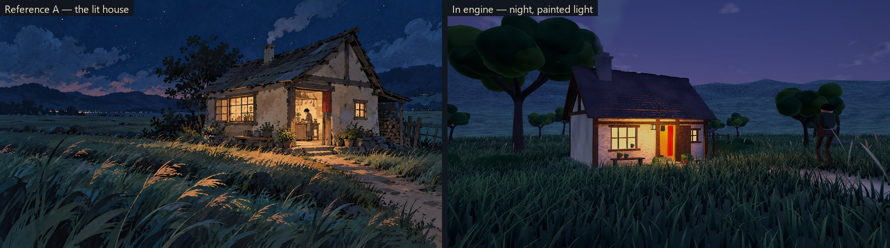
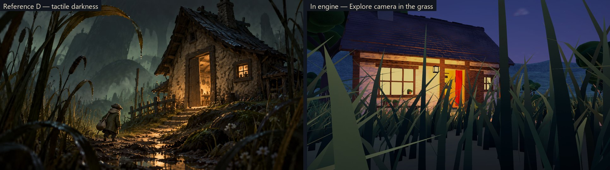
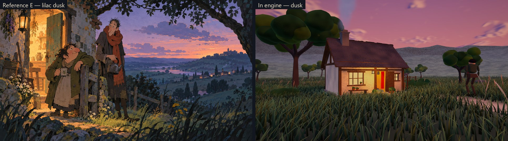
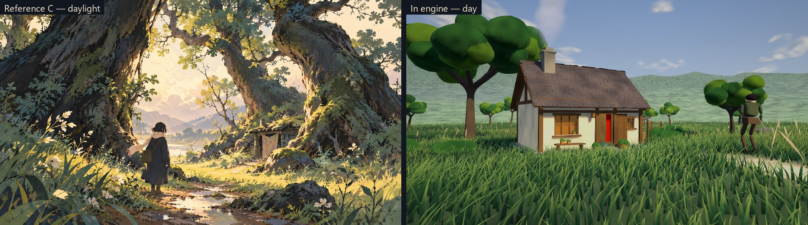
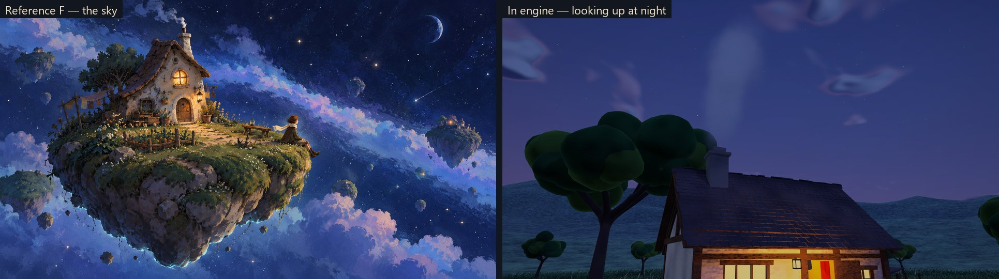
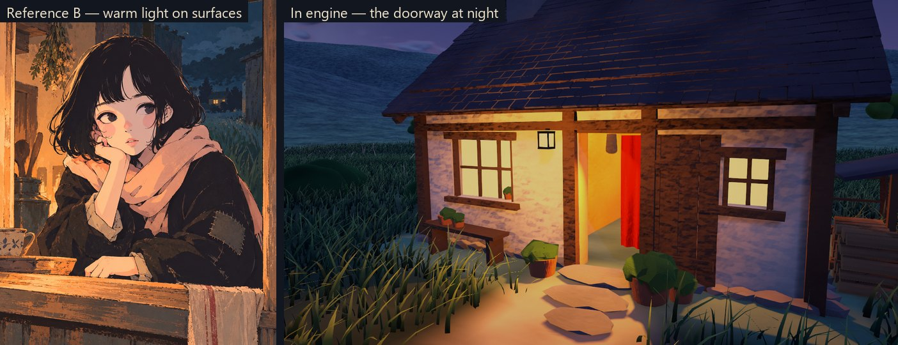

More views:

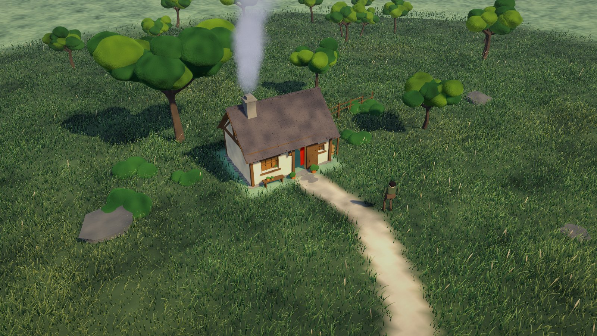
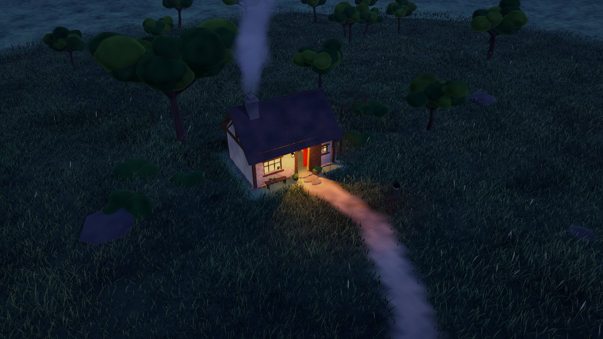
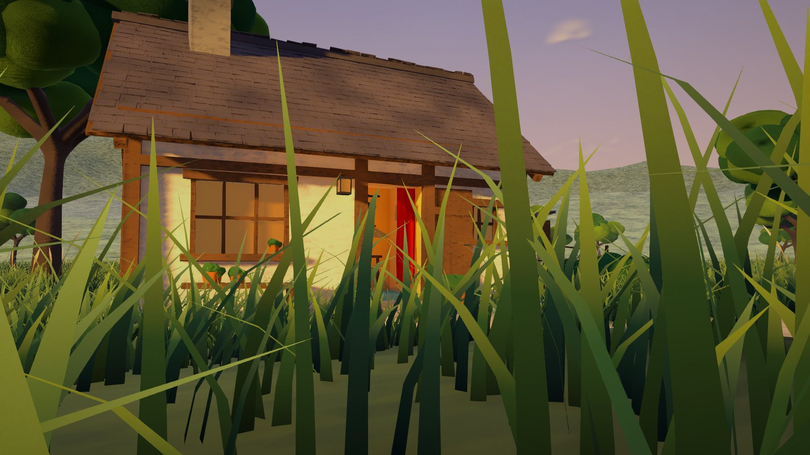
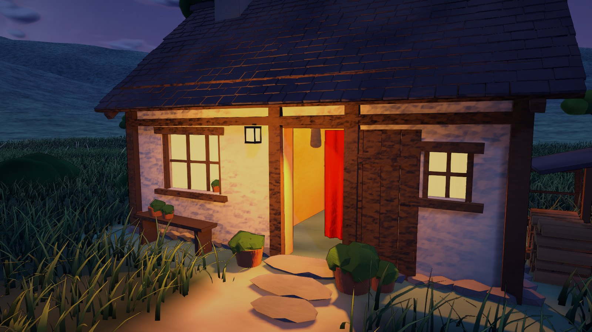
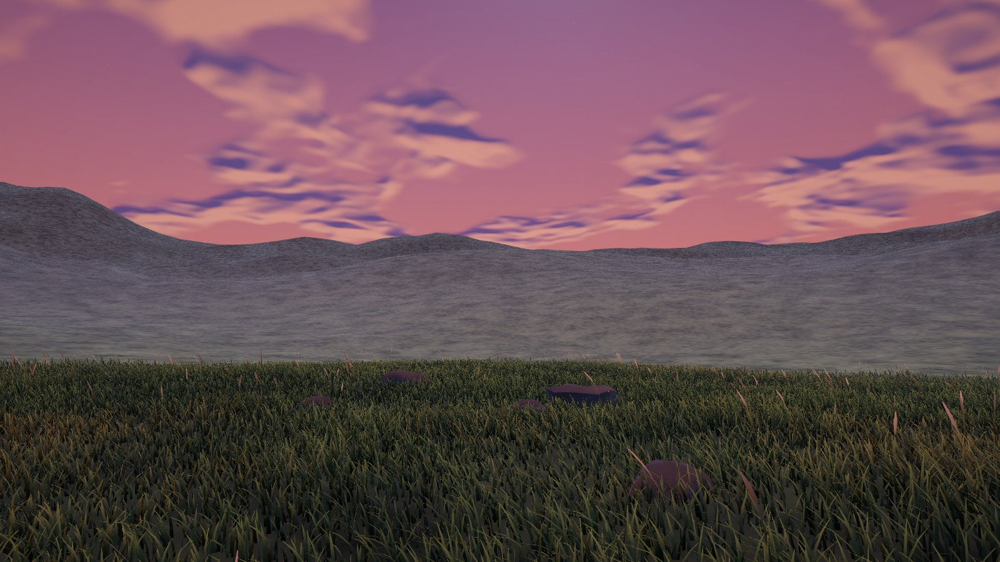

## What already carries over, and what does not yet

**Carries over:**

- **Light leads (A, D).** Warm windows, door and lantern pool light on the
  plaster, the doorstep, the path and the grass tips. The world around stays
  deep blue-green.
- **Ordinary moments (A).** The lit house in a dark meadow, with smoke rising,
  already reads as the reference's scene.
- **Time of day.** Night, dusk, golden hour and day share one place and change
  smoothly.
- **Close observation.** From the Explore camera, the grass becomes a
  foreground layer framing the house, as in D.

**Not yet:**

- **Painterly surface.** The references are paintings with brush marks
  everywhere. In engine the brushwork is still subtle, and the image reads as
  clean stylized 3D more than paint.
  - The paint filter (C) adds some abstraction but can look like a
    photo-filter.
  - Ink (D) adds a drawn edge.
  - The strongest next step would be hand-painted texture on each material,
    painted in Blender rather than generated.
- **Characters (B, E).** The worker is still the primitive test body. B and E
  are about expressive faces, posture and costume, which is S1d's job.
- **Grass as painted strokes.** The blades are individual geometry. A paints
  grass as flowing strokes with bright highlight strokes. Wider, curved
  blades and painted highlight colours would bring it closer.
- **Scale and strangeness (C, D, F).** The place is modest and ordinary.
  Giant trees, looming reeds and an impossible world are not attempted yet
  (setting and architecture remain open).
- **The far land.** It is simple hills under fog. A and E have layered,
  painted distances, lights in far villages and a valley.

## Runtime cost

Release build at 1920×1080 on this computer (NVIDIA RTX 4060 Laptop GPU,
Intel i9-14900HX). Each view was held for 2 s per candidate after a 1 s
settle. GPU time is from Unity's frame timing:

| Candidate | GPU ms (range over views, night and day) | Slowest 5% of frames (CPU ms) |
|---|---|---|
| A baseline | 3.2 – 4.1 | ≤ 5.0 |
| B painted light | 3.4 – 4.4 | ≤ 5.2 |
| C + paint filter | 4.4 – 5.2 | ≤ 5.9 |
| D + ink | 3.5 – 4.6 | ≤ 5.3 |
| E + both | 4.6 – 5.4 | ≤ 6.4 |

**How to read these numbers:**

- All candidates run at about 180–300 fps here, far inside a 60 fps budget.
- The painted light costs about 0.3 ms over plain light, the paint filter
  about 1 ms, and ink about 0.1 ms.
- The 481,213 grass blades, thinned with distance, are drawn in every
  candidate.
- Representative showcase density is assumed here: one worker, one house and
  this meadow. A crowded civilization map is not measured.

Run `WonderGather.exe -wgbenchmark` to repeat the measurement. It writes
`ordinary-place-benchmark.csv` beside the player log, then quits.

## What to judge (for Luis)

1. **The direction.** Does the place feel like the beginning of the Visual
   Soul? What is closest, and what is furthest?
2. **The rendering approach (V1).**
   - Which candidate (B, C, D or E) feels most like the artistic language you
     imagine?
   - Or which parts of each would you mix?
   - Or should the next step be hand-painted textures rather than screen
     effects?
3. **Times of day.** Which times feel right, and which don't?
4. **The Explore camera.** Get close to the plaster, the grass and the worker,
   and look up at the sky.
5. **Moving.** Order the worker along the path at night and watch the light
   on the grass.

## Evidence and limits

**Tests: `OrdinaryPlaceTests` (5 new).**

- The scene loads whole: the house, more than 200,000 grass blades, the
  worker, the lights and the smoke.
- The worker walks from the path to the doorstep on the baked navigation.
- The Explore camera can look into the open door and windows but cannot enter
  the house.
- Night lights the house and day rests it.
- Every candidate runs without errors.

The full PlayMode suite and the matched captures are recorded in
[Validation.md](Validation.md).

**Not tested:**

- whether the paint and ink passes look the same on GPUs other than this one;
- AMD/Intel graphics, and any OS other than Windows;
- long play sessions;
- interactive play in the open Editor.

The captures are stills. Motion (wind in the grass, smoke, the walking
worker and changing light) has not been reviewed in recorded footage, so
please judge it in the build.
