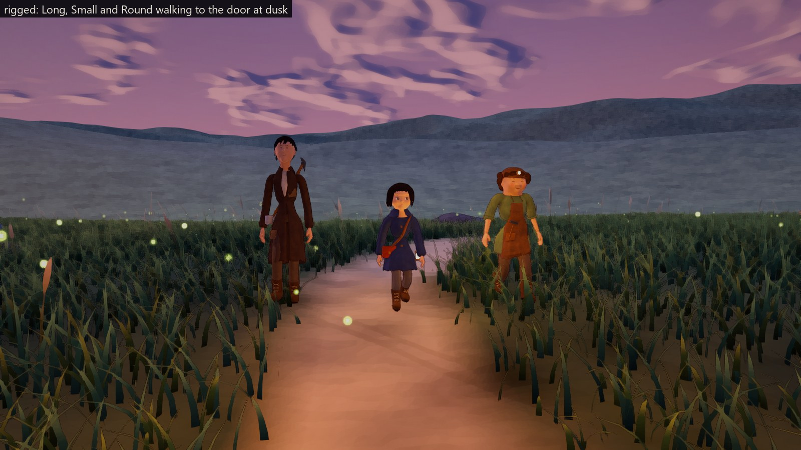
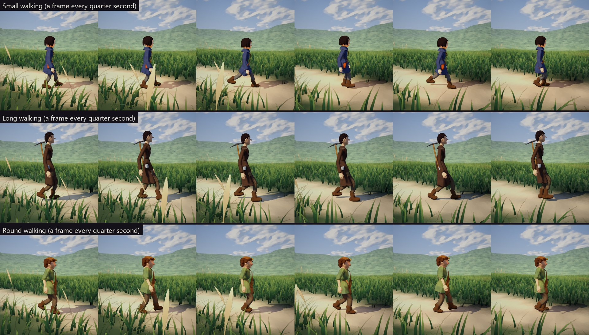
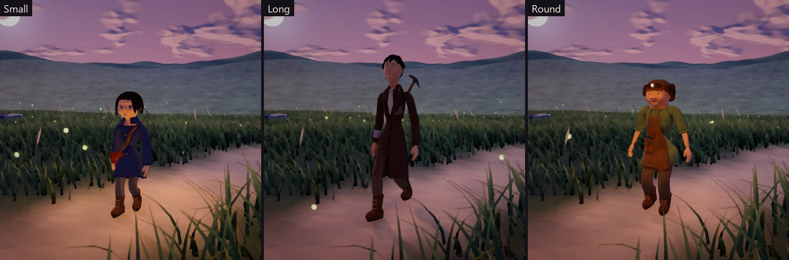
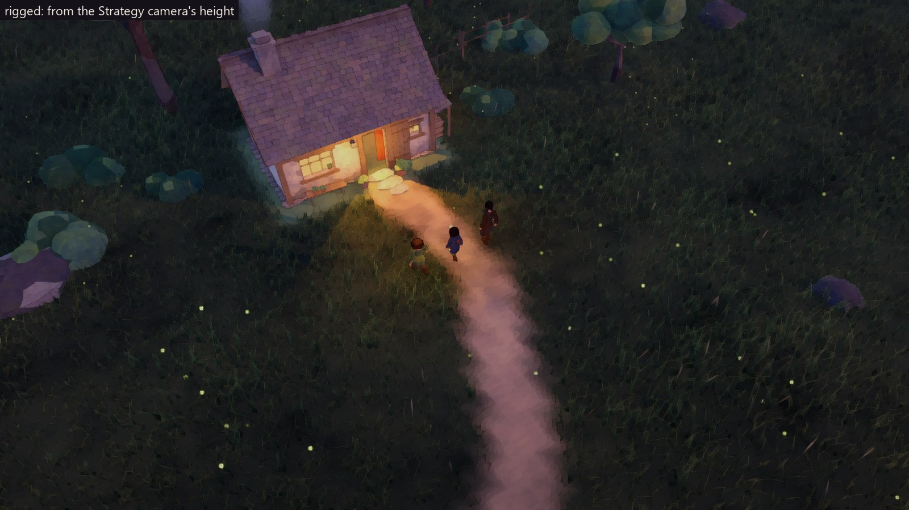

# S1d — The miners in the game: choose one, walk the meadow

**Built:** October 3, 2026, on branch `claude/worker-showcase`.
**Asked by Luis:** after the polish, "start the rigging process and making
them light enough to run well on the rts", and offer all three as choices in
this prototype ([correspondence](../Correspondence/2026-10-03_THE_MINERS_FEEDBACK.md)).
**The models:** [TheMiners.md](../ArtDirection/TheMiners.md).
**Build:** `Builds/WindowsOrdinaryPlace/WonderGather.exe`. It opens in the
Ordinary Place with the choice of miner.

## What to try

1. **Choose your miner.** The choice opens when the place loads:
   - **Small:** young and curious, a lantern at the belt.
   - **Long:** tall and unhurried, a pickaxe on the back.
   - **Round:** sturdy and laughing, a lamp on the cap.

   Pick one. `M` opens the choice again at any time. The new miner takes the
   last one's place, and the selection if the last one was selected. The
   last choice is remembered for next time.
2. **Walk.** Select the miner and right-click the ground, as before. The
   procedural body now walks the modelled body:
   - **Feet** plant and roll heel to toe.
   - **Hips** sway.
   - **Arms** swing against the legs.
   - **The head** looks along the path.
   - **Clothes:** coats, smocks and the apron follow the thighs; boots follow
     the feet.
3. **Look closely and from afar.**
   - **Up close.** `V` switches to Explore for a close look.
   - **Levels of detail.** The models change between three levels as the
     camera rises, so the Strategy camera's height is cheap.
4. **Dusk and night** (keys `4` and `6`): Small's lantern and Round's cap lamp
   glow, and light whoever carries them.

## After Luis's play (October 3, evening)

- **Small.** The lantern is carried in the left hand and swings. The satchel
  sits on the right hip, properly hung from its strap. Legs line up with the
  boots, and the neck rises cleanly into a closed collar.
- **All three.** These were polished on a close audit; see
  [TheMiners.md](../ArtDirection/TheMiners.md#polish-after-luiss-play-october-3-evening)
  and the practices in
  [CharacterPractices.md](../ArtDirection/CharacterPractices.md).
- **Natural walks** replace the one shared pace:

  | Miner | Pace | The walk |
  |---|---|---|
  | Small | 1.27 m/s | brisk, quick, bouncy |
  | Long | 1.38 m/s | long, smooth, unhurried strides |
  | Round | 1.28 m/s | rolling, side to side |

## What changed for the game

- **Carried things are carried.**
  - Small carries the lantern in the left hand (until October 3 evening, it
    hung at the hip with nothing holding it).
  - Long carries the mug in the left hand, with the pickaxe slung on the back
    on a strap across the chest.
  - Round's hands are free; the apron's hammer stays in its pocket.
- **Each walks at its own pace** (see above). Until October 3 evening, all
  three walked at 1.3 m/s.
- **Arms** hang close to the body and slightly bent, just clearing each
  one's clothes. Round's are a little wider, around a round body.

## What it costs

A release build at 1920×1080 on the RTX 4060 Laptop, by day, with every
miner walking between random places in the meadow:

| Miners walking | Strategy view, frame ms (p95) | Close view, frame ms (p95) |
|---|---|---|
| 0 | 4.9 (5.9) | 4.7 (5.1) |
| 25 | 5.7 (7.1) | 5.2 (5.4) |
| 50 | 6.0 (8.4) | 5.6 (5.9) |
| 100 | 7.0 (9.2) | 6.2 (7.3) |

A hundred miners add about 2 ms: about 0.02 ms each.

- **Levels of detail:** about 18,000, 5,000 and 1,600 triangles per miner.
- **Materials:** one painted material and one texture (2048²) each, plus
  the outline on the nearer two levels.
- **Bones:** 19.

The benchmark is in the build: run it with `-wgcrowd`. It writes
`miner-crowd-benchmark.csv` beside the player log.

## What to judge

- **Do they feel alive walking,** or still stiff? The body was tuned on the
  2.2 m test figure; its gait now scales to each miner, but it has not been
  re-tuned by eye for them.
- **The choice.** Does the picker feel right as a first step towards the
  creator?
- **Up close in motion.** Look at shoulders, hips and knees: skinning stretches
  the cloth at the joints.
- **The walks.** Do they feel natural to each body? (Luis asked for that on
  October 3.)

## Not yet

- **Mining.** The miners walk in the Ordinary Place. Mining and hauling with a
  pickaxe (the equipment scene) still use the 2.2 m test body; the tool's
  grips are sized for it.
- **Fixed hands and faces.** Hands keep one relaxed shape, and faces one
  expression.
- **Not watched by eye.** Turning on the spot and jogging were not checked
  this way.
- **Other hardware.** Only the RTX 4060 Laptop was tried.

See [Validation.md](../Validation.md) for the tests and evidence.
