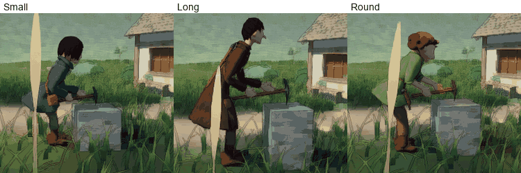

# S1d — The miners in the game: choose one, walk the meadow

**Built:** October 3, 2026, on branch `claude/worker-showcase`.
**Asked by Luis:** after the polish, "start the rigging process and making
them light enough to run well on the rts", and offer all three as choices in
this prototype ([correspondence](../Correspondence/2026-10-03_THE_MINERS_FEEDBACK.md)).
**The models:** [TheMiners.md](../ArtDirection/TheMiners.md).
**Build:** `Builds/WindowsOrdinaryPlace/WonderGather.exe`. It opens in the
Ordinary Place with the choice of miner.

## What to try

1. **Choose your miner.** The choice opens when the place loads:
   - **Small:** young and curious, a lantern at the hip (in the hand
     until October 6).
   - **Long:** tall and unhurried, a pickaxe on the back.
   - **Round:** sturdy and laughing, a lamp on the cap.

   Pick one. `M` opens the choice again at any time. The new miner takes the
   last one's place, and the selection if the last one was selected. The
   last choice is remembered for next time.
2. **Walk.** Select the miner and right-click the ground, as before. The
   procedural body now walks the modelled body:
   - **Feet** plant and roll heel to toe.
   - **Hips** sway.
   - **Arms** swing against the legs.
   - **The head** looks along the path.
   - **Clothes:** coats, smocks and the apron follow the thighs; boots follow
     the feet.
3. **Look closely and from afar.**
   - **Up close.** `V` switches to Explore for a close look.
   - **Levels of detail.** The models change between three levels as the
     camera rises, so the Strategy camera's height is cheap.
4. **Dusk and night** (keys `4` and `6`): Small's lantern and Round's cap lamp
   glow, and light whoever carries them.

## After Luis's play (October 3, evening)

- **Small.** The lantern is carried in the left hand and swings. The satchel
  sits on the right hip, properly hung from its strap. Legs line up with the
  boots, and the neck rises cleanly into a closed collar.
- **All three.** These were polished on a close audit; see
  [TheMiners.md](../ArtDirection/TheMiners.md#polish-after-luiss-play-october-3-evening)
  and the practices in
  [CharacterPractices.md](../ArtDirection/CharacterPractices.md).
- **Natural walks** replace the one shared pace:

  | Miner | Pace | The walk |
  |---|---|---|
  | Small | 1.27 m/s | brisk, quick, bouncy |
  | Long | 1.38 m/s | long, smooth, unhurried strides |
  | Round | 1.28 m/s | rolling, side to side |

## After the method's first round (October 4)

Luis's five notes on Small, the principle that every object is a proper
object, and the [model quality method](../ArtDirection/ModelQualityMethod.md)
Luis asked for. The round's log, with before and after images, is in
[TheMiners.md](../ArtDirection/TheMiners.md#the-methods-first-round-october-3-and-4).

**Where to look, on Small** (`V` for Explore, then close in):

1. **The boots, from the side, at ground level.** The leg goes down into the
   boot. The laces lie on the leather, through eyelets, with a bow.
2. **The lantern, from behind and from below.** The hand is closed round a
   wooden handle; the lantern hangs from it and swings as Small walks, starts
   and stops. It never goes into the coat.
3. **The satchel.** Each end of the strap passes through a ring on the bag.
   The bag hangs from the strap, rests against the hip, and moves with the
   stride.
4. **The strap,** over the shoulder and across the buttons. Since October 5
   it lies as it did before the round (Luis preferred that): out on the
   shoulder, soft on the coat, below the collar.

**On Long and Round:**

- **Long's pickaxe** hangs in a sling on the back: a strap, two leather
  loops, the pick resting by its head.
- **Long's mug** hangs from the fingers by its handle, and swings.
- **Long's coat** hangs slim; its front goes with the knee, its back hangs
  until a leg reaches it.
- **Round's apron** hangs from a strap round the neck, is drawn in by ties
  knotted at the back, and carries a hammer in a leather loop.

**What to judge:**

- **Do the things read as objects now?** Held, hanging, swinging, stopped by
  the body.
- **Is the movement Luis liked still there** on Small: the coat's skirt, the
  lantern, the bag?
- **Long's coat in the walk:** calm enough, or too calm?
- **Sharp turns.** The boots now step round each other. For a frame, in the
  sharpest turn, a knee shows under the lifted hem: the walk's high step,
  left for Luis's word.

## A first look at the work (October 6)

> **Changed later on October 6.** `K` now shows the swing with real weight
> ([design](../Design/ThePhysicalBody.md#in-the-place-to-try-october-6)).
> What it showed before was the first swing: all three miners at the same
> instant, in 0.8 s, only the arm moving, nothing with weight
> ([clip](../Images/Miners/Work_Clip_Side.gif);
> [review](../Reviews/2026-10-06_SamePageReview.md#what-the-swing-is-today)).
> Luis's message of October 6 asked for real weight and real strength in
> its place, and that swing is no longer shown.

**To try** (run `Builds/WindowsOrdinaryPlace/WonderGather.exe`):
1. Choose a miner in the choice that opens (`M` opens it again) and walk
   it somewhere open and level.
2. Press `K`. It bows, a plain block stands before it, and it takes up the
   pickaxe made for it and works on the block. `K` again (or walking it
   away, or choosing another miner) puts the block and the pickaxe away.
3. Go close with the Explore camera, and round it.
4. `,` and `.` (the two keys right of `M`) make it weaker and stronger.
   `-` and `=` (the two keys right of `0`) make its pickaxe lighter and
   heavier (it takes it up afresh). A line at the foot of the
   screen says the strength, the weight, how spent it is and how fast the
   last blow landed.
5. Leave it working. After a while it tires: it stands up, rests with the
   pickaxe in one hand at its side, and goes on.
6. Send it somewhere while it works (a right click on the ground). It
   takes its pickaxe with it, in one hand at its side. `K` where it stops
   puts it to work again, on a block there.
7. **The interaction click.** Hold the space bar: the pickaxe and the
   miner show their names. Click the pickaxe and choose **Lay it down**:
   the miner squats, lays it on the ground and stands up. Walk it away.
   Hold Space, click the pickaxe on the ground and choose **Pick it up**:
   it goes back, goes down and takes it. On the miner itself, at work:
   **Rest**.
8. **The lantern and the mug.** Choose Small or Long, without `K`. Hold
   the space bar, click the lantern (or the mug) and choose **Take in
   hand**: the hand takes it off its hook and carries it at the side. Walk
   the miner about. Hold Space, click it again, and choose **Hang it
   back**. With it in the hand, press `K`: the miner hangs it back first,
   then takes up its pickaxe.
9. **A boulder.** Hold the space bar, click any boulder in the grass, and
   choose **Mine**. The miner goes to it with its pickaxe, takes the last
   steps to the rock's foot, and strikes it. Pieces break off and lie.
   Send it somewhere else to stop it. Try the three miners, and a low
   boulder and a big one. Long rests after a few blows, with the head of
   its pickaxe on the rock or the ground.
10. **A fall.** With `K`, make the miner as weak as it goes (`,` several
    times, to about 0.50) and its pickaxe as heavy as it goes (`=`
    several times, to x3.00). After twenty seconds or so of work its
    legs give way: it lets the pickaxe go, falls, lies, and gets up.
11. Make it weak and its pickaxe heavy (`,` and `=` a few times each) and
   send it somewhere again. When the pickaxe asks more than half of its
   hand's hold, it drags it by the end of the handle, bent over, and walks
   slower. The line at the foot of the screen says which.

**What to look at:**
- **Weight.** Does the pickaxe look as if it weighs something, going up and
  coming down?
- **Strength.** Weaker, or with a heavier pickaxe: the upper hand goes up
  the handle towards the head, the lift is slower, the blow lands softer.
  Stronger, or lighter: the other way. Is the difference enough to read,
  and does it read as strength?
- **Each body.** The three do not swing alike. Long's pickaxe is heavy for
  Long: its upper hand is right up at the head.
- **Tiring and resting.** Does the rest read as a rest?
- **Its feet.** It sets them apart before the first swing and brings them
  together to rest. With a much heavier pickaxe (`=` several times) it
  steps to keep its feet. Does it look steady, and never wobbly?
- **The hands on the handle,** sliding, letting go and taking hold again.
- **Walking with it.** Does the pickaxe look carried, with a weight of its
  own? Does the drag read as a body with a tool too heavy for it?
- **Laying down and picking up.** Does the body go down to the ground as
  a body would? Is the space bar the right key for the click?
- **The fall.** Does it fall like a body, and not like a doll? Does the
  getting up read? Is it rare enough? Should it cost the miner something?
- **At a boulder.** Does it stand where a miner would, and strike where
  one would? Do the pieces look and fall like stone? Should the boulder
  get smaller, and run out? Does Long's rest, with the pickaxe's head
  down, read as a rest?
- **The lantern and the mug in the hand.** Does the hand take the handle,
  and does the thing hang from it as it did when it was carried before?
  Should it be possible to set them down on the ground?

**What is not there:**
- **It is not mining.** Nothing is mined, the block is put where the miner
  stands, and with `K` the pickaxe appears in the hands from nowhere (it
  can be laid down and picked up since step 8). At a boulder (step 9)
  pieces break off, but the boulder stays whole and nothing is brought
  home. The panel in place of the keys (step 11) is still to come
  ([the plan](../NextMilestonePlan.md#steps)).
- **Setting the lantern or the mug down** on the ground, and a pickaxe in
  one hand with the lantern in the other.
- **Something that pushes a miner over.** The body keeps its own balance
  ([step 6](../Design/ThePhysicalBody.md#step-6-balance-october-7)), and
  since step 10 it can fall and get up
  ([clips](../Design/ThePhysicalBody.md#step-10-the-fall-and-getting-up-october-7)). But
  nothing in the build pulls or pushes a miner: a fall comes only from
  work far too heavy for it (the step above).
- **The pickaxe does not stop at the miner's own body,** nor at the
  lantern or the mug at the hip.

**At the ends of the keys** (all three miners, the look begun as the key
begins it, with their balance; measured again on October 7; nothing breaks
at any of them):

| Strength | Pickaxe | What is seen |
|---|---|---|
| 3 | 0.4 of its weight | Fast, easy swings. The blows land at 10 to 11 m/s (6 to 7 at ordinary strength with its own pickaxe), the hands stay at the end of the handle, the arms give 8 to 16% of what they have |
| 3 | 3 times its weight | Small and Round swing it much as an ordinary miner swings its own (5.9 and 6.5 to 6.9 m/s). **Long is thrown about by its own swing:** its upper hand is at the head, it steps to keep its feet, ends a step back from the block, and goes on swinging from there (5.1 m/s). Bringing itself back to its work is step 9 |
| 0.3 | 0.4 of its weight | A weak body. The upper hand is right at the head, the back gives all it has and hardly straightens, and the blows land at 4.0 to 5.7 m/s |
| 0.3 | 3 times its weight | **It cannot swing it, and what it then does is not designed yet.** Small and Round hold the head on the block and cannot raise it. Long's pickaxe slips off the block and hangs from its hands, where nothing stops it passing through its legs. What a body does with a tool too heavy for it (drag it, or leave it) is step 7 |

## What changed for the game

- **Carried things are carried.**
  - Small carries the lantern in the left hand (until October 3 evening, it
    hung at the hip with nothing holding it).
  - Long carries the mug in the left hand, with the pickaxe slung on the back
    on a strap across the chest.
  - Round's hands are free; the apron's hammer stays in its pocket.
- **Each walks at its own pace** (see above). Until October 3 evening, all
  three walked at 1.3 m/s.
- **Arms** hang close to the body and slightly bent, just clearing each
  one's clothes. Round's are a little wider, around a round body.

## What it costs

A release build at 1920×1080 on the RTX 4060 Laptop, by day, with every
miner walking between random places in the meadow:

| Miners walking | Strategy view, frame ms (p95) | Close view, frame ms (p95) |
|---|---|---|
| 0 | 4.8 (5.2) | 4.7 (5.1) |
| 25 | 5.5 (5.8) | 5.2 (5.4) |
| 50 | 5.9 (6.7) | 5.5 (6.0) |
| 100 | 6.9 (7.8) | 6.4 (7.1) |

A hundred miners add about 2.1 ms: about 0.02 ms each. (Measured again on October 4, with the hanging things and the skirts' flaps.)

**With the finger bones (measured October 6).** The computer was in use and
the game's window in the background, so every figure is higher than the
table above and the two are not comparable. The builds without and with the
finger bones were measured one after the other, twice each (means, the 95th
percentile in brackets):

| Miners walking | Without finger bones: strategy view | close view | With finger bones: strategy view | close view |
|---|---|---|---|---|
| 0 | 5.46 (6.64) | 5.22 (6.04) | 5.46 (6.79) | 5.19 (5.95) |
| 25 | 6.30 (8.81) | 5.85 (8.07) | 6.32 (8.98) | 5.83 (7.93) |
| 50 | 6.76 (9.34) | 6.64 (9.04) | 7.00 (9.51) | 6.61 (8.98) |
| 100 | 7.97 (10.00) | 7.70 (9.40) | 8.16 (10.00) | 7.72 (9.51) |

A hundred miners add about 2.5 ms without the finger bones and about 2.6 ms
with them: no more than two runs of the same build differ by.

- **Levels of detail:** about 18,300 (Small, Long) or 19,600 (Round), then
  5,000 and 1,600 triangles per miner. A hand that closes keeps 1,600
  triangles at the nearest level.
- **Materials:** one painted material and one texture (2048²) each, plus
  the outline on the nearer two levels.
- **Bones:** 40 for Small, 39 for Long, 54 for Round: the body's 19, one for
  each hanging thing, four for the skirt's flaps, and fifteen for each hand
  that closes.

The benchmark is in the build: run it with `-wgcrowd`. It writes
`miner-crowd-benchmark.csv` beside the player log.

## What to judge

- **Do they feel alive walking,** or still stiff? The body was tuned on the
  2.2 m test figure; its gait now scales to each miner, but it has not been
  re-tuned by eye for them.
- **The choice.** Does the picker feel right as a first step towards the
  creator?
- **Up close in motion.** Look at shoulders, hips and knees: skinning stretches
  the cloth at the joints.
- **The walks.** Do they feel natural to each body? (Luis asked for that on
  October 3.)

## Not yet

- **Mining as part of the game.** The miners can be watched working on a
  block with `K` (October 6, [above](#a-first-look-at-the-work-october-6)).
  A boulder to mine, walking up to it, taking up the pickaxe and hauling
  are not built: they are the later steps of S3 and S4
  ([the plan](../NextMilestonePlan.md#steps)). The equipment scene still
  uses the 2.2 m test body and the first swing.
- **Faces.** One expression each. The hands that carry something keep one
  closed shape.
- **Not watched by eye.** Turning on the spot and jogging were not checked
  this way.
- **Other hardware.** Only the RTX 4060 Laptop was tried.
- **Extreme poses.** The models were checked on the game's own movement
  (standing, walking, a sharp turn, stopping), not yet on a deep knee bend or
  raised arms.

See [Validation.md](../Validation.md) for the tests and evidence.
