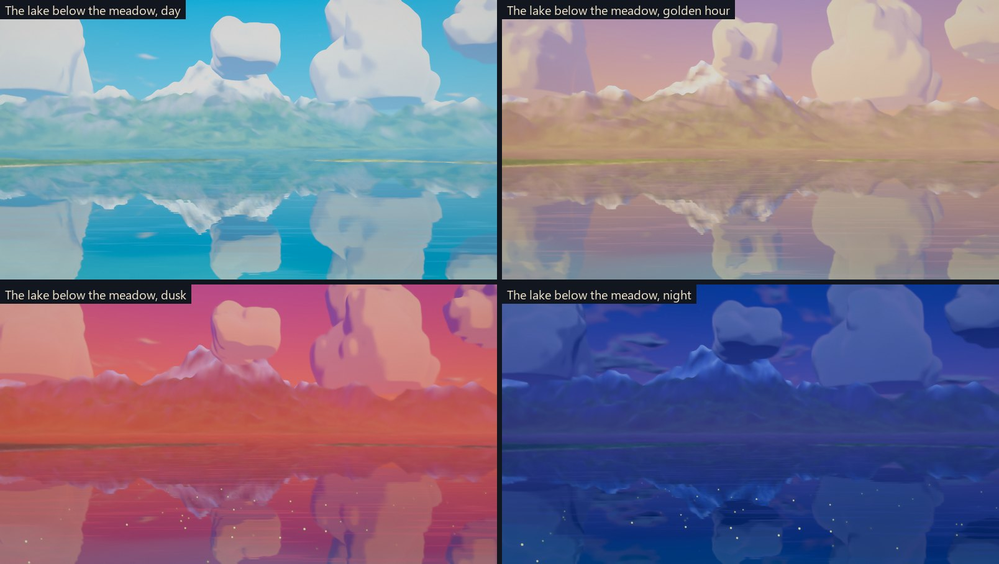
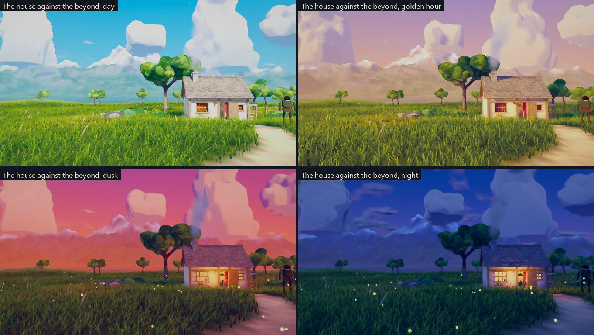
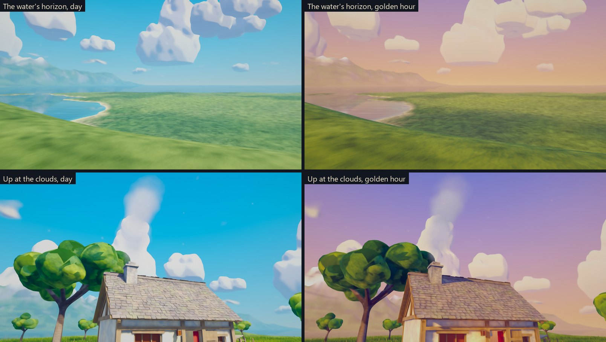
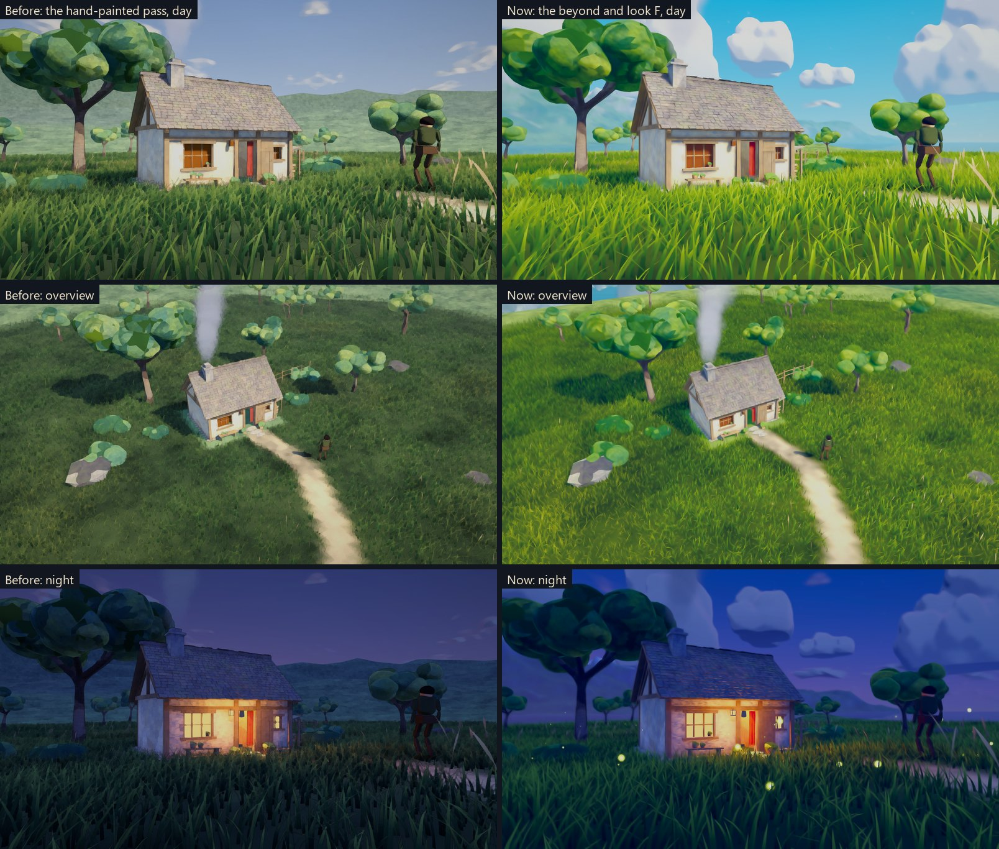
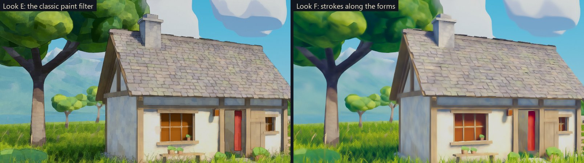
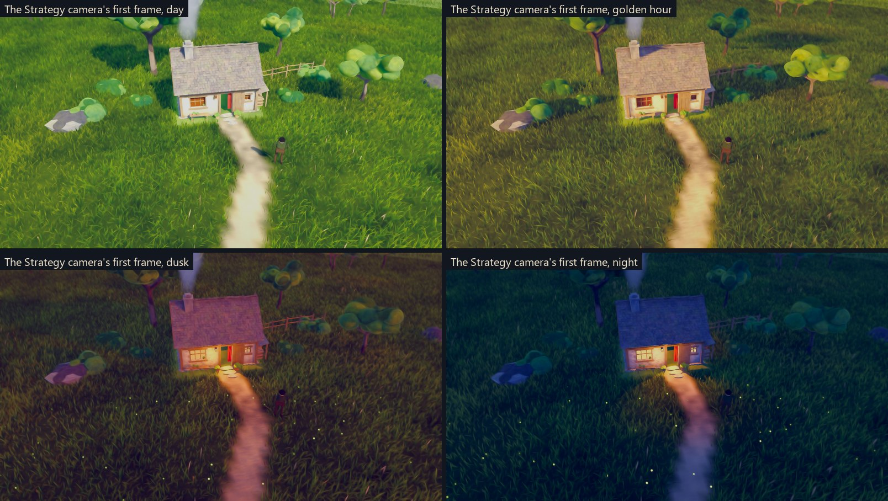

# The essence beyond the surface: playtest (S1e, first iteration)

> **Not adopted.** After seeing these captures, Luis preferred the
> hand-painted pass ("the before"). This guide is kept as the record of the
> experiment.
> - **The code** is on the branch `claude/essence-exploration`, not on
>   `claude/worker-showcase`.
> - **The reading of why** is in
>   [TheEssence.md](../ArtDirection/TheEssence.md#luiss-verdict-and-what-his-favourite-frame-teaches).

**Built:** October 2, 2026, in an isolated worktree, on the
`claude/essence-exploration` branch.
**Asks:** Luis's message of October 2, which wanted the breathtaking,
out-of-this-world emotion and not just the visual. His two follow-ups ask that
every frame be a painting driven by light, and that the style be unique to
Wonder Gather
([correspondence](../Correspondence/2026-10-02_THE_ESSENCE_BEYOND_THE_SURFACE.md)).
**The thinking behind it:** [TheEssence.md](../ArtDirection/TheEssence.md).

## What to run

- **The build.** Check out `claude/essence-exploration`, run
  `OrdinaryPlaceSetup.BuildWindows -buildOut WindowsTheEssence`, then
  `Builds/WindowsTheEssence/WonderGather.exe`.
- **In the editor.** On that branch, open `TheOrdinaryPlace` and press Play.
- **The preferred build.** The hand-painted pass, Luis's preferred base, stays
  in `Builds/WindowsOrdinaryPlace`.

The scene **opens on the lake below the meadow**, in the Explore camera.
**V** switches to the Strategy camera and back.

| Key | What it does |
|---|---|
| 7, 8, 9, 0 | Viewpoints: the lake below the meadow, the house against the beyond, the water's horizon, up at the clouds |
| 1–6 | Time: morning, midday, golden hour, dusk, blue hour, night |
| [ and ] | Scrub the time; **L** runs a time-lapse |
| P, O | Next and previous look. The scene opens on **F**; **O** steps back to **E** (your favourite until now) |
| H | Hide the panel |

## What changed

### The world beyond the meadow

- **The land.** The meadow now ends on a bluff. The land falls away to a
  still lake below, which opens east to a water horizon. Beyond the lake rise
  low ridges, then far ranges and one great snow peak.
- **The playable meadow is exactly as it was:** the same ground, path, house
  and navigation. A test checks this.
- **The sky.** Monumental cumulus modelled in Blender stand on the horizon,
  heap in the middle distance and lie in long banks. They are painted by
  their own shader:
  - warm crowns and lilac-grey bellies;
  - folds in shadow;
  - a silver lining towards the sun.

  They drift slowly with the wind, forming and dissolving at the edge of the
  sky.
- **The water** mirrors the clouds and mountains (a real reflection). Slow
  ripples break the mirror into painted horizontal streaks, and wind-ruffled
  patches drift across it. The shallows are turquoise, with a light shoreline.
- **The air.** Each farther layer takes more of the sky's own colour, thicker
  low over the water and thinner over the peaks.
- **Cloud shadows** drift across the land by day.
- **The day's palette.** Daylight is now luminous:
  - a cerulean sky over a pale cyan horizon;
  - yellow-green grass;
  - white clouds;
  - bright, coloured shade.

  Golden hour runs from lilac to peach instead of grey.

### Look F: the painting

Look F is the first step towards Wonder Gather's own language:

- **The painting pass.** Every pixel is painted with strokes laid along the
  forms it belongs to (an anisotropic Kuwahara filter). The strokes are broader
  with distance and finest where the eye lands. E's classic filter painted in
  square patches.
- **Painted world, drawn people.** Ink falls only on characters: the land,
  trees and house stay paint. In the full game this would also make units
  read instantly on the land.
- **The hour's palette.** Each time of day has a painter's choice of shade hue
  and light hue. Shadows stay saturated in their own colour and never go grey.
- **The air is alive.** Seeds and pollen catch the sun when you look towards
  it, and fireflies blink over the meadow at dusk and night.

## What it looks like

## Measured

**Colour against Luis's seven references.** Daylight captures, with the
method of [TheEssence.md](../ArtDirection/TheEssence.md#2-measurements):

| | Before (hand-painted pass) | Now (look F) | Luis's references |
|---|---|---|---|
| Green hue | about 100° | 83–87° | 61–96° (mostly 72–76°) |
| Green brightness | 0.33–0.35 | 0.52–0.54 | 0.49–0.77 |
| Sky and water hue | 215° | 194–195° | 189–200° |
| Sky and water saturation | 0.29 | 0.43–0.50 | 0.39–0.57 |
| Sky and water share, ground views | 21% | 26–32% (69% at the lake viewpoint) | 23–53% |
| Median luminance | 0.31–0.46 | 0.58–0.65 | 0.45–0.65 |

**Frame cost.** GPU time at 1920×1080, release build, RTX 4060 Laptop:

| View | E before the beyond | E now | F now |
|---|---|---|---|
| Overview | 4.5–5.5 | 7.4–7.5 | 7.7–7.8 |
| Path | 4.5–5.5 | 6.5–6.8 | 7.5–7.8 |
| Grass | 4.5–5.5 | 5.8–6.6 | 6.7–7.0 |
| The lake below the meadow | — | 4.6–4.7 | 5.9–6.2 |
| Strategy | — | 7.2–7.5 | 7.7–7.9 |

**What this means:**
- **The beyond** (reflections, clouds, far land) adds about 1.5–2 ms.
- **The painting pass** adds 0.5–1.4 ms over E's filter. The first version
  added about 5 ms; sampling wide strokes every other pixel brought it down.
- **Headroom.** At about 8 ms the frame still leaves half of a 60 fps budget
  for units.

## Questions for Luis

1. **The beyond.** Does the lake, the sky and the far world bring you closer to
   the breathtaking feeling? Which viewpoint and hour come closest?
2. **E or F.** Does look F's painting (strokes along the forms, ink only on
   people, the hour's palette) feel more like your world than E?
3. **The signature.** In [TheEssence.md](../ArtDirection/TheEssence.md#4-wonder-gathers-own-language),
   which of the seven proposed devices feel like Wonder Gather? In particular:
   - should the horizon curve like the edge of a small world, with the night
     opening into a deep painted cosmos (after F)?
   - should flowers and reeds loom near the ground?
4. **What is still not the dream?** Name any frame that still looks like a 3D
   render rather than a painting.

## Known gaps (next iterations)

- **Trees and far land.** The trees are still faceted blobs, and distant
  slopes still show facets.
- **Clouds.** They read as sculpted forms rather than brushed paint.
- **The night sky.** It is a brighter royal blue than reference A's deep
  navy.
- **Golden hour.** The far air is a little hazy.
- **The meadow beyond the grass.** The ground there is a flat field with no
  painted texture.
- **Not built yet:** flowers, a stream, visible gusts and the glow of lamplight
  (iteration 3).
- **The Strategy camera** sees no sky or water from its usual height. Cloud
  shadows are its only sign of the sky so far.
- **The worker** is still the placeholder body (S1d).

## Not tested

- **The viewpoints in motion.** The composed viewpoints were checked in
  captures and tests, not by flying through them in a build by hand.
- **Other hardware.** Frame cost was measured only on this laptop's GPU,
  without many units.
- **The water.** Reflections were checked in captures, not across every
  camera height.
