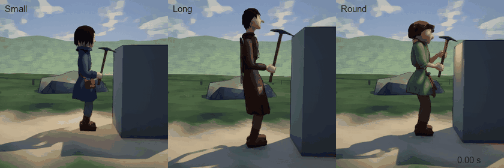

# Are we on the same page? — a review of the whole project

**Written:** October 6, 2026, by Claude, at Luis's request
([the message](../Correspondence/2026-10-06_REAL_WEIGHT_REAL_STRENGTH_AND_THE_CREATOR.md)):
"Please do a big review research of everything for the project so far for me
to see if we're on the same page as me", and "do a deep dive research into
… how usually characters would swing a pickaxe … and how we can do that".

**What was read for it:** every message of Luis's kept under
[Correspondence](../Correspondence/); the vision, the roadmap and the plans;
the 51 commits of the repository; the game's code where it concerns work,
weight and strength; and outside sources on pickaxes and on bodies moved by
forces ([listed at the end](#sources)).

**Status:** a review and a proposal, as written before Luis answered.
**Luis answered the same day** ([message](../Correspondence/2026-10-06_STABLE_BUT_ABLE_TO_FALL_AND_THE_INTERACTION_CLICK.md)):
the order is approved; A is a mixture (very stable, yet able to fall in an
extreme situation); B is (a), the lantern and the mug hanging from the
clothes; and stamina, an interaction click and "all the actions" being
physical are added. The design that follows is
[Design/ThePhysicalBody.md](../Design/ThePhysicalBody.md), and the plan is
[NextMilestonePlan.md](../Plans/S3_WeightAndStrengthAtTheRock.md). The text below is left as
it was put to Luis.

## 1. The short answer

| Question | Answer |
|---|---|
| Is the **look** on Luis's page? | Yes, by Luis's own verdicts: the Ordinary Place, the dusk, the cameras, the three miners |
| Do the **documents** say what Luis says the prototype is for? | Yes. The September 28 brief, the showcase vision and the roadmap all hold it: real contact, strength that decides how a tool is held, stones that must be carried, a character creator. Today's message adds four things ([below](#what-is-new-in-todays-message)) |
| Has the **work** got there? | **No.** Since October 1 every commit has been about the look, the cameras and the models. The stages that hold what the prototype is for (the effort of the swing, strength, carrying, the creator) are written in the roadmap and not begun |
| Is the **mining built this week** what Luis wants? | **No.** It is a drawn path, played back. Nothing in it has weight. Luis's worry is right ([what the swing is today](#what-the-swing-is-today)) |
| Was the **technique** rightly chosen? | It needs to be chosen again. On September 30 I recommended a body that is not moved by forces, and my argument treated "like a ragdoll" and "goofy" as one thing. Luis's message keeps them apart ([where I left the page](#3-where-i-left-luiss-page)) |

**Luis's own words for what the prototype is for** (today): bodies that
"react against real physics, with real strength in their limbs, and against
objects with real weight"; "that's the whole point of it".

## 2. What Luis has asked for, and where each thing stands

"Said" gives the date of Luis's message. All of them are kept verbatim
under [Correspondence](../Correspondence/).

| # | What Luis asked for | Said | Where it stands today |
|---|---|---|---|
| 1 | One worker in a small landscape with a boulder, at very high quality | Sep 28, Oct 1 | **Built and liked.** The Ordinary Place has ten boulders of four shapes. Three miners to choose from |
| 2 | The pickaxe must really hit the mineral | Sep 28 | **Built** (Sep 29) and kept for the miners: only a real touch of the pick's head on the rock yields anything |
| 3 | Click any boulder on the map and the worker mines it; the mining adapts to any rock | Oct 6 | **Not built.** The boulders are scenery. Mining needs a resource whose standing place and striking point were placed by hand. This week's look at the work uses a plain block made for it |
| 4 | The tool has real weight; the body really lifts it; bodies answer to real physics with real strength in the limbs | Sep 28 ("physically"), Oct 6 (plainly) | **Not built.** Nothing in the game has a mass. No strength exists. See [below](#what-the-swing-is-today) |
| 5 | Like ragdolls, without being goofy | The vision's first paragraph (Locked); Sep 30; Oct 6 | The body was decided **not** to be moved by forces (decision D1, Sep 30, on my recommendation). To be chosen again |
| 6 | Strength decides how the tool is held: in one hand, dragged, or not without help | Sep 28 | **Not built.** In the roadmap as S4 |
| 7 | The stones must be brought back, by strength or by gear: a load in one hand and the pickaxe in the other, a backpack, a sack, a cart | Sep 28, Oct 1, Oct 6 | **Not built** for the miners. The old test body carries a stand-in bundle that weighs nothing |
| 8 | A character creator like a video game's, for the worker | Sep 28, Oct 1, Oct 6 | **Not built.** There is a choice of three miners (`M`). The miners are built from modules (body, face, hair, garments, accessories) with the creator in mind |
| 9 | Strength in the creator: one general number, perhaps a slider; it shows gently in the body | Sep 30 (bands), Oct 1 (body and training), Oct 6 | **Not built.** The earlier choices (named bands; strength from build plus training) are overtaken by today's thought |
| 10 | Equipment as a choice: no pickaxe (cannot mine), a pickaxe, a strap for the back (needs a strong back), a backpack, a dragged sack, a wheeled cart | Oct 6 | **Not built** |
| 11 | Nothing held in the hands, so the pickaxe and strength are what the hands are about ("I'm not sure yet") | Oct 6 | **The opposite is built.** Small holds a lantern and Long a mug, so both swing with one hand |
| 12 | Movement fully procedural, grounded, never goofy | Sep 28, Sep 30 | **Built and liked** for walking ("much better"; each body's own natural walk) |
| 13 | Every object is a proper object: held, hanging, swinging, stopped by the body | Oct 3 | **Built and liked** for what the miners wear and carry. The swinging is a formula for each object, not weight |
| 14 | Two cameras; the Visual Soul; a method for model quality | Oct 1 to 3 | **Built and liked** |
| 15 | Good enough for outside players to try | Oct 1 | Not begun (S5) |

**Counted:** of the eight things that are about physical work and the
creator (3 to 11, leaving out 5), none is built.

### What the swing is today

*One swing of each miner as the game plays it today, at real speed
(recorded October 6, 25 frames a second). The same from the front:
[Work_Clip_Front.gif](../Images/Miners/Work_Clip_Front.gif); frame by frame:
[Work_Clip_Strip.jpg](../Images/Miners/Work_Clip_Strip.jpg).*

- **It is a stored curve.** The pickaxe turns from 20° to −52° to 88° along
  a smooth curve written in the code (`EquippedTool.SwingAngle`). This week
  I changed where that curve carries the pickaxe (over the shoulder, clear
  of the body). I did not change what it is.
- **Its time comes from a rate, not from weight.** A swing lasts 0.8 s, or
  longer if the worker's gathering rate is set lower. On the recorded
  frames, Small, Long and Round are at the same point of the swing on every
  frame, though Long's pickaxe is 718 mm long and Small's 517 mm.
- **The lift takes a third of a second,** and only the arm moves. The legs,
  the hips and the back do nothing.
- **Nothing has a mass.** There is no weight on the tool, no weight on the
  body, no strength anywhere in the game, and no physics body on anything
  the miners hold.
- **What is real in it:** the head must touch the rock for anything to be
  mined, and it stops where the rock is.

The earlier plan had already named this fault on September 30: "Every swing
is identical, the hands never rise, and weight plays no part. It is a
keyframe animation written as code"
([Plans/StrengthAndBurden.md](../Plans/StrengthAndBurden.md#why-the-current-motion-looks-the-way-it-does)).
The fix was planned (stage S3) and never reached.

### What is new in today's message

| New or changed | Before | Now |
|---|---|---|
| **Any rock** | "One boulder" to mine (roadmap); I asked where to put a boulder (M1) | Any of the boulders already on the map, by a click; the mining adapts to the rock |
| **Final in kind** | "Prototype" meant small in scale, deep in finish | Also: built the way the game itself will want it |
| **Strength** | Named bands (D3, Sep 30); from build plus training (O2, Oct 1) | One general number, perhaps a slider; later perhaps by limb. It shows gently in the body |
| **The hands** | The miners carry "miner's hints" in their hands (my design of Oct 2, liked as a look) | Luis's first idea was empty hands; the objects were allowed "for now" |
| **Equipment** | Carry in the hands, backpack, sack, cart | Also: no pickaxe at all; a strap for the back that asks strength of the back |

## 3. Where I left Luis's page

Four places. Each is mine.

1. **The order of the work.** The roadmap put the model before the rest,
   which Luis chose (O4), and the Visual Soul work was Luis's direction. But
   I let that first stage grow for six days: a quality method, audits to a
   tenth of a millimetre, fingers that close on a handle. In that time
   nothing was done on the question the prototype exists to answer. When
   Luis said "continue your plan", my plan was to make the miners do what
   the old test body does, which meant more polish on the stored swing.
2. **The technique (D1).** On September 30 I recommended a body that is
   posed, not moved by forces, and wrote that a body moved by forces "is the
   most direct route to the TABS-like wobble Luis wants to avoid". That
   sentence joined two things Luis keeps apart. What Luis rejects in TABS is
   its tone. What Luis wants from it is its truth: bodies and objects that
   answer to forces. I should have asked how to have the second without the
   first. Luis chose D1 on that recommendation, "for this milestone".
3. **What I called mining.** On October 6 I reported "the miners mine". The
   tests passed and the audits passed: the head touches the rock, the tool
   passes through nothing, the hand lies on the handle to 0.0 mm. Not one
   of those checks asks whether anything has weight. I measured what I had
   built and did not ask whether it was what was wanted.
4. **The hands.** I gave the miners objects to hold as part of their look,
   then treated those objects as fixed and bent the work round them:
   one-handed swings, and a question to Luis about where the lantern goes
   during work. I never asked whether the hands should be empty.

**What I change in how I work.** Each stage's plan will begin with one
line: which of the prototype's own questions the stage answers. If the
answer is "none", that is said to Luis before the stage begins, not found
out after.

## 4. What carries over

None of this needs remaking. It is what the physical work will stand on.

| Built | What it is for now |
|---|---|
| **Bodies measured from their models** (limb lengths, reach, the body's front, the head's width) | A body moved by forces needs its real sizes. Its weights can be measured the same way, from each part's volume |
| **Miners built from modules** | The creator's appearances |
| **Hands that close round a handle of any thickness** (free hands: Small's and Long's right, both of Round's) | A hand that slides along a handle and holds as hard as its strength allows needs fingers that close on any part of it |
| **A pickaxe made for each body, measured from its own model** | Its weight and balance can be measured from the same model |
| **The rule of the strike:** only a real touch of the head counts | Kept as it is |
| **The walk:** planted feet, each body's own gait | Kept. Loads will change it |
| **The audit in motion** | It can check a physical swing too. The motion will no longer be the same every time, so it will check a range of strengths |
| **A measured cost:** 100 miners walking cost about 2.5 ms a frame | The budget physics has to fit in |
| **Ten boulders with their own shapes, already solid** | The rocks to mine |

## 5. How a pickaxe is really swung

**How far this research goes.** I read tool makers' figures, trail crews'
manuals, and writing on swinging long-handled tools. I cannot watch film. A
few reference films chosen by Luis, or agreed with Luis, should be set
beside the first results. Where a figure below is worked out here and not
taken from a source, it says so.

### The tool

- **A common pick:** a steel head of 2.3 kg (5 lb) or 3.2 kg (7 lb) on a
  handle 0.9 m (36 in) long.
- **Almost all its weight is at the far end.** This is the fact everything
  else follows from.
- **Worked out here:** held level by the end of the handle, a 3.2 kg head
  pulls down with a turning force of about 27 N·m at the hand (3.2 kg × 9.8
  × 0.85 m). No wrist holds that. With the other hand under the head, the
  same tool is a plain 4 kg lift.

### The swing, in six parts

| Part | What the body does | Why |
|---|---|---|
| **1. Set** | Feet a shoulder's width apart, one a little forward. Knees bent. The tool held across the front of the body, not between the legs. One hand at the end of the handle, the other up near the head | The upper hand carries the weight where the weight is |
| **2. Lift** | The upper hand raises the head; the legs and the back straighten under it. The tool goes up beside the shoulder | Legs and back are the strong parts. The arms guide |
| **3. Top** | The head is above or behind the shoulder. The body is long, the weight on the back foot | The highest point: all the lift is now stored as height |
| **4. Drive** | The pull starts low (legs, hips, trunk bending) and the arms follow. **The upper hand slides down the handle** to meet the lower one | Sliding lengthens the swing, so the head speeds up. Gravity does much of the work: "use the weight of the tool" |
| **5. Strike** | Both hands near the end of the handle. The head meets the rock at an angle, on its point | A long lever and a small point: all the swing arrives in one place |
| **6. Recover** | If the point has bitten, the handle is used as a lever to break the piece free. The upper hand slides back up to the head. A breath, then again | The slide back is what makes the next lift possible |

Trail crews are also taught to use "short, shallow chops to save energy",
and some manuals keep the tool below shoulder height for safety. So a full
overhead swing is the strong worker's swing, not the only one.

### What strength changes

This is what should appear without being drawn, once the tool has weight
and the body a limit.

| The worker, against this tool | How it holds it at rest | How it swings |
|---|---|---|
| **Strong** | In one hand, at the balance point, at its side | High lift, hands meet early, a long fast arc. Perhaps one-handed with a light tool |
| **Able** | In two hands across the body, or on the shoulder | The six parts above |
| **Weak** | In two hands, the head hanging low; rests it on the ground when standing | The upper hand never leaves the head on the lift. Lifts to the waist or chest only. Short chops. The whole body helps: a dip of the knees, a lean back. Lets it fall more than drives it. Rests longer |
| **Too weak** | Cannot lift the head off the ground: drags it by the handle | Cannot strike. Luis's cases of the sack, the cart, or a lighter tool |

**Worked out here:** a 3.2 kg head falling 1.6 m by itself arrives at
5.6 m/s with 50 J. Driven to 10 m/s it carries 160 J. So a strong swing hits
about three times as hard as a dropped one, and that difference can be
measured at every strike.

### What the rock changes

- **Where to stand:** a handle's length plus a bent arm from the spot to
  be struck, on ground the feet can hold.
- **Where to strike:** somewhere between the knee and the shoulder that
  the head can reach. A low, flat rock is struck downward. A tall face is
  struck with a slanting or sideways swing.
- **What stops the swing:** the rock itself, wherever its surface is, and
  the body must take the jolt.

A rule for standing and a rule for choosing the spot, both read from the
rock's own shape, would let any boulder be mined. Neither exists yet.

## 6. How a body can answer to real forces without being goofy

### Where the wobble comes from

I did not find a first-hand technical account of how TABS is made, so this
is from how such bodies are generally built and from developers' own notes
on them.

In those games every part of the body is a free physical object, joined to
its neighbours and pulled toward a wanted pose. Four things make them funny:

1. **Soft joints.** The pull toward the pose is weak, so the body arrives
   late and overshoots.
2. **Balance left to chance.** Standing on two feet by forces alone is very
   hard. These games add hidden helping forces, and the body looks drunk or
   held up by strings.
3. **Feet that slide,** because nothing plants them.
4. **No intention.** The body reacts but does not prepare. A person
   preparing to lift something heavy sets the feet and bends first.

None of the four is weight. Weight is what such games get right.

### Three ways to build it

| | **A. The whole body is physical** | **B. Drawn motion, shaped by formulas for weight** | **C. Physical work on planted legs** |
|---|---|---|---|
| What it is | Every part a free body, balance included. The full "ragdoll" | What decision D1 chose. The motion is still drawn; formulas slow it for heavy things | Everything held, carried, dragged or pulled is a real body with real weight. The arms, shoulders and back move it only by pushing and pulling, and each joint has a most it can give. The legs keep the planted walk; balance is worked out from the real weights |
| Does the tool have real weight? | Yes | No. It looks as if it had | Yes |
| Does strength limit the body truly? | Yes | Only where a formula was written for it | Yes, at every joint that works |
| Does it answer to what was not foreseen (an odd rock, a glancing blow, a bump)? | Yes | No | Yes for the tool, arms and trunk. The legs answer by rule (brace, step, slow) |
| Can it fall over? | Yes | No | No |
| Risk of goofiness | High: causes 2 and 3 above | None | Low: feet are planted, balance is not left to chance, and a plan gives the body intention |
| Cost | High, and it grows with every unit | Low | Middling; to be measured |
| What is lost | Exact feet, exact arrival, calm clothes | The point of the prototype | Stumbling and falling, for now |

### What I recommend: C first, then A as a marked experiment

- **C gives what Luis named:** the tool's real weight, the lifting, real
  strength in the limbs, and objects with real weight. Stones, a sack and a
  cart are the same kind of thing as the pickaxe: real bodies that the
  miner's strength moves or fails to move.
- **C is the first half of A, not another road.** It needs every part's
  weight, every joint's limit and the plan of a swing. A needs all of those
  and then adds legs and balance. Nothing built for C is thrown away if
  Luis later wants A.
- **A is where the goofiness lives.** I would try it after C works, as its
  own experiment that Luis can switch on and compare, so it cannot spoil
  what is already good.

**What strength would be.** One number. It sets the most each working
joint can give and the most a hand can hold. A body's weight comes from its
own model. So a small strong miner and a large weak one differ for real
reasons.

**What the plan of a swing would be.** Intentions, not poses: raise the
head as high as it will go; bring it down on that spot. How high it goes,
how fast, and whether it gets there at all come out of the weights and the
limits. This is an old idea in animation research: give a character its
weights, its muscles' limits and a goal, and preparation and follow-through
appear without being drawn (Witkin and Kass, 1988).

**In Unity.** The engine has a kind of jointed physical body made for
robot arms: it cannot stretch at the joints, and each joint's drive has a
limit on its force. That limit is exactly "strength in a limb". Whether the
arms are built from it, or the forces are worked out at the hands and the
arms follow, is to be settled by trying both on a bench and looking.

**What I do not know yet:**

- whether it stays steady at every frame rate the game runs at;
- what one miner costs, and so how many can work at once;
- how the clothes behave when the motion is no longer the same every time;
- how it reads at the miners' size. They are small, and small things fall
  and swing quicker than people do.

The first step of the proposal exists to answer these with pictures and
numbers before anything else is built on them.

## 7. The proposal

Reorder the roadmap so that the next thing built is the thing the prototype
is for. The stage names are kept so earlier documents still make sense.

| Order | Stage | What it gives Luis to see |
|---|---|---|
| **Next** | **S3 — Weight and strength at the rock** | A miner really lifting a pickaxe that has weight, with a strength that can be changed while watching; then mining any boulder by a click |
| Then | **S4 — Carrying and equipment** | No pickaxe, a pickaxe, a strap for the back, a backpack, a dragged sack, a cart; stones brought home; loads that change the walk |
| Then | **S2 — The creator** | The screen itself: the three appearances, strength with its gentle change of body, equipment, and what this worker will be able to do |
| Last | **S5 — Ready for players** | As in the roadmap |

A plain strength slider would exist from S3's first step, so strength can
be played with long before the creator's screen is made.

**S3's steps** are written out in
[NextMilestonePlan.md](../Plans/S3_WeightAndStrengthAtTheRock.md).
In short:

1. **Weigh everything.** Each body part and each pickaxe gets its weight
   and balance from its own model.
2. **The bench.** One miner, one pickaxe, real weight, a strength that can
   be changed. **Clips go to Luis here, before anything else is built on
   it.**
3. **The hands,** free on all three miners, as Luis chooses in B.
4. **The swing,** in its six parts, with the sliding hand and the whole
   body.
5. **Holding and walking with the tool,** as strength allows.
6. **Any boulder,** by a click.
7. **In the Ordinary Place,** with a plain strength slider.
8. **Evidence:** tests, the audit across strengths, measured cost, a build
   and a playtest guide.

## 8. What I need from Luis

| ID | Question | Options | I recommend |
|---|---|---|---|
| **A** | How far does the physics go first? (This replaces D1.) | **(a)** Physical work on planted legs (C above). **(b)** The whole body physical, balance included (A above) | (a) first; (b) afterwards as a marked experiment |
| **B** | What becomes of the lantern and the mug? | **(a)** Both hands empty; the lantern and the mug hang from the belt or the bag, as looks only. **(b)** Both hands empty; the lantern and the mug are left out. **(c)** As now | (a), shown beside the present miners before anything is replaced |
| **C** | Is the order above right? | **(a)** S3, S4, S2, S5. **(b)** The creator first | (a) |

**Smaller things I may have misheard** (I go on with the reading given
unless Luis says otherwise):

- **"Like Taps"** is read as TABS.
- **"Adaptive rock"** is read as: the mining adapts to whichever rock.
  Whether the rock itself visibly wears away as it is mined stays open.
- **The strap for the back.** On October 1 the pickaxe on the back "doesn't
  make any sense"; today a strap for the back is one of the choices. I read
  them together: on the back is right when something real holds it there
  and the body's strength bears it.
- **The sack.** Read as a sack that is dragged, holding the stones (and
  perhaps the pickaxe).

**Still open from before:** how Long stands in the game (P1); the walk's
high step in the sharpest turn; merging the branch into `main`.

## Sources

**The pickaxe**

- USDA Forest Service, *Handtools for Trail Work*, the pick mattock
  (stance, grip, "short, shallow chops"). The page refused a direct visit;
  it was read through a search engine's extract:
  <https://www.fs.usda.gov/t-d/pubs/htmlpubs/htm05232810/page06.htm>
- Santa Cruz Mountains Trail Stewardship, *Ultimate Trail Work Guide: Hand
  Tools*: <https://santacruztrails.org/blog/ultimate-trail-work-guide-hand-tools/>
- On the sliding hand in swinging a long-handled tool:
  <https://www.awesomeaxes.com/how-to-use-axe/> and
  <https://crateclub.com/blogs/loadout/how-to-swing-an-axe-mastering-the-art-of-chopping-wood>
- Head weights and handle lengths, from makers' listings:
  <https://www.rapidonline.com/pick-axe-2-27kg-5lb-579979> and
  <https://screwfix.com/p/roughneck-7lb-railroad-pick-36-/5985x>
- The body's sequence in swinging a weight (hips before shoulders before
  the tool), from studies of the hammer throw:
  <https://www.jstage.jst.go.jp/article/jjbse/12/4/12_2008_004/_article/-char/ja/>

**Bodies moved by forces**

- Witkin and Kass, *Spacetime Constraints* (1988):
  <https://www.ri.cmu.edu/publications/spacetime-constraints>
- Unity manual, the articulation body and its joint drives:
  <https://docs.unity3d.com/Manual/class-ArticulationBody.html>; on why it
  cannot stretch:
  <https://discussions.unity.com/t/featherstones-solver-for-articulations/768851>
- A developer's notes on such bodies (weight, drag, a body of few physical
  parts with the limbs following):
  <https://gamedeveloper.com/design/8-tips-for-animating-active-ragdolls>
- Another team's notes on steadiness:
  <https://discussions.unity.com/t/wip-how-we-made-our-active-ragdolls-somewhat-convincing/848337>
- The kinds of physical bodies used in games:
  <https://en.wikipedia.org/wiki/Ragdoll_physics>
- Horswill, *Lightweight Procedural Animation with Believable Physical
  Interactions* (2008): <https://ojs.aaai.org/index.php/AIIDE/article/view/18671>
- *Half Sword*, a game whose fighting is all physics, in its makers' words:
  <https://store.epicgames.com/news/how-half-sword-makes-bloody-brutal-medieval-combat-feel-real>

**Not found:** a first-hand technical account of how *TABS* or *Exanima*
move their bodies.
