# The playtest round: Luis's ten notes, one by one — begun October 8, 2026

Luis played the build of S3 and sent ten notes, some kept back from
earlier stages ([the message](../Correspondence/2026-10-08_THE_PLAYTEST_NO_FAKE_ANIMATIONS.md)).
This page keeps track of each: what Luis saw, what was found when it was
looked into, what was done, and what there is to show for it. It comes
before S4 ("this polishing run and the fixing run" first, then "all the
plans I asked for").

**What the round answers, of the prototype's own questions:** whether a
body with real weight and real strength can be made to *read as real* in
everything it does, to the eye of someone playing; and whether the place
keeps its look at every distance.

**The rule for the round** (Luis's): no fake animations; every movement
is the body, with its weight, acting on the world; and each is judged
against how a real body does the same thing, not by whether it works.

**Where the rest is:**

- What real bodies do, with the sources:
  [the research](../Research/2026-10-08_RealBodiesAndHowToJudgeThem.md).
- How a movement is checked now:
  [the judging of movement](../ArtDirection/MotionJudging.md).

## The notes

| | Luis's note | State |
|---|---|---|
| L1 | Fireflies: too many at night; they follow the camera when it zooms out. They are to be their own things in the world, seen by the distance from them: fewer and fainter from far | **Done; for Luis to see.** [Below](#l1-the-fireflies) |
| L2 | The cabin's light gets suddenly much stronger at some point of zooming out | **Cause found and removed. One choice is Luis's.** [Below](#l2-the-cabins-light) |
| L3 | The walk: a slight stutter after each step, as if set down a little | **Cause found and removed; measured. For Luis to see.** [Below](#l3-the-stutter-after-each-step) |
| L4 | Turning round on the spot: the legs teleport a little, and it does not look human | **Much done; not finished.** [Below](#l4-turning-round-on-the-spot) |
| L5 | The clothes "explode" when a character kneels | To be looked into |
| L6 | The kneeling reads as an animation in parts, and most of it is off | To be looked into |
| L7 | Getting up after a fall is an animation, not the body | To be looked into |
| L8 | Long stopped recovering at 77% spent, and stood still | **Cause found and removed; measured.** [Below](#l8-long-stops-recovering) |
| L9 | Taking the lantern or the mug: uncanny once it is held | To be looked into |
| L10 | In general: uncanny movements; some look built in, and do not answer to the world | Under way with each of the above |

## How each movement is checked

Three things, in this order: the **numbers** (the movement traced frame
by frame at the rate Luis plays at, and read for breaks); **judges who
did not make it** (three, each with its own question, and a referee);
and **Luis**. All of it is in
[the judging of movement](../ArtDirection/MotionJudging.md).

The first of the three found the causes of L3 and L4 the first time it
was run.

---

## L1. The fireflies

**What Luis said.** "There are still way too many of them during the
night"; zooming out "literally drags around the screen the current
fireflies"; they should be "its own entities, and they appear based on
your distance from them, and when it's very far away, there are less of
them that you see, and they are less bright."

**What was found.** The place was taken at forty steps of the zoom,
from 5 to 80 m, with time standing still, each step twice: with the
fireflies and without, so that they could be counted exactly.

- **They belonged to the camera.** All 600 lived in a box round the
  point the camera looked at, and the box grew with the camera's
  distance (from 44 m across to 150). Each firefly's place was a share
  of the box: when the box grew, every one of them slid outwards from
  its middle. From the screen it looked as Luis described: the same
  fireflies, dragged.
- **There were more of them the further out.** 9 lit on the screen from
  5 m; 74 from 15 m; **137** from 28 m; still 126 from 42 m, the camera's
  farthest.
- **From far they were made brighter, not fainter.** A dot was never
  drawn smaller than two pixels, and a dot widened so was given up to
  80% more light, "so the meadow still reads as alive". That was my
  answer to Luis's note of October 2, and it was the opposite of what
  was wanted.

**What was done.**

- **Each firefly has a home in the meadow,** found once: one to every
  20 m² of ground where grass grows (not on the path, not under the
  house, thinning at the meadow's edge). There are **567** in the whole
  place. Each roams round its own home, low over its own ground. The
  camera has no say in where any of them is.
- **What the camera changes is what is seen.** From within 12 m all
  that are out are seen, at their brightest. From further, fewer: each
  has its own place in the order in which they drop out of sight. From
  50 m, 8 in 100 are seen, at 15% of their light. Beyond 110 m, none.
- A dot widened to two pixels is dimmed by as much as it was widened.

| From | Lit on the screen, before | After | The light of one that far away, after (from close: 1) |
|---|---|---|---|
| 6 m | 18 | 7 | 1 |
| 9 m | 48 | 10 | 1 |
| 15 m | 74 | 18 | 0.98 |
| 22 m | 136 | 25 | 0.85 |
| 28 m | 137 | 23 | 0.67 |
| 34 m | 131 | 24 | 0.47 |
| 42 m (the camera's farthest) | 126 | 10 | 0.25 |
| 52 m | 86 | 9 | 0.15 |
| 80 m | 47 | 6 | 0.15 |

(Counted on a picture 960 by 540. Luis's screen is wider: about a third
more of them in view.)

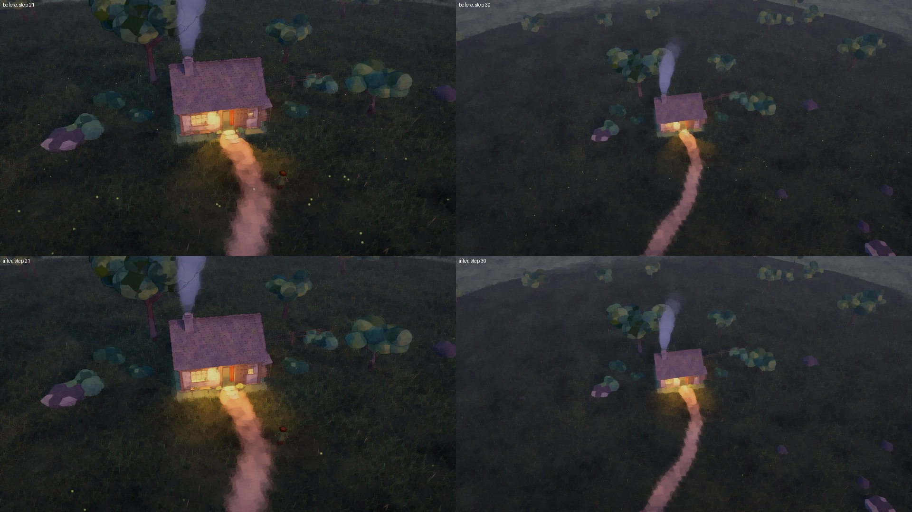

*Above, as it was; below, as it is. Left from 22 m, right from 42 m.*

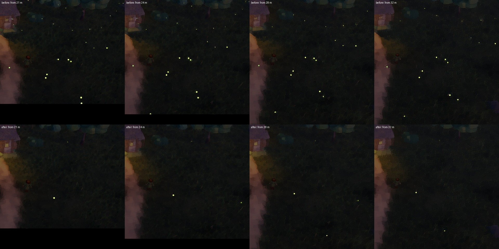

*The same patch of meadow from 21, 24, 28 and 32 m, with time standing
still and the fireflies' own light brightened to be seen. Above, as it
was: the same dots, sliding outwards as the camera pulls back. Below, as
it is: each stays where it is, and grows smaller and fainter.*

**What checks it.** Three tests in `DuskDetailsTests`: each firefly has
its own home, on its own ground, where grass grows, and no home moves
when the camera does; from further away fewer are seen and they are
fainter, at every step of distance; there is still a sign of them from
the farthest view. `DuskZoomCapture` takes the pictures.

**For Luis.**

- **Is this few enough, and is it too few from far?** From the farthest
  view there are about ten faint dots across the screen at any moment.
  Luis asked on October 2 for "an indication of them even when very
  zoomed out". Both figures are one setting each.
- Their colour, size from close, the way each blinks and the small
  circle each flies were not changed.

## L2. The cabin's light

**What Luis said.** October 2: "when we are far away the lights suddenly
look very strong and even spread a bit to the terrain nearby. But when we
are more zoomed in that extra brightness disappears. Now I really liked
how it looked from far away... so I think we should try to fix that also,
primarily by adjusting how it looks when not super zoomed out". October
8: "the cabin light gets suddenly much stronger than before, that's still
happening. We should still investigate that, also very in depth, with
each level of zoom out".

**What was found.** The same forty steps, measuring the brightness of
the same four metres of ground round the door at each.

- From 5 to 45 m the light falls gently and evenly, by half a percent to
  one percent a step. **Between 45 and 52 m it rises by a tenth**, and
  the share of bright ground by a third (from 23% to 33% of it).
- **The cause: shadows end 50 m from the camera.** The pipeline draws no
  shadow further than its shadow distance from the eye, and fades them
  out over the last tenth of it. The house's lamps are real lights
  inside real walls. Within 45 m the walls, the door's frame and the
  bench shade them, and the light falls as a shaped pool. Beyond 50 m
  nothing shades them: they light the ground through the walls.
- With the camera at its farthest (42 m from what it looks at), the
  house crosses that line whenever it is a little off the middle of the
  screen. On a wide screen it is often.
- **What I did on October 2 was the wrong cure.** I took the cause to be
  the grass (its tips lit more than its blades) and changed how lamplight
  falls on grass. The jump stayed, as Luis says.

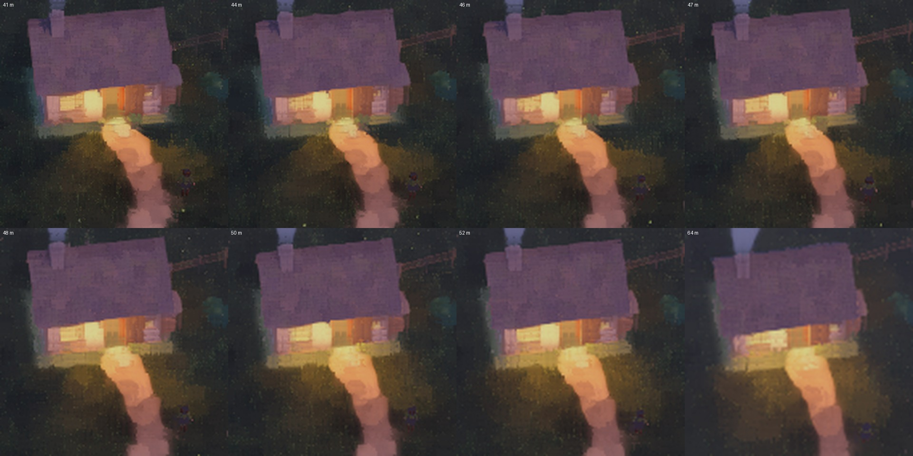

*As it was: the same twelve metres round the door, from 41, 44, 46, 47,
48, 50, 52 and 64 m. Between the fourth and the sixth the walls stop
shading the lamps.*

**What was done.**

- **Shadows reach as far as the lamps are seen from** (`ShadowReach`).
  While a lamp that casts shadows is lit, the shadow distance is kept
  beyond all that it lights, however far the camera is. The nearer
  shadow cascades keep the metres they had, so nothing changes close
  by; by day, with no lamp lit, nothing changes at all. The pipeline's
  own settings are put back after each picture.
- With that alone, **nothing jumps at any distance**: from 5 to 80 m
  the light round the door never rises from one step to the next by
  more than a third of a percent.

**The choice that is Luis's.** With the jump gone there are two looks,
each steady at every distance, and Luis has liked both:

| | What it is | Who has seen it |
|---|---|---|
| **Spreading** | The lamplight at the door and the windows is not shaded: it spreads over the ground before the house, as it looked from far away. The fire *inside* stays behind its walls (so no light comes out under the back wall) | The look from far that Luis "really liked" on October 2, now also from close |
| **Shaded** | The door's frame, the bench and whoever stands in the doorway shade the lamplight: a shaped pool, and a miner in the door throws a shadow down the path | The look from close that Luis has played with since October 2, now also from far |

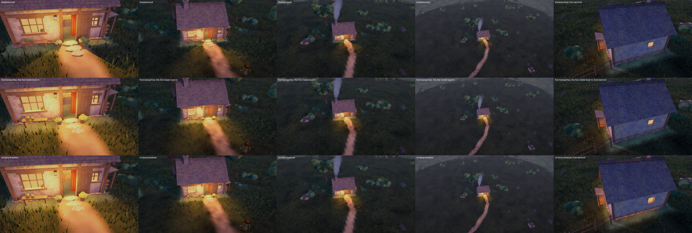

*Top: shaded. Middle: spreading, with the fire inside still behind its
walls. Bottom: no lamp shaded at all (what the far view was before: note
the light under the back wall, at the right). Columns: from 6, 13, 27 and
50 m, and from behind the house.*

**The place starts with *spreading*,** because that is what Luis asked
for on October 2 ("primarily by adjusting how it looks when not super
zoomed out since I liked the zoomed out version"). **Key 0 switches to
*shaded*** and back, and the look test's panel says which is on.

What *spreading* gives up, so that Luis can weigh it: lamplight no
longer throws anyone's shadow. A miner standing in the door is lit and
shades nothing.

| From | Light round the door, before | Spreading | Shaded |
|---|---|---|---|
| 5 m | 0.440 | 0.490 | 0.440 |
| 20 m | 0.396 | 0.440 | 0.395 |
| 42 m | 0.377 | 0.421 | 0.377 |
| 45 m | 0.376 | 0.420 | 0.376 |
| **49 m** | **0.404** (+7.3% in one step) | 0.417 | 0.373 |
| **52 m** | **0.415** (+2.8%) | 0.413 | 0.369 |
| 60 m | 0.410 | 0.408 | 0.367 |
| 80 m | 0.406 | 0.404 | 0.367 |

*Spreading* from far is what the far view always was (0.413 beside
0.415 at 52 m); *shaded* from close is what the close view always was
(0.440 beside 0.440 at 5 m).

**What checks it.** Two tests in `DuskDetailsTests`: the shadows reach
beyond all that the fire inside lights, from 20 to 150 m, and the
pipeline's own setting is as it was after a frame; the lamplight
spreads unless its shadows are switched on, and the fire inside is
always shaded.

**Not measured yet:** what the longer shadow distance costs in the frame
when the camera is far from the house (the far cascade covers more
ground then). To be measured in the build.

## L3. The stutter after each step

**What Luis said.** "There's a slight stutter after each step, where it
looks like the character is being, like, teleported a little bit, like to
the ground... very obvious for humans. I don't know if you can see it.
Maybe you have to study it a lot."

**What was found.** Each miner's walk was traced frame by frame at 100
frames a second (about what Luis plays at): its place, its hips, its
head, each foot.

- **At every step the hips dropped in a single frame.** By 47 to 83 mm
  for Small, up to 94 mm for Round and **128 mm** for Long, on the
  slope the miners start on; the head with them. Between drops they rose
  slowly: the hips' height was a sawtooth.
- **The cause.** The hips were held down only by the legs of feet *on
  the ground*. A foot in the air held nothing. So through each swing the
  hips stayed as high as the standing leg allowed; and in the frame the
  swinging foot landed, further ahead and (going downhill) lower, its
  leg had to reach it, and the hips were put down at once to where it
  could. The code said so: "lowering stays immediate so planted legs
  always reach".
- **The foot showed it too:** in the air its leg was at full stretch and
  could not reach where it was going, so the foot hung short of its
  path; in the landing frame it jumped 67 to 117 mm to the ground.
- It had been so since the walk was made. I had not seen it because I
  had not looked at the hips from one frame to the next, and my clips
  ran at 25 and 30 frames a second, where a drop in one frame reads as a
  quick bob.

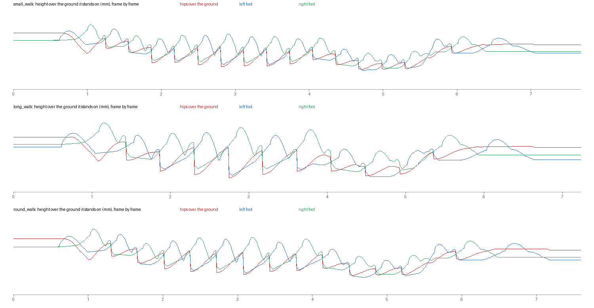

*As it was: Small, Long and Round walking seven metres. Red: the hips'
height over the ground. Blue and green: the feet. Each step ends in a
vertical drop.*

**What was done.** A real body comes *down* onto its landing foot: it is
lowest with both feet on the ground, and gets there smoothly through the
second half of the step
([the research, section 3](../Research/2026-10-08_RealBodiesAndHowToJudgeThem.md#3-walking-the-rise-and-fall-of-the-body)).

- **The hips come down to a landing through the swing.** From a third
  of the way through a foot's swing, the hips are brought to where
  both legs will reach once it has landed: from the height they are at
  and at the pace they are moving, along one line without a corner, by
  the very reach that will hold them afterwards. When the foot lands
  nothing is left to change.
- **A landing is reckoned to the frame it happens in.** The foot lands
  in a frame, not between two; reckoned to the moment between, where it
  would land moved ahead in its last frame in the air, and the foot
  jumped about a centimetre as it landed.
- **The hips rise with a pace that is kept.** Let go by a leg, they do
  not start up at once.
- **A foot leaves the ground gently.** It rose by a quarter of its whole
  lift in its first frame in the air.

| | Hips: the largest jolt in one frame | Frames in the walk with a jolt over the limit (4 mm) | Landing foot: how far it was put from where it was going | A foot in the air: the largest jolt |
|---|---|---|---|---|
| Small, before | 83.4 mm | 33 | 105 mm | 28.9 mm |
| Small, after | **2.4 mm** | 0 | 2.1 mm | 9.5 mm |
| Long, before | 128.3 mm | 21 | 154 mm | 19.1 mm |
| Long, after | **2.0 mm** | 0 | 2.1 mm | 8.0 mm |
| Round, before | 94.0 mm | 29 | 117 mm | 12.8 mm |
| Round, after | **2.7 mm** | 0 | 2.2 mm | 8.5 mm |

(A jolt: how much the change of place from one frame to the next itself
changes. Before and after are measured with the same measure, on the
same seven metres. All three walks now pass every limit of the numbers.)

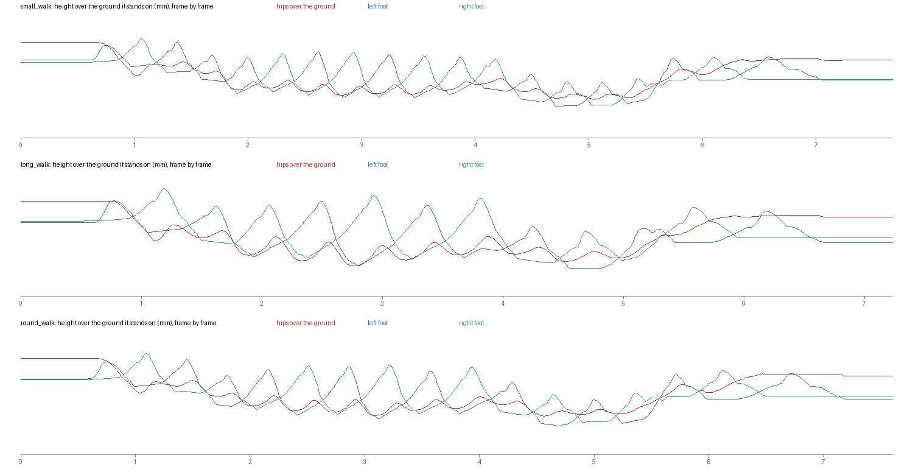

*As it is: the same three walks. The hips rise and fall once a step in
one line; nothing drops.*

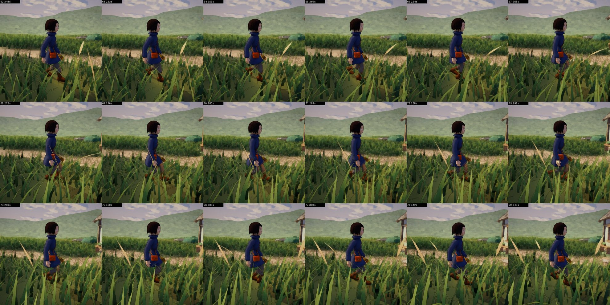

*Small, from 2.48 to 3.16 s of its walk: one picture every 0.04 s.*

**Not done:** no judge has looked at the walk yet (the first round was
cut off before it answered: the account's usage limit), and Luis has
not. The numbers say there is no break left in it; they cannot say that
it reads as a walk.

**Also to be said:** over the ground the hips now rise and fall 12 to
15 cm in a step on this slope. A person's rise and fall 4 to 5 cm on
the flat. Part of the difference is the slope, part is these bodies'
short legs taking long steps. It has not been judged yet.

## L4. Turning round on the spot

**What Luis said.** Facing one way and sent the opposite way, "the legs
already looked a bit weird... now it's even more weird"; they "teleport a
bit sometimes when trying to turn, and the movement is not very human or
natural."

**What was found** (the same trace, of a miner standing and sent
straight behind it, and of a miner walking and sent back the way it
came).

- **A foot in the air jumped 31 to 40 cm in one frame,** two or three
  times in every turn: feet moved at up to 38 m/s. **The cause:** a foot
  swinging goes round the standing boot, never through it; which side it
  went round, and by how much, was worked out afresh each frame from a
  path that turns as the body turns, and the answer flipped.
- **The body walked off backwards.** It reached its whole walking pace
  in a third of a second, while still facing the wrong way, and turned as
  it went: for half a second it travelled across its own feet.
- **It turned all of a piece.** Head, chest, hips and the body's place
  began in the same frame and turned at one pace (180 degrees a second,
  from the first frame to the last).
- **A leg was twisted by 140 degrees.** The body turned right round over
  a foot that stayed where it was.
- Sent back while walking, **the hips dropped to within 12 cm of the
  ground** for a moment: a foot had been left 60 cm behind, and the hips
  were put where both legs reached.

**What real bodies do**
([the research, section 4](../Research/2026-10-08_RealBodiesAndHowToJudgeThem.md#4-turning-round-on-the-spot)):
half a turn in about a second and a half, in two or three steps; the
head first, then the chest, then the hips; the feet stepping round under
them.

**What was done.**

- **The head looks round first:** up to 62 degrees ahead of the body,
  towards where it is about to go; the chest follows by a third of that;
  the hips come round under them.
- **The turn gathers pace and loses it,** instead of starting and
  stopping at once.
- **It turns, then walks.** Turned further than 58 degrees from its way
  it all but stands (it creeps), and turns; it walks as it comes round.
- **A leg turns only so far in its hip.** The body turns no further than
  62 degrees round from a foot on the ground: it waits there until that
  foot has stepped. So the turn is paced by the steps, as a person's is.
- **The foot on the side it turns to steps first,** and lands turned on
  ahead of the body, opening the way; the other comes round after it.
- **A boot that would lie across the standing one lands turned less,**
  under its own hip. (It used to be put out to the side to get past, by
  up to 45 cm: the body then stood wide, and fell between its feet.)
- **A foot in the air changes where it is going at a pace,** and goes
  round the standing boot along a way that does not jump.

| A turn right round from standing | Small, before | Small, now | Long, before | Long, now | Round, before | Round, now |
|---|---|---|---|---|---|---|
| A foot's largest jolt in the air, in one frame | 367 mm | 9 mm | 403 mm | 16 mm | 289 mm | 9 mm |
| The fastest a foot moves | 32 m/s | 5.9 m/s | 38 m/s | 6.2 m/s | 30 m/s | 5.9 m/s |
| The hips' largest jolt sideways or along | 61 mm | 1.3 mm | 4.1 mm | 1.4 mm | 4.1 mm | 1.2 mm |
| The hips' largest jolt up or down | 66 mm | 5.4 mm | 24 mm | 11.6 mm | 21 mm | 7.6 mm |
| Frames with a jolt of the hips over the limit | 24 | 2 | 14 | 4 | 16 | 4 |

| The same turn | Before | Now |
|---|---|---|
| Steps to face the other way | feet chasing the turn, with jumps | 3 |
| From a tenth of the way round to nine tenths | 1.1 s, at one pace (180 degrees a second) | 0.86 s, gathering and losing pace (about 1.25 s in all) |
| The head, ahead of the body | not at all: head, chest and hips began in the same frame | up to 62 degrees; it has gone a tenth of the way 0.06 s before the hips, and nine tenths 0.29 s before them |
| The most a leg is twisted | about 140 degrees | 62 degrees |
| Travelling while turned away from where it is going | at its whole pace within a third of a second | under 0.1 m/s until it is within 58 degrees |

| Sent back the way it came while walking | Small, before | Small, now | Long, before | Long, now | Round, before | Round, now |
|---|---|---|---|---|---|---|
| A foot's largest jolt in the air | 308 mm | 15 mm | 388 mm | 48 mm | 275 mm | **122 mm** (once) |
| The fastest a foot moves | 31 m/s | 6.3 m/s | 37 m/s | 7.0 m/s | 28 m/s | 14.8 m/s |
| The hips' largest jolt up or down | 81 mm | 4.2 mm | 128 mm | 6.9 mm | 92 mm | 5.3 mm |
| The hips' largest jolt along | 12.7 mm | 12.2 mm | 113 mm | 13.8 mm | 12.8 mm | 13.0 mm |
| Frames with a jolt of the hips over the limit | 49 | 4 | 43 | 9 | 46 | 4 |

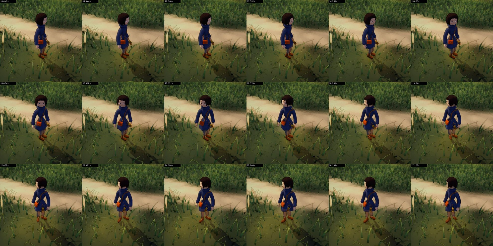

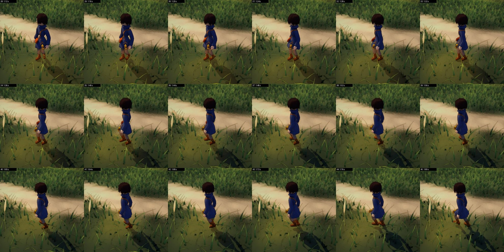

*Small, standing, told at 0.50 s to go straight behind it: one picture
every 0.04 s, from 0.40 to 1.80 s. The head looks round; the right foot
steps and opens the way; the left comes round; it walks.*

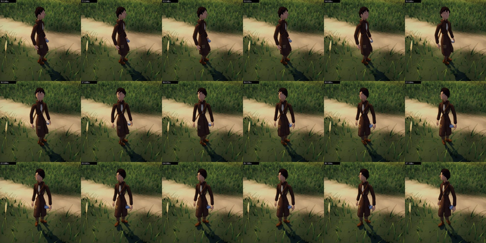

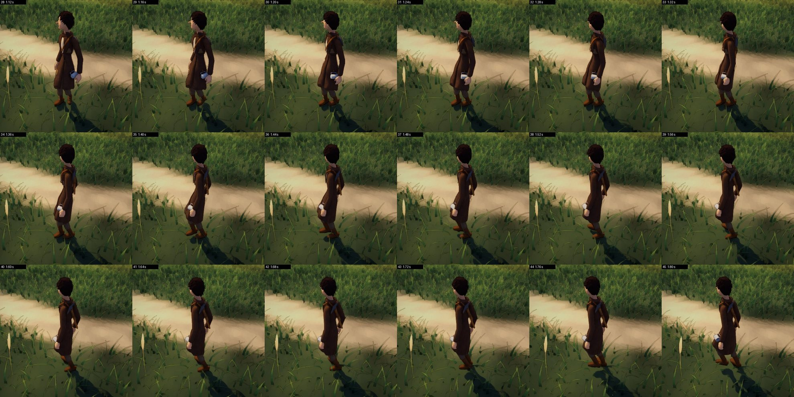

**Not finished.**

- **The numbers still fail the turn on a few frames:** the hips jolt up
  or down by 5 to 12 mm in two to four frames of each turn (where the
  walk begins out of the turn), and Long's foot by 16 mm.
- **Sent back while walking is the worse case.** A foot still jumps in
  the air once in Long's (48 mm) and once in Round's (122 mm); and the
  hips jolt along by 12 to 14 mm in one frame, the head by 24 to 28 mm,
  **as they did before** (that one is not from the turn: the body's lean
  answers its slowing down at once).
- **No judge has looked at it yet.** A first round of six judges was
  called and all six were cut off before they answered (the account's
  usage limit); nothing came back from them.

## L8. Long stops recovering

**What Luis said.** "The long, it mined, and then it got tired, and then
after he recovered to 77% spent, he stopped recovering, and now he's just
still without doing anything more."

**What was found.** Each miner worked for five minutes at the boulder
nearest to where the place puts it, with each of the three pickaxes, at
ordinary strength; every half second what each group of muscles was
giving was written down.

- **Long, with its own pickaxe, did exactly what Luis saw.** After five
  blows it rested with the pickaxe's head on the ground and the end of
  the handle in its right hand. Through that "rest" **its right arm gave
  100% of what it had**, without pause. A muscle giving all it has tires
  as fast as rest restores it at 77% spent: there it stayed. Its knees,
  bent to bring the hand down to the handle, gave 54%.
- **The cause.** Resting so, the hand was meant to hold the handle's end
  at a set place beside the body, as if the pickaxe stood upright on its
  head at the feet. It did not: its head lay where the blow had left it,
  on the rock, half a metre ahead. The place was one the handle could
  not be at. The arm pulled for it with all it had, for as long as the
  rest lasted. And Long is tall and its pickaxe short: even upright the
  handle's end is 38 cm below its hanging hand, so its knees bent to
  reach it.
- **Long with the light pickaxe never went on either.** It rested with
  the pickaxe in one hand at its side, as the others do; but the hand
  was carried a fifth of the arm's length out from the body, and Long's
  arms are long: holding itself and the tool out there took 36 to 43%
  of the shoulder. It settled at 27 to 38% spent, never fresh enough
  (15%) to go on, and stood "getting its breath" from the first minute
  to the fifth.
- **With the heavy pickaxe, Long's legs gave out** at 99 s, from
  "resting" with its knees bent; and Small, with the heavy one, fell at
  109 s.
- So of nine pairs of miner and pickaxe, **four did not work for five
  minutes**; three of them were Long. My check of S3 (thirty miners and
  boulders, six blows each) was too short to meet a rest.

**What a rest is**
([the research, section 8](../Research/2026-10-08_RealBodiesAndHowToJudgeThem.md#8-resting-from-work)):
a way of standing in which no muscle gives more than it can go on
giving. A body "resting" with an arm at full strain is not resting.

**What was done.**

- **The arm that carries a tool at the side hangs.** As near to
  straight down as the body lets it, and all but straight: a bent elbow
  holds a tool up by strength, a straight arm by its bones. This is also
  how it is carried walking.
- **The rest with the head on the ground is gone.** It was never a rest
  for a tall body; and a tool whose weight is all at one end is not
  shared by two hands either (that was tried: the upper hand still
  carried nine tenths).
- **A rest ends.** Resting gives back less and less. It is looked back
  on every eight seconds: when the last eight gave back next to nothing,
  the rest has given what it can. The body then goes on, if it is at
  least a little fresher than when it stopped.
- **And if it is not** (the tool is too heavy for this body to hold and
  rest at once), **it puts the tool down and says so:** "It cannot get
  its strength back holding that pickaxe: it puts it down".
- **A pickaxe that slips from the hands at work ends the work,** and the
  panel says so. (It used to leave the miner standing, neither at work
  nor done.)

| Five minutes at its nearest boulder | Before | After |
|---|---|---|
| Small, light (0.9 kg) | 61 blows, 3 rests | 72 blows, 2 rests |
| Small, its own (1.5 kg) | 60 blows, 4 rests | 46 blows, 4 rests |
| Small, heavy (2.7 kg) | 8 blows; **fell** at 109 s | 11 blows, 2 long rests; no fall |
| Long, light (1.9 kg) | 6 blows; **rested for ever** from 57 s | 30 blows, 5 rests |
| Long, its own (3.2 kg) | 5 to 11 blows; **stuck at 77%**, or fell at 108 s | 15 blows, 3 rests |
| Long, heavy (5.8 kg) | 4 blows; **stuck at 77%** | 2 blows, then puts it down and says why |
| Round, light (1.4 kg) | 95 blows, 1 rest | 87 blows, 1 rest |
| Round, its own (2.4 kg) | 56 blows, 4 rests | 54 blows, 4 rests |
| Round, heavy (4.3 kg) | 32 blows, 5 rests | 33 blows, 4 rests |

(After: the code as it is now, the whole suite passed on it. No miner
fell, and none stood for ever.)

**Still so, and for Luis to know.**

- **Long is a poor worker beside the others:** 15 blows in five minutes
  with its own pickaxe, to Small's 46 and Round's 54. Its long arms hold
  a tool at a disadvantage, and it rests long. That is what its body
  is, by these rules; whether Long *should* be so is a question of
  design, and is Luis's.
- **A body that cannot rest holding its tool lays it down and stops.**
  It could instead lay it down, rest, and take it up again by itself.
  That is not built.
- The rests are long: half a minute to two minutes.

---

## What was run, for all of the above

- **The whole PlayMode suite,** alone: 176 tests; 161 passed, none
  failed, 15 are run only when asked (1,373 s). The first whole run
  after the walk and the turn were changed failed 18: every one was
  looked into (legs stretched past their length; a pace that fell to the
  ground; a stopped worker that never came to face its work; boots that
  overlapped in a turn; three tests whose own premises the new rest had
  changed, rewritten and said so in them).
- **The release build** (`Builds/WindowsOrdinaryPlace`), and its own
  measures run in it:

| The build's own measure | October 8, before the round | Now |
|---|---|---|
| One miner standing | 4.57 to 4.72 ms | 4.63 to 4.73 ms |
| One miner at its work | 4.51 to 4.83 ms | 4.62 to 4.67 ms |
| No miners walking, 25, 50, 100 | 4.84, 5.62, 6.08, 7.31 ms | 4.95, 5.73, 6.24, 7.82 ms |

  A hundred walking miners cost half a millisecond more than they did
  (a foot in the air now looks along the rest of its way for the other
  boot). Nothing was thrown in the build's log.
- **Not tested:** anything by Luis's eye; the judges (cut off); the
  turn in the build at Luis's frame rate and screen (the traces are the
  editor's, at 100 frames a second); what the longer shadow distance
  costs at night from far (the measures above are at the place's own
  hour, 18:36); frame rates under 50; other hardware.

## What was learnt in this round, so far

- **What I checked was whether a thing worked. Luis looks at how it
  moves.** Every one of the ten notes passes "it worked".
- **Read a movement frame by frame, at the rate it is played at.** The
  stutter was 5 to 13 cm in one frame, at every step, for weeks.
- **Check what a body is doing while it "rests".** The rest was a pose;
  nobody had asked what it cost to hold.
- **A check has to last as long as the thing it checks.** Six blows do
  not meet a rest. Five minutes do.
- **When Luis says which of two looks to keep, do that, and find the
  real cause.** On October 2 Luis said to bring the close view to the
  far one. I changed the grass instead, and the jump stayed for a week.
