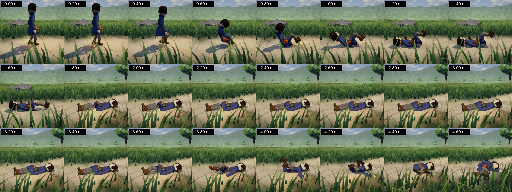
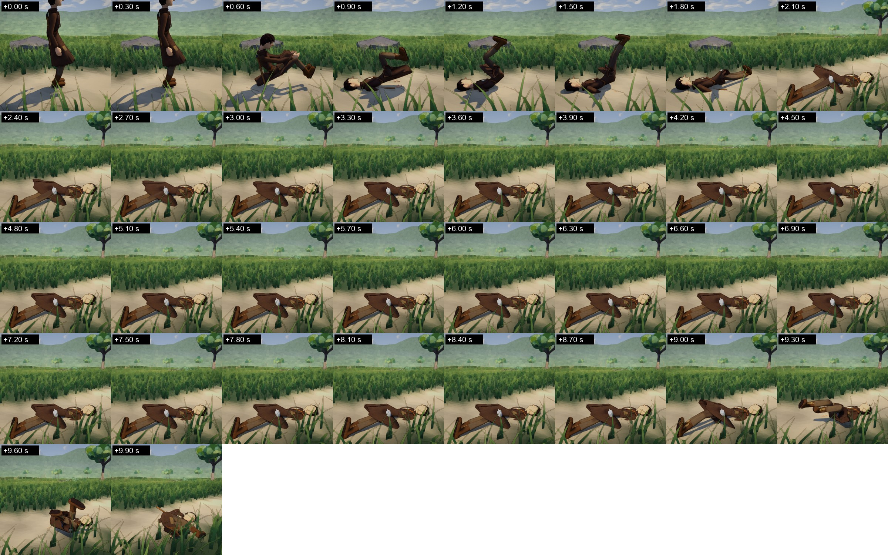

# The round of October 9: how long a fallen miner lies, the research, and the body's own

**Why.** Luis, October 9
([the message, verbatim](../Correspondence/2026-10-09_THE_BODYS_OWN_NOT_POSED.md)).
It says four things:

| | Luis | What was done | Where |
|---|---|---|---|
| 1 | "I want stability in the body but with it still being the body's own. I don't want it to be posed like that." | Recorded as a Direction. A plan for it was proposed, and Luis approved it the same day; nothing of it was built in this round | [The proposal](../NextMilestonePlan.md) |
| 2 | "research and look for what would be a reasonable time for the miners to lay down... dependent on factors such as how strong was the force that pushed it down, it's current stamina and anything else relevant" | Researched and built | Below, and [the research, part 1](../Research/2026-10-09_AliveAndTheBodysOwn.md#1-how-long-a-fallen-body-lies) |
| 3 | "we must do media studies and research of what kind of movements feel natural for certain actions" | A first study: what animators and studies of seeing say makes a movement read as alive, set against the miners as they are | [The research, parts 2 and 3](../Research/2026-10-09_AliveAndTheBodysOwn.md#2-what-makes-a-movement-read-as-alive-and-not-robotic) |
| 4 | "good job with the agent reviews, please continue with that for further steps always" | The judges are called for every step from now on. They are also asked a second thing: is it alive | [`alive.md`](../../Art/Review/judges/alive.md) |

Luis also said: "the rest I couldn't open a test to see how your
progress was so far". **Nothing of the playtest round or of this one has
been played by Luis.** How to open the build is at the end of this page.

## How long a fallen miner lies

**What it was.** A fallen miner lay 1.2 s, whatever had happened to it,
and then began to get up.

**What it is.** When it has come to rest, it reckons how long it lies:

| It lies | How long | Why |
|---|---|---|
| At least | 0.8 s | A body that has only sat down hard still has to find where it is |
| More, by how hard it came down | up to 4.5 s | Shaken, and winded |
| More, by how hard its head struck | up to 2 s | Dazed |
| More, by how spent its legs and its back are | up to 3.5 s | It gets its breath |
| All of it less for a stronger body, more for a weaker | divided by the root of its strength | A stronger body gathers itself sooner |
| Never more than | 10 s | The middle figure for old people who fell and got up again |

- **"How hard it came down"** is the *blow*, in metres a second: the
  speed that what pushed it gave its body, or the most speed the ground
  took from its hips, its trunk or its head in one step of the physics,
  whichever is more. Nothing is added under 1 m/s; all of it at 6 m/s.
  For the head alone, from 2.5 to 6 m/s.
- **"How spent"** is the share of their strength that its legs or its
  back have used up at their work (the same tiredness that makes a miner
  rest), squared: a little tiredness adds almost nothing.
- **The panel says it:** "It fell, and lies a moment (1 s)." / "It fell
  hard, and lies winded (4 s)." / "...dazed" / "...out of breath".
- **After a try at getting up that fails,** it lies 2.5 s and tries
  again, as before.

What these were set from is in
[the research](../Research/2026-10-09_AliveAndTheBodysOwn.md#1-how-long-a-fallen-body-lies):
between the games' one to three seconds and the ten of old people.
**They are my settings, and for Luis to change.**

**What came out.**

| | Small (41 kg) | Long (58 kg) | Round (88 kg) |
|---|---|---|---|
| Pushed with 100 N for 0.3 s, from four sides | 0.8 to 1.7 s | 1.2 to 1.9 s | 1.0 to 1.9 s |
| Pushed with 350 N, from four sides | 2.6 to 3.2 s | 3.6 to 4.8 s | 1.1 to 2.2 s |
| Pushed with 600 N, from four sides | 4.5 to 5.7 s | 4.4 to 6.7 s | 1.9 to 5.0 s |
| Pushed lightly for its weight (3 N a kilogram), from in front | 1.8 s | 3.1 s | 2.3 s |
| The same, its legs and back four fifths spent | 3.9 s | 5.2 s | 3.8 s |
| Pushed hard for its weight (12 N a kilogram) | 3.9 s | 5.2 s | 7.3 s |

(The first three rows: 36 pushes on the bench, after the judges' change.
The last three: the test.)

- **The same push is a harder blow to a lighter body.** 600 N from
  behind: Small came down at 4.9 m/s and lay 5.7 s; Round at 2.2 m/s,
  and lay 1.9 s.
- **How it lands matters more than how hard it was pushed.** Small,
  pushed lightly from behind, went down onto its knees and the top of
  its head, stayed so for a second, and tipped onto its side two and a
  half seconds after the push ([pictures](../Images/Round_2026-10-09/Lies_Small_Light_FromBehind.jpg));
  nothing struck hard, and it lay 0.8 s. Pushed the same from in front,
  it sat down and went over onto its back in one, and lay 1.7 s.
- **It is almost always the head.** In nearly every fall the hardest
  stop is the head's (1 to 6 m/s). See "What stands open".

*Small, pushed with 100 N from in front. Times from the push; a picture
every 0.2 s. It is counted as lying at 1.3 s and begins to hold itself
again at 3.1 s.*

*Long, pushed with 600 N from in front; a picture every 0.3 s. Its head
struck at 5.6 m/s. It is counted as lying at 1.7 s and begins to hold
itself again at 8.5 s. For those seven seconds nothing in it moves.*

(Both as they are after the judges' change. Small
[as the first judges saw it](../Images/Round_2026-10-09/Lies_Small_Light_Before.jpg),
a picture every 0.3 s: its legs are still up at 2.1 s.)

### A stir before it gets up: tried, and taken out

In the pictures a body that lies five seconds does not move at all, and
then is suddenly a ball. So for the last second of its lying I had it
hold itself again with part of its strength (its head coming off the
ground, its limbs drawing in).

- **With three quarters of its strength** it drew its knees up, which
  read well; and the hard-pushed Small then failed to turn over at its
  first try. The poses of turning over were found for a body that lies
  slack.
- **With under a half** it turned over as before (22 of 24 at the first
  try; without the stir, 24 of 24 in one run and 11 of 12 in another: no
  difference that can be told), and the stir could hardly be seen: in
  Small on its back nothing moves by more than a degree.

It is taken out. A fallen miner lies quite still. That is a fault, and
it is the first thing a living body does not do
([the eight things](../Research/2026-10-09_AliveAndTheBodysOwn.md#for-ours-eight-things-a-living-body-does-and-where-the-miners-are)).
The mending of it is to search the turning over again with a body that
stirs first, and to give the body breath; both are in step 1 of
[the proposal](../NextMilestonePlan.md).

## What the judges of the lying said

Three judges each round (the body, the animator, the sceptic: separate
agents on the smaller model, who did not make it), new ones the second
time. They were given six sheets (each miner pushed lightly and hard,
a picture every 0.2 or 0.3 s, times printed), what the body is told to
do, the figures, and what was found about real bodies. They were also
asked, for the first time, the eight things of
[`alive.md`](../../Art/Review/judges/alive.md). All six verdicts:
**"reads as real, with a flaw"**.

### First round

| What was said | By | Against the trace | What was done |
|---|---|---|---|
| While it lies nothing moves at all, for up to seven seconds: "a stopped model, not a stunned body"; "more than 6 s with no visible change reads as dead, not hurt" | All three (sure) | Stands: its joints change by under a degree while it lies | **Open** (see below) |
| Its legs stand in the air 0.6 to 0.9 s after it has come down on its back, and then sink: "a slack leg would fall with the body" | All three (fairly sure) | Stands. It held the fall's hold until it was counted as lying, half a second after it stopped, and then let go over a second: Small's thighs went from 81 degrees to 14 over the 0.65 s *after* it was "lying" | **Changed:** it lets go when the ground has it (its hips, trunk and head stopped, its trunk no longer upright), and is slack half a second later |
| Small pushed hard: it kneels bowed, its head on the ground and its rump up, unchanged for a second and a half, then slumps | All three (one: "natural"; two: "held") | Stands as seen: it was counted as lying while it rested on its knees and head | The same change: it now sags from the moment it stops, and is counted as lying only when it is down (at 3.1 s, where it was 1.5) |
| The first movement of getting up is seen 0.4 to 0.8 s after the figure's "begins to get up" | Two | Stands: its strength comes back over about a second. What is seen as lying is the figure and about half a second more | Nothing; said here |
| Nothing gets ready before it rises: a leg moves with no stir of head or trunk before it | Two (one: "in part") | Stands | **Open,** with the first |
| Long, pushed lightly, lies "slightly too short" (1.2 s, having gone down full length on its front) | Two | It is what the reckoning gives for a blow of 1.5 m/s | Nothing. Whether the least should be longer is Luis's |
| Round pushed lightly and Round pushed hard settle in nearly the same pose | One | Not checked on more runs | Nothing |
| The times: "about right" in all six but that one; hard against light differs clearly (three to six times) | All three | | |
| Small against large differs "only through the blow, not through the body" | All three | True: its size comes into it only by how it lands | **For Luis:** should a heavier, or an older, body lie longer for itself? |
| "The head-strike and blow figures are identical in all six columns" | One | True, and it is a finding of the figures: the head is what lands hardest | **Open** (the fall: see below) |
| After its head has struck at 4 to 6 m/s "nothing in the lying shows being stunned or hurt" | One | Stands | **Open,** with the first |

### Second round (after the change)

| What was said | By | Against the trace | What was done |
|---|---|---|---|
| The lying body is frozen: "switched off, waiting for a timer" | All three (sure, or fairly sure) | Stands, as before | **Open** |
| The lie ends from nothing: a motionless body suddenly lifts a knee or curls | All three | Stands, as before | **Open** |
| The landings: "the legs stay up over the hips while the trunk is already down, then drop slack... a body rolling over backwards. No hidden effort" (the body: sure). The animator still sees raised legs "held until let go" for about 0.6 s in Round and Long pushed hard | One for, one against, one silent | In part. The legs go up by their own motion as the body goes over, and come down about 0.4 s after it is on its back (it was over a second). While the body still rolls it holds itself | Nothing more. **Less, not gone** |
| Long, pushed lightly, sags for a second and a half (its legs folding under it) before it lies; so it is on the ground longest of the three light falls after the gentlest blow | Two (the third: "slightly long") | Stands: on its knees and its head it moves too slowly to be counted as stopped, so it holds itself and sinks slowly | **Open.** (In the first round two judges called this body's lie slightly too short, and in the second two called it long. The reckoned 1.2 s is the same both times; what differs is how long it takes to settle before it) |
| Small pushed hard lies "too long as shown": as long as the grown Long, after a smaller blow | One (two: "about right") | It is what the reckoning gives (4.9 m/s; 5.7 s) | Nothing; for Luis, with the question of size |
| On its back it lies "tidy, as if laid out": straight, legs together, arms at its sides | One ("it may be the picture") | It is what a slack body of these parts comes to | Nothing |
| After a push of 100 N the legs fold and the body drops in place; no foot steps | One | **Struck as a fault of the lying;** true of the bench and of the panel's button: both let the body go first and then push it, so that a fall can be seen. In the game a body pushed so keeps its feet (the balance) | Nothing; said in the playtest's step |
| "A small white-grey oval" on Long's coat that never changes | One ("it may be the picture") | **Struck:** it is Long's mug, which hangs at its hip | |
| The times: about right in all six for two judges; light against hard clear | | | |

**No third round.** What stands is the same thing said five ways, and it
is not to be mended by a setting: **a fallen miner does not breathe, does
not stir, and gets up from nothing.**

## What stands open

| | What | Where it is to be mended |
|---|---|---|
| 1 | **A fallen miner lies quite still, and gets up from nothing.** Six judges of six | [The proposal](../NextMilestonePlan.md), step 1: breath, and a stir that the turning over is searched with |
| 2 | **It is almost always its head that lands hardest** (1 to 6 m/s; in life 5 m/s is a serious injury), **and its hands do not reach for the ground.** A young, fit person who falls gets a hand down in nine falls of ten and strikes the head in about one of nine ([the research, part 4](../Research/2026-10-09_AliveAndTheBodysOwn.md#4-action-by-action)). Of everything the miners do, the fall is furthest from a real body | The fall itself: arms that reach for the ground. Not looked into. It would shorten the lying too, since the head's blow is most of what that is reckoned from |
| 3 | **A body that comes down onto its knees and its head** rests there, sagging, for a second or more (Small pushed from behind; Long pushed lightly) | The fall: the body has no hands that catch it. Not looked into |
| 4 | **Size comes into the time only through the blow.** Whether a heavier or older body should lie longer for itself | Luis's |
| 5 | **Whether a fall should cost anything** beyond the time (tiredness after it; the pickaxe let go) | Luis's (open since October 9) |
| 6 | **Second tries.** In two pushes of seventy-two, a body failed its first try at getting up, lay 2.5 s and got up at its second (as before this round) | The search |

## What the research found, in short

The whole of it, with sources:
[the research of October 9](../Research/2026-10-09_AliveAndTheBodysOwn.md).

- **Eight things a living body does** that a robot does not: it is
  never quite still; its parts do not move on one clock; it gets ready
  before it acts; what hangs on it goes on a moment; its hands and feet
  move in arcs, with one hump of speed; it does not repeat itself; it
  keeps its balance by degrees (ankles, hips, a step); it shows its
  effort.
- **Where the miners are:** two of the eight not at all (they stand and
  lie perfectly still; every step is the same step), five in part, one
  mostly (what hangs on them swings).
- **A body can be walked by its own joints alone, and stay up.** It has
  been done since 2007 with a few poses in a ring, each joint held
  towards its pose, and balance kept by where the foot comes down. It
  recovers from pushes. Nothing recorded is needed. It is close to how
  the getting up was made here.
- **What it asks of ours:** ankles (the let-go body has none); the walk
  searched until it does not look stiff; and "stable" said in numbers.
- **Action by action** (part 4): standing people shift their weight from
  leg to leg; before a first step the weight goes back and to one side
  for about half a second; strides differ by a percent or two; in a turn
  the eyes go first, then the head, the trunk, the hips, and the feet
  last; a heavy lift begins with the feet going wider and the hips
  dipping. **And a young body that falls gets a hand to the ground nine
  times in ten: ours never does.**

## What the proposal says, in short

[The proposal for the body's own](../NextMilestonePlan.md).
**Approved by Luis later the same day**
([the four answers](../Correspondence/2026-10-09_THE_BODYS_OWN_ANSWERS.md));
it is the plan now in force. As it stood when this page was written:

- **Nothing pushes the body from nowhere.** No unseen hand holds it up.
- **Stable is measured first on the body as it is today,** and the
  body's own must do no worse.
- **The order:** the ground for it (ankles, measures, cost); standing
  with life in it; from the knees onto the feet; a step; walking; down to
  the ground and up; the work; then S4, built this way from the start.
- **What Luis has is kept beside it,** to switch to on the panel, until
  Luis accepts each movement.
- **Four questions for Luis** (B1 to B4): whether "no active ragdoll"
  (September 30) is replaced; whether this comes before S4; whether the
  measures of "stable" are right; whether breathing may be drawn on the
  body.

## What was run

- **`PhysicalFallTests`:** 7 of 7, on the code as it is. The new one,
  `AHarderFallAndASpentBodyLieLonger`: each of the three miners pushed
  lightly (3 N a kilogram), hard (12), and lightly again with its legs
  and back four fifths spent. It asks that the harder push is a harder
  blow and a longer lie, that the spent body lies at least a second
  longer than the fresh one, and that no lie is under half a second or
  over ten.
- **The bench** (`PhysicalFallBench`): the three miners pushed with 100,
  350 and 600 N from four sides, 36 pushes: **36 up, their own way; 35
  at the first try** (Long, pushed hard from in front, at its second).
  Read in pictures.
- **Two rounds of three judges** (above).
- **The whole PlayMode suite,** alone, on the code as it is: 180 tests;
  **164 passed, none failed**; 16 are run only when asked (1,434 s).
- **The release build** was made from that code, and its own measures
  run: one miner standing 4.5 to 4.8 ms a frame, at its work 4.5 to
  4.6 ms; the crowd 4.9, 5.6 to 5.9, 6.5 to 6.8 and 8.5 to 8.8 ms a
  frame for none, 25, 50 and 100 miners; no exceptions in either log.
- **The build was opened from the main project's own folder** (by the
  measuring run): it started, ran and closed with no error.

## What was not tested

- **Luis's eye.** Nothing here is accepted.
- **A fall in the built player.** The measures the build runs by itself
  have no fall in them; the lying was run in the Editor's tests only.
- **The panel's words** ("It fell hard, and lies winded (4 s).") were
  not looked at on the screen.
- **A weak body, or a body tired by real work, lying:** the test spends
  the legs and back by a setting, not by mining; strength was ordinary
  in every run.
- **A fall with a tool in the hands,** on a slope, against a boulder or
  onto another body.
- **A third round of judges.**
- **Long's blows at a boulder,** which failed once in five runs of that
  test on October 9 (31 cm from the aim, for 20 allowed), passed in this
  run. Still not looked into.

## How to open the build

Luis, October 9: "the rest I couldn't open a test to see how your
progress was so far".

1. In the project's folder on this computer, open `Builds`, then
   `WindowsOrdinaryPlace`.
2. Start `WonderGather.exe`. It opens in the Ordinary Place, with the
   choice of miner.
3. What to look at:
   [the playtest's steps](../Playtests/MinersPlaytest.md#after-luiss-play-of-s3-what-to-look-at-now-october-8)
   (step 10 is the fall: **Push it over**, on the panel at the lower
   left).
4. `Alt` + `F4` closes it.

- **The build is on this computer only.** Builds are not uploaded to
  GitHub (`Builds/` is left out of the repository). It was made on
  October 9 from the code of this round.
- **The game's own log says the build was last opened on October 8,**
  which was a measuring run of mine. So I do not know whether Luis
  tried to open it and it failed, or had no chance to. **If it does not
  open, what the screen says is the first thing I need.** The log of the
  last time it ran is `Player.log`, in
  `%USERPROFILE%/AppData/LocalLow/Wonder Gather/Wonder Gather - The Wanderer`.
- **In the Unity Editor** the place is the scene
  `Assets/_WonderGather/Scenes/TheOrdinaryPlace.unity` (open it and
  press Play). I did not test it that way today; the build is what was
  tested.
