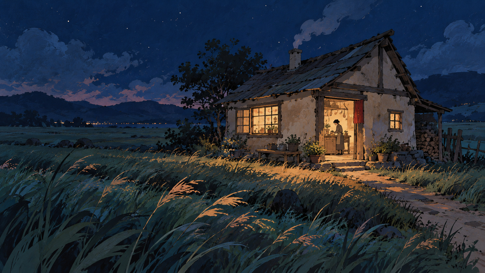
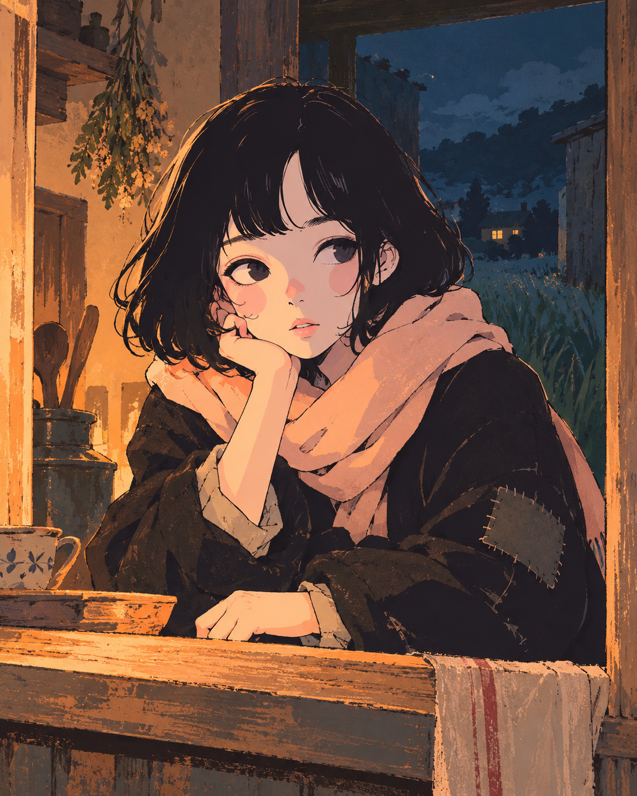
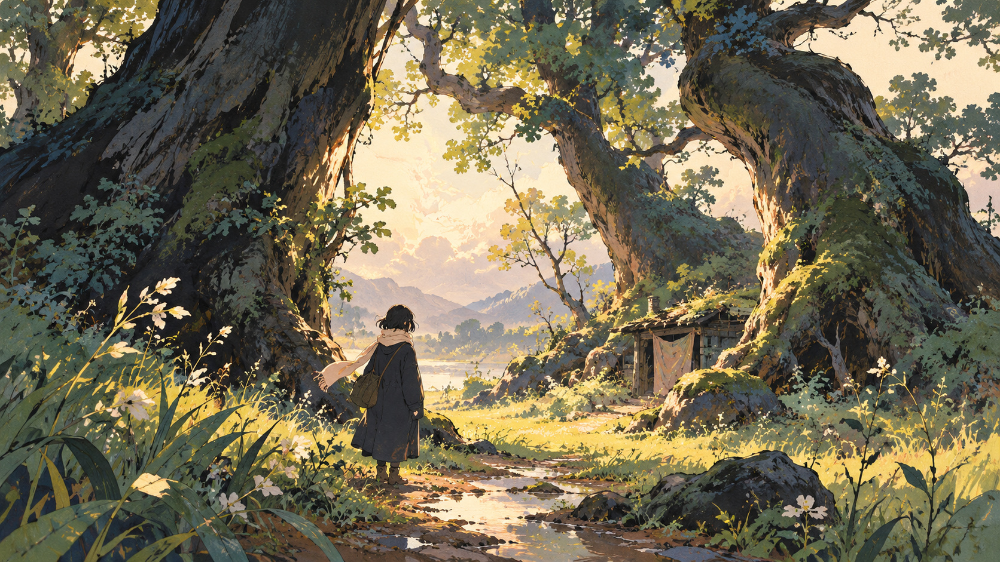
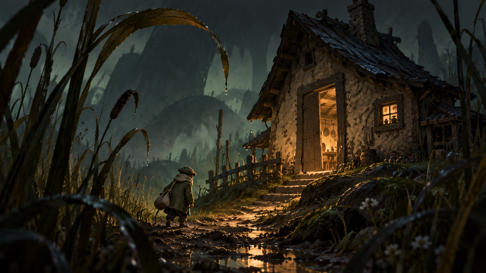
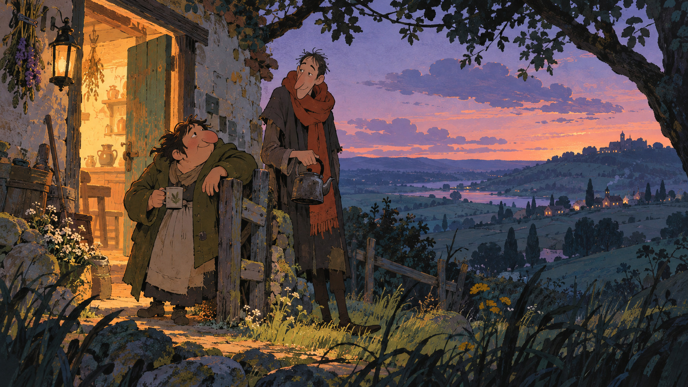
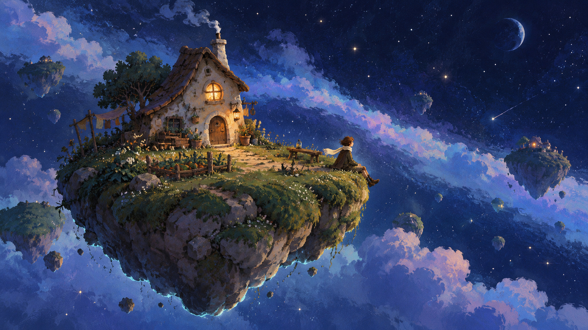

# Visual Soul — Wonder Gather's art direction reference

**Source:** `Wonder_Gather_Visual_Soul_Handoff.pdf`, made by Luis with
ChatGPT and handed over on October 1, 2026
([correspondence](Correspondence/2026-10-01_VISUAL_SOUL_AND_TWO_CAMERAS.md)).
**Status:** the **Direction** for the showcase and the game.

- Images A–F are approved, with no ranking.
- Final proportions, architecture, world setting and rendering technique stay
  **Open**.
- It replaces the S1 Blender style studies ([StyleStudies.md](StyleStudies.md)),
  none of which was chosen.

The handoff's text is transcribed in the first three sections below (only its
headings were shortened). "How we translate it" is the engineering reading
of it: hypotheses to test in the engine, not decisions.

## The confirmed core

> Even an ordinary moment should feel worth pausing for.

- **Ordinary moments to admire.** Even a house with its lights on in a
  grassland at night should be beautiful and magical. Slow pacing gives the
  player time to admire the world.
- **Lighting leads the emotion.** Light is the strongest priority. Deliberate
  pools of warmth, rich colored shadows and selective highlights should make
  everyday moments captivating.
- **Surfaces feel alive.** Texture, color and irregular shapes must interact
  with the light. Clothing, wood, plaster, grass and skin should have
  individual visual character.
- **Characters have a soul.** Expressive drawing, posture, small gestures and
  distinctive shapes matter. Characters should feel like individuals with a
  life beyond the frame.
- **Playful, personal wonder.** The world can hold warmth, curiosity,
  strangeness and quiet melancholy. Its artistic language should be
  unmistakable.

The aim is a strongly stylized, individual artistic world. Earlier
game-render style sheets were rejected for feeling generic and alike.

## Carry this into the game (the handoff's instructions)

1. **Start with one ordinary place.** Build a small house, grassland, path and
   worker in the existing prototype. Inspect current project constraints
   before choosing the rendering approach.
2. **Show night and daylight.**
   - A and D for night and material presence.
   - B and E for characters.
   - C for daylight nature.
   - F for wonder and scale.

   Seek a coherent artistic language.
3. **Judge moving scenes.** Review several actual camera angles, near and far
   views, moving characters and changing light. Texture, silhouettes and tool
   interactions should remain readable.
4. **Measure the result.** Compare real captures with the references and
   report runtime cost under representative unit and environment density. The
   artworks establish the aim; feasibility needs an in-engine test.
5. **Approval and open choices.** A–F are confirmed, with no stated ranking.
   Final proportions, architecture, world setting and rendering technique
   remain open. Use the artworks for visual principles while preserving the
   existing 3D gameplay and procedural unit behavior.

## The six approved soul images

### A — The lit house (night, material presence)

An ordinary home becomes magical through the relationship between warm light
and a rich, dark world.

- **Light.** Apricot and amber windows illuminate selected wall, doorstep and
  grass shapes. The surrounding blues and greens remain deep and beautiful.
- **Texture.** Brush marks, uneven plaster and flowing grass belong to the
  objects. Their rhythm gives the scene life.
- **Presence.** A small everyday gesture inside the doorway makes the house
  feel inhabited. The landscape has room to breathe.

### B — A face in window light (characters)

A person feels present through imperfect drawing, an ordinary gesture and a
few expressive marks.

- **Character.** Loose contours, strong dark hair and coat shapes, a quiet
  expression and a relaxed hand give the figure personality.
- **Light and surfaces.** Warm light finds the cheek, scarf and worn wood.
  Painted texture remains visible in both light and shadow.

### C — The breathing grove (daylight nature)

Daylight creates wonder through large living shapes, textured shade and an
inviting opening.

- **Shape and scale.** Curving trunks frame a small person and a bright
  clearing. Unusual proportions feel organic and personal.
- **Painted light.** Warm cream and yellow-green highlights sit against deep
  blue-green bark and foliage. Broad masses organize the finer marks.
- **Atmosphere.** The scene invites lingering. A scarf, puddle, rough root and
  modest shelter make the world feel lived in.

### D — Tactile darkness (night, material presence)

A small person and a warm dwelling sit inside a world of unfamiliar scale and
tangible materials.

- **Physical presence.** Damp earth, rough plaster, worn timber and cloth have
  weight. Soft dimensional shadows make the surfaces feel touchable.
- **Light and strange scale.** An amber path joins the figure to shelter.
  Looming reeds and deep cool shadows make the ordinary home feel mysterious.

### E — Expressive drawn life (characters)

Distinctive people and a quiet exchange bring playful humanity into a
beautifully painted evening.

- **Individual characters.** Different body shapes, noses, shoulders and
  relaxed gestures create personality. Simple drawn faces carry feeling.
- **Lived-in warmth.** A kettle, cup and open door suggest everyday life.
  Amber light, lilac sky and deep blue-green fields form a calm color rhythm.

### F — Cosmic wonder (wonder and scale)

A tiny cared-for home and an ordinary person make an immense, impossible world
feel personal.

- **Intimacy and vastness.** The warm window and small seated figure anchor a
  sweeping blue world. Great distances make the pocket of life precious.
- **Playful wonder.** A curved grassy island, painted clouds and cool edge
  light balance tenderness with impossibility. A literal space setting is
  still open.

## Influences named by Luis

These guide exploration. A–F are all approved, and their final synthesis
remains open.

- **Studio Ghibli** (Spirited Away, The Boy and the Heron): wonder through
  painted light, living texture and ordinary human moments.
- **Little Nightmares**, a game Luis loves: tactile atmosphere, dramatic light
  and strange scale. The desired intensity remains open.
- **Ranking of Kings, Mob Psycho 100:** anime with individual artistic
  personality, meaning expressive drawing, distinctive shapes and characters
  with feeling.
- **Super Mario Galaxy:** some scenes feel beautiful and full of wonder. The
  exact favorites are unknown; cosmic vastness is one possible
  interpretation.
- **User-supplied art reference** (page 9 of the PDF; not committed because its
  provenance is unknown). A bust of a dark-haired girl in a pink scarf
  showing lively imperfect contours, warm color, confident dark shapes and a
  face with personality. These are visual-language cues; the final cast and
  costumes are still open.
- **Further reading:** Tarsier on visual language and scale. Small, simple
  character shapes contrast with an oversized organic world.

## How we translate it (engineering reading, to be tested in engine)

These are working hypotheses for the S1 in-engine test. They are not
decisions. Each will be judged against real captures in motion.

| Principle | What it suggests for real-time 3D |
|---|---|
| Lighting leads | **Warmth and color.** Local warm lights (windows, doors, lanterns) carry the warmth, and the world around stays deep blue-green. **Shadows.** They take a cool hue from the sky rather than turning black. **Terminator.** The edge between light and shadow is soft and slightly broken, like a brush edge, not a hard toon step. **Time of day.** A time-of-day system drives sun, moon, sky, ambient, fog and window lights together. |
| Surfaces feel alive | **Painterly variation.** Hue and value vary across surfaces, and brush-mark texture is tied to each object (plaster, wood, cloth, grass, skin), with an individual treatment per material. **Shape.** Irregular silhouettes, so nothing is perfectly straight. |
| Grassland | **Dense grass.** Wind-moved blades darken to blue-green at the root and catch warm light at the tips. **Seed heads.** Tall grass with seed heads catches window light at night (A, D). **Foreground.** Dark grass silhouettes frame close views. |
| Sky | **A painted sky.** Clouds with soft lit edges, stars and a moon at night, and a lilac and apricot dusk (E), giving a sky worth looking up at from the Explore camera. **Distance.** Layered aerial perspective in the distance (A, E). |
| Characters have a soul | **Shape and face.** Distinctive silhouettes and proportions, strong dark hair and coat shapes, and a simple drawn face. **Contours.** Possibly loose ink contours on characters (B, E). **Gestures.** Small idle gestures. **Scarf.** A scarf appears in almost every image (B, C, D, E, F), but costume remains open. |
| Wonder and scale | **Reading near and far.** The scene must read both up close (Explore camera) and from strategic height (RTS camera). **Scale.** Large forms (trees, reeds, distant hills) against a small person. |

**Candidate rendering techniques to compare in engine**:

- a custom painterly lit shader;
- screen-space painterly filtering;
- ink contours;
- a paper/brush grain;
- color grading.

They should be compared side by side in the same scene, and the choice is
Luis's.
